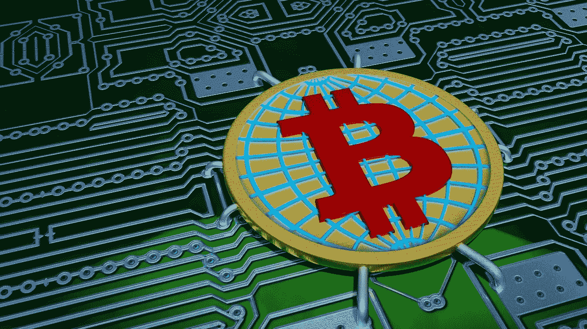
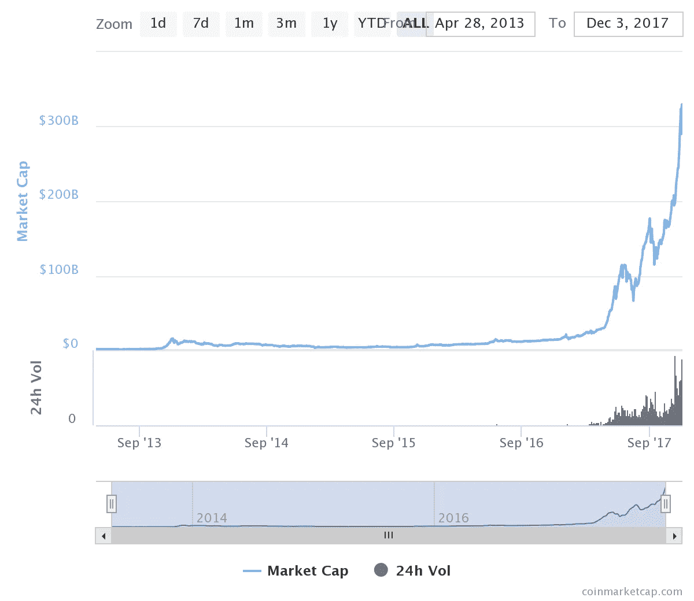
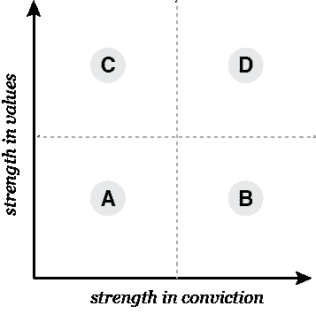

# 区块链人

> 原文：<https://medium.com/hackernoon/the-blockchain-people-978cc4da3a1c>

互联网正处于一场革命之中:集中的专有服务正被*分散的*、*开放的*服务所取代；可信方替换为*可验证的*计算；脆弱的位置地址被弹性内容地址取代；低效的单一服务被点对点算法市场取代。

这场革命的核心是*区块链*。基于区块链的系统在政治上是分散的(没有单点控制)，在架构上是分散的(没有单点故障)，在逻辑上是集中的(代表单一状态，数据在所有节点上克隆)。当与代币经济相结合时，基于区块链的网络为其参与者和投资者创造了有利可图的金钱激励。在撰写本文时，总的代币市值已经超过了 3000 亿美元。

Chart illustrating collective token market cap

相对于美国技术融资的传统方式，代币可能代表着流动性时间[>1000 倍的改善](https://news.earn.com/thoughts-on-tokens-436109aabcbe)和买方基础规模>100 倍的改善。

2017 年，区块链公司利用 ico(首次公开募股)筹集了超过 32 亿美元。那年夏天，筹集的资金超过了传统风险投资，极大地改变了早期阶段的融资格局。

通过解决核心模型造成的低效率来进行破坏的机会，以及从全球投资者基础上筹集大量资本的能力自然吸引了各行各业的企业家，这使得区分好坏变得极其困难。对今天的区块链来说，一个很好的类比就是 90 年代末的互联网。每九十九个 pets.com，就有一个 Amazon.com。

作为一名投资者，要想在噪音中看到信号，一个很好的起点是了解推动这一趋势的人。我写这篇文章是为了分享一个我开发的对我很有效的评估框架。我根据人们的价值观和信念将他们分为四类:

A.较差的值保持较差
B .较差的值保持较强
C .较强的值保持较弱
D .较强的值保持较强

## A.低劣的价值观不被接受

炒作自然会吸引那些想要乘风破浪的机会主义者，不幸的是，大多数人都属于这一类。他们往往是机会主义者，受到通过 ico 销售令牌的大肆宣传的启发，他们的动机是快速赚钱，而对技术的基础、原理或发展不感兴趣。

由于他们不投资于获得深度，他们缺乏信念，并可能愿意用合理的理由改变这些价值观。没有增长，他们很有可能会失败。有些可能会成功，至少在短期内。

## B.低劣的价值观根深蒂固

这些人有微弱的价值，但确信他们是正确的。他们不会接受改变，通常也不会成长。无政府主义者属于这一类。很容易发现他们，因为他们往往是弱听和严重自我静态。我会不惜一切代价避开他们。

## C.强大的价值观不牢固

大多数成功的企业家和投资者都属于这一类。他们投入时间和资源来建立自己的价值观，并带着信念进行沟通，因为他们的价值观深入人心。他们倾向于信奉理想主义而不是实用主义。他们的价值观可以通过合理的推理得到发展。

## D.强烈的价值观根深蒂固

原始创新者属于这一类。他们从深刻的理解和创新的思维中发展价值观。不适应牢固树立的价值观会让他们不太容易接受环境或情况。价值观和信念的力量使他们极具影响力，但不一定是伟大的企业家。

如果你喜欢看这篇文章，请花点时间推荐给你的朋友，并与他们分享！也可以关注我 [*推特*](http://twitter.com/GregOsuri) *进行常规的区块链相关评论。*