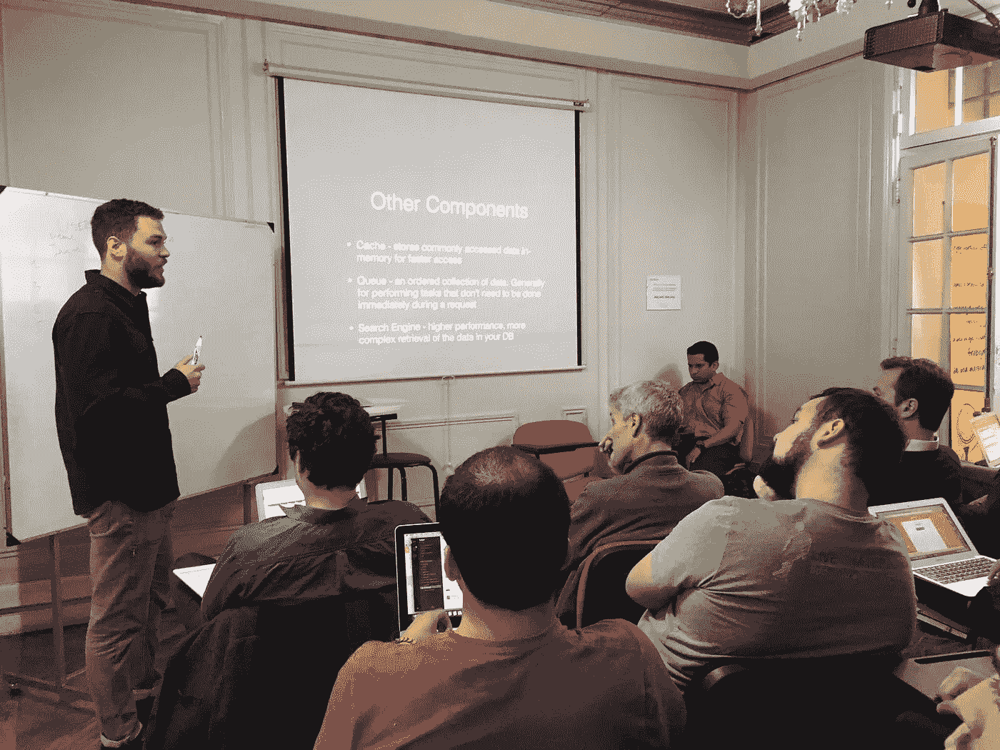
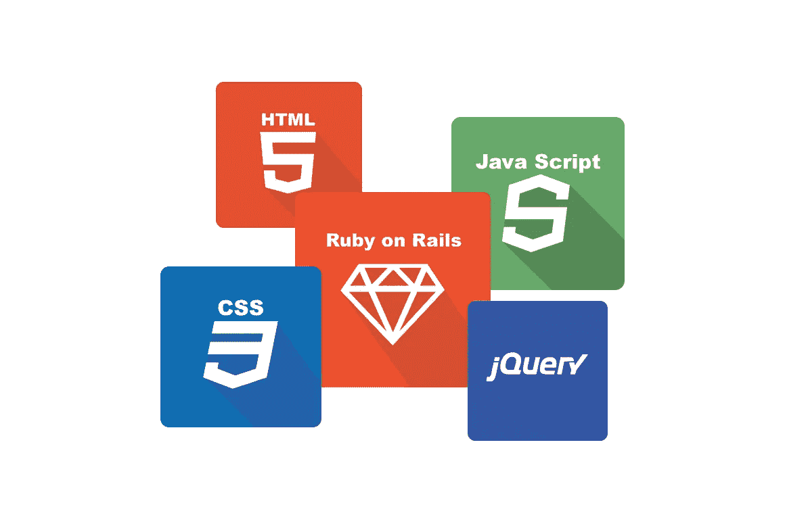
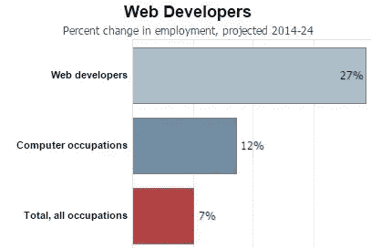

# 训练营的教育模式奏效了。原因如下

> 原文：<https://medium.com/hackernoon/the-bootcamp-education-model-works-heres-why-fd25825f4c0a>

软件开发训练营是一个相对较新的现象，它呈现了一种与学生在典型的大学环境中所遇到的完全不同的教育模式。这些项目通常比大学学位项目短一个数量级，只持续几个月，而不是长达四年或五年。他们能够做到这一点的方法是，让参与者专注于狭窄范围的高度专业化的编程技能，这与学士学位期间提供的广泛的文科教育形成对比。[为了完全透明，我正在运行一个我自己的网络开发训练营项目，面向哥伦比亚麦德林的数字游牧民。](http://www.destinationdev.com/)我写这篇文章是基于我诚实的观点和经验，而不是作为一个无耻的宣传，我正在努力开发《目的地:开发》，因为我相信这种教育模式，原因我将在下面描述。

# 权衡取舍

可以肯定的是，这种新的教育方式有其利弊，而[也受到了相当多的批评](http://fusion.net/story/303385/coding-bootcamps/)。然而，我认为对训练营的批评主要是由一些申请者、学生和雇主不切实际的期望造成的，而不是教育模式的内在缺陷。在许多情况下，这些[不切实际的期望是由训练营本身的误导性营销造成的](https://blog.bloc.io/the-truth-about-coding-bootcamp-job-placement-rates/)，有些人宣传工作安置率超过 90%,从最慷慨的角度来看，这是对数据的选择性篡改，从最糟糕的角度来看，这完全是捏造。任何向学生承诺工作或吹嘘强大行业联系的训练营项目都应该被适当地怀疑。此外，许多训练营几乎不筛选他们的申请人，并录取许多被成为开发人员的想法所吸引的学生，这在理论上看起来很棒，因为有六位数的工资、令人敬畏的设施和良好的工作生活平衡。问题是，花费数千美元，颠覆你的生活去追求一项新技能，而没有时间去验证你是否有兴趣和能力，这显然是一个危险的提议。

The author, dropping some knowledge

# 我的经历

尽管有这些担心，我仍然坚信编码训练营提供的教育模式的价值，我认为它们有潜力对大学等更传统的机构提供的教育产生积极的影响。我在 2013 年参加了 Dev Bootcamp，这是我做过的最好的决定之一。在几个月的时间里，我从零编码能力变成了全职员工，并获得了六位数的薪水。从那以后，我能够使用我最初在 Dev Bootcamp 中开发的技能[成为一名自由职业的数字游牧网络开发人员](https://hackernoon.com/being-a-freelance-software-developer-is-awesome-5849b7db59fe#.c44m3w4bc)并过上我热爱的生活，一边旅行一边编码，同时自由地从事自己的创业项目。虽然我确实认为自己是一个编码训练营的成功故事，但这个过程绝非易事。我不得不非常努力地工作，让自己达到可以被雇用的程度，然后不得不花数年时间更加努力地工作，首先变得富有成效，然后成为一名真正的专业人士。但是，根据我的经验，我相信，只要有足够的决心和努力，任何能够向自己证明他们既喜欢编程，又有能力自己学习和解决编码问题的人都可以在训练营后取得成功。在一天结束的时候，这取决于你，而不是你参加的训练营，来确保你拥有成功所需的一切。

据我所见，编码训练营产生了一个公式，允许合适的学生在令人难以置信的短时间内成功学习，并在类似的短时间内过渡到新的高薪工作，这些代码似乎都利用了以下属性和环境:

# 沉浸

让训练营为学生提供大幅加速学习的第一个关键因素是沉浸感。学生通常每周花 40 个小时在结构化的课堂环境中，如果是最成功的学生，还会在课外花同样的时间学习、处理项目和问题，并与同学讨论编码和技术。这意味着，在考虑准备工作之后，许多学生预计在短短几个月内已经投入了近 1000 个小时学习编程。为了便于比较，让我们来看看在本科计算机科学项目中学习和实践所花费的总时间。以加州大学洛杉矶分校的计算机科学课程为指导，学生们学习大约 20 门为期四分之一(10 周)的计算机科学课程来获得学位。让我们慷慨地说，每门课每周需要大约 5 小时的讲课和 2 小时的家庭作业/学习(我猜这比大多数学生实际做的要多得多)。这将在 4 年的时间里增加约 1400 小时——并不比训练营的学生在 4 个月左右的时间里获得的时间多多少。此外，并非所有的时间都是平等的，这就引出了我的下一个观点。

Lectures are boring!

# 实践学习

所有最成功的编码训练营都非常强调实践学习，学生们用大部分时间解决问题和构建项目。相比之下，大学计算机系的学生花更多的时间在讲课上。人们通过实践来学习，而不是通过阅读、听讲座或观看他人实践，这或多或少是常识。关于这一点的一点外部证据，检查[这里](http://www.sciencemag.org/news/2014/05/lectures-arent-just-boring-theyre-ineffective-too-study-finds)，或者[这里](https://www.purdue.edu/discoverypark/gk12/pdf/Riskowski09.pdf)。在经典的训练营模式中，学生们将大部分时间花在编码上。讲课是作为编写代码的实际工作的补充，而不是作为教育经历中的主要因素。此外，在大多数训练营结束时，学生们会花时间研究有形的、真实世界的软件产品，而不仅仅是解决抽象的算法。这让我想到了训练营模式成功的另一个重要因素:

# 就业技能

训练营教授直接适用于就业市场的概念、技术和技能。当回顾面向对象编程中的基本算法优化或概念时，就业市场中使用的语言，如 Ruby、JavaScript 或 Python，被用来代替传统程序中更常见的 C++或 Java。此外，所有最好的训练营项目都让他们的学生构建多个全功能的网络应用程序(或者在某些情况下是移动应用程序)。成功的晴雨表是有一个有形的软件，它可以工作，并托管在互联网上，让所有人都可以看到——而不是解决问题集或通过测试。学生还可以接触到作为专业开发人员取得成功的关键辅助技术，如 Git、Unix 命令行和 Postgres 等行业流行的数据库。

# 可接近的技术

我已经可以听到传统计算机科学教育的支持者的呼声——“但是你正在培养整整一代不懂编程基础的开发人员！”——“像 Ruby 这样的语言让事情变得太简单，不理解垃圾收集这样的底层概念，你就不可能成为真正的开发者”。我同意对低级概念的掌握和用类型化语言编程的能力都是任何严肃的高级工程师的先决条件。然而，我认为它们对一个初级工程师来说并不重要。我觉得传统的计算机科学教育有些落后，可以从其他科学教育的进步中学到一些东西。

以物理为例。大多数物理课首先教的是传统的牛顿力学和运动学。随着学生的进步，他们发现他们所学的概念并不是现实的真实表现，而实际上是近似值。然后，学生们通过更高级的概念，如量子力学和相对论，了解事物是如何工作的。我没有听到专业物理学家抱怨他们的领域被装腔作势的人超越，因为高中生没有首先学习这些话题。我觉得计算机科学也应该如此，仅仅因为学生从抽象出低级概念的平易近人的编程语言开始，并不意味着他们以后不能回头学习这些东西。从 Ruby 和 JavaScript 这样的语言开始可以让初级开发人员在工作中更有效率，让学习变得更容易，让过程变得更有趣。

# 就业市场

当然，如果初级开发人员的就业市场没有蓬勃发展，我上面讨论的训练营所利用的所有教育创新都将毫无意义。训练营确实有效，因为在最重要的科技中心，如旧金山、洛杉矶和纽约，软件开发人员严重短缺。企业愿意接受技能水平极低的绿色训练营毕业生，并自己培训他们，因为他们无处可去寻找人才。当然，如果出现另一个泡沫，就像 21 世纪初让科技行业崩溃的泡沫，这些训练营的毕业生将无处可去。

虽然我不是经济学家(即使我是，你也应该对我可能做出的关于即将发生的宏观经济事件的任何预测持保留态度)，但我可以对当前的就业市场说，目前的情况看起来一点也不会放缓。对开发人员有巨大的需求，公司仍然愿意在有动力、有快速学习能力的初级开发人员身上冒险。根据 [2016 年 Stack Overflow 开发者调查](http://stackoverflow.com/insights/survey/2016#work-salary)，训练营的毕业生实际上可能比传统 CS 学士学位的同龄人挣得更多。此外，即使你非常不幸，恰好在科技行业经济衰退之前参加了训练营，随之而来的就业市场萎缩也几乎肯定是暂时的。软件工程是少数几个可以依靠在未来几十年继续经历实质性增长的领域之一，因为该领域推动的软件自动化将导致许多其他职业萎缩或消失。

# 费用

参加编码训练营当然需要大量的资金投入，也是一个重大的人生决定。平均学费为 11451 美元，这些项目并不便宜。然而，与大学学位、研究生院或许多其他专业培训项目相比，这里的投资回报率真的令人难以置信。如果我之前没有说清楚，让我重申一下:**参加编码训练营并不能保证你能得到一份开发人员的工作，不管别人怎么告诉你。**话虽这么说，但如果你有能力和决心去学习素材，并且愿意去奔忙，你会在完成一个节目的几个月内找到工作。旧金山高级训练营毕业生的起薪超过 10 万美元，这项投资可以在很短时间内收回。

再说一次，在成本方面，这与本科或研究生学位没有可比性。许多人从大学或研究生院毕业时，已经负债数十万美元。这不仅来自较高的学费，还来自在校期间产生的生活费。如果你合理地留出 5000 美元来支持自己，同时参加训练营并在之后找工作，你可能需要将这个数字乘以 10 才能获得 4 年制学位。此外，这还没有考虑到你在学校工作和赚钱的时间的机会成本。鉴于时间投入的差异，训练营的机会成本相对于大学来说相当低。

因此，鉴于训练营提供的教育模式、蓬勃发展的就业市场以及相对较低的投资要求，我看好这种新的教育形式，并期待它继续扩大和影响其他学科的教育。最后，这里是无耻的插头！有兴趣在旅行中学习编程，并创造一种你真正热爱的生活方式吗？查看 [*目的地:Dev，我们在哥伦比亚麦德林为数字游牧民族开设的软件开发培训学院*](http://www.destinationdev.com/) *。*

[评论](http://www.destinationdev.com/blog/2017/3/14/the-bootcamp-education-model-works-heres-why#comments-outer-wrapper)

*原载于*[*www.destinationdev.com*](http://www.destinationdev.com/blog/2017/3/14/the-bootcamp-education-model-works-heres-why)*。*

> [黑客中午](http://bit.ly/Hackernoon)是黑客如何开始他们的下午。我们是 T21 家庭的一员。我们现在[接受投稿](http://bit.ly/hackernoonsubmission)并乐意[讨论广告&赞助](mailto:partners@amipublications.com)机会。
> 
> 如果你喜欢这个故事，我们推荐你阅读我们的[最新科技故事](http://bit.ly/hackernoonlatestt)和[趋势科技故事](https://hackernoon.com/trending)。直到下一次，不要把世界的现实想当然！

