# 弹跳工厂

> 原文：<https://medium.com/hackernoon/the-bounce-factory-3498de1e5262>

使用基于物理的反弹来激活您的 web 应用程序。


反弹效应，即物体在[重力](https://hackernoon.com/tagged/gravity)的影响下下落，撞击地面，失去能量，然后反弹，在游戏中无处不在，在网络上也有所应用。然而，web 上的大多数反弹效果都是相同缓动曲线的重复，这使它们感觉很强制。如果你开始创造自己的反弹，这比你想象的要稍微复杂一点，因为当物体失去能量时，不仅每次振荡的高度会改变，而且反弹的频率也会改变。[1]

在这里，我描述了在 [javascript](https://hackernoon.com/tagged/javascript) 中创建反弹效果的数学和技术，设计师可以使用设定的持续时间和反弹次数来参数化地控制反弹效果。

# 数学

在 Spring Factory 中，我们需要处理一个微分方程的解。这里我们只需要一些大一物理。显示如何在其他媒体中创建反弹效果的其他教程通常专注于二维或二维运动(例如，如何使抛射体(如球或鸟)反弹)。这里，我将只详细讨论运动的垂直维度，因为水平分量的典型实现通常非常简单。[2]

## 战略

一个篮球被举到离地面一定高度(保持为 0)。它被释放并落到地球上。在触地时，接触摩擦、飞尘和内部变形会从球中窃取能量，当球向上弹起时，每次触地后，球的高度会略微降低。

为了描述球的运动，我们需要一种方法来描述球的位置，它的动能和势能，以及地面从它那里窃取能量的方式。

从前面可以看出，这比简单地解一个方程要复杂一些，因为每次球落地都会产生一个不连续点。解决这个问题的一个方法是运行轨迹的实时模拟。然而，这可能是有限制的，因为它使像反转动画或中途跳转这样的事情变得更加困难。[4]相反，我们将专注于预先计算临界点，即动画中球落地的点，并为动画的每个片段使用单独的参数化方程。

## 落下的球

重要的事情先来。让我们展示一个下落的物体是如何运动的。等式 1 描述了恒定加速度下物体的运动。我们的弹跳球将由几个抛物线弧组成。图 2 显示了将一个球从静止状态释放到地球表面以上一米处的行为。图 3 显示了一个球在原地弹跳时的样子，因为它在每次弹跳后都会失去能量。

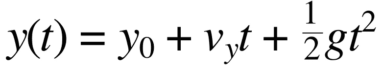

Equation 1: Position of a falling object accelerated only by gravity. The first term is initial height, the second describes the motion provided by the initial velocity, and the third describes how the position is influenced by gravity. y is height above ground, v is initial velocity, g is gravitational acceleration, and t is time. In the real world, gravitational acceleration is known to be appx. -9.81 meters per second per second [near Earth’s surface](https://en.wikipedia.org/wiki/Gravity_of_Earth).

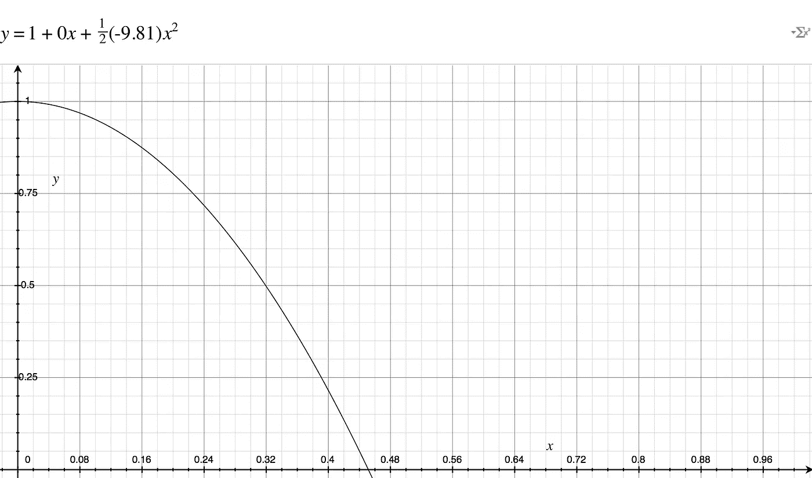

Figure 1: A ball is released at rest one meter above the ground and reaches the ground in about 0.445 seconds. Note that the arc is parabolic. Despite the labeling of y and x, the y axis is height above ground, and the x axis is time.


Figure 2: Here’s our bouncing ball. Several arcs put together, each reduced in height by, in this case, 15%. In our final version, the axes will both be scaled to be between 0 and 1\. Note the discontinuities at each contact point. y = height, x = time

## 能源窃贼

一个弹跳的球逐渐停下来。它通过在每次反弹后将其能量释放到环境中来做到这一点。有两种显而易见的方法来模拟这一点，我不确定哪一种是“正确的”,因为物理过程通常很复杂，但不管你做出多大的反弹，一种有意义的方法是在每次反弹后略微降低球的能量。例如，每次球落地时，地面会窃取球 15%的能量。这种方法对任何高度都很好，但缺点是能量永远不会达到 0，所以我们需要设置一个阈值高度，低于该高度球将停止运动，或者在动画上设置一个时间限制。另一种方法是在每次反弹后减去一个恒定的能量，它会自然地将自己分解为 0，尽管你可能仍然需要设置一个时间限制。

也就是说每次反弹 *n* 后，当前能量是初始能量的某个分数α(alpha)(0 到 1 之间)。如果地面窃取了你 15%的能量，α将是(1–0.15)或 0.85。因为这个量代表了剩余的能量而不是损失的能量，所以我们称α为弹性。

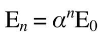

Equation 2: The current energy E_n is the repeated application of a fraction to the initial energy. *n is the number of bounces 0, 1, 2, … etc. Alpha is the amount of energy the ground steals,*

这相当抽象，但现在是时候变得更具体了。我会介绍球的动能和势能的对偶方程。从物理学上记住，能量是一种特殊的量，既不会被创造，也不会被消灭。每当动能改变时，它就从其潜在的能量库中吸取能量或给予能量。即 KE + PE = const。当球撞击地面时，一些能量被地面吸收。这可能会令人困惑，因为我刚刚说过，能量不会被创造或毁灭，而是球失去了能量。然而，球-地系统保持其能量。从技术上来说，我们可以跟踪地面积累的能量，但这对我们的目的来说并不真正必要。

事不宜迟，下面是我们的方程式:

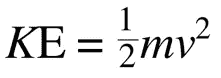

Equation 3: Kinetic energy of an object with mass m moving at velocity v.

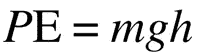

Equation 4: Potential energy of an object with mass m held a height h above the ground.

方便的是，如果我们知道弧的顶部在哪里，我们可以使用势能方程计算总能量。如果我们想知道球落地时或落地后的速度，我们可以用动能方程来求解。

## 缓和曲线

在上面的“策略”中，我讨论了计算不连续点和从最近点投影来创建动画。例如，如果参考图 3，在 t = 0.25 时，我们将使用第一条抛物线进行投影，但在 t = 0.75 时，我们将使用第二条抛物线。为了做到这一点，你需要知道不连续点在哪里，反弹后还有什么能量。每一次不连续不仅是向新抛物线的过渡，而且是在高度和时间上都更短的抛物线。

那么我们如何计算不连续点在哪里呢？幸运的是，我们可以使用上述等式的组合来计算抛物线的终点。值得注意的是，第一次反弹的计算与后来的反弹不同，因为球是在弧的中途、在最高点开始反弹的。

如果你用等式 1，设置 *y* = 0，求解 *t* ，你将得到半反弹时间。由于球在离地高度 *h* 处开始静止，初始位置为 *h* ，速度项为 0。

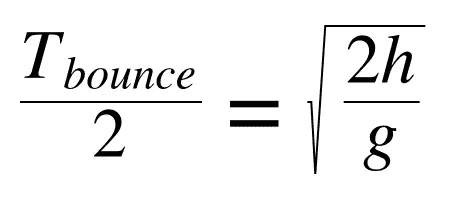

Equation 5: T/2 is the half bounce time. h is the original height above the ground, g is the acceleration due to gravity.

我们现在可以通过计算每个弧的高度来迭代向前投影，然后用它来寻找下一个不连续点。不过第一次弹跳有一个小技巧，因为它不是从地面开始的。我们的第一个不连续点实际上位于-T/2，在动画的起点之前，但是我们仍然可以用它来投影 0 的位置。

那么下一次反弹的高度是多少？使用等式。2 和等式。4，可以看到 E1 = α E0，而 E0 = *mgh* 。因此，E1 = α *mgh* 。这看起来有很多变量，但是我们有一些技巧来简化它。首先，α是你的设计师选择的弹性，所以是已知的。由于质量不受重力加速度的影响，也没有与其他受质量影响的物体发生碰撞，我们可以选择 m = 1。因为我们希望我们的缓和曲线适用于任何情况，我们可以选择 h = 1。我们的缓动曲线的输出将代表球的位移百分比，而不是它的实际位置，这使得它可以推广到许多动画。最后，因为我们计划让你的设计师选择动画的持续时间，重力是没有意义的。重力的强度通常会决定物体下落的速度，但是因为我们将直接使用持续时间来控制，所以我们也可以设置 g = 1。因此，我们有了一种描述弧高的新方法:

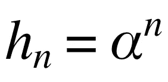

Equation 6: Derived relationship of arc height to elasticity.

这意味着我们可以从等式 2 进一步推导出以α表示的反弹时间方程。5 和等式。6，设 g = 1:

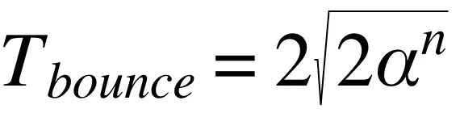

Equation 7: Bounce time of the nth arc in terms of elasticity.

现在很容易计算临界点的位置。为了从一个临界点投射一个弧，我们将使用方程。1，但在该点的位置计数 *t* = 0。在这一点上，我们知道当前位置是 0，我们持有 *g* = 1。我们需要知道什么是 v。谢天谢地，我们有先见之明跟踪球的能量穿过弧线。在临界点，当球在空中加速时，所有的势能都转化成了动能。要得到 *v* ，我们只需要重新排列 Eqn。3、动能方程，用前面讨论过的 *m* = 1， *g* = 1， *h* = 1，并结合方程。2:

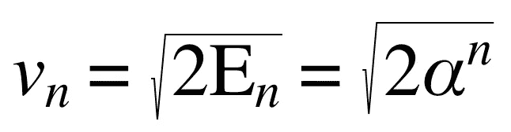

Equation 8: Initial velocity of ball just after bouncing

现在我们需要最后一个等式。我们需要计算需要计算的点数，因为我们需要在某个点结束 for 循环。给定我们的弹性和阈值ε (epsilon ),超过该阈值可以停止弹跳，我们可以根据方程求解弹跳次数。2 并回忆 E0 = 1:

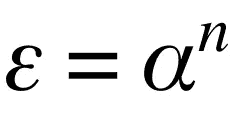

Equation 9: Eqn. 2 set equal to the cutoff energy threshold ε. Recall E0 = 1, which is why it is not shown.

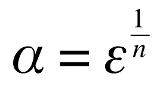

Equation 10: Eqn. 9 rearranged using logarithms. The elasticity in terms of the number of bounces, *n,* and the cutoff threshold (epsilon).

我们现在准备进行编码。我们有三个旋钮来调节我们的动画:

1.  *n* —弹跳次数。
2.  *毫秒* —动画的持续时间。所描述的算法描述了一个特定的弹跳形状，它将根据动画的速度而变得更快或更慢。关于这是如何工作的细节，见 JSFiddle 和下面的第二个。
3.  ε——最后一次反弹的高度分数(0…1 ),通常非常小(小于 1%),假设你想让球自然静止。这会控制能量为 0 的点，这样动画就不会被无数看不见的小反弹弄得杂乱无章。

# 从数学到动画

一旦你理解了上面的数学，下面的代码就相对简单了。然而，有几个正在进行的技巧需要一些解释。

首先，这个函数被称为*反弹工厂*。它不是一个 90 年代的音乐组合，而是产生一个反弹函数，该函数根据您的规范采用一个域为 0…1 的变量 *t* 。0 表示动画的开始，1 表示结束。这允许您将动画的完成百分比输入到结果函数中，并获得该部分动画的对象总位移的比例。

*bounceFactory* 由两个参数控制。一个必选，一个可选。在上面的等式中，对应于 *n* 的必需参数，弹跳次数是不言自明的。阈值，对应于上面的ε，通常在其默认值 0.1%时是可行的，但是您可能决定想要更早或更晚地切断反弹，例如，如果您的动画比大约 2 秒长得多或短得多。合理的数值可能高达 10%左右。

例如，假设您想要为 5 次反弹生成一个缓动函数，并在最后一次反弹达到最大高度 1%时停止反弹:

```
var easingfn = bounceFactory(5, 0.01);
```

关于这个函数要注意的第二件事是，生成的函数是预计算反弹点的闭包。这节省了大量的前期工作，因为我们只需要在每次调用排序后的数组时找到合适的点，而不是根据能量和反弹次数进行计算。虽然我还没有分析过两个版本，但这似乎是个好主意，而且符合我喜欢的编码风格。对于一个 60Hz 的动画，回想一下，在渲染给定的帧之前，你只有 16.7 毫秒的时间来做你想做的一切。

第三，你会注意到第一个点被分成了两个点。由于动画从物体已经在空中的下落点开始，我们可以将抛物线弧的起点设置在一半处，终点设置在一半处，并正常计算其余的弧。

要查看这方面的实际例子，并搭配一个工作动画框架，[看看 JSFiddle。](https://jsfiddle.net/1Lh6y1t7/)您可以通过编辑 JS 部分底部的参数来操纵动画。

*如果你喜欢这篇文章，请在 Medium 上关注我。你可能还喜欢* [*的乙状结肠工厂*](https://hackernoon.com/ease-in-out-the-sigmoid-factory-c5116d8abce9) *和* [*的弹簧工厂*](/@willsilversmith/the-spring-factory-4c3d988e7129) *。*

# 资源

1.  [http://easings.net/](http://easings.net/)——缓和曲线最初由罗伯特·彭纳发明。这些都是伟大的技术成就，但是弹跳已经被过度使用了。

## 尾注

[1][http://www . motion script . com/articles/bounce-and-overshoot . html](http://www.motionscript.com/articles/bounce-and-overshoot.html)—Dan Ebberts 的这篇文章讨论了弹跳动画作为 Adobe After Effects 的二维模拟。这真的很好，但我更喜欢创建解析曲线，以便动画可以由单个变量精确控制。

[2]通常，水平速度只是一个常数。如果你考虑到空气阻力，它会以某种方式减少。你也可以试着在撞击地面时减去一些能量。

[3]在更复杂的实现中，可以考虑空气阻力。

[4]如果你想让多个物体以某种混乱的方式互动，进行模拟是很有好处的。您可以使用一些技巧，例如每秒多次保存帧中所有内容的状态，然后在前进和后退时查询您的帧数组，但是我认为对于常见的情况，孤立地设置元素的动画，解析解决方案会更简洁，并且在浮点允许的范围内尽可能精确。稍后你会看到，通过创建一个缓和曲线，我们将抽象出重力和质量，这将进一步简化事情。你的设计师将精确控制时间和弹性，而不必摆弄质量和重力参数。