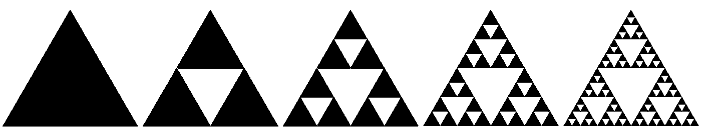
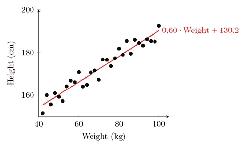
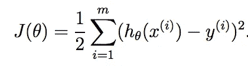
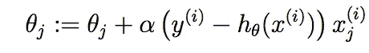
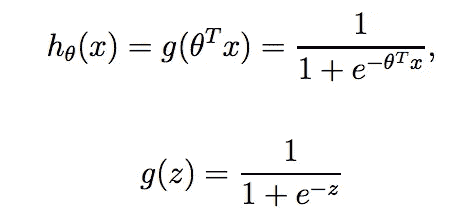
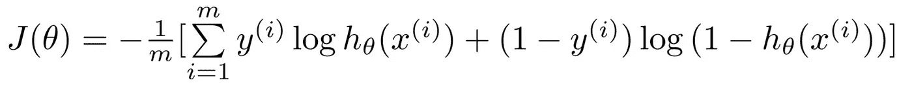

# 人工智能的基石

> 原文：<https://medium.com/hackernoon/the-building-blocks-of-ai-e9601ace9393>

*几周前，我写了关于我是如何和* [*为什么学习机器学习*](https://hackernoon.com/how-im-learning-machine-learning-a0f88538eba1) *，主要是通过* [*吴恩达的 Coursera 课程*](https://www.coursera.org/learn/machine-learning/) *。现在我带着 9 周的时间回来检查。*


A is for algorithm, B is for Bayes Theorem, C is for Cost Function, …

机器学习建立在先决条件的基础上，以至于通过基本原则学习似乎势不可挡。真的需要花一个月[学习线性代数](https://www.khanacademy.org/math/linear-algebra)吗？或者花几周时间复习微积分和统计学？绝对不行。有一些数学和编程经验就没问题了。你真的只需要熟悉[适马符号](https://www.mathsisfun.com/algebra/sigma-notation.html)并且能够在 for 循环中表达它。当然，你的作业会花更长的时间来完成，头几次你看到那些巨大的方程时会头晕，但是你能做到！微积分甚至都不需要。Ng 教授反复向您介绍，并强调要避免先决条件。

你将从头开始学习一些非常重要的概念。ML 由统计学、微积分和线性代数三股力量推动。统计是你在 ML 中所做的一切的核心。微积分告诉我们如何学习和优化我们的模型。线性代数使得在大规模数据集上执行这些算法变得可行。



我们将讨论这三个部分中的每一个，然后我将把它们放在一起向你展示神经网络[T21 是如何工作的。](https://hackernoon.com/tagged/network)

# 统计数字

原来数据科学和机器学习是一个东西，只是指的是不同层次的规模。数据科学往往专注于较小的项目和可视化/通信支持，这与用于大型数据集和大规模数据工程工作的机器学习相反。所以请记住，您正在构建一个大的可伸缩版本，可以在几天内使用 R、Matlab 或 GASP——Excel——组装起来。

我在商学院有一个[很棒的统计学老师](https://www.mccombs.utexas.edu/Directory/Profiles/Damien-Paul)，他和马里奥·范·皮布尔斯有着惊人的相似之处。所以我开始理解回归，尽管我使用的是一个很弱的工具包(Excel +一个统计插件)。很难弄清楚哪些特征是重要的，所以我主要是研究、观察并使用相关性分析。然后，我应该观察散点图，并对我的高 R 平方值的质量有直觉。有了机器学习，我把一把旧火枪换成了等离子步枪。


那么我们从哪里开始统计呢？当然是退步！

## 线性回归

一个[线性回归](https://en.wikipedia.org/wiki/Linear_regression)很简单。描绘任何两个可量化的相关项目的散点图。他们之间通常有一种模式。算一算，你最终会得到一条形式为`Y = MX + B`的最佳拟合趋势线，其中 M 是应用于每个 X 值的权重，B 是一个常数。

吴教授的教科书上的例子是关于波特兰或俄勒冈州的房地产价格。我们用每平方英尺的价格作为 X 值，房子的价格作为 Y 值。我们使用一种称为梯度下降的学习算法来确定最适合我们数据的直线。梯度下降是一种优化算法，它试图在我们的训练集中最小化房屋的预测价格和实际价格之间的差异。

```
Living Area (sq. feet)  |  Price (000s)
-----------------------------------------------------
1124                    |   192
2480                    |   471
1678                    |   275
1970                    |   318
```

这很酷，因为线性回归允许我们估计新房子的价值。我们只需将新的 X 代入等式，就可以得出房子的估计价格。经过大约 3 周的机器学习课程，你可以创造下一个 Zillow。



Ex 2 — Linear Regression showing the height as predicted by weight

然而，我们的线性模型非常简单。我们都知道影响房价的因素更多，所以我们的算法也应该考虑这些因素。这就引出了多元回归，在多元回归中，多个变量会影响产出。

## 多变量回归

多元听起来很花哨很复杂，对吧？它只是线性回归的一个子集，其中有多个输入变量，我们称之为特征。我们的训练集现在变成了具有 I 个特征的 M 个示例的`M x I`矩阵。每个要素都有一个权重，而不是一个带权重的变量。我们称每种重量为`theta`。我们使用我们的学习算法来计算θ，θ是最适合我们的训练集的最佳权重向量。

我们可以扩展我们的波特兰房价示例，以包括新的特性，如卧室数量、浴室数量和一英里内房屋的平均价格。然后我们得出这样一个等式:

`y = x0 + x1 * theta1 + x2 * theta2 + x3 * theta3 + x4 * theta4`

这三个新特征可以改善我们的预测，但也可能引入新的问题。首先，像平方英尺这样的大数字可能会压倒像卧室数量这样的小数字。接下来，我们可以添加如此多的特征，以至于我们使模型过度适应训练集，并且它很难预测测试集中的新数据。我们还可以添加如此多的功能，以至于耗尽我们的系统资源，无法用我们的学习算法处理数据。

幸运的是，这些问题都有解决方案。我们可以标准化我们的数据，并把它放在一个水平的竞技场上，其中每个 X 介于 0 和 1 之间。我们可以使用一个称为 lambda 的系数来减少具有太多特征的模型的影响。我们可以使用正常的数据处理或像主成分分析这样的技巧来减少我们的特征集，使之易于管理。想想看，处理灰度 150x150 图像比处理全彩色 1080p 图像要容易得多。

尽管如此，线性回归还是给了我们一个能给出定量值的函数。如何分类一封邮件是不是垃圾邮件？

## 逻辑回归

当数据是分类的(例如，真/假、正/负/中性等)时，使用[逻辑回归](https://en.wikipedia.org/wiki/Logistic_regression)。它通常在数据为二进制(是/否)时使用，但也可用于对一组项目进行分类。Ng 教授从一个简单的模型开始，根据肿瘤的大小预测肿瘤是恶性还是良性。我们不是预测一个值，而是预测发生的概率。由于概率介于 0%和 100%之间，我们不能再使用一条无限延伸的线，我们只剩下一个阈值。过了 X 点，我们很可能看不到肿瘤。

逻辑回归的另一个重要概念是对数标度。这是后勤日志。实际上，大多数学习算法使用 Sigmoid 函数进行逻辑回归。它给出了一条 S 形曲线，比直线函数更准确地描述了我们的误差。如果我们不是很有信心，比如说一个肿瘤有 60%的可能性，我们弄错了，它是良性的，这是可以理解的。然而，如果我们说有 2%的几率，实际上是肿瘤，那么我们就犯了一个巨大的错误。使用对数标度函数，我们捕捉这种直觉，并惩罚模型的自信和错误。


The Sigmoid Function

我们的学习算法多次运行我们的训练集，并确定 sigmoid 函数的权重。我们可以用它来预测某事发生的可能性。如果我们试图根据一张图片将农场动物分类为马、牛、猪或羊，我们最终会运行 4 个不同的逻辑回归(每个类别一个)，然后选择概率最高的一个。

既然我们已经介绍了统计数据，我将谈谈学习算法是如何工作的。

# 结石

微积分为我们的学习算法提供动力。统计数据告诉我们目标，但它并没有帮助我们学习。线性代数很快为我们的学习算法做了计算。

十五年前，我在大学学过一点微积分，但那时我学得并不太好。我很难记住希腊字母的小写名称，所以[偏导数](https://www.khanacademy.org/math/multivariable-calculus/multivariable-derivatives/partial-derivative-and-gradient-articles/a/introduction-to-partial-derivatives)符号特别可怕。我现在知道如何使用它，但仍然不理解它。没关系。如果你想在没有硕士/博士学位的情况下获得硕士学位，你不可能无所不知。然而，如果你生疏了，或者想再学一点数学，就去可汗学院吧。

你们大多数人以前都用过[解算器](https://support.office.com/en-us/article/Define-and-solve-a-problem-by-using-Solver-9ed03c9f-7caf-4d99-bb6d-078f96d1652c)。我们为求解器提供一个函数，加上输入数据。微积分就是求解器的工作原理。你可以通过一个进行线性回归，得到最佳拟合。然而，它们很慢，所以我们使用不同的方法，在我们的训练集上反复迭代，并使用更简单的函数计算最佳拟合。

## 价值函数

**代价函数，也叫误差函数或损失函数，是** [**监督机器学习**](https://www.quora.com/What-is-the-difference-between-supervised-and-unsupervised-learning-algorithms) **中最重要的概念。为了学习，你必须了解自己的表现。你的预测是好是坏？如果他们是坏人，他们有多坏？**

对于线性回归，我们使用一种称为[最小](https://en.wikipedia.org/wiki/Least_squares) - [平方](https://www.khanacademy.org/math/statistics-probability/describing-relationships-quantitative-data/residuals-least-squares-rsquared/v/regression-line-example)的技术来查看实际 Y 值与我们预测的 Y 值相差多远。我们迭代我们的训练集并总结`(predicted — actual) ^ 2`。形式上，我们的成本函数是:



这里的问题是假设函数，记为 h0。在线性回归中，这是你的回归函数，通常是`Prediction = Theta0 + Theta1 * x`。我们遍历训练集中的每个示例，并对平方误差求和，以获得这组θ参数的成本。θ参数是线性回归方程中的权重。我们的学习算法的目标是最小化成本函数，因此我们修改θ参数(例如，权重)以优化模型。

令人欣慰的是，有一个很好的方法来修补模型并最小化我们的成本函数。

## 梯度下降

通过简单的线性回归，我们有两个θ参数，线方程中的 M*x 和 B，然后是成本函数 J(θ)。三维图可以显示两个权重的变化如何影响我们的成本函数。因此，我们可以使用微积分来绘制完整的碗形梯度并求解最小值，或者我们可以从随机点开始，使用一种称为**梯度下降**的迭代算法来找到最小值。


3d graph of gradient. Note the concentric rings on a 2d surface at the bottom.

这就是梯度下降的原理。我们初始化我们的θ参数，然后当应用于特定的θ参数时，我们通过遵循成本函数的偏导数来学习。这给了我们一个功能:



Gradient Descent learning function

在这里，我们迭代所有的θ参数，并对误差乘以该θ参数的 X 值的结果求和。阿尔法是学习率，它让我们把下降的速度设定在碗的底部。我们不能把阿尔法值定得太高，否则我们会超额完成目标。我们必须迭代，因为我们下降的角度会随着我们接近全局最小值而改变。

这就是机器学习的工作原理。这并不疯狂也不神奇，只是大量的应用数学。我们可以对多元线性回归使用相同的精确技术，并迭代我们的数据集，以了解每个特征的最佳值。使用线性回归时，我们总会找到最小值。然而，如果我们让事情变得更复杂，并使用多项式系数，3d 图不再是一个碗，我们可能会朝着局部最小值而不是全局最小值前进。对于这种情况，我们可以使用像[支持向量机](http://docs.opencv.org/2.4/doc/tutorials/ml/introduction_to_svm/introduction_to_svm.html)这样的技术。

我们也可以使用梯度下降进行逻辑回归。然而，我们必须改变我们的假设函数，从而改变成本和学习函数，因为我们不再瞄准一条直线。我们使用 sigmoid 函数作为假设函数，它看起来像这样:



Using the Sigmoid Function for your hypothesis

我们在成本函数中做同样的事情，将假设与实际值进行比较。然而，在我们的实际 Y 值中，我们有一个 1 或 0 的二进制目标。我们必须进行测试，看看我们有多接近真阳性，有多接近真阴性。在成本函数中，我们可以将这两部分简化为:



Cost Function for a Logistic Regression

我们的学习算法仍然是梯度下降，它看起来几乎与线性回归相同。我们迭代所有的θ参数，并向全局最小值下降。我们仅仅使用基于对数标度的不同假设函数。

# 线性代数

任何人都可以在不使用线性代数的情况下运行机器学习算法。适马符号无处不在，所以算法只是一堆 for 循环。然而，嵌套的 for 循环在运行数千次或数百万次时会很慢。幸运的是，有一个解决办法:线性代数。

你需要的线性代数知识是矩阵加法和矩阵乘法。加法、减法和其他元素运算(乘以 5、求平方根等)很容易掌握。矩阵的大小必须相同，并且在每个矩阵中的对应单元格之间执行该操作。比如，[1 ^ 2；3 4]+ [1 1;1 1] = [2 3;4 5]

另一方面，矩阵乘法需要更多的直觉。如果你是一名程序员，这可能是观看 Khan Academy 上的一些视频或阅读程序员线性代数指南的好时机。对我来说解释细节有点太长了，所以这里是我从 AHA 学到的两点:

1.  **矩阵的行和列必须对齐。**如果将 A * B 相乘，那么第一个矩阵的列必须与第二个矩阵的行匹配。你的大部分时间将花在前后排列它们，以及交替调换哪一个。
2.  **适马符号中的大多数表达式都可以简化为矩阵乘法。**矩阵数学类似于归约/注入迭代器。迭代一系列数字。在每一步中，将两个元素相乘，并不断将每个和与前一个相加。然后你只剩下一笔钱。这就是我们如何将学习算法简化为线性代数。

# 把所有的放在一起

你在斯坦福机器学习课上学到的一切都是建立在自身之上的。稍后，您将学习专门的算法来提高您的数据质量，加快您的算法(主成分分析)，并从非结构化数据中发现有趣的东西。但是你将学到的最重要的东西是如何创建和学习神经网络。

## 神经网络

神经网络只不过是相互连接的逻辑回归。我们将每个单独的 logit(逻辑回归单元)称为一个节点，并将这些节点分组到层中。当我们有多个隐藏层时，我们称之为深度学习。这也是为什么我们不能解释在中间的隐藏层发生了什么。


A simple neural network with 4 inputs, 1 hidden layer, and one output

我们比以前做了更多的计算，因为我们为每个节点计算单个逻辑回归，另外我们还根据我们是预测(从输入向前)还是学习(从输出和成本函数向后)向前或向后推动该节点的结果。这些动作被称为前向传播和反向传播。

速度是非常重要的，这就是为什么需要线性代数。这也是 ML 在高端图形卡或张量处理单元上完成的原因，这些图形卡或张量处理单元专门用于矩阵运算，而不是标准的 CPU。在过去的 10-15 年里，我们的硬件和软件已经足够快地运行大规模的神经网络。这就是人工智能冬天结束的原因，我们现在正处于机器学习的爆炸式增长中。

[](http://bit.ly/HackernoonFB)[](https://goo.gl/k7XYbx)[](https://goo.gl/4ofytp)

> [黑客中午](http://bit.ly/Hackernoon)是黑客如何开始他们的下午。我们是 [@AMI](http://bit.ly/atAMIatAMI) 家庭的一员。我们现在[接受投稿](http://bit.ly/hackernoonsubmission)，并乐意[讨论广告&赞助](mailto:partners@amipublications.com)机会。
> 
> 如果你喜欢这个故事，我们推荐你阅读我们的[最新科技故事](http://bit.ly/hackernoonlatestt)和[趋势科技故事](https://hackernoon.com/trending)。直到下一次，不要把世界的现实想当然！

