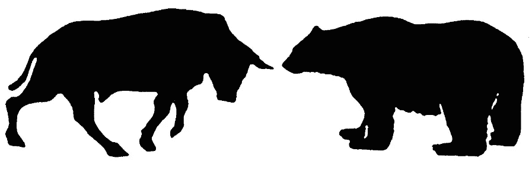
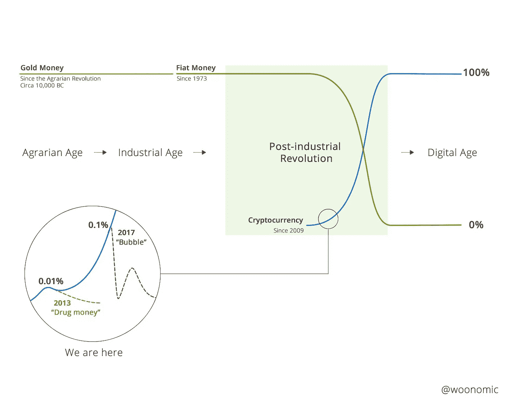
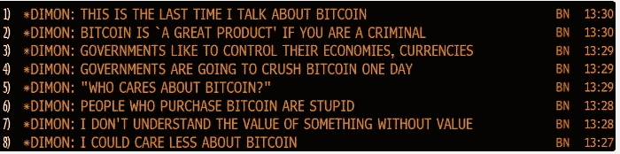
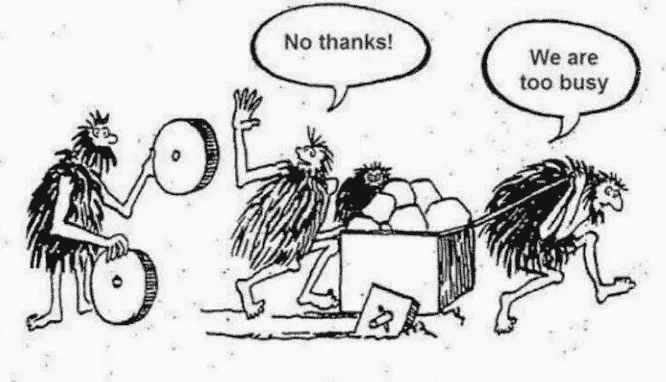

# 比特币的牛市与熊市

> 原文：<https://medium.com/hackernoon/the-bull-case-vs-the-bear-case-for-bitcoin-4ab9c7230758>

牛市案例:

感谢[威利·吴](https://medium.com/u/fbea34830f4f?source=post_page-----4ab9c7230758--------------------------------)

熊市案例:

Thx [链条](https://medium.com/u/7686e64cbf8e?source=post_page-----4ab9c7230758--------------------------------)

[试图](https://hackernoon.com/tagged/trying)帮助一只熊是什么感觉:

*如果你从这篇帖子* ***中获得了至少*0.000000001[比特币](https://hackernoon.com/tagged/bitcoin) *的价值，请在*** *下方“鼓掌”，这样其他人就会看到这篇帖子。*