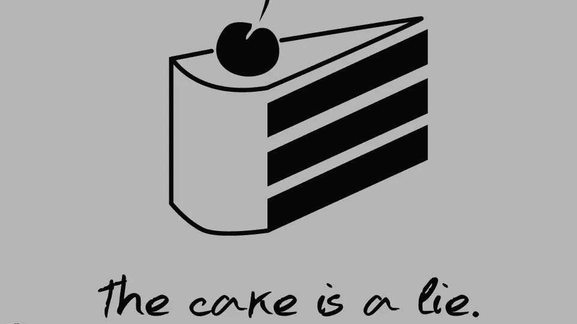
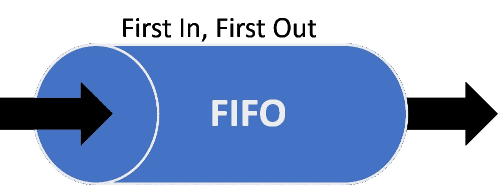
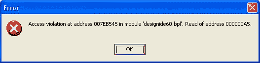
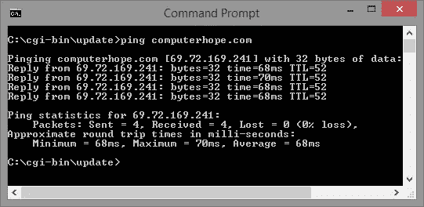
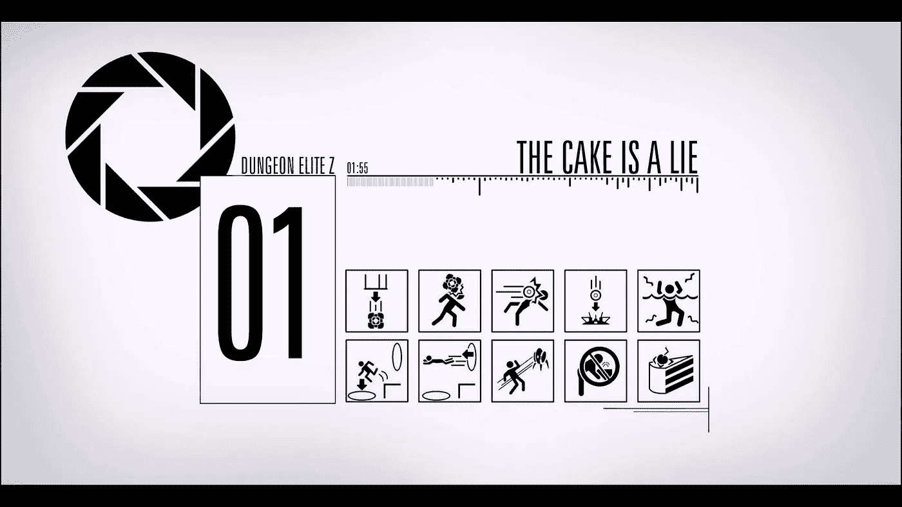

# 蛋糕是个谎言！

> 原文：<https://medium.com/hackernoon/the-cake-is-a-lie-f0210aab2ee3>

你有没有想过——“如何向一个从未面对过的人解释`programming`”。

> 原创文章是很久以前在另一个星系创作的。这只是一个翻译试验，它没有包含尽可能多的笑话。

所以，让我们想象一下——你有一个朋友，他不是计算机科学的`soiled`,从不尝试自动化某件事，从不玩`factorio`，从不写一行代码。

> 所以，让我们想象一个正常的人。

让我们叫他比尔。

他数学不是很好，甚至只是“不好”，**但是他爱吃糖果**！

你的任务是**教**比尔一些**魔法** IT **事情**，你每天都要做。最简单的。加密秘密知识。

你该怎么办？

# 喂他！

长话短说，有一天安德烈·亚历山大问比尔:

> —安德烈:嗨，比尔，你想要块糖吗？
> 
> —比尔:是的，当然！

然后比尔会拿到糖果，从糖果包装**中拆开**并吃掉**有效载荷**。

简单？我们用了两个神奇的词！

— — — — — — — — — — — — — — — — — — — — — — — — — — — — — —

几天后，沃思问比尔:

> —沃斯:嗨，比尔，你想要块糖吗？
> 
> —比尔:没错！当然可以！
> 
> 嘿，我还有一个，你要吗？
> 
> —比尔:没错！当然可以！

这是一个**条件控制循环**，或者说是一个**循环。**

> 嘿，我还有一个，你要吗？
> 
> —比尔:没错！当然可以！

但是没有糖果，比尔得到了一个常见的**空指针异常**。

— — — — — — — — — — — — — — — — — — — — — — — — — — — — — —

当心——如果 [Alexandrescu](https://en.wikipedia.org/wiki/Andrei_Alexandrescu) 突然返回并继续给 Bill 喂糖果——将会发生**缓冲区溢出**。最后，比尔总是会接受新的糖果。

Buffer overflow

— — — — — — — — — — — — — — — — — — — — — — — — — — — — — —

第二天沃思准备好了。他有一大包糖果。

> —沃思:好的，让我检查一下我的包……
> 
> —沃思:我还有一颗糖。比尔，你想要一块糖吗？
> 
> —比尔:没错！当然可以！

在这种情况下，沃思只有在有糖果的情况下才会提供。

这里我们热一个**循环，前提是**。

— — — — — — — — — — — — — — — — — — — — — — — — — — — — — —

但是有一天，比尔来到沃斯的家，他说:

> —比尔:给我一颗糖！
> 
> —沃思:没有什么是永恒的！你什么都吃了！
> 
> —比尔:但无论如何我都要拿！！！
> 
> —比尔:你有糖果吗？？？

这是一个带有后置条件的**循环。悲伤的故事。感谢上帝警察就在附近。下次要小心，不要喂野鸟。**

— — — — — — — — — — — — — — — — — — — — — — — — — — — — — —

几十年后，丹·阿布拉莫夫来到比尔面前，把他所有的糖果都放在桌子上:

> —丹:无语的凝视着比尔。
> 
> —比尔:无言地凝视着第一颗糖果
> 
> —丹:比尔，你想在这些糖果上放一个吗？
> 
> —比尔:是的，当然。

这是一个由收集控制的循环。

— — — — — — — — — — — — — — — — — — — — — — — — — — — — — —

就在这之后，丹又拿了一个袋子，把所有的糖果放在桌子上，数了数，然后放回袋子里。

> —丹:比尔，看起来我还有一颗糖果。你想要一颗糖吗？
> 
> —比尔:是的，当然。

这是一个**计数控制回路**。

— — — — — — — — — — — — — — — — — — — — — — — — — — — — — —

但是[迟早会有一天 Bjarne_Stroustrup](https://en.wikipedia.org/wiki/Bjarne_Stroustrup) 来养活比尔。

> 比尔，你有糖果吗？
> 
> —比尔:是的，当然。
> 
> —比约恩:比尔，你想要颗糖吗？
> 
> 比尔:————

比尔正在咀嚼糖果。他很忙，没有什么能打扰他。他抛出了一个互斥锁，线程被锁定，时间停止了…

Thread lock.

— — — — — — — — — — — — — — — — — — — — — — — — — — — — — —

比约恩非常聪明，他找到了解决办法:

> —比约恩:比尔，你想要颗糖吗？
> 
> 比尔:————
> 
> —比约恩:好吧，我会等到吃完为止……

这里我们得到了一个**线程同步**。

— — — — — — — — — — — — — — — — — — — — — — — — — — — — — —

好的，这次我们将召唤[彼得 _ 诺顿](https://en.wikipedia.org/wiki/Peter_Norton)。

> —彼得:比尔，你想要一块糖吗？
> 
> —比尔:没错！当然可以！
> 
> —彼得:我会提供一整包。你自己嚼吧。

接下来，比尔会从袋子里一颗接一颗地拿出糖果，一颗接一颗地吃掉。

这叫做**后进先出**——后进先出。只要包装底部的糖果最后被吃掉。

与此同时，比尔的消化是一种先进先出。

> 你以前必须知道。

— — — — — — — — — — — — — — — — — — — — — — — — — — — — — —

[唐纳德 _ 克努特](https://en.wikipedia.org/wiki/Donald_Knuth)也加入了喂食的队伍。但是有一天，他厌倦了给比尔买新糖果，于是他请一家餐饮公司代购。

> —唐纳德:嘿，我的朋友，你能在最近的商店里买到最好的糖果并把它们送给比尔吗？这是比尔的地址和钱…

从那以后，比尔总是从唐纳德那里得到新糖果。

在这个案例中餐饮公司是一个**职能**，而地址和金钱是**论据**。而一颗糖果就是一个**返回值**。

如果对于相同的地址和相同的钱数，比尔总是得到相同的糖果——这将被称为**纯函数**。

> 但只是万一公司只会把糖果从 A 点转移到 B 点，而 shop 永远是非纯功能，只要它丢了糖果。

但是丹尼斯·里奇甚至更聪明！

> —丹尼斯:嗨，比尔，你想要块糖吗？比尔:你知道的！丹尼斯:这是一个地址。你会在那里找到你想要的糖果。

那是一个**指针**。

但是，当比尔到达那个地址时，他发现那里有一个军事目标。无论如何——他得到了一个地址，并试图不惜一切代价达到他的目标，但安全就是安全。

**访问违规**。

几个月后，从监狱逃跑后，他试图重复，但仍然无法达到“目标”。有什么东西在远处阻止了他——无形而坚不可摧的**之墙限制了**。

— — — — — — — — — — — — — — — — — — — — — — — — — — — — — —

但是有一天…甚至，说实话——晚上— [网络恶魔](https://en.wikipedia.org/wiki/Cyberdemon)来到比尔的家，大喊:

> [—赛博恶魔](https://en.wikipedia.org/wiki/Cyberdemon):你想要颗糖吗？
> 
> —比尔:是的！在白天，然后星星闪耀！永远！

所以，比尔又得到了他的糖果。但这是一个有点悲伤的故事，只要他忘记检查有效载荷的类型或执行任何其他**数据验证**。☠️

— — — — — — — — — — — — — — — — — — — — — — — — — — — — — —

在那之后，比尔在虚空中醒来，听到:

> —宇宙:比尔！你想要一颗糖吗？
> 
> —比尔:是的！
> 
> —宇宙:比尔！你想要一颗糖吗？
> 
> —比尔:是的！
> 
> —宇宙:比尔！你想要一颗糖吗？
> 
> —比尔:是的！

这就是 **ping** 的工作原理。

在具有非零**延迟**的受扰系统中，情况可能是这样的:

> —宇宙:比尔！你想要一颗糖吗？
> 
> —宇宙:比尔！你想要一颗糖吗？
> 
> —宇宙:比尔！你想要一颗糖吗？
> 
> —比尔:是的！
> 
> —比尔:是的！
> 
> —比尔:是的！

但是这种情况只对 TCP/ **UDP** 有效。在 TCP/ **IP** 的情况下，它可能会改变

> —宇宙:比尔！你想要一颗糖吗？比尔。你想要一颗糖吗？
> 
> —宇宙:比尔！你想要一颗糖吗？
> 
> —比尔:是的！是啊！是啊！

因为长兄弟分组将通过时间或大小因子( **MTU** )来连接。

# 结束了

我有很多不为人知的故事，比如比尔和四人帮，或者非跨浏览器糖果。

但是让我讲最后一个，关于不可分割的糖果:

比尔吃了几百次，但是它又回到他的手里，没有嚼过，甚至还是甜的！

所以不可分的糖果可能是一个**单例**或一个**内存** **泄漏，**只要垃圾收集器不能消化它。

Have a good time, Bill.

最初的文章“The Val`s Candies”是在 7 年前发布的，从那时起，它获得了许多新的用户评论示例——递归、委托、接口、堆栈溢出、过程与函数、类、B 树等等。

那么，**你能从中描述点什么吗？从抽象的计算机世界用一颗糖果、一块蛋糕或其他东西…**

比尔仍然很饿，他快饿死了。你必须喂他。