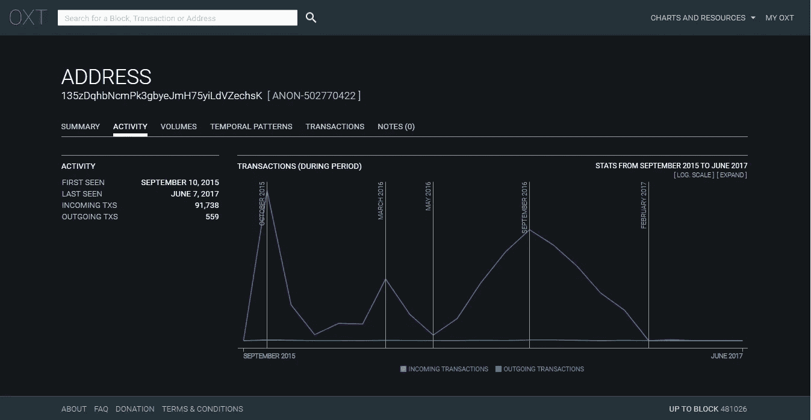
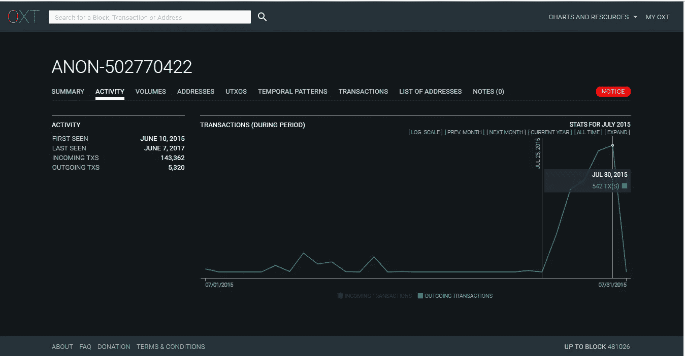
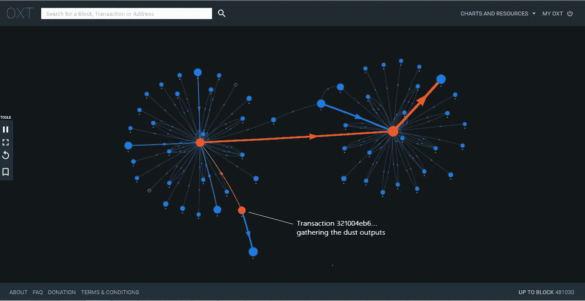
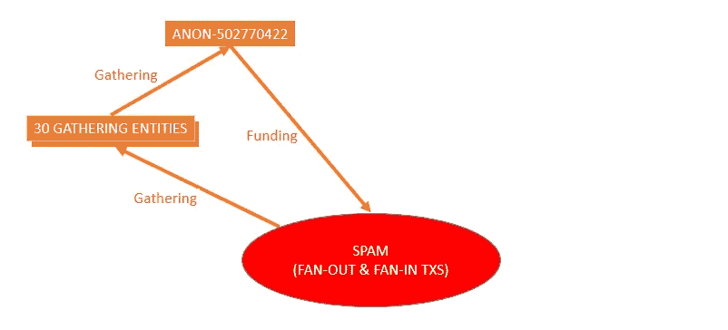
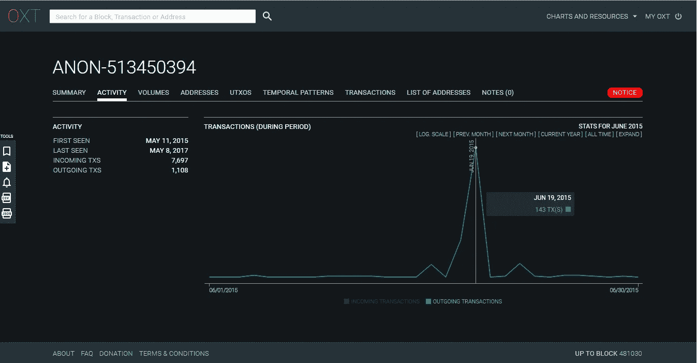
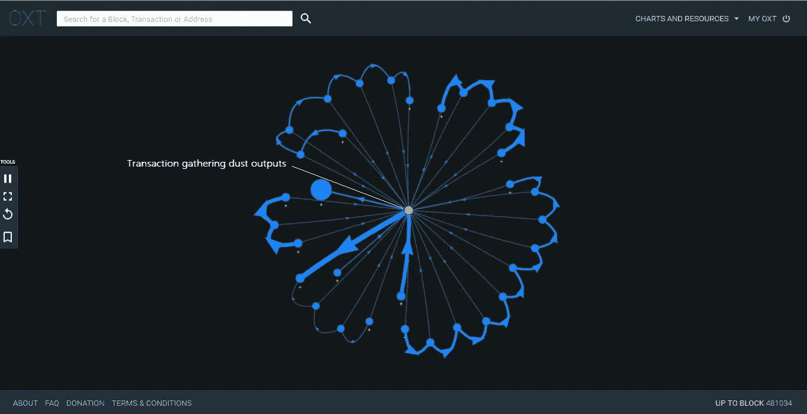
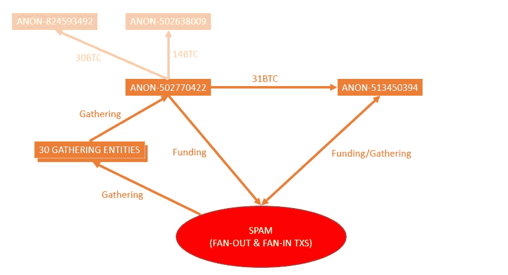
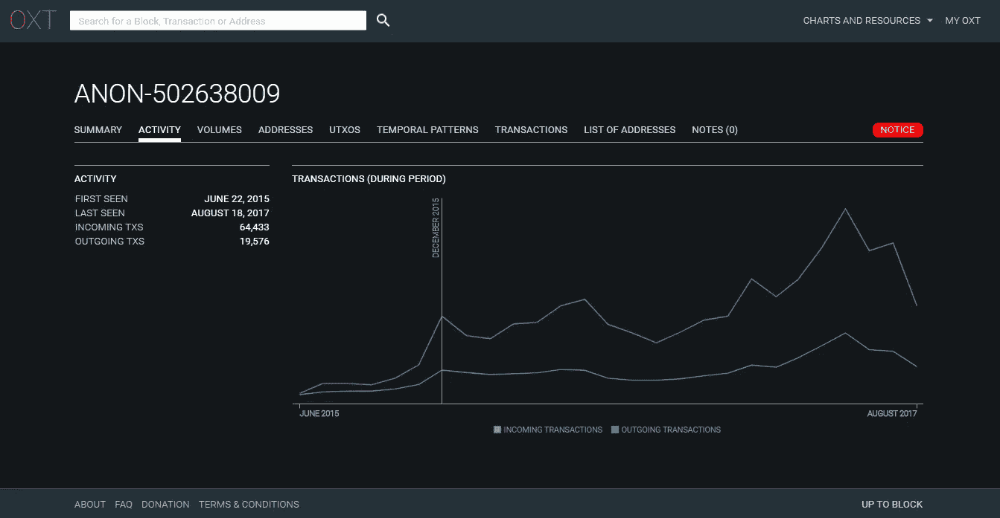
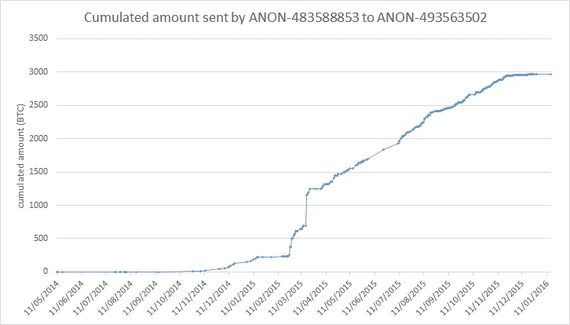
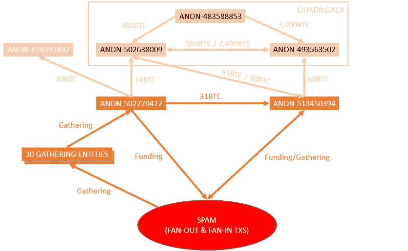

# 加拿大的联系

> 原文：<https://medium.com/hackernoon/the-canadian-connection-7f48cafe2369>

*“大脑离他生活中明显的前额至少有二十英尺；它隐藏在巨大的工事后面，就像魁北克扩大防御工事内最深处的城堡。”—赫尔曼·梅尔维尔，《白鲸记》*

The French Connection

在这个系列的[第一部分](/@laurentmt/good-whale-hunting-d3cc3861bd6b)中，我们已经开始绘制一张描绘莫比迪克边界的地图。虽然有用，这张地图仍然是初步的和非常低的清晰度。

改进这个地图将是第三部分的主题，目标是找到关于攻击内部的新见解，可能是关于他们的犯罪者。请注意，由于时间有限，我们不会试图面面俱到，但我们将遵循深度优先的方法，优先考虑最有希望的途径。

# 怎么画比较好的地图？

有超过 120 万笔交易，很明显手动检查会陷入僵局。我们需要一种方法来快速找到地图上最值得我们关注的区域。为了实现这一目标，我们将使用一套定制脚本，结合我们对莫比·迪克的了解以及由 [OXT](https://oxt.me) 提供的额外信息。

> 注:OXT 是一个数据分析平台，致力于比特币区块链。它从区块链中提取原始数据，并对其进行处理，以计算各种统计数据和分析比特币交易。后者是由于试探法而实现的，该试探法(其中)检测可能由同一实体控制的地址并将它们分组到簇中。默认情况下，集群由富有诗意的名称标识，如“ANON-12345”(ANON 代表匿名)。额外的英特尔允许将特定的集群链接到真实世界的实体。

有了这些新工具，让我们试着识别那些被 dust 输出“瞄准”的实体。如果我们幸运的话，这些攻击的实施者很可能会出现在接收者列表中。

运行攻击 A 的脚本(10，000 个 satoshis 的 dust 输出)为我们提供了超过 10，200 个实体和 12，700 个单独的地址。一些实体在 OXT 被打上了标签，并与众所周知的服务(交易所、支付处理器、赌博网站、矿池等)有关联，但许多仍然是匿名的。这条路听起来不太有前途。太多的可能性…

另一方面，对攻击 B 运行相同的脚本(1000 个 satoshis 的 dust 输出)会得到 70 个实体和 23 个单独的地址。在 70 个实体中，我们找到了一些服务(DISCUS FISH、IGOT、BITPAY、BITFINEX、CAVIRTEX、WIKILEAKS)和 15 个钱包，我们可以将它们与在公共媒体(如 BitcoinTalk 论坛)上发布比特币地址的个人用户联系起来。只有 50 个匿名实体，这条路看起来更有希望，特别是如果我们考虑攻击 B 是最大的和最具破坏性的。

# 让钱流动起来！

我们接下来可以做的是分析这些聚集实体的流出资金流:有多少比特币被发送到哪些实体？

第一次尝试给了我们 10，000 多种不同的流量。听起来有很多工作要做…

让我们通过移除不在两个收集实体之间的流来尝试过滤这些数据…答对了！这个简单的过滤器为我们提供了 37 个流，但更好的是，这 30 个流似乎被发送到同一个实体: [**ANON-502770422**](https://oxt.me/entity/tiid/502770422)

对 OXT 上的这个实体的手动检查告诉我们，它是 465 个 P2PKH 地址的集群，但是其中一个地址收到了 91，738 个事务，看起来非常特殊:[**135 zdqhbncmpk 3 gbyejmh 75 yildvzechsk**](https://oxt.me/address/tiid/438755150)

在档案中的快速搜索告诉我们，这个地址已经被一些用户识别为可能被 coinwallet.eu 控制。

该地址接收的交易数量的时间演变揭示了另一个有趣的模式

Peaks of activity for an address likely used by the attacker for the gathering of dust outputs

我们可以在 2016 年 3 月观察到一个峰值，在 2016 年 9 月观察到另一个峰值(在 2016 年 6 月至 2017 年 1 月之间活动增加)。这些周期与第 7 和第 8 波的时间跨度几乎完全吻合(见第 2 部分)。

所有这些因素表明，我们已经找到了收集尘埃的部分机制:

*   在第一级，尘埃输出由一组 30 个实体收集，
*   第一级聚合的 utxos 被发送到 ANON-502770422 进行第二轮聚合。

现在，让我们回到 ANON-502770422，让我们检查它的传出活动。数据告诉我们，它在 2015 年 7 月 25 日至 2015 年 8 月 7 日期间一直相当活跃。(第三波垃圾邮件攻击)。

Peak of activity for ANON-502770422 during the 3rd wave of spam attacks

对该实体在此期间发送的一些交易进行随机检查，可以让我们识别出类似于[这个](https://oxt.me/transaction/tiid/400002832)的交易。乍一看，这个交易只是一个尘埃产出的聚合。没什么新鲜的。但如果我们在这笔交易后跟踪比特币的流向，事情就变得更有趣了。我们可以观察到，发送到 ANON-502949525 的 0.01000080BTC 被用于资助新的垃圾邮件交易长链。

[图形的交互版本(仅限桌面)](https://oxt.me/bookmark/5997fd3be5c1652f2c17b20b)

这些交易告诉我们 **ANON-502770422** 负责收集灰尘输出，但**也是一个扇出交易**长链的积极资助者。

好吧。是时候完成我们的地图了。

# 告诉我你的朋友是谁，还有…

让我们通过分析 ANON-502770422 的所有流出资金流来了解更多信息。

看起来前三名是:

*   [ANON-513450394](https://oxt.me/entity/tiid/513450394) 已收到约 31BTC，
*   [ANON-824593492](https://oxt.me/entity/tiid/824593492) 已收到 30BTC 左右，
*   [ANON-502638009](https://oxt.me/entity/tiid/502638009) 已收到约 14BTC。

ANON-513450394 好像特别有意思。图表显示了 2015 年 6 月、8 月和 12 月的 3 个传入活动峰值，以及 6 月、7 月和 8 月垃圾邮件期间的传出活动峰值。

Peak of outgoing activity for ANON-513450394 during the 1st wave of spam

事实上，一个[快速手动检查](https://oxt.me/bookmark/5996c864e5c1652f2c17b207)证实了该实体已经资助了长长的垃圾邮件交易链。

实际上，通过检查该实体的历史(2015 年 6 月 4 日)，我们甚至可以检测到一个[事务](https://oxt.me/transaction/tiid/357551236)，看起来像是收集剥离链产生的粉尘输出的测试。

Moby Dick runs a preliminary test (May 2015)

[图形的交互版本(仅限桌面)](https://oxt.me/bookmark/5996cc21e5c1652f2c17b208)

最后，如果我们关注这个实体活动的最开始[，我们会发现收到的第一个 BTC 是由一个名为 ANON-493563502 的实体发送的，我们将在稍后的调查中遇到这个实体。但是现在，让我们完成地图。](https://oxt.me/bookmark/5996ce5ee5c1652f2c17b209)

# 告诉我谁是你朋友的朋友…

迄今为止，对资金流动的分析对我们很有帮助。让我们看看将同样的方法应用于 ANON-513450394 可以学到什么。

似乎该实体发送资金的两大接收方是:

*   [ANON-493563502](https://oxt.me/entity/tiid/493563502) 已收到 68BTC 左右，
*   ANON-502638009 收到 45BTC 左右。

是的。你说得对…我们之前已经见过这两个实体了。在这一点上，给予他们更多的关注似乎是合理的。

对这两个实体的手工检查告诉我们:

*   ANON-493563502 是自 2014 年以来活跃的一组 P2PKH 地址。其活动量表明它是一种服务，其时间模式表明该实体活跃在美洲大陆，
*   ANON-502638009 是自 2015 年 6 月以来活跃的 P2SH 2/3 multisig 地址集群。其活动量和时间模式再次表明了一种活跃在美洲大陆的服务。

对其资金流动的分析表明(除其他外):

> ANON-493563502 从 ANON-502638009 收到了大约 7400 BTC，
> 
> 匿名电话 493563502 从匿名电话 48358853 收到了大约 3000 BTC，
> 
> ANON-493563502 已经将大约 3000 只 BTC 送到了波洛涅克斯，
> 
> ANON-493563502 向 ANON-502638009 发送了大约 500 个 BTC，
> 
> ANON-502638009 已经向/从 POLONIEX 发送和接收了大约 3000 BTC，
> 
> ANON-502638009 已收到来自 ANON-483588853 的约 760 BTC。

这些数字表明，ANON-493563502 和 ANON-502638009 有密切联系，但也可能与 ANON-483588853 或 POLONIEX 有联系。

在 WalletExplorer 上进行的搜索表明，ANON-483588853 可能是加拿大交易所 QuadrigaCX。这一点似乎与 OXT 上展示的实体的时间模式相一致。

# 加拿大的联系

两个因素使我认为 ANON-493563502 & ANON-502638009 实际上可能与 QuadrigaCX 有关:

QuadrigaCX 完全[于 2016 年 1 月 1 日将其 P2PKH 存款地址切换至 multisig 地址](https://coinforum.ca/discussion/3187/qcx-multi-sig-bitcoin-funding-addresses)。这似乎与 ANON-502638009 在 2015 年 12 月的活动简介中观察到的增长一致。

ANON-483588853 和 ANON-493563502 之间的资金流动图表显示，2015 年 3 月至 2016 年 1 月期间，资金不断“外流”。考虑到 ANON-483588853 的活动也在该日期停止，该模式表明资金在交易所控制的两个钱包之间转移。

一切都好。让我们完成我们的地图。

# 让我们总结一下我们发现的一切…

## 你确定 ANON-493563502 和 ANON-502638009 是 QuadrigaCX 控制的？

不是 100%确定，但这似乎是一个合理的猜测。无论如何，应该很容易得到对该假设的确认(直接从交易所或从社区)。

## 是否意味着该交易所是 2015 年夏季垃圾邮件攻击背后的实体？

绝对不行。但这表明犯罪者是/曾经是交易所的客户。

## 这是否意味着用于垃圾邮件攻击的比特币来自这个交易所？

其实好像不是这样。我们已经检测到 ANON-513450394 收到的几笔交易，表明该实体已通过比特币混合器(可能是比特币雾)获得资金。关于 ANON-502770422，其资金来源似乎是收集第一次攻击(由 ANON-513450394 发起)期间产生的粉尘，以及收到更多资金，当然是通过一个混合器提供的。

## 是否意味着袭击者居住在加拿大？

现在说还为时过早，但一些额外的证据表明，攻击者可能位于美洲大陆，而不是欧洲。

# 结论

我们发现有两个实体(ANON-513450394 和 ANON-502770422)在垃圾邮件攻击的两个阶段中扮演了重要角色。

对资金流动的分析表明，攻击者可能是加拿大 QuadrigaCX 交易所的客户。

最后，这两个实体之间以及与交换机之间的联系表明，这两个实体可能与同一个攻击者相关联，或者这两个攻击者之间存在强连接。

# 奖金

一张交易图，显示了 2015 年 5 月 ANON-493563502 向 ANON-513450394 发送的资金、2015 年 6 月 ANON-513450394 所做的初步测试以及一长串垃圾邮件交易的资金之间的联系。

[互动版(仅桌面版)](https://oxt.me/bookmark/598a586ce5c1652f2c17b203)