# 价值 100 万美元的比特币

> 原文：<https://medium.com/hackernoon/the-case-for-the-1-million-dollar-bitcoin-1602e8840fb8>

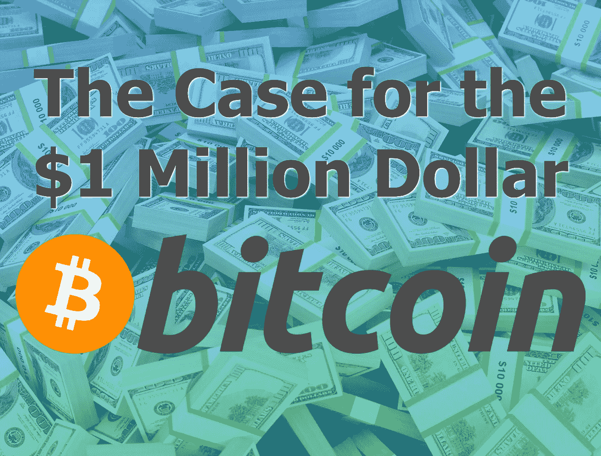

[比特币](https://hackernoon.com/tagged/bitcoin)要 100 万美元了！这就是比特币最大化主义者所说的。但这是真的吗？这可能吗？众所周知，专家们正在讨论货币的未来和数字资产的真实价值，这是一个值得探索的真正商业案例。与其鲁莽地推测并鼓励将你所有的积蓄投资于这种数字资产，不如让我们客观地讨论一些潜在的事实、假设和可能将这种看似不合理的价格分配给一个比特币所需的一般要求。

在我开始之前，我想披露我没有内幕消息，我没有运行过先进的预测模型，我之前也没有任何把握地预测过今天比特币的当前价格。即使我这么做了，我还是要提醒大家，市场会做市场会做的事情。

# 一百万美元的比特币意味着什么

为了有一个 100 万美元的比特币，我们必须考虑目前正在发挥作用的力量，以及区分比特币的价格和它的感知价值。这些本来就不一样。价格是某人愿意支付的价格。本质上，它是某种东西的货币成本。另一方面，价值的意义来源于利益和总体有用性。价格是这次讨论的焦点。虽然价格因素与对价值的看法有关，但我承认，当谈到比特币时，辩论价值太容易破坏对话。

写这篇文章时，比特币的价格是 18500 美元。在这个价位上，市值为 2940 亿美元。如果比特币定价为每枚 100 万美元，那将反映出 5400%的涨幅，54 倍的回报率。通俗地说，这意味着你给我 1 美元，我给你 54 美元作为回报。我知道这看起来很特别。但讽刺的是，我最初是在感恩节假期开始写这篇博客的，就在 3 周前。然后……比特币的价格是 8200 美元。在这个价位上，市值为 1370 亿美元。如果比特币定价为每枚 100 万美元，那么这将反映 12.1 倍的百分比增长(或 121 倍)。因此你给我 1 美元，我给你 121 美元作为回报。

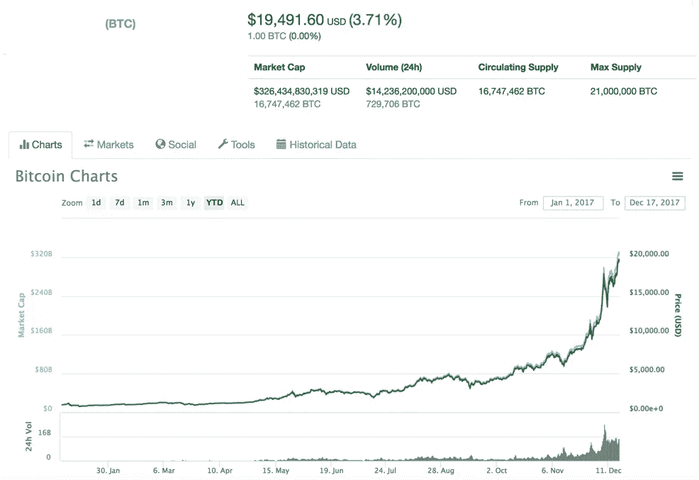

[Snapshot CoinMarketCap 12/17/2017](https://coinmarketcap.com/currencies/bitcoin/). As you can see the price has jumped yet again.

这似乎更不可能和例外，你不觉得吗？说实话，这个市场一直在取代最大的怀疑论者，虽然不可能知道这个泡沫是否会破裂，但更不可能预测它何时会发生。

100 万美元比特币的说法表明，比特币在全球的总市值将达到**16.5 万亿美元**。这就弥补了已经丢失的，现在因为各种原因无法恢复的大约 450 万个比特币。

# 了解 16.5 万亿美元

虽然 16.5 万亿美元是一个非常大的数字，但让我们客观地看待它。在考虑大的财务数字时，我们可以看一些比较数字，但为了本文的目的，让我们访问全球货币供应、全球股票市场、世界上最大的公司和世界上最富有的 50 个人。此外，我觉得考虑国内生产总值(GDP)和我个人最喜欢的离岸账户持有的资金会有所帮助。

在货币项目的[杰夫·德贾丁斯创作的](http://money.visualcapitalist.com/author/moneyproject/)下面的[信息图的帮助下，前面提到的一些数字更容易理解。](http://money.visualcapitalist.com/worlds-money-markets-one-visualization-2017/)

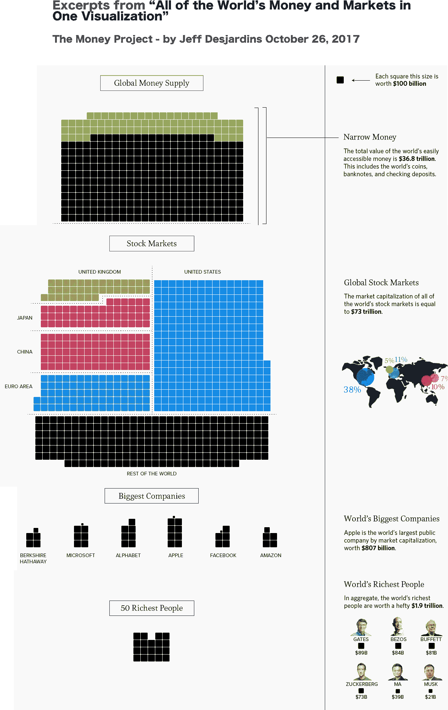

现在我们已经对这些比较数字有了一个方向，让我们考虑一下 16.5 万亿美元的比特币市值与它们的关系。

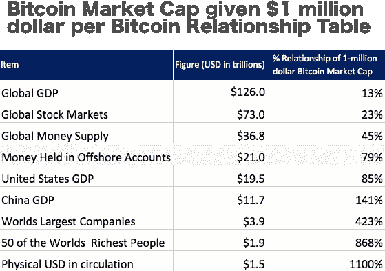

2017 Figures, various sources

为了强调一些比较数字，考虑到这一假定的比特币市值，它将相当于全球 GDP 的 13%,全球股票市场价值的 23%,以及全球货币供应量的 45%。

离岸账户持有的资金估计有 21 万亿美元。比特币 16.5 万亿美元的市值相当于今天这些资产的 79%。离岸账户数据具有象征意义，因为比特币被认为是一种“不可扣押”的资产。除非你的电脑遭到黑客攻击，或者你个人被关押起来，直到你交出你的比特币的私钥，否则从技术上讲，没有任何机构可以从你手中夺走你的比特币。只要这一点成立，离岸货币就很有可能被转换成比特币和其他加密货币。

这些数字令人震惊，要将比特币等数字资产与这些数字进行比较，首先需要信念的飞跃。在这种特殊的市值假设下，这变成了一个更难理解的现实概念。总的来说，这些比较现在应该给你一个与拥有 100 万美元比特币相关的含义的参考。

# ***生态系统力量***

比特币被指具有通缩效应，因为该货币的供应量是有限的。只要对比特币的需求稳定或扩大，比特币的购买力就会随着时间的推移而增加。与美元等法定货币相比，美元的供应和印刷在理论上是无限的，因此美元的购买力会随着时间的推移而下降。

除了这一关键的货币差异之外，在我们对 100 万美元比特币的争论进行调查之前，还必须强调一些系统性的力量。这些力量是比特币[区块链](https://hackernoon.com/tagged/blockchain)和当今生态系统运作方式所固有的。比特币的供应、新比特币向市场的释放，以及获得新比特币的计算难度，都在一个新领域中扮演着不可或缺的角色，这个新领域被称为加密经济学。我将在这里强调比特币加密经济框架的一些关键点，以供参考。

*比特币供应*。只会有 2100 万个比特币存在。截至今天，大约有[1670 万枚比特币在流通](https://blockchain.info/charts/total-bitcoins)，因此还有 430 万枚比特币有待发行。

*新比特币的发行速度*。每当创建一个比特币区块链区块，就会有新的比特币作为奖励被释放出来。数据块创建速率每 2016 个数据块调整一次，以实现持续两周的调整期(相当于每小时 6 个)。)每块产生的比特币数量设定为几何级数递减，每 210，000 块减少 50%，即大约 4 年。目前估计，最后一枚比特币将于 2140 年发行。(确定当前每个数据块的 BTC 版本，给出一些观点)

*比特币挖矿难度变化*。为了让比特币网络释放更多的比特币，并向比特币区块链写入新的交易，加密功能必须不断得到解决。影响这一点的主要因素有两个。这些因素被称为**[**和**](https://blockchain.info/charts/hash-rate) 。这可能会很快变得复杂，为了避免让这部分变得太专业，需要理解的一般概念是，块被解决得越快，在比特币区块链中挖掘下一个块就越困难。当难度增加时，网络通常需要更大的计算能力，以 hashrate 的形式来对抗增加的难度。下面的[比特币控制供应时间表](https://en.bitcoin.it/wiki/File:Controlled_supply-timeline_estimation.png)显示了我们如何在大约 2140 年达到比特币的最大发行量，并根据 hashrate 的增减进行调整。**

**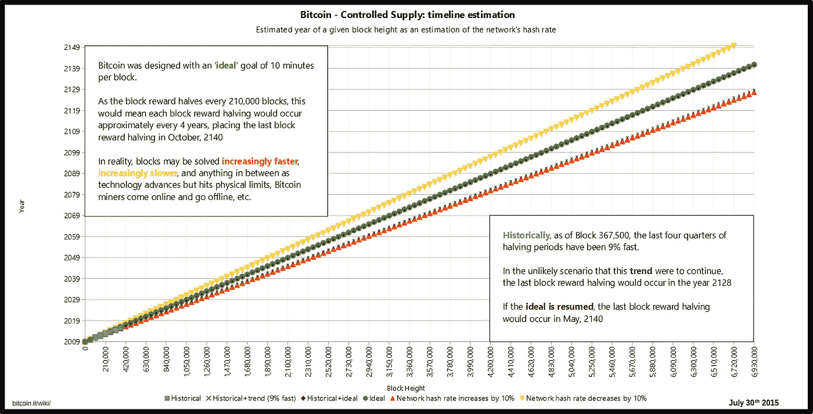**

**Some readers may be unfamiliar with the label on the x-axis. The Bitcoin block height is an expression of how many Bitcoin block precede the existing one. For example the first block or genesis block is considered to be 0.**

# **比特币发行**

**比特币的分配也是现有市场环境下的一大讨论点。比特币的所有权分布并不均匀。虽然比特币是建立在财富分配和资本高效分散流动的自由主义基础上的，但有少数钱包的容量超过 100 BTC。根据下面的[比特币分布图](https://bitinfocharts.com/top-100-richest-bitcoin-addresses.html)，这种集中程度如此之高，以至于大约 18000 个钱包持有超过 1000 万比特币(假设没有比特币丢失过，这代表了将会存在的所有比特币的 47.5%)。按照今天 18500 美元的价格，这意味着价值 1850 亿美元的比特币集中在接近 18000 名参与者手中。*(注意，由于一个人可以拥有多个钱包，或者反过来可以“共享”钱包的保管，因此很难确定实际上有多少人附属于这些钱包)***

**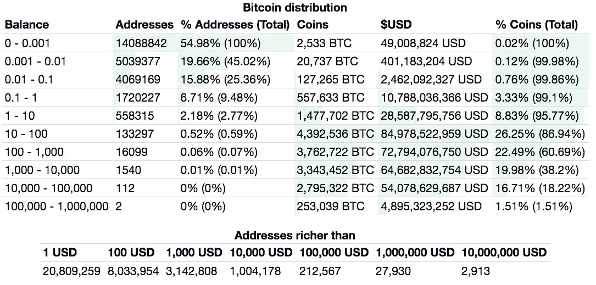**

**[BitInfo Charts](https://bitinfocharts.com/top-100-richest-bitcoin-addresses.html)**

# **利益相关者和激励措施**

**现在我们对比特币生态系统有了更多的了解，我们需要谈谈利益相关者和激励机制。其核心动机是激励个人或组织参与某些活动。在比特币存在的近 9 年里，它成功地创造了许多利益相关者，每个人都有自己参与的理由。这种参与可以是更大的比特币巨鲸或金融机构的微零售参与者。**

****

****矿工。**最早采用比特币的是矿工。他们运行比特币网络节点并验证交易。为了运行一个节点，他们有一个下载了整个比特币分类账的计算机系统。除了运行节点，矿工们还运行软件，分配计算处理能力，为下一个可以写入的比特币区块解决加密问题。找到下一个区块的矿工将获得比特币作为奖励。假设，只要比特币有价值，采矿经济对矿工有利，就会有大量矿工。这张比特币网络中活跃节点的图表显示了比特币网络的全球化程度。虽然它对我来说是令人兴奋的，但这不是一个轻松的过程，因为它需要维护和保养。**

**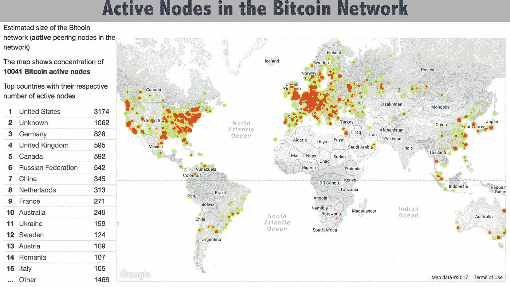**

****散户/投资者**。比特币的散户持有者从年轻的千禧一代到年长的退休人员都有。在很大程度上，他们是在投资，并希望价格升值。在比特币的早期，人们如何参与比特币的故事值得称赞。他们在社交媒体上发现，有些人玩用比特币结算的游戏，是的，有些人甚至参加了黑暗网络，在曾经臭名昭著的丝绸之路上从事非法活动。今天的采纳者，更有可能是从主流媒体渠道听说的。不管这些散户参与者是如何开始的，许多人发现他们的爱好可能会改变生活。**

****机构所有者、投资者和交易者**。在 2017 年下半年，我们已经看到机构参与比特币和加密货币的爆炸式增长。这一资产类别是新的、性感的、有前途的，令许多非技术人员迷惑不解。不管怎样，它已经引起了大型银行、家族理财室和对冲基金的注意。也有许多加密对冲基金已经推出，这进一步证明了直接参与这一数字资产领域的专业市场机会。**

****

**Photo by [Chris Li](https://unsplash.com/photos/6Y6OnwBKk-o?utm_source=unsplash&utm_medium=referral&utm_content=creditCopyText)**

**此外，有许多结构性金融产品正在推出，以比特币的价格进行交易。虽然这些金融玩家中不太可能有人真的想持有比特币，但他们表现出了相当大的交易欲望。提供这些衍生工具的相关组织包括芝加哥期权交易所(CBOE)、芝加哥商品交易所(CME)和纳斯达克。美国并不是这一领域的唯一参与者，因为莫斯科证券交易所(Moscow Stock Exchange)提出了交易比特币期货的提议。在监管框架通过之前，俄罗斯产品暂时被拒绝。**

**还有一个推动比特币进入高度令人垂涎的交易所交易基金(ETF)市场的因素。许多看涨比特币的人都在口吐白沫，希望比特币的 ETF 市场能够推出。ETF 在公开市场上作为传统股票交易，为了上市比特币 ETF，许多人认为这些基金将需要持有比特币来管理他们的基金，从而推动对比特币的需求。**

**对许多人来说，这些产品代表了数字资产的合法化，以及促进令牌的可见性。随着这些产品和市场的形成，许多人认为比特币将继续高度波动。如果价格波动，你可以打赌华尔街和金融机构总的来说能找到赚钱的方法。**

****银行**。当考虑银行和金融服务提供商时，比特币和加密货币会扰乱常规商业运营。根据 [Investopedia](https://www.investopedia.com/university/banking-system/banking-system1.asp) 的说法，银行系统通过“接受客户存款，从投资者或贷款人那里筹集资金，然后用这些资金提供贷款、购买证券和提供其他金融服务”来运作如果人们使用比特币和其他加密货币转移他们的资金，本质上是他们自己的银行，他们就在规避使用他们的银行机构来满足传统的银行需求。**

****影响者和媒体**。随着比特币和加密货币成为在这一热点话题上获得恶名的一种时尚方式，一些比特币和加密货币的影响者已经出现。媒体喜欢故事，比特币给了他们一个可以尽情发挥的故事。无论是比特币的神秘性，快速致富的角度，还是唱反调的人，只要对收视率有好处，就是对媒体有好处。**

****主权国家和政府的角色**。不能忽视或低估主权国家的性质，因为它与加密货币特别是比特币有关。由于比特币有可能影响银行业、资本管制、货币政策，甚至执法和国家安全，每个国家无论是否在组织层面持有比特币，都被迫参与这一对话。我们已经看到，在委内瑞拉等正在经历恶性通货膨胀的国家，比特币已经成为全国话题的一部分，因为那里的人们努力维持稳定的财富储存和安全的交易媒介。比特币是这个问题的部分解决方案。就中国而言，该国一直保持着非常严格的资本管制，比特币在这方面钻了一个空子，从而在中国制造了一个金融监管执法问题。**

**当然，我们可以定义各种形状和大小的其他利益相关者和利益，但不管这些参与者在生态系统中处于什么位置，比特币已经成为一种几乎不可能不采取立场的现象。对这种对话了解得不多，将会受到社会的谴责。**

# **为了比特币牛市的运行**

**有很多看好比特币的人，但他们的许多观点要么没有公开，要么纯粹是基于炒作。他们中很少有人真正讨论为了让比特币继续繁荣，需要避免或减轻哪些障碍。**

****

***有利的监管环境*。比特币和加密货币需要保持在一个有利的或至少是允许的监管环境中，不会限制或扼杀比特币的采用和互动。加密行业希望公平和平衡的监管，以允许更大的区块链加密货币市场和他们推向市场的技术解决方案的持续增长。**

***与银行合作*。银行需要支持与比特币基地等公司的交易。如果银行禁止与这些机构之间的资金往来，它们实际上就阻断了加密金融和法定金融世界之间的联系。我们已经看到全球许多银行机构与基于加密货币的业务关系有限或没有关系。**

***长期的技术成功*。迄今为止，比特币网络没有遭到黑客攻击。没错，确实有一些黑客攻击导致了个人用户和公司损失比特币，但更重要的是，比特币网络并没有出现致命缺陷。有一个比特币网络漏洞称为 *51%问题，*但如果没有网络上的恶意行为者或尚未建成的可操作化量子计算资产的大规模勾结，很难采取行动。**

***机构支持*。比特币目前是一种谈论和交易的性感资产。当人们赚钱时，他们往往会对赢家感到兴奋和热情。如果机构投资者不再青睐比特币，他们可能会减少新创建的衍生品市场的交易量，抛售他们实际持有的比特币，并有效压低该资产的价格。**

***媒体支持*。虽然比特币不是一家公司，但它受到了媒体前所未有的大肆宣传，促使人们了解更多信息，在某些情况下，人们会考虑将比特币加入自己的退休投资组合。不管怎样，媒体越是推动这个问题，越多的人将被迫谈论它。人们谈论得越多，他们就越有可能投资。如果媒体在这个建立在实际损失基础上的空间里宣传恐惧，这可能会导致大规模抛售。**

****

**Photo by [Gabriel Matula](https://unsplash.com/photos/Ez5wjPTCRLQ?utm_source=unsplash&utm_medium=referral&utm_content=creditCopyText)**

***增值区块链解决方案的增长*。有一个完整的软件解决方案生态系统，利用比特币网络运行的技术，即区块链。随着越来越多的生产网络和应用程序建立在这项技术上，这些项目推出的独特加密资产通常会促进投机和在某些情况下基于区块链软件的互操作性。**

***大规模标记化*。有一种将现实世界资产令牌化的早期趋势。这可以包括汽车和房地产等有形财产，但也可以包括股票和债券等金融资产。随着越来越多的资产以某种形式的加密货币以具有法律约束力的方式“令牌化”，比特币和其他加密货币更有可能被用来代表现实世界的资产进行交易。**

***更多商业用例*。我们已经看到一些公司接受加密货币作为支付方式。其中包括 Overstock.com、OkCupid、特斯拉、Shopify 等。更大的名单见 [2017 年接受比特币&加密货币的大公司名单。](https://steemit.com/bitcoin/@steemitguide/2017-top-list-of-big-companies-that-accept-bitcoin-and-cryptocurrencies)我们已经看到一些高端房产和车辆，比如用比特币购买的兰博基尼。**

***解决扩展问题和交易成本*。比特币有一个缩放问题。看到超过 100，000 笔未经确认的交易排在[比特币队列](https://steemit.com/bitcoin/@steemitguide/2017-top-list-of-big-companies-that-accept-bitcoin-and-cryptocurrencies)中并不罕见。此外，随着比特币价格的上涨，比特币的交易成本也大幅上升。目前正在努力解决这一扩展问题，但要成功解决还需要时间。**

**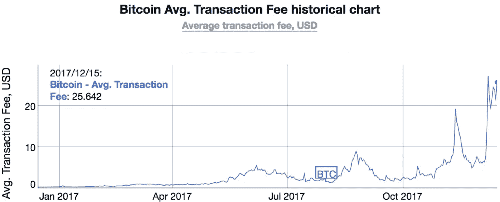**

**[BitInfoCharts](https://bitinfocharts.com/comparison/bitcoin-transactionfees.html#1y)**

***控制比特币分叉*。比特币网络有许多分支。最近，比特币现金和比特币黄金作为比特币区块链的衍生品被创造出来。从本质上说，这一变化代表了区块链的分裂。为了避免过于专业，更迫切的金融含义是，这些分叉凭空创造了新的货币。这些新形式的比特币具有交易价值。如果你持有一枚比特币进入分叉，你应该能够获得一个衍生令牌——比特币现金和比特币黄金分叉后。这给货币模型带来了稀释效应。虽然这看起来令人兴奋，但比特币分叉可能是数字资产不稳定的一个促成因素。**

****

**Photo by [Leio McLaren](https://unsplash.com/photos/flEStjHTY14?utm_source=unsplash&utm_medium=referral&utm_content=creditCopyText)**

***高风险市场领域的缓解*。加密市场中出现了许多高风险因素，这些因素要么与比特币直接相关，要么影响比特币的价格走势。我的前三名包括**

1.  ****虚假的、明显无法实现其技术构建和执行路线图的弱势初始硬币发行(ico)****
2.  ****稳定的硬币管理**。稳定硬币的透明度和有效管理，如与美元 1:1 挂钩的 Tether，目前其市值超过 10 亿美元**
3.  **[**比特连接**](http://bitconnect.co/) 。Bitconnect 可能是有史以来最具侵略性的金字塔计划之一，据称是一个自我监管的金融系统，只要你把你的加密货币押在他们身上，不拿出来，就可以让你的实际加密货币押上，以获得疯狂的高回报。尽管这种商业模式看起来好得令人难以置信，但它吸引了很多关注，是一种排名很高的加密货币，截至 2017 年 12 月，市值超过 20 亿美元。**

# **快速浏览梅特卡夫和里德定律**

**在区块链顾问 Tom Budd 的讨论中，梅特卡夫定律的概念出现了好几次。该定律指出，电信网络的价值与系统连接用户数量的平方成正比。汤姆专注于以下框架:如果你将比特币和加密货币的采用视为反映电信网络性能的一种方式，那么随着采用率的增加，价格波动的基本原理就变得更容易理解。**

**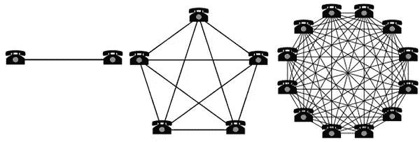**

**一位著名的作家和科学家 David P. Reed 发表了一篇名为“群体法则”的论文，他认为梅特卡夫法则实际上低估了群体形成网络的价值。[里德定律](https://en.wikipedia.org/wiki/Reed%27s_law)表明大型网络的效用，尤其是社交网络，可以随着网络的规模成指数增长。因此，里德定律也被用来更好地理解脸书和 Reddit 等社交网络的采用和效用。随着时间的推移，比特币网络的采用和参与在很大程度上符合梅特卡夫和里德的研究结果。**

**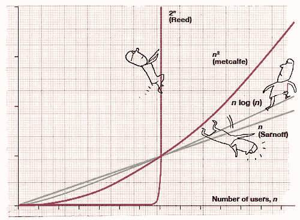**

**Illustration: [**Serge Bloch**](http://www.sergebloch.net/) — via [**Thoughts-Illustrated**](http://thoughts-illustrated.blogspot.com/2008/07/ieee-spectrum-metcalfes-law-is-wrong.html)**

**与非常受欢迎的比特币钱包公司 Blockchain.info 的钱包增长相比，人们可能会发现这些曲线有一些相似之处。**

**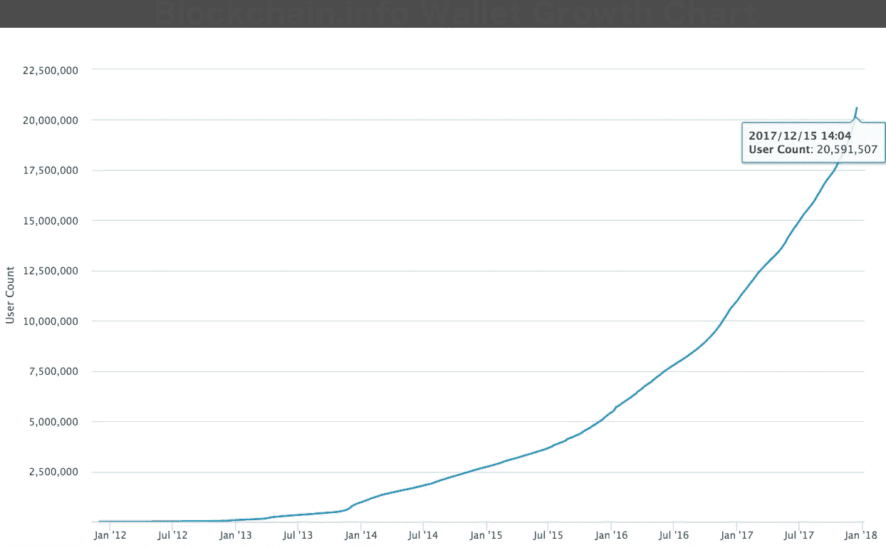**

# **最后**

**虽然乍一看，我们已经达到了 18500 美元的比特币价格，这可能令人震惊，但更好地理解本文中讨论的要点将有助于您理解 100 万美元比特币的道路，以及从现在起价格的任何上涨。加密空间已经被证明移动迅速，如果梅特卡夫或里德定律对这场金融革命的未来适用，那么我们显然正处于比特币和加密货币故事的拐点。我不是说从现在开始比特币会涨到 100 万美元、10 万美元或任何天文数字。我只是说这个问题很复杂，接下来会发生什么会很令人兴奋！**

****

**Photo by [NASA](https://unsplash.com/photos/Yj1M5riCKk4?utm_source=unsplash&utm_medium=referral&utm_content=creditCopyText)**