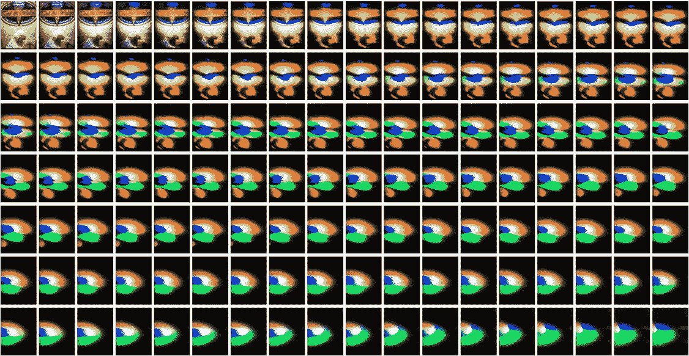
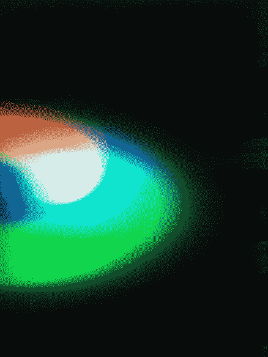
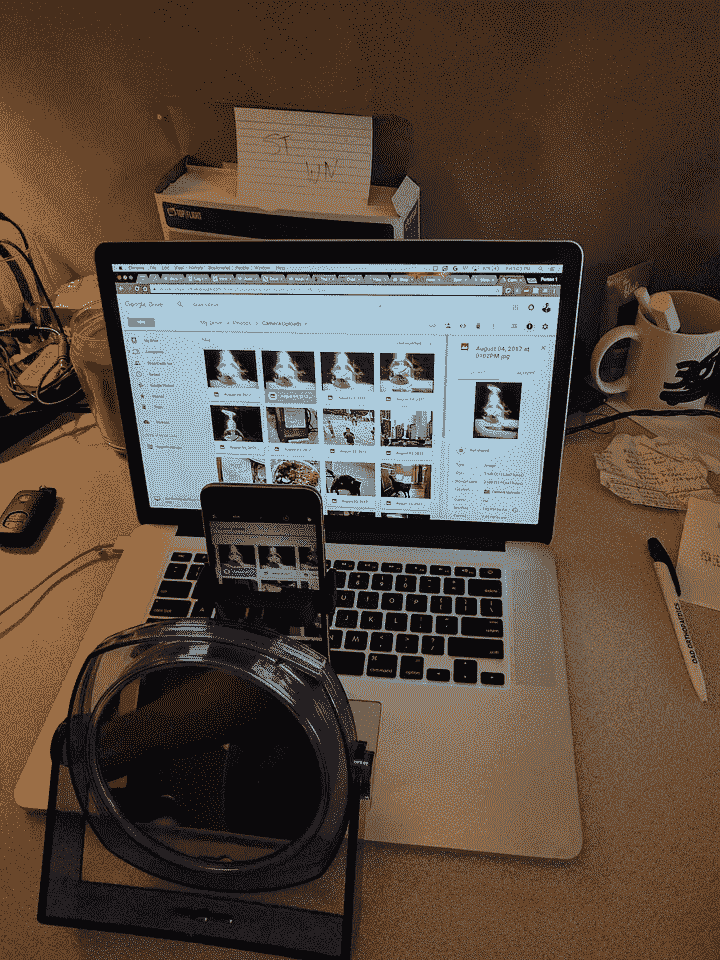
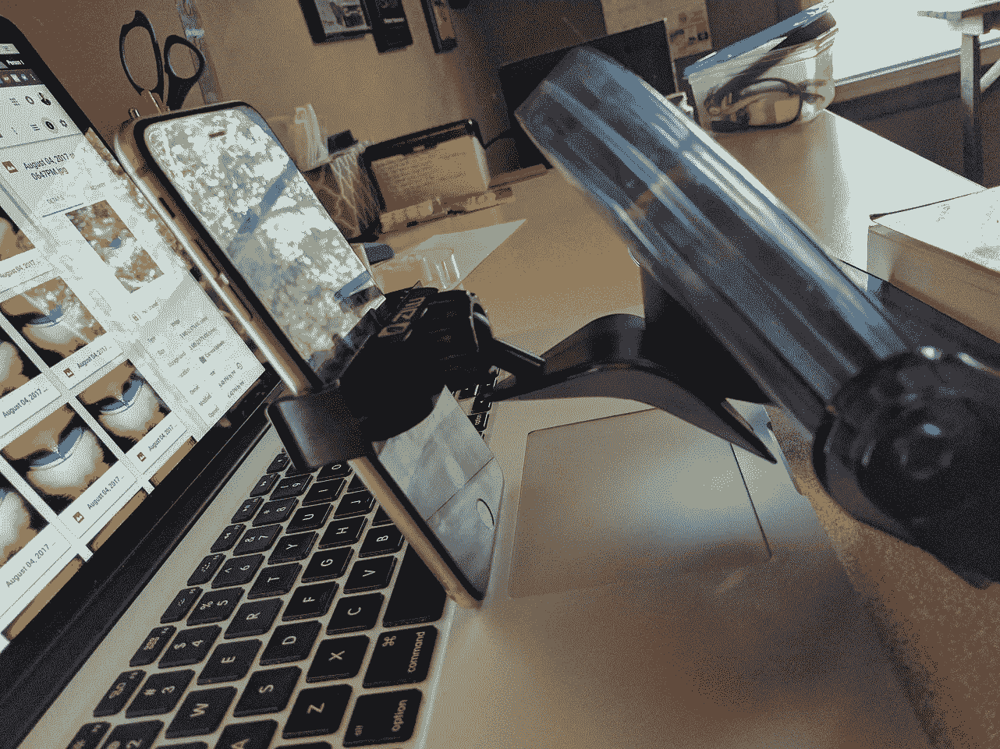
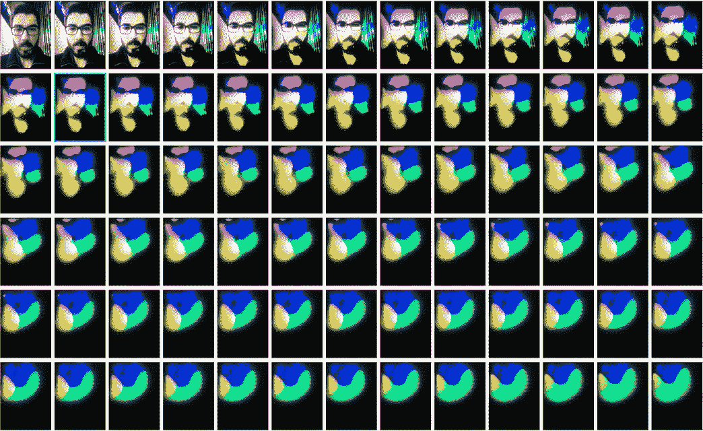
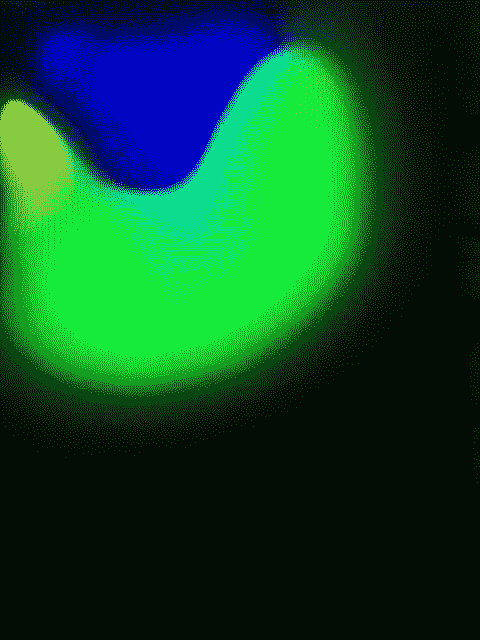
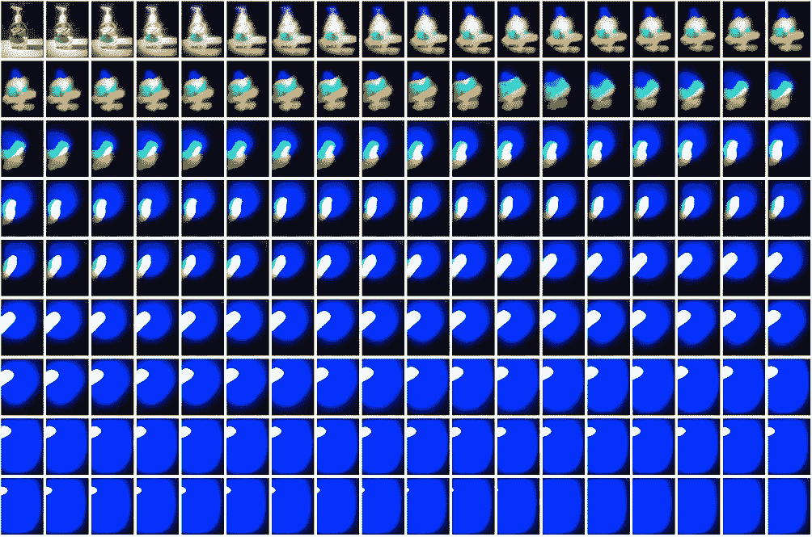
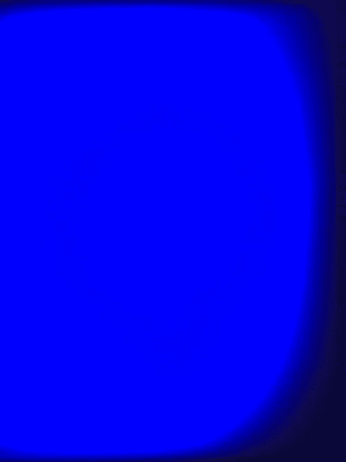

# 记忆的混乱:摄影递归

> 原文：<https://medium.com/hackernoon/the-chaos-of-memories-photographic-recursion-ef7f1a60c7b1>

## 当你一遍又一遍地重复拍摄一张照片时，会发生什么？

2012 年西北大学的一项调查记忆的研究得出结论，记忆就像电话游戏。当你记起某件事时，你实际上不是在回忆最初的事件。取而代之的是，你在回忆你最后一次回忆起的记忆。

这对内存意味着什么？它不仅解释了错误记忆的原因，而且这一现象有助于治疗 PTSD 患者，这使得记忆可以由医疗专业人员进行“调整”。

> 当你记起某件事时，你实际上是在记起你最后一次记起这件事。

当我想得更多的时候，我想知道——当你一遍又一遍地递归记忆时，实际上发生了什么*？那段记忆变成了什么？熵和混沌的力量会使记忆变得空虚吗？或者，由于记忆总是通过你的大脑过滤，也许你的个性、内在信念和世界观给记忆着色，使它成为你独有的。*

# *实验:照片的照片*

*我想进一步研究这种递归现象。一个朋友给我看了[阿尔文·卢西尔的《我坐在房间里》](https://en.wikipedia.org/wiki/I_Am_Sitting_in_a_Room)，一段录音的录音片段等。这最终将整个音频降低到房间的共振和声。*

*然后我想到了一个视觉类比:拍一张照片，一遍又一遍，观察结果。下面是在东北奥马哈拍摄的 Ted & Wally 冰淇淋的照片。*

******

# *这是怎么拍摄的？*

*我用我的 iPhone 6s Plus 拍照，用我的 MacBook Pro 15 英寸 Retina 显示屏显示渲染图像。我将 iPhone 6s Plus 和[鲁兹通用车载电话支架](http://amzn.to/2vCeONM)安装在一个旋转的小镜子上，这样我就可以精确地调整相机的位置。*

*在从我的 iPhone 上拍了一张照片后， [IFTTT](http://ifttt.com) ( [链接到特定的小程序](https://ifttt.com/applets/58663251d-automatically-back-up-your-iphone-photos-to-google-drive))自动将照片备份到一个特定的 Google Drive 文件夹中，然后我在电脑上打开它，拍摄下一张照片。*

****

# *为什么图像会变异？*

*当拍摄每张照片时，都会有一些微小的扰动使图像发生轻微的变化:*

*   ***颜色**。颜色最终趋向于 RGB 值，这是由计算机屏幕上的 RGB 像素引起的。*
*   *人为错误:尽管人们普遍认为，我并不完美。*
*   *****亮度** : iPhone 相机试图锚定在“中等亮度”来决定图像的明暗程度。你可能习惯于点击 iPhone 屏幕，看到一个正方形出现，这是相机校准亮度的方式。在这种情况下，亮度校准通常是使图像的暗部分变暗，或者使较亮部分变亮。***
*   ***条纹/点状:照片中会出现一些来自电脑屏幕的噪音，以像素或条纹的形式出现。***
*   *****眩光**:光线从显示器上反射，每次拍摄新照片时都会产生一点模糊效果。***
*   *****其他:**可能是其他任何东西——屏幕上的灰尘，当我按下 iPhone 时的轻微抖动，也许当我按下相机按钮时，一缕阳光碰巧透过窗户出现。***

# ***那么，这些结果意味着什么呢？***

***这个实验显然不是大脑如何处理记忆的准确表现，而是一个有趣的思想实验和对递归和熵的突变力的调查。***

***看到计算机屏幕上的 RGB 颜色在图像中栩栩如生，这是美丽而迷人的，图像到斑点的转换令人着迷。对我来说，这提醒了我，尽管熵具有“破坏性”的性质，但混沌中也有如此美丽的东西。***

***即使是最轻微的扰动的放大倍数**也是显著的。在这张冰淇淋照片中，我的相机稍微向右倾斜了一点，所以图像的左侧会被切掉。这种效果加剧，最终导致照片的整个主体向左移动。在记忆中，也会出现类似的效果——一个微妙的负面想法或怀疑会一遍又一遍地出现，消耗记忆本身。*****

***这种递归摄影还能象征其他什么自然过程？***

*   ***当口述历史从一个故事讲述者传给下一个故事讲述者时，历史是如何变化的？***
*   ***当文化一代一代地重新解释宗教文本时，它们最终会越来越多地反映文化本身吗？***
*   ***当你把一个故事从英语翻译成西班牙语，然后再翻译成英语，然后再翻译成西班牙语，会发生什么？***
*   ***也许甚至进化的力量也可以被认为是一种递归。***

# ***其他物体:我的脸***

***我很想看看这种效应对其他类型的受试者的影响。我注意到颜色仍然强烈倾向于 RGB 值。看到我自己的脸变成一系列美丽的颜色真是太迷人了。***

******************

# ***其他物品:洗手液***

***在这个例子中，我真的想研究照片的最终平衡——它会到达停止变化的点吗？这张照片拍摄时间最长，但我最终看到了一个普通的蓝色屏幕，在拍了几张照片后，它停止了变化。***

***我们记忆的“最终平衡”是什么？***

******************

***如果你喜欢这篇文章，请鼓掌表示你的赞赏👏下面，看看我的其他一些类似的项目:***

*   ***[将 SF Clipper 卡改造成可穿戴式](https://hackernoon.com/transform-the-sf-transit-clipper-card-into-a-wearable-2f32b59e40ae)***
*   ***[我设计了一件 t 恤，这样人们就会和我说话](/@stervy/hacking-social-interaction-with-t-shirts-6f57b6edcf37)***
*   ***[我如何面对 115 件事](https://hackernoon.com/how-i-live-my-115-things-53558259575b)***