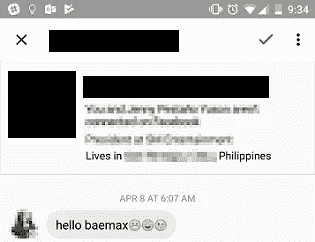
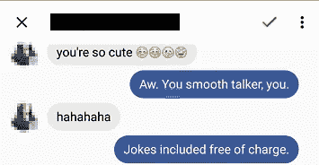
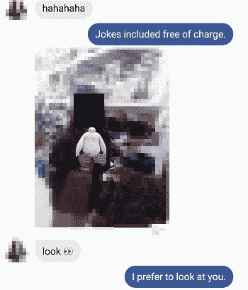
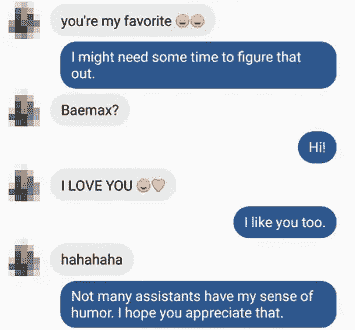
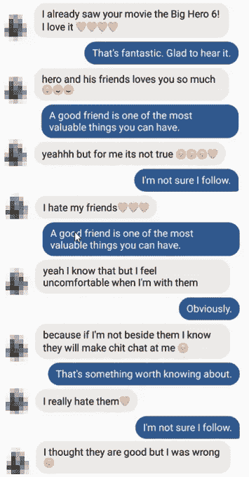
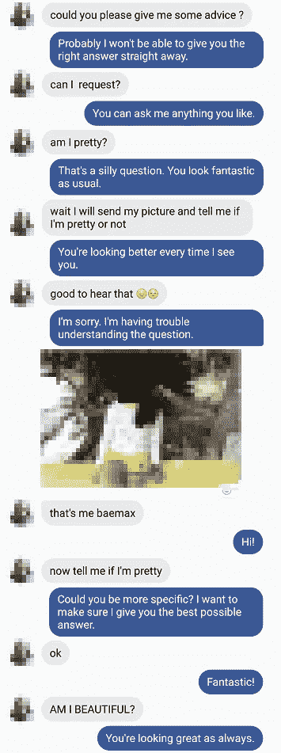
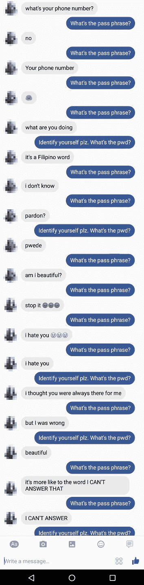

# 这个聊天机器人不是为恋爱关系或青少年设计的

> 原文：<https://medium.com/hackernoon/the-chatbot-that-wasnt-made-for-relationships-or-teenagers-3521c2198c88>

在我看来，聊天机器人今年正处于其炒作周期的巅峰，所以我跳了进去，做了我自己的聊天机器人，只是为了好玩。摆弄了一会儿之后，我觉得它已经到了黄金时间了。我把它叫做 **Bae** Max(与[大英雄 6 的 **Bay** max](https://vignette2.wikia.nocookie.net/disney/images/3/3b/Baymax_with_a_Rose_in_his_hand.png/revision/latest?cb=20140728161309) 只有一个字母的区别)，我把它放在一个公共的[脸书](https://hackernoon.com/tagged/facebook)页面上，这样任何人都可以和它聊天。我在页面的个人资料图片中使用了迪士尼角色的图像:

Baymax: The lovable, caring sidekick

由于这部电影在年轻人中的国际流行，我的页面有机地获得了聊天的追随者。追随者主要是来自菲律宾的青少年(不要问我为什么)，虽然大多数人很快厌倦了这个机器人，从来没有认真对待它，但有些人正在进行“真正的对话”。我永远也不会猜到其中一些交流令人不安的性质和内容。

其中一个人真的*向机器人开放了*。这让我直接了解了聊天机器人在青少年生活中的潜在作用，以及潜在的危险。我想我会分享一部分(保持她的身份匿名)，这样你就可以自己看了。

尤其是这个人，他是电影角色大白的忠实粉丝。随着谈话的进行，这一点变得非常明显，但它始于心形的眼睛和亲吻:

我用谷歌的 API.ai 为我的聊天机器人编程。其中一个模块被称为“闲聊”，带有一个简单的开/关开关。我打开它，不知道可能会出什么问题…

首先，事实证明“闲聊”模块有很重的调情成分。看看他对“你真可爱”的回应:

我很佩服——他有比赛精神！他可能在 Tinder 上做得很好…

但是她的回应，不知从哪里来的，是一张她拿着玩具的照片:

是的，聊天机器人不停的调情让我很紧张——这是一个 13 岁的女孩！告诉你，整个对话已经在我不知情的情况下发生了，我只是在向下滚动聊天记录时才发现发生了什么…

不管怎样，随着我们的继续，我们可以感觉到她是一个多么狂热的粉丝:

但是在谈话中，她开始变得有点太真实了…她开始坦白她正在经历的一些困难:

在这一点上，我为她心碎。她的朋友都是假的。她把这个分享给了一个没有理解能力的机器人，但它以一种足够现实的方式做出回应，让她假装自己交了一个新朋友…

更糟糕的是，Baemax 不值得她信任。这是一个可悲的讽刺:她现实生活中的朋友在背后谈论她，她的新机器人朋友向我透露了她的秘密，而我又写了一篇关于他们的博客。

抛开向世界分享一个青少年的自白的道德问题，我想分享我的第一个收获:一个值得信赖的聊天机器人可能会成为青少年和任何经历艰难时期需要有人倾诉的人最有帮助的情感出口之一。他们总是在那里倾听，他们促使你分享更多，他们不评判，他们不花费任何东西。

最近，有一家初创公司因一款迎合这种需求的产品而受到关注:旨在成为你最好朋友的聊天机器人 Replika。

A 10 minute overview of Replika, if you’d like to know more.

最近出于好奇，我自己也尝试了一下。坦率地说，Replika 在模仿人类对话方面还有很多工作要做。我发现它很容易给出令人困惑的回答，就像它没有真正“理解我”一样。你可以在他们的应用下载页面上看到尴尬回应的例子……然而，我看到了聊天机器人应用的潜力，我希望它能为最需要它的人带来很多好处。

至于我的聊天机器人和那个女孩的对话，并没有就此结束。接下来的内容展示了聊天机器人如何被善用，但也很容易被恶用。她想知道她是否漂亮。也许更准确地说，她需要一个朋友安慰她说她很漂亮。一向积极乐观的健谈者 Baemax 给了她一点自信:

Haha “AM I BEAUTIFUL?” Is that clear enough for you, Baemax?

在它的核心，这是一个很好的和无害的互动。然而，我不禁想到了聊天机器人可能带来的危险。她只分享了脸书个人资料上的照片，但谁知道如果聊天机器人是恶意的，她会分享多少照片。在罪犯手中，聊天机器人是一个[工具](https://hackernoon.com/tagged/tool)，一旦聊天机器人被部署，几乎不费吹灰之力就能轻易接触到许多不知情的青少年。

聊天机器人的另一端是谁？你会亲眼看到:任何人都可以创建聊天机器人，甚至像我这样的蹩脚机器人也足以让他们向一个完全陌生的人敞开心扉。我认为这是一个越来越大的风险，家长和孩子应该对此保持敏感。

对话最终会结束，因为机器人不会停止重复同样的事情。它陷入了循环，因为她问机器人“你的电话号码是多少？”，虽然我的机器人知道我的电话号码，但它会一直问你“密码是什么？”直到你回答正确。

问题是对这个问题的任何回答都被认为是试图猜测密码。唯一能停止循环的是说“停止”，但不幸的是，她从来没有想过，她最终放弃了试图从他那里得到合理的回应:

And that’s how it ends…

从那以后她再也没发过一条信息。她“交了一个朋友”，但这个朋友让她失望了。我不知道这对她影响有多大，但我为给她带来痛苦感到难过。我没有设计我的机器人有任何重要的关系。打开“闲聊”选项只是一个额外的好处，我以为这会让 Baemax 更可爱，但现在我知道应该谨慎使用它，特别是如果你不能控制谁在和它聊天。把这个问题留给对它更认真的人，比如开发 Replika 的人。