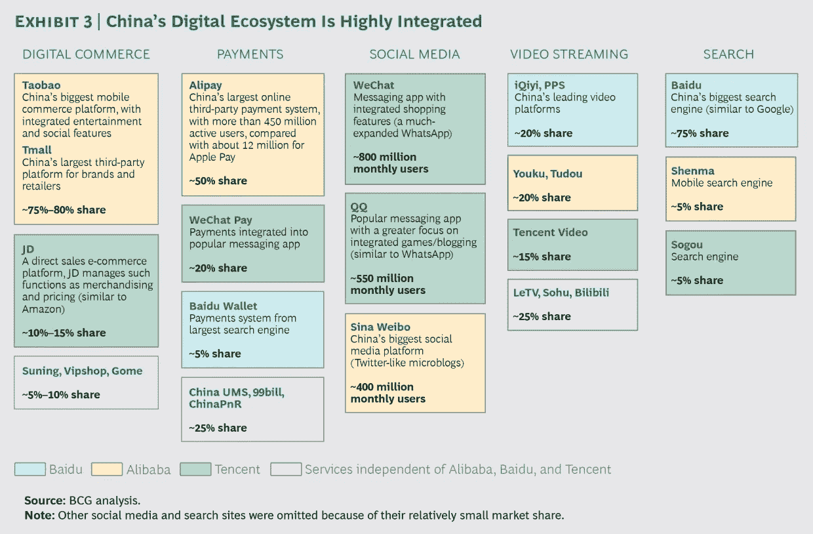
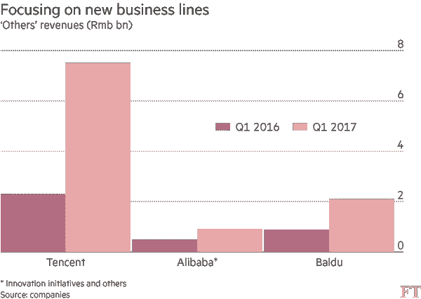

# 中国科技三巨头及其持股

> 原文：<https://medium.com/hackernoon/the-chinese-tech-trio-and-their-holdings-a86af3ada42>

过去十年，中国科技用户群以天文数字的速度增长。[2016 年，中国的网上支出超过了美国和英国的总和](https://www.bcg.com/en-us/publications/2017/retail-globalization-china-reveals-future-shopping.aspx)。除了以惊人的速度增长之外，该行业对西方观众越来越透明。

目前，中国科技领域由三大巨头主导:[、阿里巴巴](https://hackernoon.com/tagged/alibaba)(市值 3740 亿美元)、腾讯(3270 亿美元)和百度(640 亿美元)。

三巨头中最大的是马云领导的阿里巴巴。阿里巴巴最初是一个 B2B(企业对企业)网站，为中国[以外的制造商和潜在买家牵线搭桥，如今它已经发展成为全球收入第二大的电子商务公司，仅次于 Amazon.com。关于阿里巴巴的更多信息，请参见](https://hackernoon.com/tagged/china) [HackerNoon](https://hackernoon.com/) 上发表的[我的文章](https://hackernoon.com/a-brief-overview-of-alibaba-5c5ae9aa2d34)。

下一个最大的是腾讯，它在美国的三巨头中也不太出名。该公司主要专注于移动业务，拥有社交媒体和游戏方面的热门应用，在科技的几乎所有其他方面都有投资。腾讯旗下拥有微信，这是世界上最大的即时通讯应用之一，月用户超过 9.38 亿。但腾讯也是世界上最大的游戏公司，其《王者荣耀》是 2017 年 Q1 全球下载量最高的应用。[腾讯最近宣布将于秋季在美国和欧洲推出其最成功的游戏《王者荣耀》](https://www.bloomberg.com/news/articles/2017-07-07/tencent-is-said-to-take-honour-of-kings-to-the-u-s-and-europe)。

三巨头中最小的是百度，在西方媒体中通常被称为“中国的谷歌”。百度拥有中国最受欢迎的搜索引擎，但也有类似“百度百科”(一个中文维基百科)和百度音乐的业务。

这些公司不是在严格的筒仓中运作；他们都扩展到了大多数的技术子行业。参见波士顿咨询集团的下图:

Source: [What China Reveals About the Future of Shopping](https://www.bcg.com/en-us/publications/2017/retail-globalization-china-reveals-future-shopping.aspx)

而且他们的投资并不止于中国的边境。在过去的两年里，[这些公司(以及它们的追随者 JD.com)向美国科技公司投资了 56 亿美元](http://www.cnbc.com/2017/03/08/chinas-tech-giants-are-pouring-billions-into-us-start-ups.html)。对于希望打入中国市场的西方科技公司来说，与中国巨头合作几乎是必不可少的。

2016 年初，[阿里巴巴成为 Groupon](http://money.cnn.com/2016/02/16/investing/groupon-alibaba-jack-ma/index.html) 的第四大股东，2014 年，他们成为 Lyft 的投资者。阿里巴巴一直在全球范围内对增强现实初创公司进行大量投资:他们拥有 [Lumus](https://www.crunchbase.com/organization/lumus#/entity) 、 [WayRay](https://www.crunchbase.com/organization/wayray) 甚至神秘的 [Magic Leap](https://www.crunchbase.com/organization/magic-leap#/entity) 的股权(以约 8 亿美元投资的形式)。见:[2017 年获资助最多的 AR 创业公司](https://hackernoon.com/augmented-reality-startup-funding-in-2017-70c4d73c212e)。

腾讯也在长城之外成长。该公司是 Snapchat 的早期投资者，并以 86 亿美元的高价收购了热门手机游戏《部落冲突》(Clash of Clans)的开发商 Supercell。腾讯甚至拥有竞技游戏《英雄联盟》(League of Legends)的开发商 Riot Games，截至 2014 年，该游戏拥有约 6700 万月活跃用户。他们还向 Flipkart 投资了 12 亿美元，向特斯拉投资了 18 亿美元。

Source: [The Rise of China’s Tech Firms in Five Charts](https://www.ft.com/content/d5397a08-4667-11e7-8d27-59b4dd6296b8)

甚至他们对单个公司的投资也交织在一起。上述所有公司都在中国优步滴滴出行有投资。

你可以看到，这些公司都不愿意仅仅停留在自己的专业领域；就像他们的美国同行一样，他们都在科技的其他方面进行了大量投资。美国财经/科技媒体在很大程度上忽略了中国科技行业，但随着这些公司的扩张和增长，这种趋势的日子屈指可数。

延伸阅读:

[中国互联网巨头走向全球](https://www.economist.com/news/business/21721203-tencent-leading-acquisition-spree-alibaba-close-second-chinas-internet-giants-go)

[Chinacast:阿里巴巴](https://soundcloud.com/user-623401313-988309604)

[中国科技公司崛起五大排行榜](https://www.ft.com/content/d5397a08-4667-11e7-8d27-59b4dd6296b8)

[认识你需要了解的 8 家中国科技巨头](https://uncubed.com/daily/meet-the-8-chinese-tech-giants-you-need-to-know/)

[下一个迪士尼将来自中国，它的名字叫腾讯](/backchannel/why-chinas-tencent-might-be-the-next-disney-b8f87f305c47)

充分披露:我受雇于 Amazon.com，这篇文章中的观点完全是我自己的。