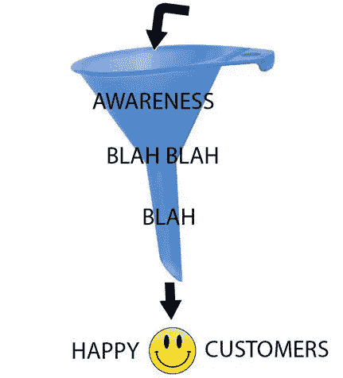
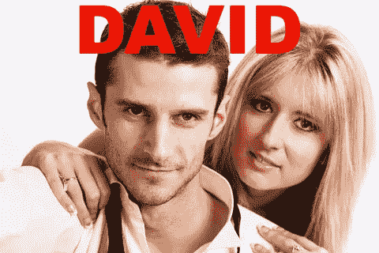
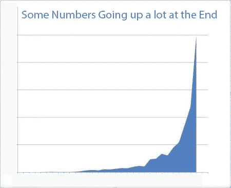

# Churninator……我们构建的消除客户流失的工具现在是开源的(你可能不希望你的竞争对手看到这一点)。

> 原文：<https://medium.com/hackernoon/the-churninator-the-tool-we-built-to-kill-churn-is-now-open-sourced-you-may-not-want-your-e5155865dc4e>

基于一个真实的故事……一家 SaaS 小公司如何将客户流失率降低到连 FaceBook 都无法匹敌的水平。

我是 CoverageBook.com[的开发人员之一，这是一个为公关专业人士加速和简化报告的工具。](https://coveragebook.com/)

我们在营销和开发团队之间大致平分秋色。大多数时候，营销团队做他们的事情(开发营销策略等)，而我们在开发团队做我们的事情(编码，掰手腕比赛等)。粉笔和奶酪。

但归根结底，我们都想要同样的东西:建立人们真正需要的美好服务；太好了，他们会很乐意付钱的。然后我们可以继续开发[营销](https://hackernoon.com/tagged/marketing)策略，并进行掰手腕比赛。这是一个美丽的良性循环。

实现这个梦想并不容易，但我们在这方面做得很好。全球 100 多个国家的 1，000 多名活跃、快乐的客户。我们每周都有 100 条线索进来，给我们的免费试用一个回旋的机会，如果结果证明他们喜欢他们所看到的，那么他们就会注册一个付费计划。经典的漏斗东西在这里，真的不值得写一篇博文。我听到了。

但在漏斗的另一端，没人愿意谈论的肮脏的一端，你有所有 SaaS 公司都害怕的东西:流失。我还是会做关于搅拌的噩梦。或者至少我曾经……(为了甜蜜、甜蜜、无噩梦的睡眠而坚持阅读)。

Churn

你可以限定你的销售线索，以确保你有正确的客户进入顶部，所以当有一天来自纽约的大卫注册了一个付费计划时，我们认为我们有了另一个伟大的合格客户。我们都在 CoverageBook.com 总部欢呼(当另一个快乐的试用者意识到他们不能没有我们时，我们总是这样做)。他看起来像是另一个完全合格的，对我们来说完美的匹配，这似乎是另一段美好关系的开始。

…from New York.

大卫利用 CoverageBook.com 度过了快乐的几个月:眨眼间就做出了令人眼花缭乱的报告。但是后来他的主要客户取消了和他的合同。是客户想要 CoverageBook.com 提供的报告，所以他不再需要我们了。回到 CoverageBook.com 总部，我们幸运地不知道来自纽约的大卫的未决决定…这将继续打破我们的心。

来自纽约的大卫登录到他的帐户，看到他在过去几个月里与我们一起制作的所有漂亮的报告，尽管他几乎无法让自己这样做…是时候…结束我们之间美好的事情了…他点击“我的帐户”，在我们向大卫展示我们一起做的所有伟大的事情之前，这个地方有很多次…点击“取消我的订阅”，然后“取消”和…他的订阅被取消了。难过，好难过。

来自纽约的大卫关闭了浏览器窗口，拉起了他灰色风衣的领子，走了出来，走在寒冷的下着毛毛雨的纽约夜晚。

回到 CoverageBook.com 总部，坏消息传来。

“我们有一个搅拌器！”

我看着营销团队:斯特拉用手捂着嘴；加里看着窗外，目光呆滞。在开发团队，丹检查我们的数字，这意味着我们不能有周五晚上的啤酒，技术辩论和掰手腕。他热泪盈眶。

流失大量减少每月经常性收入(MRR)摧毁团队士气，并打破年轻，脆弱的心灵。我必须做点什么。一些激进的东西。我有一个疯狂的想法…

我整晚没睡，喝了一杯又一杯的咖啡，

黑客攻击，使一件事，将杀死流失一劳永逸…不只是为了我们的 SaaS，但所有萨斯(？SaaS 的复数形式是什么？我真的不知道)。我忽略了营销、产品和技术开发之间的所有筒仓。我嘲笑开发协议和市场营销的基本原则…我被激怒了。我累坏了。无论如何，我都决心完成这项工作。

凌晨 4 点 37 分，我拿到了。

第二天早上，我爬进总部，向团队宣布:“我已经做了一个可以杀死客户流失的东西。所有搅动。甚至是那些粘在漏斗脏端的烦人的小东西。我称之为…

在我的本地机器上进行演示后，我说服了 Gary(创始人/产品经理 twitter 家伙)让我把它热修复到产品中，然后看着我们的流失率下降…..

我是个英雄。我被举在团队的肩膀上，在办公室里走来走去。我精疲力竭，兴高采烈。我忍不住哭了。

“忍者！油炸饼！”他们欢呼起来。

我们回来了。客户流失率为零。

零。

几周前我们只能梦想的水平… MRR 正在腾飞…

MRR since Churninator

士气空前高涨…

年轻脆弱的心不会破碎。在我看来不是。

好的，两周后…

来自悉尼的苏珊决定是时候取消与我们的订阅了(她正处于艰难时期，工作已经枯竭，她正在转行)。她做了来自纽约的大卫所做的，她登录到她的帐户，点击“我的帐户”，“取消我的订阅”，并去点击“取消”按钮，但然后…出乎意料地…非常意想不到的事情发生了…

来自悉尼的苏珊不能引起我们 MRR 的下降或打破我们的心…怎么会？观看下面的视频，看看搅动器如何设法防止这种情况，以及任何其他搅动的发生。

观看一段关于 Churninator 的视频:

如果你运行一个 SaaS，并希望看到你的客户流失率降到零，我们已经开源了 Churninator，它可以作为 Rails gem([GitHub](https://github.com/AlanDonohoe/churninator_gem)/[ruby gems](https://rubygems.org/gems/churninator))或 [Bower 包](https://github.com/AlanDonohoe/churninator_bower)。这一次我们请客。你们这些疯狂、年轻、脆弱的梦想家们，做个好梦吧(完整的安装说明在 GitHub 页面上)。

在推特上关注我。

你知道有哪些公关专业人士对报道感到纠结/厌烦吗？查看:[CoverageBook.com](https://coveragebook.com/)免费试用(但请不要让我们伤心)。

 [## 制作封面书籍。很快。几分钟内完成分析的精美公关报告

### 它完成了它的设计任务，快速生成干净、数据丰富的覆盖报告。我的代理已经剃光了…

coveragebook.com](https://coveragebook.com/) 

> [黑客中午](http://bit.ly/Hackernoon)是黑客如何开始他们的下午。我们是阿妹家庭的一员。我们现在[接受投稿](http://bit.ly/hackernoonsubmission)并乐意[讨论广告&赞助](mailto:partners@amipublications.com)机会。
> 
> 如果你喜欢这个故事，我们推荐你阅读我们的[最新科技故事](http://bit.ly/hackernoonlatestt)和[趋势科技故事](https://hackernoon.com/trending)。直到下一次，不要把世界的现实想当然！

