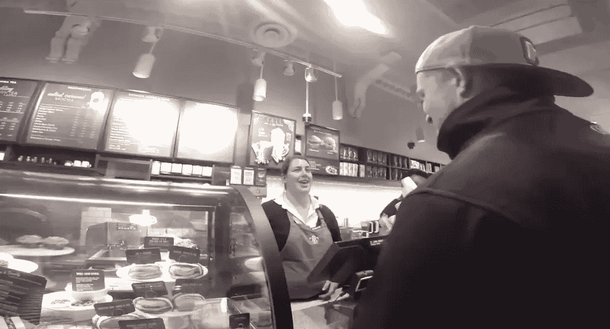

# 咖啡挑战:要求你想要的东西的力量

> 原文：<https://medium.com/hackernoon/the-coffee-challenge-the-power-of-asking-for-what-you-want-eeebfdcbab91>

The power of asking for what you want.

## 我在 2015 年做的最好的事情之一是诺亚·卡根的咖啡挑战。这是一次奇妙的经历，它让我明白了如果你想要什么，你需要主动去要求。在我的职业生涯和个人生活中，我需要做得更好的一件事是问别人我想要什么。我明白了别人无法读懂我的心思。

当我在蒙特利尔银行工作时，我会问我的老板，为什么一个人会得到某种机会。他们总是告诉我“他们要求这么做。”在你的个人生活中也是如此。如果你想要什么，你需要能够向别人要。

下面是我十月份写的关于我的经历的帖子。每个人都应该去接受这个挑战。如果你接受了这个挑战，请在下面的评论区写下你的经历，或者发邮件给我，告诉我你在 josh.emberson@breakingbaystreet.com 的经历。

你需要参加[咖啡](https://hackernoon.com/tagged/coffee)挑战有三个主要原因:

1.  它会帮助你获得自信
2.  当你提出要求时，得到的回应可能会比你想象的更好
3.  它会告诉你，仅仅因为有传统的做事方式，(比如把咖啡的价格作为一个给定)，并不意味着这是最好的方式

收到这些信息后，我想展示一下咖啡挑战有多强大。我决定将挑战付诸实践，并与你们分享我的成果。

周六，我和我的一个朋友朱利安(Julian)带着一台 GoPro 去了多伦多的皇后街。我们的任务很简单:让*在星巴克买一杯咖啡至少有一个* 10%的折扣。然后，随着我们的成功，我们会向前支付:我们会把我们买的所有咖啡送给无家可归的人。

我们从皇后街和巴瑟斯特街的星巴克开始，计划是我去点一杯咖啡，要求 10%的折扣，朱利安会把它拍下来。我们会继续在皇后街向东走，在每一家星巴克停下来，做同样的事情。

总的来说，我们去了 10 家不同的星巴克，在其中的 6 家享受了折扣。让我重复一遍:我们在 10 家星巴克中的 6 家有折扣！我认为这是一个不错的回报！我所做的只是要求 10%的折扣。

我们学到了什么？！

1.  获得折扣的关键是与人们建立联系。通过简单的微笑和真诚地询问他们一天过得如何，就可以和他们建立联系。当你微笑时，看着你的人很难不报以微笑。
2.  当我要求打折时，我问的大多数人都很震惊。看 [**片段**](https://youtu.be/CzOji3Q3NDY) 的时候，观察人们的反应(第一个片段之后，即使没有声音，我要求打折的时候也很容易分辨出来)。

在我问了这个问题后，每个人都给了我以下三个答案中的一个:

1.  不，我不能给你，我不能做那些决定
2.  他们只是说“当然”
3.  他们问我为什么要打折

如果他们问我为什么想要折扣，我会回答“为什么不”对于一个咖啡师来说，“为什么不”是一个足以改变他们想法的好答案。对其他人来说，“为什么不”不是一个足够好的答案。

在其中两家星巴克，咖啡师继续与我们交谈，我们向他们解释说，我们要求打折，并把咖啡送给无家可归的人。那一刻，当咖啡师发现我们在给无家可归的人送咖啡时，他们免费给了我们点的咖啡，并给了我们额外的咖啡送人。我要感谢星巴克那些令人敬畏又充满爱心的咖啡师。

总之，我们去了 10 家星巴克，得到了 6 个折扣，送出了 15 杯咖啡。这是非常棒的一天。那天我们学到的最重要的事情是:如果你不问，答案总是否定的，当我们问的时候，好事就发生了。当你把自己放在那里，那就是事情发生的时候。

今天就出去做咖啡挑战，把你的咖啡送给需要的人。这是双赢的局面。如果你得到 10%的折扣，你会感觉很好。如果你没有得到折扣，知道你在帮助别人，你仍然会感觉很好。

*原载于 2016 年 1 月 23 日*[*breakingbaystreet.com*](http://breakingbaystreet.com/2016/01/23/the-coffee-challenge-the-power-of-asking-for-what-you-want/)*。*