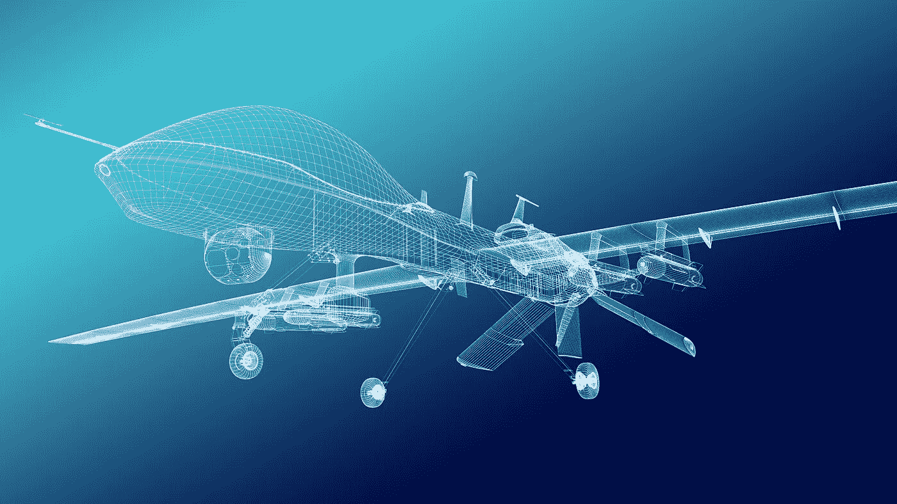
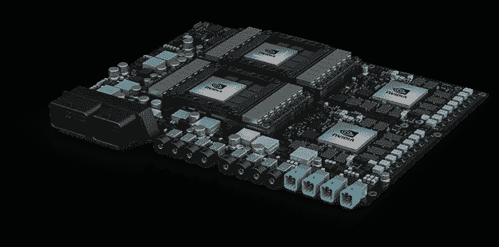
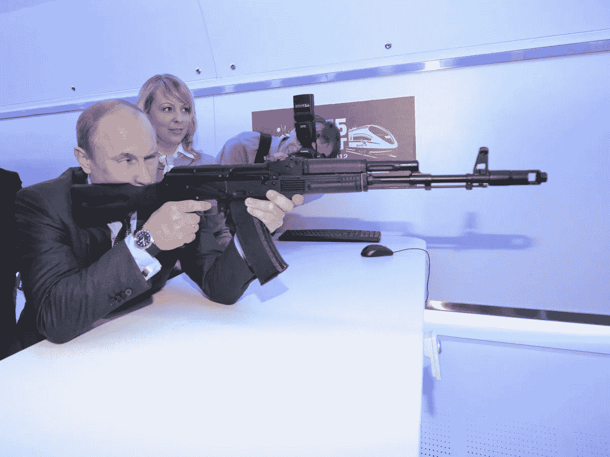
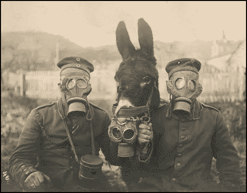

# 黑仔机器的未来时代

> 原文：<https://medium.com/hackernoon/the-coming-age-of-killer-machines-c71fdb07d51c>

本年度最恐怖的电影 不是来自好莱坞。

它来自 T4 的一个智囊团，该智囊团希望将我们从杀人机器中拯救出来。

在电影《不久的将来》的反乌托邦中，装满炸药的手掌大小的无人机使用面部识别功能，精确地追捕和屠杀人们。一系列毁灭性的袭击席卷了乡村。成群的微型杀人犯撕裂国会，基于意识形态屠杀参议员。恐怖分子将一大群飞行怪物释放到学校里，带走那些敢于公开反对威胁的父母的孩子。

The ***Slaughterbots*** short film shows us the dark side of AI.

让这一切变得如此恐怖的是我们离实现它有多近。

我才没有[艾危言耸听](https://hackernoon.com/why-superintelligent-ai-will-kick-ass-38f8b25978c0)。机器学习将给我们带来令人难以置信的新力量，从手机上的皮肤癌检测到奇异材料设计，再到加速药物发现。尽管人工智能可能会对工作产生毁灭性的影响，但也有可能人工智能将我们带入一个全新工作的繁荣黄金时代，我们只能开始想象 T21。

**而终结者、** [**超智能人工智能**](https://hackernoon.com/why-elon-musk-is-wrong-about-ai-a093b83ac99a) **接管世界大多是百年都无所谓的玄幻问题，*如果曾经*，这些机器指日可待。**

由[卷积神经网络](https://hackernoon.com/learning-ai-if-you-suck-at-math-p5-deep-learning-and-convolutional-neural-nets-in-plain-english-cda79679bbe3)驱动的 [**面部识别**](https://www.theguardian.com/technology/facial-recognition) 工作得非常好。今天你可以从亚马逊 买到几十架 [**微型无人机。大量的**](http://amzn.to/2znS3Ly) **[**开源 robo 操作系统**](https://opensource.com/article/16/12/drone-projects) 已经在 Github 上运行。更糟糕的是，穿越黑暗网络的旅行可能会让你得到无数炸药的配方。**

把所有这些放在一起，你就有了一颗聪明的子弹，准备好将恐惧打入世界的心脏。

但这只是开始。

[Nvidia Pegasus self driving car platform](https://www.nvidia.com/en-us/self-driving-cars/drive-px/).

这个星球上最大的芯片制造商从 [**【英伟达】**](https://www.nvidia.com/en-us/self-driving-cars/drive-px/) 到 [**【英特尔】**](https://www.theverge.com/circuitbreaker/2017/10/17/16488414/intel-ai-chips-nervana-neural-network-processor-nnp) ，连同几个资金雄厚的 [**隐形创业公司**](https://www.forbes.com/sites/aarontilley/2017/08/31/ai-chip-cerebras-systems-investment/#165442fe1529)**都在努力构建芯片来增强智能应用[寒武纪大爆发](https://www.datanami.com/2017/05/24/nvidias-huang-sees-ai-cambrian-explosion/)。**他们正在精心打造** [**新架构**](https://www.technologyreview.com/s/526506/neuromorphic-chips/) **并将其全部缩小为动力** [**自动驾驶汽车**](https://www.youtube.com/watch?v=fmVWLr0X1Sk)**[**卡车**](https://www.wired.com/story/what-does-teslas-truck-mean-for-truckers/)**[**手术机器人**](https://spectrum.ieee.org/the-human-os/robotics/medical-robots/autonomous-robot-surgeon-bests-human-surgeons-in-world-first) **和** [**房屋清洁机**](http://amzn.to/2Bm13lI)******

********

****Tesla electric truck capable of nearly fully autonomous driving.****

****毫无疑问，这些芯片也将为自主武器提供动力。****

****随着这些芯片变得越来越智能，以及越来越小，它将赋予这些微型杀手各种新的能力，像规避和对抗无人机营突击协调。****

****那些武器已经在这里了。****

****美国国防部[去年发布了一段视频](https://www.youtube.com/watch?v=0WNNanoUu2I)，显示微型战斗机从一架飞机上降落在[海军位于加利福尼亚州中国湖的尖端研究设施](https://www.cnic.navy.mil/regions/cnrsw/installations/naws_china_lake.html)上空。****

****观看武器滚动和俯冲攻击和防御战机轻松，他们的金属尖叫回荡在你的噩梦。他们使用从研究昆虫和 T2 狼群掠食者行为发展而来的算法。不难想象，明日之星将派出大批机器人攻击敌机。它们会从四面八方猛烈撞击机翼和引擎，让战机从天而降。****

****他们用今天的低功率芯片建造了这一切。****

******对于未来几年将充斥市场的专业人工智能芯片，他们能做些什么？******

****用不了多久，曾经被认为是科幻的东西就会变成黑暗的现实。****

****更糟糕的是，我刚刚会见了世界顶级人工智能研究人员之一，[维安·钦纳](https://www.youtube.com/watch?v=QOfX10tU6A4)。我告诉他电影的事，以及如果我们能把芯片缩小到足够小的话，它看起来有多近。他说了一些令我不寒而栗的话。****

****“我们甚至不需要它们。**借助无线技术，您可以集中智能并远程控制它们。”******

****这意味着它们今天是可能的，明天不是。****

# ******博弈论、黑色预算和恐怖******

****作为未来学家，我喜欢无法解决的问题。每当我发现一个没有答案的问题，我就忍不住去想它。****

****我们怎样才能阻止这样的事情发生？****

****首先，你可以参与其中。创作电影《T21》的组织是一个非营利组织，致力于在智能武器起飞前将其拆除。他们将发布时间安排在与联合国自主武器公约一致的时候。像埃隆·马斯克和其他一百多位科技名人一样，他们支持全面禁止人工智能攻击系统。****

****我百分之百支持这项禁令。我也认为它几乎没有成功的机会。****

****让我们来看看为什么，为什么我们不应该让它阻止我们。****

********

****Putin tests out the successor to the AK-47, the [AK-12](https://www.youtube.com/watch?v=w28PzInI0lw).****

****禁令失败的第一个原因是这些武器对世界领导人和军队来说太有诱惑力了。俄罗斯总统普京早就说过，谁领导 AI 谁就“ [**统治世界**](https://www.cnbc.com/2017/09/04/putin-leader-in-artificial-intelligence-will-rule-world.html) **。军事策划者将把这些屠宰机器人视为一种革命战争的方式。信不信由你，他们会认为他们更人性化。******

****如果你仔细想想，他们没有错。****

****向房屋投掷大量炸弹会造成毁灭性的附带伤害。他们杀错了人，砍倒了无辜的妇女和儿童，摧毁了当地的基础设施，制造了势不可挡的人道主义难民危机，这些危机有可能演变成新的冲突，并使民众反对你，因为父母们在旋转的钢铁风暴中失去了孩子。****

********

****Refugee fleeing devastated cities in Syria.****

****精确的人工智能武器可以扫除这一切。不再有建筑物倒塌，不再有无辜的孩子在晚间新闻中被撞得头破血流。****

****相反，这些黑暗的掠食者只是在夜幕的掩护下突然袭击，在他们知道是什么袭击了他们之前撕掉了他们的脸。****

****比海豹六队和导弹便宜多了。****

********

****[Hunter Killer drones](http://kaiju.wikidot.com/wiki:hunter-killer) from [Terminator 2 Judgement Day](http://amzn.to/2znKmow).****

****训练一只海豹突击队员大约要花费 35 万美元，另外每年还要花费 100 万美元让它们留在战场上。一枚爱国者导弹价值 300 万美元。像这样的无人驾驶飞机可能要花费几千美元。也许一个超级先进的要花五万美元。****

****有一个老笑话说[军事情报是一个矛盾修饰法](http://asp.tacticalgear.com/military-intelligence-is-an-oxymoron/),但是并不需要天才来做这些数字的投资回报率。****

****世界上没有一个军事策划者不想在这些微型怪物一上市就订购一千万只。****

****禁令失败的另一个可能原因是，并非世界上每个国家都会同意它。**如果有一个国家在做这些事情，** [**博弈论**](https://mindyourdecisions.com/blog/2015/07/14/an-awesomely-evil-test-question-and-its-mathematical-answer-game-theory-tuesdays/) **告诉我们其他人也会这么做。就像核武器一样，如果你没有核武器，你就不能冒险让别人拥有它们，因为它们会在任何即将到来的冲突中压倒你。这是一种生存威胁。******

****即使每个国家都同意这项禁令，这也没有关系。世界上最大的几个国家将会继续建造他们的秘密预算。****

****然而真正的问题是，这些武器几乎任何人都可以拿到。如果我们设法在国家一级禁止它们，用现成的组件、3D 打印机、开源软件和一点点意志力，它们将被证明太容易建造了。这意味着流氓演员和恐怖分子迟早会得到它们。****

****下一个 9/11 可能不是一栋大楼倒塌，而是对被认为是异教徒的精确制导攻击。****

****尽管知道所有这些，我仍然认为我们应该尽力让他们远离战场。****

********

****Soldiers in WWI with chemical weapon defense masks.****

****[**化学武器禁令**](https://www.armscontrol.org/factsheets/cwcglance) **已经被证明极其有效。自从第一次世界大战以来，我们还没有看到化学武器的广泛使用。当然，许多国家仍然藏着它们，但大多数不会冒险在较小的地区冲突中使用它们。这将需要另一次世界大战，社会习俗完全崩溃，真正的化学战再次肆虐。******

# ****按钮战争****

****那么有什么方法可以真正阻止这种事情发生呢？****

****老实说，我不这么认为，但我仍在努力。****

****目前最好的答案是对策。****

****[**反监视服**](https://ahprojects.com/projects/stealth-wear/) 是一种潜在的解决方案。已经到了[这里](http://www.projectkovr.com/)准备出发。****

****我可以想象未来面临任何威胁的每个人都有几件套头毛衣、一件夹克或一件可以阻挡热扫描仪和面部识别的连帽衫。适合你口袋的面部彩绘 可能是你和一枚爆炸性迷你导弹之间唯一的障碍。在攻击中，快速地在你的脸上划过耀眼的颜色来欺骗扫描仪。而一个 [**的 3D 打印面具**](http://www.urmesurveillance.com/urme-prosthetic/) 或许有一天能救你一命。每个人的背包、挎包或汽车里都会需要一个。****

****另一种可能性很大的是 [**防御无人机**](http://observer.com/2014/03/terrifying-taser-drone-comes-equipped-with-80000-volt-stun-gun/) 。每一个作用力都有一个大小相等方向相反的反作用力。你可能需要自己的微型机器来抵御无人攻击机。****

****将机器人从指定的禁飞区重定向的地理围栏将在政府大楼、基地和学校上空竖起，但任何杀手机器都不太可能在乎。坏人会把代码从软件中删除。即使我们设法将 geo 模块放入芯片本身，它们仍然可以在你睡觉的时候来找你。****

********

****一个更好的办法是当小怪物靠得太近时，用能量或磁障击昏它们。把它们想象成冰或者 [**入侵对抗电子**](http://williamgibson.wikia.com/wiki/Intrusion_Countermeasures_Electronics) [从科幻小说中撕下来并赋予生命](http://amzn.to/2i8e6Cy)。俄罗斯和美国已经拥有 [**微波武器**](http://www.popularmechanics.com/military/weapons/a16044/russian-anti-drone-microwave-gun/) 可以干掉六英里外的无人机。未来二十年，ICE 将主导家庭安全系统。****

****具有讽刺意味的是，它可能是安装在你屋顶或天花板上的人工智能微波武器，证明了对屠宰机器人的最终对策。把它们想象成明天令人讨厌的烟雾报警器。****

****当然，这些都不是万无一失的。****

****就像生活中的许多事情一样，从枪支控制到核威慑，这一切在纸面上看起来简单明了，但现实却要复杂得多。禁令并不像人们希望的那样有效。巴黎拥有世界上最严格的枪支法律，恐怖分子仍然设法将自动武器带入城市，枪杀《查理周刊》的记者。****

****这才是真正的问题。****

******没有简单的答案。******

******但这并不意味着我们不应该继续寻找它们。******

****############################################****

******突发新闻:**就在我发布这篇文章的几天后，[正如我所料，俄罗斯已经表示他们不会遵守任何联合国关于杀手机器人的禁令](http://www.businessinsider.com/russia-will-ignore-un-killer-robot-ban-2017-11)。黑仔机器来了。****

****############################################****

## ******如果你在 2017 年 12 月 7 日在纽约市，你想听我谈论货币和加密货币的未来，请务必来参加** [**战略硬币峰会**](https://www.eventbrite.com/e/strategic-coin-tge-summit-cryptocurrency-utility-token-event-tickets-39701853312?aff=erelexpmlt) **。使用折扣代码“utilitytoken25”获得门票五折优惠！******

****###########################################****

## ****如果你喜欢我的工作，你可以考虑访问我的主页，因为我想拯救世界，但我无法独自完成。****

****############################################****

********

****简单介绍一下我:我是一名作家、工程师和连续创业者。在过去的二十年中，我涉及了从 Linux 到虚拟化和容器的广泛技术。****

*****看看我的第一部小说，* [***【蝎子游戏】***](http://amzn.to/2A6I54g) *，一部令人神魂颠倒的未来黑色电影，*被读者称为“神经巨匠的第一次严峻竞争”和“黑色侦探遇上约翰尼助记术”****

****如果你想了解我提供的最新最好的信息，请随时加入我的读者群。****

## ****你也可以[加入我的私人脸书小组，Nanopunk Posthuman 刺客](https://www.facebook.com/groups/1736763229929363/)，在这里我们讨论所有的科技、科幻、幻想等等。****

****############################################****

## ******最后，如果你和我一样热爱加密领域，那就来吧，加入** [**DecStack，这是加密货币和分散式应用程序项目**](http://decstack.com/) **的虚拟合作场所，在这里你可以和多个项目的杰出人物交流。永远完全免费。只是进来和社交，一起工作，分享代码和想法。通过反馈让你的想法更好。寻找新朋友。见见你的新家人。******

****############################################****

****一如既往，感谢阅读。****