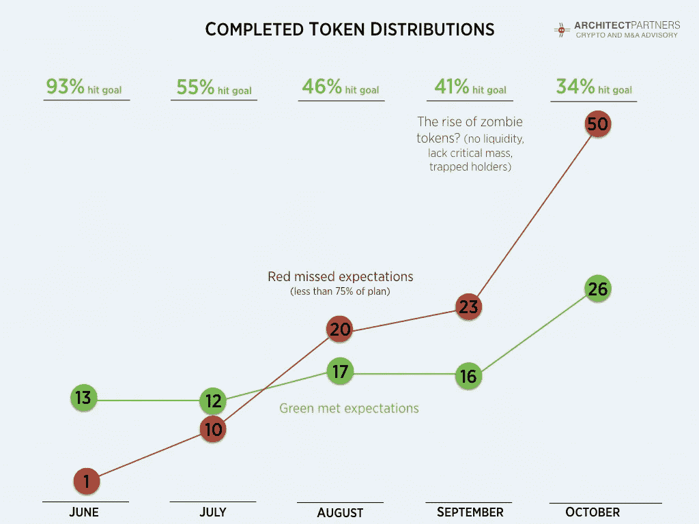

# 即将到来的僵尸令牌时代？

> 原文：<https://medium.com/hackernoon/the-coming-era-of-the-zombie-token-707350b34b42>

## 更新的 ICO 市场状况观察

一个月前，我们出版了《大多数 ICO 失败:两个世界的故事》 ,它超越了令人窒息的正面标题，更好地理解了逐个项目的 ICO 市场的重要细微差别。这些数据揭示了一个日益具有挑战性的市场。真实的情况是，越来越多的 ico 未能实现其融资目标，而且往往是非常戏剧性的。

**更新:过去一个月发生了什么？**

标题仍然非常积极。2017 年 10 月，76 个项目完成了 ICO，融资额相当于 7 亿美元，创下月度纪录。然而，正如我们上个月观察到的，市场变得越来越挑剔，只有 26 个项目(占总数的 34%)达到了融资目标，创下新低。此外，我们认为至少有几十个项目已经宣布推出 ICO，但此后又在公开场合保持沉默。这些发现与我们日常经历的轶事信号是一致的。

**对我们结论的批评**

我们的分析和结论是基于公开宣布的融资目标与实际筹集的资金的比较。我们衡量成功的标准是任意选择的提高 75%既定目标的障碍。这种方法受到了相当多的批评；认为通过 ICO 筹集资金，无论金额大小，都是成功的表现。在某些情况下，我会全心全意地同意，特别是在团队有一个雄心勃勃的融资目标，但没有达到，但仍然筹集了数千万美元资金的情况下。

**即将到来的僵尸代币时代？**

然而，许多项目仅通过其 ico 筹集了少量资本。例如，自 2017 年 6 月以来，我们统计了 82 个融资 500 万美元或更少的项目，通常少得多。

这造成了一个难题。从中长期来看，代币价值从根本上取决于 I)代币在“可行、实时和可持续”项目中的使用，以及 ii)代币持有人的流动性。筹集的有限资本可能会增加进入可行项目状态的风险，发行的少量代币实际上保证了缺乏流动性。不幸的是，我们担心这种组合可能会导致许多“僵尸令牌”。

我们将僵尸代币定义为:I)缺乏足够数量的用户/支持者，ii)缺乏足够的资金来实现其白皮书中描述的愿景，iii)代币持有人缺乏流动性，以及 iv)由于 I)至 iii)的原因，将来很可能很难筹集额外的资金。让这种情况更加复杂的是，发行者通常会永久固定代币供应量，可能会禁止未来出售额外代币来筹集所需资本。

僵尸令牌与彻底失败的项目非常不同。僵尸代币实际上可能会导致项目失败，因为 I)表示支持者数量有限，ii)难以吸引交易所上市，即使吸引到，也几乎保证了低交易量导致的低效率价格发现和流动性，iii)产生不断狙击的沮丧代币持有者。所有这些因素都会分散注意力，并形成一个负面的反馈循环。

吹毛求疵很容易。这不是我们的意图。我们的目标是帮助加密/区块链社区为加密货币和代币创建一个强大而合理、可持续、合法合规的市场。我们是过去非理性繁荣时代的直接参与者，并且相信，正如卡洛塔·佩雷兹在《技术革命和金融资本》中所说的那样，这样的状态是“发展的巨大技术浪潮”的前兆然而，直接后果可能是痛苦的。

**供考虑的建议**

我们是加密/区块链的信徒，但也认识到市场将遭受成长的痛苦，其中一些痛苦今天已经开始显现。对于那些寻求使用代币作为融资工具或平台内激励机制的人，我们建议考虑以下几点:

1.  仔细准备，假设一个具有挑战性的市场接受棘手的问题和越来越高的购买者的期望。
2.  假设您需要与越来越多的专业加密购买者合作，以成功完成 ICO。
3.  假设监管者最终会以某种方式进行监管。采取措施降低当前和未来的风险。
4.  建立灵活性以适应未知的未来。例如，在预先确定所有令牌术语时要小心。适应平台用例或额外资本可能是有利的。

**开源备份资料**

对于那些感兴趣的人来说，[这里的](https://docs.google.com/spreadsheets/d/1cpDOY_AnbO9UiUIDde7CagHzfOTDHVw4l927_7sdKSw/edit?usp=sharing)是我们所有数据分析的谷歌电子表格。我们打算允许评论，编辑和更正。

*最后一点，我们注意到，对于用什么词来描述俗称的 ICO 或首次发行硬币，目前仍存在争议。我们更喜欢代币发行，其他人则围绕 TGE 或代币生成活动。不管怎样，在我们心中，形式重于实质。监管者不会受到用来描述这类交易的名称的影响。在本文中，我们坚持使用 ICO，因为它是最常用和最广为人知的术语。*