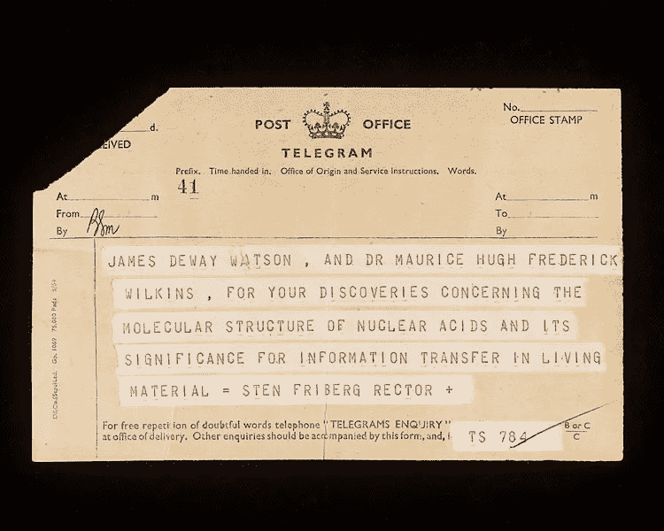
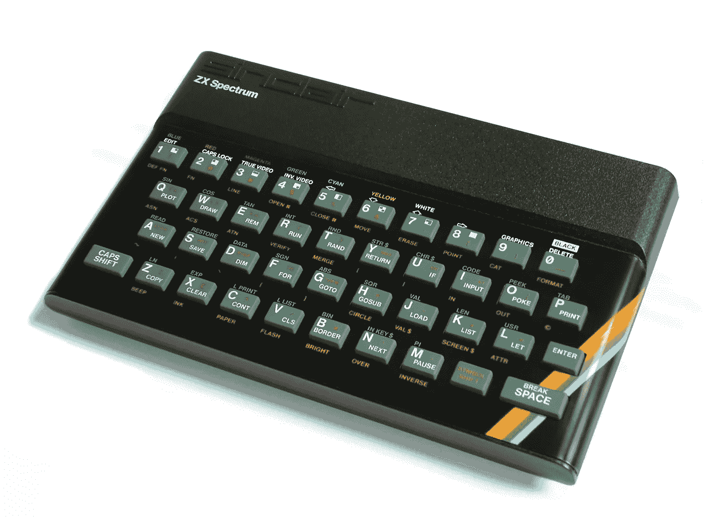

# 沟通光谱:让人们了解你的波长

> 原文：<https://medium.com/hackernoon/the-communication-spectrum-getting-people-on-your-wavelength-37e99299f96b>

## 伟大的软件来自伟大的交流

有时候你需要人们知道一些事情。有些是无聊的，非必要的，乏味的。其中一些很吸引人，也很重要。考虑这两条信息:

a.“爱丽丝下周要去上课，所以她不会在办公室”b .“我们的生产环境不佳”

那些是完全不同的新闻。一个是紧急的，可能需要每个人的立即关注。另一个很平凡。通常，我们选择电子邮件作为传递两者的最佳方式。

我不想抨击电子邮件。电子邮件也可以。但是对于这两种信息来说都不理想。关键是要认识到这两条信息是非常不同的。每一种都需要不同的交付方式。

## 电视和电报

电视将信息输入房间。有时它可能会吸引我们的眼球，但当我们在手机上上下滚动时，它往往会消失在背景中。

电报需要关注。如果你不幸欠了某人很多钱，在 21 世纪的今天，你仍可能收到一封电报。有人会来你家，核实你的名字，并在你手里放一封信。这是一种引人注目的[交流方式](https://hackernoon.com/tagged/communication)。它需要关注。

电视和电报非常不同。他们坐在通信[频谱](https://hackernoon.com/tagged/spectrum)的两端附近。

## 通信频谱

向团队成员传达信息的方式有很多，有些方式比其他方式更有效。这里有一些建议，按照他们吸引注意力的程度递增的顺序排列。

*   网站(全球资讯网的主机站)
*   海报
*   白色书写板
*   壁挂式电视屏幕
*   电子邮件
*   群组即时消息
*   直接即时消息
*   信
*   电报
*   电话会议
*   电话
*   会话
*   会议
*   在办公室里大喊大叫

最上面是“网站”。这根本不会引起太多的注意，因为必须有人真正思考才能看到它。但那可能是我们所需要的。考虑我们的第一个示例消息—

爱丽丝下周要去上课，所以她不会在办公室

如果我从来没有和爱丽丝一起工作过，或者不知道她是谁，那么我就不需要这些信息。但如果我想知道她在哪里，我可以在内部员工休假网站上找到她。

白板也很适合这种事情。我之前建议过使用真相白板。这是一种与你的团队分享关键信息而不会过多打扰他们的方式。

在我们的光谱底部是强有力的，但非常具有破坏性的，“在办公室里大喊大叫”。我认为，在出现大规模生产中断的情况下，这通常是一种合理的做法。

你的信息适合哪里？

> Jez Halford 是一名软件开发顾问，帮助团队更频繁地交付更好的软件。访问 jezhalford.com 了解更多信息。

> [黑客中午](http://bit.ly/Hackernoon)是黑客如何开始他们的下午。我们是 [@AMI](http://bit.ly/atAMIatAMI) 家庭的一员。我们现在[接受投稿](http://bit.ly/hackernoonsubmission)并乐意[讨论广告&赞助](mailto:partners@amipublications.com)机会。
> 
> 如果你喜欢这个故事，我们推荐你阅读我们的[最新科技故事](http://bit.ly/hackernoonlatestt)和[趋势科技故事](https://hackernoon.com/trending)。直到下一次，不要把世界的现实想当然！

