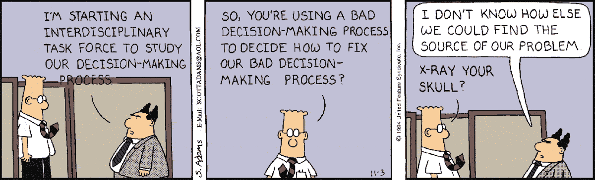

# 服务商绩效管理的关注趋势

> 原文：<https://medium.com/hackernoon/the-concerning-trend-of-facilitator-pms-d18aa21137cb>

Dilbert already knew it in 1994

你可能很清楚产品经理的角色正在从决策者转变为推动者的趋势。

退一步说，这很烦人，但如果走极端，它会导致一种缺乏决策的文化，这实际上是做出一个不做决策的决定。这种瘫痪是失败的原因。

但在喊狼来了之前，让我先退一步。

在这件事上我的声音可能不受欢迎。比我更有见识的人写道，现代项目经理的角色应该如何转变为“服务和催化”，而不是“拥有和管理”。“促进和建立框架”而不是“决定”。你可能自己也听过。

约翰·卡特勒为[写了一个有趣的故事](/@johnpcutler/the-evolving-product-manager-role-6f288bbc3cda#.8fvcysjhj)，尽管我同意他的大部分观点，但“促进者”这一部分令人担忧。

# 是的，但是

我确实看到每个团队都需要一名技术娴熟的辅导员，这也是一个巨大的优势。这是我们工作的一部分。我也明白这种转变是对首相是独裁决策者时代的一种反应。但是让我们不要陷入极端，并一直走到这样一种情况，即每个人都高兴地分配决策的责任，或者在这种情况下，缺乏决策的责任。

是的，项目经理的工作是让整个团队参与进来，共同寻找解决方案，但她也需要表现出责任感，有时还需要发挥领导作用。

# **当群体决策可能是个坏主意的时候**

这是我的候选名单:

## 1.高复杂性

有许多因素需要同时考虑。不是每个人都能在从事需要高度专注的工作时，如编码时，把他们的脑袋都包起来。

## 2.选择最不糟糕的选项

一个团体通常不会决定最好的选择，而是选择反对者最少的那个。伟大的产品不是从妥协中诞生的。

## 3.专门化

每个团队成员都应该了解产品背后的业务，并被期望为塑造产品做出贡献，但作为产品经理，你在战略和货币化方面投入的时间比任何人都多。

如果你愿意，UI 设计是一个很好的类比。每个人都应该参与进来，尤其是开发人员，这样他们就可以指出技术上的限制，但是最终设计人员有责任提供一个优秀的 UI。**进一步类比，项目经理是终极产品设计师。**

## 4.聪明的人会发现很多问题

大多数独角兽都是从一开始听起来很可怕的想法开始的。一个高度聪明的团队很好的指出 10 个行不通的理由。这可能是一个安全网，但也可能是一个障碍。

## 5.速度

决策团队中的人越多，达成共识所需的时间就越长。

> 不是非此即彼。
> 
> 对于每一种情况，项目经理都应该决定什么时候坚定并坚持一个想法，什么时候授权一个人去领导，什么时候退后让团队决定。这不仅仅是促进。

# “为什么你应该相信我”

经前综合症往往有着不同的过去。在他们职业生涯的某个阶段，他们可能是工程师、设计师、营销人员、销售代理、项目经理、商业分析师，甚至是银行家和律师。他们最早进入产品管理部门，这是他们的第二个角色，但更常见的是第四或第五个角色。

他们经常联合创办至少一家[创业公司](https://hackernoon.com/tagged/startup)，并且染指企业的每一部分。

是的，这种多样性使他们处于最适合促进任何需要促进的地方。但这也让产品经理成为你可以依靠来制定战略和做出艰难决定的人。*他们掌握着决策的全局:从利益相关者到用户，从*[*【NPS】*](https://en.wikipedia.org/wiki/Net_Promoter)*目标到收入目标。*

有时候有人不得不打个直觉电话。需要有人拿出那个长远的眼光。必须有人向整个团队“推销”这一愿景。

有时候总得有人站出来。

而被期待做这件事的人，就是产品经理。

> [黑客中午](http://bit.ly/Hackernoon)是黑客如何开始他们的下午。我们是 AMI 家庭的一员。我们现在[接受投稿](http://bit.ly/hackernoonsubmission)并乐意[讨论广告&赞助](mailto:partners@amipublications.com)机会。
> 
> 如果你喜欢这个故事，我们推荐你阅读我们的[最新科技故事](http://bit.ly/hackernoonlatestt)和[趋势科技故事](https://hackernoon.com/trending)。直到下一次，不要把世界的现实想当然！

