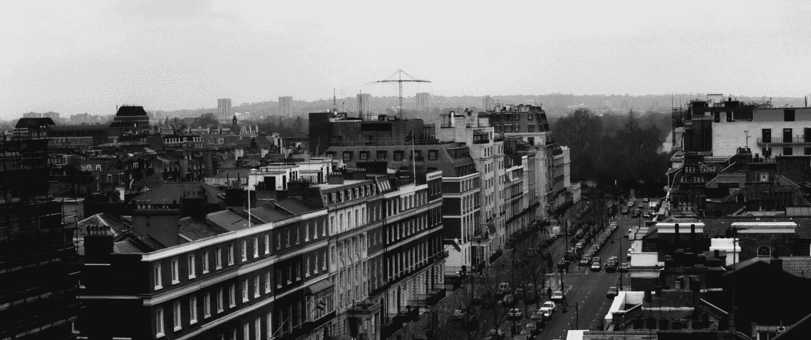
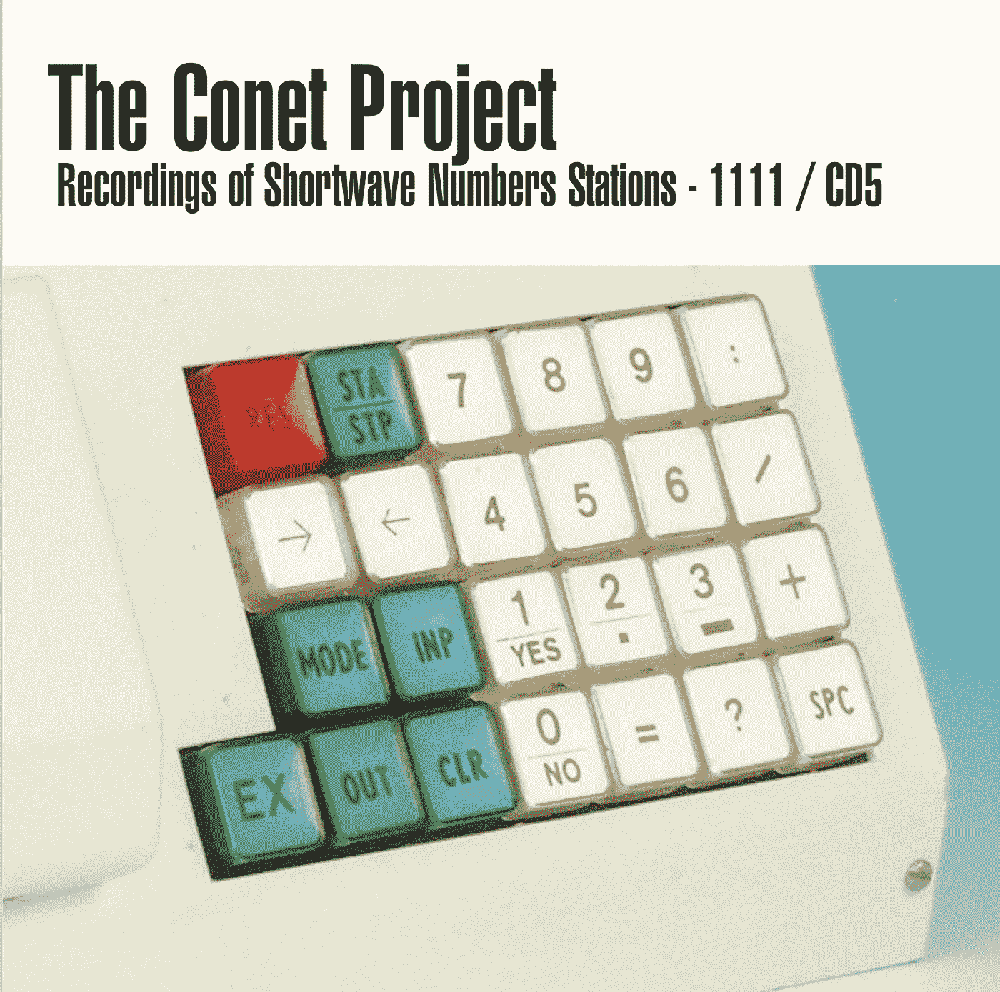
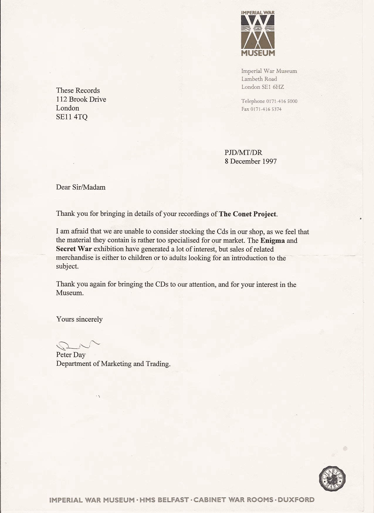

# Conet 项目:短波数字电台的记录

> 原文：<https://medium.com/hackernoon/the-conet-project-recordings-of-shortwave-numbers-stations-5e127d7cb8c6>

超过 45 年来，短波无线电频谱一直被世界情报机构用来传送秘密信息。这些信息由数百个“数字站”传送。

短波电台是匿名单向交流的完美方式。位于世界任何地方的间谍都可以通过小型的、本地可用的、未经改造的短波接收器与他们的主人联系。Numbers Stations 使用的加密系统被称为“一次性密码本”，是无法破解的。结合这一事实，即一旦信息接收者被插入敌国，几乎不可能追踪到他们，数字站系统的威力就变得显而易见了。

这些电台使用非常严格的时间表，用许多不同的语言进行传输，使用男性和女性的声音全年日夜重复数字串或语音字母。这些声音有不同的音高和语调；甚至有一个德国电台*【瑞典狂想曲】*传来一个女孩的声音！

人们可能会认为，自正式“冷战结束”以来，这些间谍活动应该已经大大减少了，但事实远非如此。数字电台，当然还有间谍，一如既往地忙碌着，自从柏林墙倒塌后，出现了许多新奇古怪的电台。

为什么在超过 45 年的时间里，数字电台的现象几乎完全没有被报道？数字电台背后的机构是什么，为什么东欧电台还在广播？为什么捷克共和国 24 小时运营一个数字站？

为什么数字电台可以干扰基本的无线电服务，比如空中交通管制和航运，而不用对任何人负责？为什么“瑞典狂想曲”数字电台用了小女生的声音？

这些只是尚未解答的一些问题。

Detail of a voice generator from the cover of the 5th disc of The Conet Project: Recordings of Shortwave Numbers Stations TCP/1111

现在，Irdial-Discs 正在发布**The Conet Project:Recordings of short wave Numbers Stations/1111**，这是一个传奇的、有史以来第一个全面的 Numbers Stations 录音合集的特别版，即将公之于众，现在又增加和更新了**一个新的第 5 张 CD，包含以前未发行的录音，所有 *176 首歌曲，5 小时 51 分钟，*** **，首次在 iTunes 上******。****

**Conet 项目是一项重要的历史参考资料，用于研究这一迄今尚未报道和未知的间谍领域。CD 上的许多电台已经停止工作，再也听不到了。最新的套装包括 4 张原始的 Conet Project CDs，其中包含 150 张 Numbers Stations 的录音，时间跨度长达 20 年，直到 1997 年发行原始套装，一本 80 页的完美装订的小册子，4 张明信片，加上一张新的**第 5 张 CD** 和 **26 张以前未发行的奇异“噪音站”**的录音，以及第 5 张 CD 附带的一本新的 8 页小册子。**

# **一则轶事…**

**1997 年，在第一次推出“Conet 项目:短波数字电台 录音”的时候，我们真的不知道它会如何被接受，也不知道如何最好地让它进入公众视野。我们抓住每一个机会试图将它公之于众，包括下面的联系人。**

**在伦敦兰贝斯路这些记录(他们正在分发 Conet 项目)的拐角处是 [*帝国战争博物馆*](http://www.iwm.org.uk/) ，他们正在举办一个名为 [*秘密战争*](http://www.culture24.org.uk/history-and-heritage/war-and-conflict/modern-conflict/tra14024) 的展览，这是**

> **“英国唯一一个专门展示英国间谍活动的永久性展览”。**

**自然地，我们想象帝国战争博物馆可能会收藏一些[*【Conet Project*](http://irdial.com/conet.htm)的“SOR”复制品，因为它与展览非常吻合。我们所要做的就是*把它展示给他们*，他们应该会接受这个想法。**

**“SOR”的意思是“销售或退货”——这就是它的工作方式。我们送来一盒七或十四份 TCP，他们把它们放在店里展示。如果他们卖了，他们就付钱给我们，如果他们不卖，他们就把拷贝退还给我们，费用由我们承担。**

**没有钱，没有保证金，也不需要账户；我们相信他们会付钱给我们，他们不会有任何风险。**

**我们给他们寄了一份样本和一封关于 TCP 的信。你可以想象当我们收到帝国战争博物馆商店的回复时，我们笑得多开心:**

****

**现在，偏执狂会说有人打了个电话，取消了正在储备的 Conet 项目。愤世嫉俗的人会说，“他们只是不明白”，其他人会说，“这只是陈述”。不管是哪种方式，我们都觉得很奇怪，像 TCP 这样与全面间谍展览密切相关的东西，除了其他东西之外，还展示了[恩尼格玛机](http://images.google.com/images?q=Enigma+Machine+at+the+Imperial+War+Museum,+London&ie=utf-8&oe=utf-8&rls=org.mozilla:en-US:official&client=firefox-a&um=1&sa=N&tab=wi)，短波收音机，各种间谍设备等等。会以这种奇怪的方式被驳回。**

**一听*的 Conet 项目*就足以说服他们进货。Conet 项目的想法表面上看起来很枯燥，但事实却大不相同。一旦你听了它，很快就会明白，Conet 项目是一个遥远而难以接近的“专业”发布的对立面。**

**你认为以上三个原因中的哪一个**阻止了他们购买 TCP？你的猜测和我们的一样好。****

**000–000**