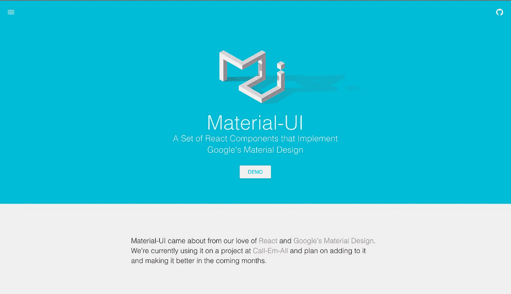

# 新 React.js 应用的最佳 UI 框架。

> 原文：<https://medium.com/hackernoon/the-coolest-react-ui-frameworks-for-your-new-react-app-ad699fffd651>

只用最好的 UI 框架来构建你的应用。

Material-UI

# 材料-用户界面

 [## call mall/material-ui

### 实现谷歌材质设计的 material-ui - React 组件。

github.com](https://github.com/callemall/material-ui) 

> [一套实现谷歌材质设计的 React 组件](https://github.com/callemall/material-ui)

此外，它是[反应](https://hackernoon.com/tagged/react)的第一个 UI 套件之一。 [Material-UI](http://www.material-ui.com/#/) 拥有你需要的所有组件*(甚至更多)*。 **Material-UI 是非常可配置的**，带有预定义的[调色板](http://www.material-ui.com/#/customization/colors)和`<MuiThemeProvider>`，使得[允许你为你的应用](http://www.material-ui.com/#/customization/themes)定义一个自定义的颜色主题。

*我个人不喜欢。* **素材 UI 曾经出现过性能问题，但是根据** [**3.0 版本**](https://github.com/rofrischmann/inline-style-prefixer/blob/master/Changelog.md#30) **性能得到了提升。**

# React 桌面

 [## React Desktop |用于 OS X El Capitan 和 Windows 10 的 React UI 组件

### OS X El Capitan 和 Windows 10 的 React UI 组件

用于 OS X El Capitan 和 Windows 10reactdesktop.js.org 的 React UI 组件](http://reactdesktop.js.org/) 

> 【for MacOS Sierra 和 Windows 10 的 UI 组件。

关于 [*电子框架*](https://github.com/electron/electron) 我相信你也知道。如果你对跨平台[桌面](https://hackernoon.com/tagged/desktop)应用的 UI 组件感兴趣，那么[**React-桌面**](http://reactdesktop.js.org/) 就是为你准备的。你可以找到 Mac OS 和 Windows 10 的 UI 组件。

# 语义-用户界面-反应

 [## 语义-组织/语义-用户界面-反应

### 官方的语义-用户界面-反应集成

github.com](https://github.com/Semantic-Org/Semantic-UI-React) 

> [*官方语义-界面-反应集成*](https://github.com/Semantic-Org/Semantic-UI-React)

[**Semantic-UI-React**](http://react.semantic-ui.com/introduction)——是 React 的 **Semantic-UI** 的官方克隆。它几乎拥有语义 UI 中所有最常用的组件，而且它还有一个**非常好的声明式 API，****React 组件的速记道具，并且这个 UI 框架是 jQuery-free 的。**

> [此外，我有一个用 React-Semantic-UI、Webpack 和其他很棒的东西构建的 starter(带演示)。](https://github.com/Metnew/suicrux)

# 蚂蚁设计

 [## 蚂蚁设计

### 蚂蚁设计🐜一种用户界面设计语言

github.com](https://github.com/ant-design/ant-design) 

> [企业级 UI 设计语言和基于 React 的实现。](https://github.com/ant-design/ant-design)

*来自官方文件:*

*   一种用于 web 应用的企业级 UI 设计语言。
*   一套**开箱即用的高品质 React 组件。**
*   **用打字稿**写的，有完整的定义类型。
*   一个**NPM+web pack+**[**dva**](https://github.com/dvajs/dva)前端开发工作流程。

它支持**浏览器**、**服务器端渲染**和**电子**环境，有许多组件和[甚至一个带有 Create-react-app 的教程。](https://ant.design/docs/react/use-with-create-react-app)

这里是蚂蚁设计的演示。

# 蓝图

 [## palantir/蓝图

### blue print——一个基于 React 的 web 用户界面工具包

github.com](https://github.com/palantir/blueprint) 

*来自文档:*

> 它是为桌面应用程序构建复杂的、数据密集的 web 界面而优化的。如果你非常依赖移动交互，并且正在寻找一个移动优先的 UI 工具包，这可能不适合你。

用打字稿写的，有很好的文档。Docs: *它包含了许多(30+) React 组件* ***覆盖了所有的基本库，从按钮*** ***到表单控件再到工具提示和树*** *。它还包括用于每个组件的***CSS 样式，以及用 Sass 和更少的变量来设计自己的组件和应用程序的工具，* ***优雅的调色板，以及两种尺寸的 300 多个 UI 图标。****

# *反应引导*

* [## 反应自举/反应自举

### react-bootstrap - Bootstrap 用 react 构建的 3 个组件

github.com](https://github.com/react-bootstrap/react-bootstrap) 

> 用 React 构建的 Bootstrap 3 组件。

*来自官方文档*:[**React-Bootstrap**](https://react-bootstrap.github.io/introduction.html)是一个可复用的前端组件库。通过脸书的 React.js 框架，你将获得 **Twitter Bootstrap 的外观和感觉，但代码更加简洁。
简而言之，这是用 React 编写的众所周知的引导组件。**

# react-工具箱

 [## 反应工具箱/反应工具箱

### react-toolbox -一组 react 组件，利用 CSS 的力量实现 Google 的材料设计规范…

github.com](https://github.com/react-toolbox/react-toolbox/) 

> 一组 React 组件，利用 CSS 模块的力量实现 Google 的材料设计规范

听说过 [**CSS 模块**](https://github.com/css-modules/css-modules) 吗？[**React-工具箱**](https://github.com/react-toolbox/react-toolbox/) 依赖于它。它允许您只使用 [**所需的 CSS，而不使用像 Purify-CSS 这样的工具。**](https://github.com/purifycss/purifycss) 此外，React-Toolbox 是**高度可定制的框架**，开箱即用 3o+组件。

# 索环

 [## 索环/索环

### 索环-最先进的企业应用 UX 框架。

github.com](https://github.com/grommet/grommet) 

> 最先进的企业应用 UX 框架。

我不能把**索环**称为 UX 框架，**要大得多**。
一大堆 UX **组件**和用 **React +** 编写的 utils 自带 **grommet-cli +【入门】**指南+预建**模板+ good docs +** 集成 **Sketch = Grommet。**

# 构造

 [## 办公开发/办公界面结构反应

### office-ui-fabric-react - React 组件为 office 和 Office 365 构建体验。

github.com](https://github.com/OfficeDev/office-ui-fabric-react) 

> React 组件用于构建 Office 和 Office 365 体验。

在过去的几年里**微软**支持并构建了许多开源项目——*Angular 2、TypeScript、VS Code(基于电子)*和 [**Fabric**](https://github.com/OfficeDev/office-ui-fabric-react) 。

[**Fabric**](https://dev.office.com/fabric) 就是用**打字稿**写的**官办库**，有 [**【入门】**](https://dev.office.com/fabric#/get-started) 指南、 [**博客**](https://dev.office.com/fabric#/blog) 、 [**官办调板和字体**](https://dev.office.com/fabric#/styles) **、**[**你项目中需要的**](https://dev.office.com/fabric#/components) 所有组件。

微软让我吃惊。感谢[*@ aslamhadi*](/@aslamhadi)*对于* [*这个链接*](https://dev.office.com/fabric) *。*

# React-md

 [## mlaursen/react-md

### react-md - React 材料设计

github.com](https://github.com/mlaursen/react-md) 

又一个实现材料设计的库。但是等等，给它一个机会。 [**React-md**](https://github.com/mlaursen/react-md) 可以根据您的需求[****是很好的文档**并且有**【入门】指南**，有**许多常见的材料组件。****](https://react-md.mlaursen.com/) ***只有一期——库由* [*一个贡献者*](https://github.com/mlaursen/react-md) *维护开发。如果你想为开源项目做贡献——React-MD 可能是个不错的选择。*
*感谢* [*苏霍夫*](https://medium.com/u/cf670d6b1ee8?source=post_page-----ad699fffd651--------------------------------) *对本库的推荐。***

**github:[https://github.com/Metnew](https://github.com/Metnew)
推特:[https://twitter.com/coldlinecall](https://twitter.com/coldlinecall)**

************

> **[黑客中午](http://bit.ly/Hackernoon)是黑客如何开始他们的下午。我们是 [@AMI](http://bit.ly/atAMIatAMI) 家庭的一员。我们现在[接受投稿](http://bit.ly/hackernoonsubmission)，并乐意[讨论广告&赞助](mailto:partners@amipublications.com)机会。**
> 
> **如果你喜欢这个故事，我们推荐你阅读我们的[最新科技故事](http://bit.ly/hackernoonlatestt)和[趋势科技故事](https://hackernoon.com/trending)。直到下一次，不要把世界的现实想当然！**

*****