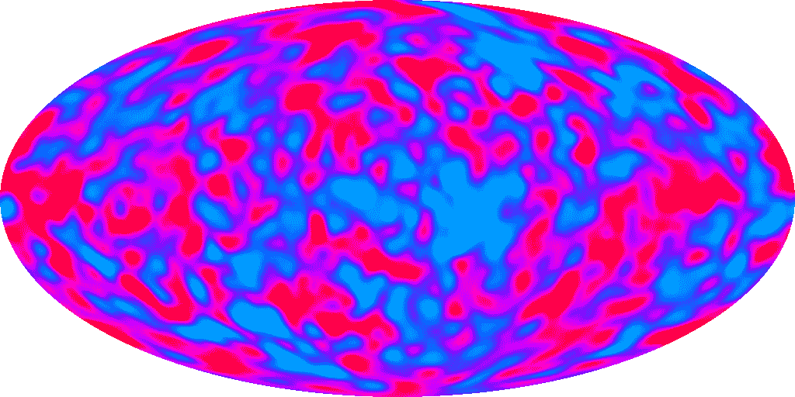
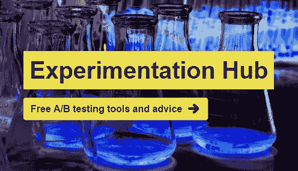

# 互联网的宇宙背景辐射

> 原文：<https://medium.com/hackernoon/the-cosmic-background-radiation-of-the-internet-d47d8e672b8b>

140 亿年前，宇宙是极其炽热、稠密的等离子体。然后，随着宇宙在大爆炸后膨胀，其中的气体冷却了。当这些气体达到大约 2700 摄氏度的温度时(在星系存在的数十亿年前)，质子和电子能够结合成氢原子，以电磁辐射的形式向各个方向释放能量。

A remnant of the Big Bang: a map of the Cosmic Microwave Background Radiation across the whole celestial sphere, as measured by the COBE satellite in 1992\. The colours represent minute temperature variations smaller than 1 part in 10,000 (average temperature of -270°C).

# 鸽子粪

时间快进到 1963 年，当时研究人员阿诺·彭齐亚斯和罗伯特·威尔逊正在研究银河系发出的微波。他们不断检测背景噪音，起初他们以为是他们使用的大型微波接收器上的鸽子粪便造成的！然而，他们很快意识到这种噪音是大爆炸留下的电磁辐射。

©[Karen Lee](https://www.flickr.com/photos/karenlee_galleries/25369547071/)

这种宇宙微波背景辐射充满了宇宙。我们可以从各个方向观察到它。这是一个恒定的噪声源，在这一领域的实验中必须加以考虑。

# 互联网的背景辐射

作为产品经理，我的部分职责是评估新产品和新功能的潜力。这些可能是意图测试，比如实际上不做任何事情的按钮，或者链接到外部网站或登录页面的横幅。它们可以是探索对人们来说什么是重要的测试，比如过滤数据或提供新信息的新方法。它们可以向不同的流量段公开现有的功能，也可以是未来产品的初步实现。我已经帮助发布了许多这样的实验，并且经常注意到，不管是什么实验，都有相对一致但较低的参与度(大约 1%)。

我想知道这种程度的参与是否存在，不管你测试的是什么特性。当然，你不能忽视人们会注意到变化并与之互动的可能性，因为它是新的。但是新鲜感只适用于熟悉你的产品的回头客。这种参与是否暴露了人们出于好奇探索他们在网站或应用程序中看到的东西的自然倾向？一小部分人会因为你的东西在那里而点击它吗？在评估特性的优点时，我们是否需要考虑持续的低水平交互？我们只是在检测[互联网](https://hackernoon.com/tagged/internet)的背景噪音吗？

# 我们为什么要关心？

在任何实验(科学或 A/B 测试)中，理解实验发生的背景是很重要的。有哪些其他可能的信号会与你的结果相混淆？还有哪些因素会影响你对数据的解读？您还需要知道什么，以便您能够准确地隔离您的实验变更对您的度量的影响？优秀的科学家和产品经理会探索数据变化背后所有可能的原因，然后声称这是由他们实施的修改引起的。他们试图证明自己是错的。

The Lagoon Nebula, in the constellation of Sagittarius - ©[NASA Goddard Space Flight Center](https://www.flickr.com/photos/gsfc/20307734442/)

然而，也许有一个更重要的问题:我们真的关心那些产生的结果与背景噪音无法区分的实验吗？他们会把你的生意推向新的令人兴奋的领域吗？你可能会说，优化核心产品漏斗中的转换率是一个恰当时机的例子。在你探索其他途径的同时养活摇钱树。然而，总有一天这会产生收益递减。我也看到了许多更好地满足客户需求实际上会降低漏斗转化率的例子。它成为满足人们的工作需求和理解(或潜在发展)你的商业模式之间的平衡行为。

# 增量收益与创新

在他的 [2017 年致股东的信](https://www.recode.net/2017/4/12/15274220/jeff-bezos-amazon-shareholders-letter-day-2-disagree-and-commit)中，亚马逊的杰夫·贝索斯将痴迷的客户关注描述为避免“第二天”自满的一种方式。痴迷的客户关注可以采取迭代和增量改进的形式，或者如贝佐斯所说，你可以“播种，保护树苗，当你看到客户高兴时加倍下注”。

针对已经满足的用户需求改进您的解决方案是有必要的，但是您业务的逐步改进将来自于发现并满足未满足的用户需求。所以，采用一种[指数思维](https://hbr.org/2016/07/how-to-create-an-exponential-mindset)，寻找能让你的关键指标提高 10 倍而不是 1%的指标。

当然，这依赖于你测试正确的东西，比如最危险的假设和最大的未知。或者将任何 MVP 集中在假设的客户需求的核心原则上。维护大局；如果你在太精细的层次上处理它，你将有过早陷入细节的风险。一个好的经验法则是问你自己，提议的实验是否会提供足够的信息来阻止你沿着特定的思路前进。或者在实验结束时，你是否会说“这很有趣，但真实的产品会有很大的不同，所以我们还是应该继续下去”。正如 Skyscanner 的首席执行官加雷斯·威廉姆斯曾经说过的:

> “我们去寻找鲦鱼，我们得到了什么？一桶小鱼！”

©[Amy Lloyd](https://www.flickr.com/photos/amylloyd/9187905742)

请记住，在那个赢得第二次世界大战的明智之举是更多更好的轰炸机的时代，一名公务员决定授权建造一架全新飞机“喷火”的原型机，因为这将是“最有趣的实验”。英国人以伦敦一栋房子的低廉价格制造了一架飞机，拯救了数百万人的生命，也可以说拯救了自由世界。

所以下一次你看你的路线图时，问问你自己有多少项目是有助于互联网的背景辐射，有多少是旨在改变你的业务或市场的工作方式。

## 想提高你的 A/B 测试吗？

*查看我的新网站:*[*【ExperimentationHub.com】*](http://www.experimentationhub.com/)*获取免费工具和建议，帮助您进行更好的实验，并对结果更有信心。*

[*ExperimentationHub.com*](http://www.experimentationhub.com/)

> [黑客中午](http://bit.ly/Hackernoon)是黑客如何开始他们的下午。我们是 [@AMI](http://bit.ly/atAMIatAMI) 家庭的一员。我们现在[接受投稿](http://bit.ly/hackernoonsubmission)并乐意[讨论广告&赞助](mailto:partners@amipublications.com)机会。
> 
> 如果你喜欢这个故事，我们推荐你阅读我们的[最新科技故事](http://bit.ly/hackernoonlatestt)和[趋势科技故事](https://hackernoon.com/trending)。直到下一次，不要把世界的现实想当然！

