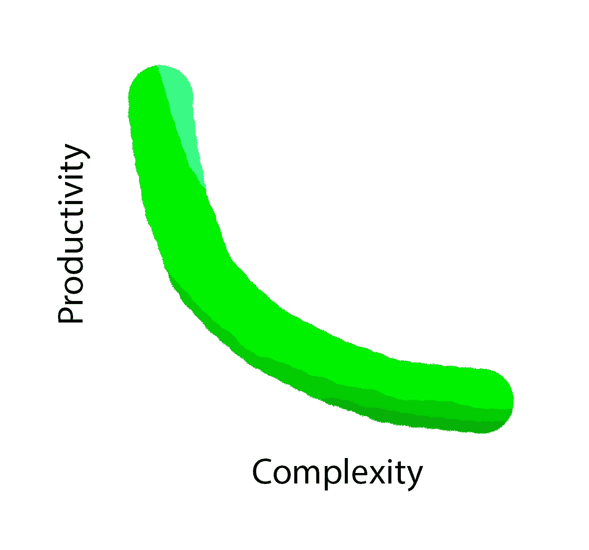

# 坏代码的代价及其预防

> 原文：<https://medium.com/hackernoon/the-cost-of-bad-code-and-preventing-it-aeabd3074fba>

[软件](https://hackernoon.com/tagged/software)项目难以置信地难以维护。在许多情况下，当开发人员得到一个旧项目时，他们更愿意重写而不是理解它。

这是一个代价高昂且难以应对的问题。虽然不是不可能。正如我喜欢说的:你需要写好的，可扩展的[代码](https://hackernoon.com/tagged/code)就是要有*好的品味*。

代码库越复杂，使用它就越困难和痛苦。

对于程序员来说，复杂性导致:

*   缺乏动力，
*   输出超过他们能力的压力，
*   学习新技术和提高技能的愿望没有实现
*   最终查看招聘人员提供的起球服务。

对于公司的其他部门来说，这将导致:

*   推迟发射计划，
*   让营销和销售团队待命，
*   客户支持团队长期从客户那里收集同样的错误反馈，
*   “非熟练”开发人员的高轮换
*   跟上竞争的艰难时期。

然而，确保代码库易于使用很少被付诸行动。更常见的是，这种事情会被归因于大量的谈话时间，表现为沮丧和希望的释放。

的确，简化代码库不会输出任何对最终用户来说是有形的东西，至少不会直接输出，但在大多数情况下，它可以轻松地比 **2x** 提高生产力，在极端情况下，它可以比**10x**提高生产力。

因此，首先让我们尝试找出问题的原因:

# 什么是坏代码？以及它对。

## 复杂的设置🕐

程序员对一个项目的第一印象是在他的电脑上设置它。有些人说第一印象是遇见某人时最重要的，许多程序员对项目也有同样的感觉。

令人惊讶的是，经常听到世界级承包商花费数周时间建立他们的开发环境的故事。那是一个什么都没有输出的时候，甚至没有使项目变得更简单，什么都没有！

## 难以理解👽

如果开发人员:

*   需要编写原始代码的人的持续支持来理解它
*   为了完成他的任务，他需要很长时间去理解什么需要改变/添加/删除，

很可能代码很难理解。

这个问题对程序员和雇主来说都是一个很大的挫折，因为开发人员的输出只是它可能输出的一小部分。

## 官僚的📃

我们都不喜欢无意义的任务，程序员也不喜欢。但是，当代码开始堆积在通常只需要几个步骤的“黑客”任务上时，它们很容易与“黑客”的数量成比例地增加。

这导致了积极性的下降，如果不允许编码者简化项目的复杂性，它可能会创造一种慢行的文化。

## 有许多妥协🔒

另一种形式的“黑客”是将代码库与依赖关系联系起来的解决方案，依赖关系可以是代码包、操作系统、连接的运行过程(本地或在线)、软件版本等形式。

妥协会将程序员锁定在降低他们工作效率的技术上，并且会导致更多的问题而不是好处。

## 先进的😥

说代码是高级的是开发人员的一个非常常见的藏身之处，他们不愿意为自己的决定辩护。

无论最终的结果有多令人惊讶，如果它不容易被别人理解，它将永远不会扩展或死亡。因为在漫长的雇佣和解雇“不像他们看起来那样合格”的开发人员的过程中，找不到可以使用它的开发人员。

# 可以采取什么措施来防止这些问题？

## 有良好的项目基础🏕

项目的基础是开发人员每次想用它做任何事情时都必须与之互动并深刻理解的东西。

它可以概括为:

*   开发和生产环境
*   体系结构

不是很多，对吧？嗯……不应该，我认为开发人员不应该花超过 5 分钟的时间去了解基础。然而，基地很容易变得复杂。

由于赶时间，基地变得过于复杂。我也同意，花很长时间来确保某件事尽可能以最好的方式完成是无效的。但不要只冲向基地。匆忙完成一个项目的各个部分绝对没问题，他们越不依赖其他部分就越好。
事实上，一个项目的各个部分可以完全不同于基础架构，只要对它的偏离在他们自己的层次上被很好地记录并且除了在他们自己的层次上没有影响。

基础的想法是帮助开发人员有一个做事的模式，这样他们就可以少考虑如何增加项目的复杂性以及在哪里可以找到它。

## 促进♻️的可回收性

尽管我们为自己的解决方案感到自豪，但我们也应该明白，在找到新的解决方案之前，它们都是相关的。

所以在编写代码时，最好尽可能使其成为简单的和独立的的**。因为当找到更好的解决方案时，遵循这些值的代码可以更容易地在不同的上下文中使用。这减少了迁移工作，并允许有更多的开发工具可供选择。**

## 社交🗣

询问其他开发人员他们对想法的看法有助于在早期发现不好的模式。

这在建立基础时尤其重要，因为以后对其进行更改可能会涉及不切实际的工作量。

## 懒惰😴

如果你发现自己一遍又一遍地重复任务，不要只是继续做。相反，找到一种方法来自动化这些任务或简化项目基础。

如果您确实自动化了官僚任务，那么也要将新命令作为开发环境命令的一部分记录下来。这样任何参与该项目的人都可以有更好的体验。

简化基础可能会耗费时间，但同样，它也可能在未来节省足够的时间来弥补它。项目越大，就越难简化。

# 结束的

好的代码是最重要的因素:

*   一个项目的寿命，
*   扩大从事这项工作的人数，
*   它能容纳多少功能
*   发展速度。

它要求:

*   *好味道*，
*   良好的基础结构和指导方针，
*   由懒惰的开发者进行社会化开发
*   尽可能独立于依赖性，尽可能容易替换。

# 保持联络

我写作的目的是为了结识能与之进行有趣对话的人。所以我最希望的就是在评论中或者推特上得到你的消息( [@esperancaJS](https://twitter.com/esperancaJS) )。