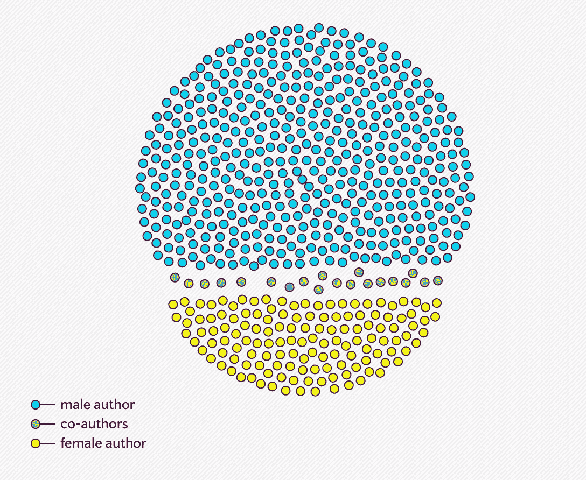
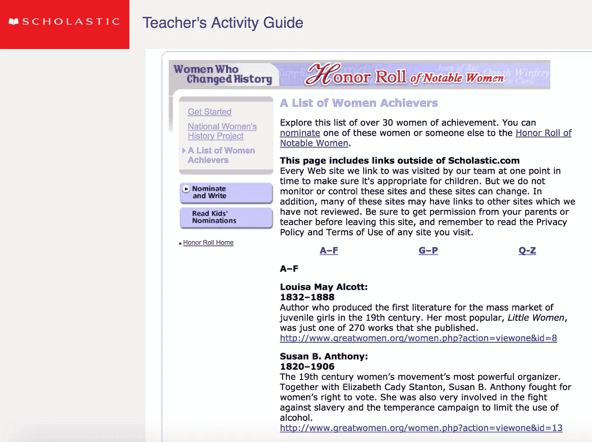
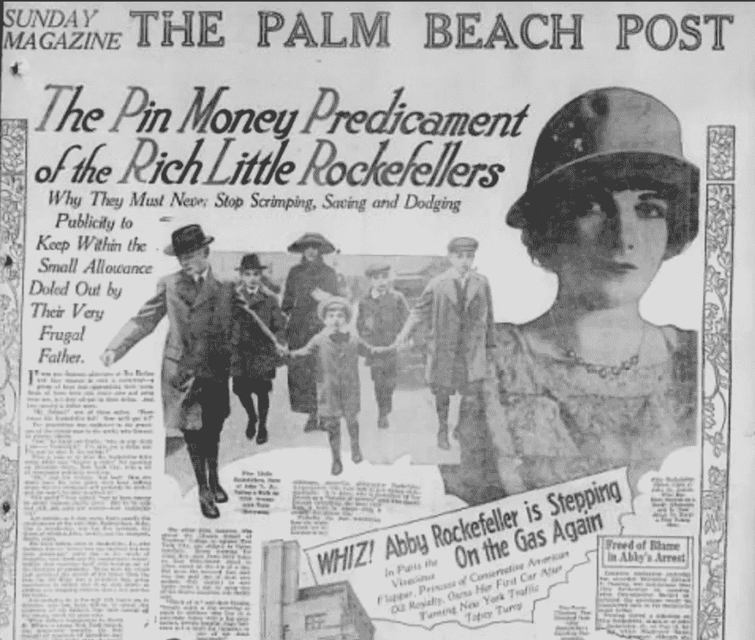

# VC 中女性的创作故事

> 原文：<https://medium.com/hackernoon/the-creation-story-of-women-in-vc-14a0575a8be7>

最近有很多关于骚扰文化的报道席卷了硅谷。性别歧视和愤怒的故事。在[女性获得的创业资金总额少于男性](https://techcrunch.com/2017/07/16/its-2017-and-women-still-arent-being-funded-equally/)而[女性获得风投席位的机会更少](https://www.theatlantic.com/business/archive/2016/09/venture-capitalist-women/501677/)。根据最新统计，风投公司的投资合伙人中只有不到 7%是女性。

自从我开始在风投公司 Union Square Ventures 工作以来的一年半时间里，对我个人来说，这是一个令人心酸的话题。

这不是我人生中第一次体验到自己是房间里唯一的女性，但这是我第一次目睹一个行业的文化强烈拒绝这种行为的含义。我感到自豪的是，我们在科技行业的地位使我们能够独一无二地实现变革。因此，我认为重要的是谈论正在发生的事情，并更好地理解导致我们来到这里的历史背景。

虽然我是风投公司投资团队的一员，但我不是投资合伙人。我每天大部分时间都专注于培养和增强我们投资组合网络中 65+项活跃投资的实力。我的工作是尽可能建立最强大的网络，并促进快速和直接地向我们投资组合内外的人介绍，让我们的公司接触新的人或想法，最终帮助他们节省时间、节省资金，并建立更好的业务。

在风险投资界，这是一个较新的工作机会，早在 2010 年，USV 就是首批引入这个机会的人之一。从那时起，我们保守地举办了 250 多场投资组合网络活动，有 3，000 多人参与了各种活动，从面对面的网络活动到在线讨论和直接的一对一同行交流。

与投资伙伴不同，我不能用投资回报的多少来衡量我的成功。

相反，我会问这样的问题:通过在正确的时间推荐正确的机构，我为寻求 SEO 策略建议的人节省了多少时间？我如何量化在一家公司的转折点上让一位新的产品候选人担任副总裁的影响？把来自十几家公司的十几个人聚集在一起，看着他们第一次认识到他们都有相似的问题，这到底有多有价值？

不用说，我所做的工作的影响会让人觉得有点“黏糊糊”

在过去的一年里，我在其他公司遇到了几十个职位与我相似的人——网络总经理、平台负责人、人才合作伙伴或社区经理。他们中的大多数人和我一样，是通过一个意想不到的切入点进入这个行业的。他们中的大多数人，像我一样，在交流他们所做工作的价值时遇到了挑战，测试这个行业和他们的公司将允许他们有多少自主权和权力。

他们中的大多数人和我一样，都是女性。

在一个由男性主导的行业，我无法回避的是，往往是女性承担这些更微妙、更柔和、以社区为中心的角色。

我们是怎么到这里的？

# **创投故事**

现代[风险投资](https://hackernoon.com/tagged/venture-capital)行业的[故事](https://hackernoon.com/tagged/story)是这样的:

早在 1957 年，当战后经济再次开始回升时，一个由飞兆相机和仪器公司(Fairchild Camera and Instrument)组成的小团队开始用硅晶体管制造半导体。两年后，这家新公司飞兆半导体(Fairchild Semiconductor)成为历史上第一家风险投资支持的初创公司。

当时的支持者洛克菲勒兄弟公司(后来成为 Venrock Partners)为现在这个多产的行业铺平了道路，几乎每天都有数百万美元的投资。Venrock 继续投资了 400 多家公司(其中包括英特尔和苹果),今年 1 月，他们的第八只基金[以 4 . 5 亿美元收盘。](https://techcrunch.com/2017/01/26/venrock-has-raised-450-million-for-its-eight-fund-just-like-its-seventh-fund/)

掌管 1959 年飞兆半导体交易的是小约翰·d·洛克菲勒的第四个孩子劳伦斯·洛克菲勒，他鼓励他的六个孩子通过投资风险交易来利用 1958 年的小企业投资法案。这个由八名合伙人组成的高水平团队包括劳伦斯的四个兄弟，一名科学家，一名律师，以及他们的姐姐艾比(他们都称她为“巴布斯”)。

是的，你没看错。第一家风险投资支持的创业公司是由一家名为洛克菲勒兄弟的公司资助的，他们的姐姐是这家公司的合伙人。

因此，第一个风险投资男孩俱乐部诞生了。

# **谁讲述你的故事？**

今年早些时候，我在旧金山的一家咖啡店里遇到了一位咖啡师，她在业余时间制作了一个播客，目的是将女性的声音带回历史的复述中。

"历史课上我们听到最多的是谁的故事？"她问，给了我一个会意的，女孩对女孩的眼神。“男人。”她继续说道:“你认为是谁把这些历史写进了塑造我们社会观的书里？”新闻快报，她说:也是男人。

那次谈话让我难忘。从那以后，我对那短暂的几分钟想了很多——被一个我承认以前没怎么考虑过的问题吓了一跳。我们的历史真的完全被男人主宰了吗？

脑海里跳转到小学读历史课本的回忆。在我的脑海中，我可以看到页面上的黑色文字，著名历史人物的肖像，定义好的词汇，还有，在关于美国独立战争的章节中，一个侧栏框，灰色阴影，几乎没有占据⅓的页面，标题是:“妇女在革命中的作用。”女性在独立战争中的贡献，以及她们在“大后方”所扮演的角色，占据了大约 350 字的篇幅，相比之下，只有几页专门讲述战斗故事以及支持每一个故事的将军们。

回顾过去，谁能说对我们来说，知道每一场革命战争中发生的所有城镇的名称比理解推动整个人口最终推翻他们的政府的社会结构更重要呢？也有可能，在那个时期，女性并不仅仅处于与(更有权力的)男性同等水平的对历史变革产生影响的位置上。

现在一想到五年级的时候，我盲目地接受任何新知识作为绝对真理，我就很生气。(并不是说一个第一次学习自己国家历史的 10 岁孩子会知道得更多。)但那篇 350 字的关于女性的小侧边栏，不仅大大淡化了我确信要复杂得多、重要得多的一段时间，而且它实际上只是自我们走进教室的那一天起，对所有女性持续而微妙的推动的一个例子:女性的故事是侧边栏。男人的故事是主要的叙事。

这并不是说讲述这些故事的历史学家作为叙述者是不可信的，但是让我们面对现实:无意识偏见并不是在[谷歌于 2014 年创造了这个著名的术语](https://www.youtube.com/watch?v=nLjFTHTgEVU)时发明的。它一直都在。

似乎没有任何可靠的研究表明，在重述历史时，这种男性声音在多大程度上主导了我们的集体世界观和视角。但是[在最近的一项研究中](http://www.slate.com/articles/news_and_politics/history/2016/01/popular_history_why_are_so_many_history_books_about_men_by_men.html)， *Slate* 分析了 614 部流行历史作品，发现其中 75%的故事是由男性讲述的。

Slate found that 75% of works of popular history are told by men: [http://www.slate.com/articles/news_and_politics/history/2016/01/popular_history_why_are_so_many_history_books_about_men_by_men.html](http://www.slate.com/articles/news_and_politics/history/2016/01/popular_history_why_are_so_many_history_books_about_men_by_men.html)

哦，对了，这个数据是 2015 年出版的书。([你可以在这里看到他们的完整名单](https://docs.google.com/spreadsheets/d/1cgv73RSGexQ7KE45pyNZlNizGJB2MTY51P1HWbnRYoU/edit#gid=0)。我无法想象女性创作的书籍的比例会比之前的任何一年都高——你能吗？

从另一个角度来看，我转向谷歌，输入“历史上的女性”

谷歌上最热门的是[的这篇学术文章](http://teacher.scholastic.com/activities/women/notable.htm)，一份女性成就者名单的“教师活动指南”。上面有 39 个名字。

说真的，学院派？更别说网站看起来从 2002 年就没更新过了。

这是我们能做的最好的吗？

Apparently there are only 39 women achievers in history… [http://teacher.scholastic.com/activities/women/notable.htm](http://teacher.scholastic.com/activities/women/notable.htm)

# **像艾比这样的人**

我一直在想艾比·巴布斯·洛克菲勒这样的人。回到 1946 年，距离投资极具颠覆性的半导体行业只有 10 年多一点的时间，这是一种什么样的感觉？是什么原因让她逃避更深入地钻研这个她已经非常接近成为其中一员的行业。

今天，当我们站在区块链和加密货币这个有可能改变游戏规则的世界的边缘时，我对此感到疑惑，这是一个有可能同样具有破坏性的技术领域。女性会成为这个故事的一部分吗？我会吗？

在艾比的案例中，除了一些关于她作为合伙人参与公司事务的附带提及，她可能参与的任何其他事情都变得更加模糊。她参加了飞兆半导体的第一次会议吗？她对这项技术可能带给世界的前景同样充满热情吗？有人邀请她参加这些讨论吗？我们可能永远不会知道。

1976 年,*《纽约时报》* 报道了她的讣告，但没有提到她与公司的关系，而是称她为“安静的洛克菲勒”

对于像艾比·洛克菲勒这样的人所面临的挑战，我只能略知皮毛。成为世界上最富有的家庭中的第一个，也是唯一的女孩。背着和你母亲一样的名字(洛克菲勒的妻子也叫“艾比”)这么多年。也许这就是为什么，随着年龄的增长，她越来越远离聚光灯，被她的五个兄弟超越。当然，没有雪莉·桑德伯格在指导她如何“融入”商界。

因此，她没有追求政治或金融(像她的大多数兄弟一样)，而是选择了更安全的路线:慈善事业。

关于艾比的故事不多，但我在这里和那里找到了一些零碎的东西。有几个关键时刻让我印象深刻:

*   她被描述为“叛逆”和“神经过敏”,因为收到超速罚单而多次见诸报端；《棕榈滩邮报》甚至称她是一个“快速完成她做的每一件事，并发现很难接受这种严格自律的生活”的人
*   据称，她在自己的婚礼[上因删除结婚誓言中的“服从”一词而引发了一场小小的社会丑闻](http://www.nytimes.com/1976/05/29/archives/abby-rockefeller-mauze-philanthropist-72-is-dead.html)。
*   她后来在麻省理工学院建立了一个基金，支持一个女性代表不足的领域的女教授。

这些轶事在我看来很突出，因为它们描述了一个现代女性的行为。

让我们客观地看待这个问题:如果在 2016 年，我穿着花裙子参加我的婚礼(对不起，妈妈)并独自走过红毯(对不起，爸爸)是“可耻的”，那么在 1925 年把“服从”这个词从你的婚礼誓言中删除会是什么感觉？！说真的。说到进步。

至少可以说，艾比不是一个没有什么智力追求的温顺女人。也许在另一个时代，她会是一个先驱。

Abby “Babs” Rockefeller on the front page of *The Palm Beach Post* on March 22, 1925: [https://www.newspapers.com/newspage/133382944/](https://www.newspapers.com/newspage/133382944/)

# **风投遗留问题**

你如何让一个行动太快的叛逆女性变成一个更喜欢独处、远离聚光灯的人？我打赌她会被关闭或者被关闭太多次。

我既不是历史学家，也不是学者。所以我甚至不能假装理解理解任何这种历史背景的错综复杂和细微差别。但我是这个创世故事延续的一部分。

从飞兆半导体开始的故事继续给我们带来主导我们日常讨论的名字:比尔盖茨、史蒂夫乔布斯、拉里佩奇、谢尔盖布林、杰夫·贝索斯、马克扎克伯格、埃隆马斯克。

而那些继续使这种权力上升的因素呢？他们是继续资助这些疯狂、牵强、疯狂想法的风险资本家。在所有这些知识和遗产中，在所有这些从车库、公园长椅和宿舍中孵化出来的想法中，甚至在沙丘路的所有那些“思想的交汇”和涌入这个生态系统的数百万美元中——[仍然主要是男人在掌舵](http://fortune.com/2017/03/13/female-founders-venture-capital/)。

有时候，我喜欢让自己进行一次思考练习，问自己如果事情的开始有一点点不同，会是什么样子。

例如，如果约翰·d·洛克菲勒克服了(几个世纪的文化偏见)并把他的长子看作是应该自然接管并开创一个将持续几十年的新事业的人，那么这个人就是艾比。如果他转向她说，“我希望你考虑一下，我们如何通过投资新企业来启动战后经济，这些新企业可能会重塑我们对工业和技术进步的看法，”她会后退一步……还是加快脚步？

如果她站出来，我相当肯定她不会把公司命名为洛克菲勒兄弟，也许她带头会引起范德比尔特家族的注意，这可能会激励他们的一个女性后代也这样做。也许“第一追随者”效应会催化我们的社会变成一个最富有和最有权力的女性是科技行业的人，滚雪球般地把我们带入一个今天的世界，科技领域不像兄弟会聚会，更像一个高雅、老派的女性俱乐部，女性首席执行官比男性更普遍，男性最终会以任何可能的方式进入这个行业，并希望通过自己的方式进入指挥链。

好吧，也许这有点夸张。但重点是:她爸爸没这么说。或者艾比没想到要这么做。因此，这种趋势还在继续。

没错，风险投资行业沉浸在一种男性主导的传统中，这种传统可以一直追溯到其诞生之初。

是的，女性(不管出于什么原因)还没有集体晋升到公司的合伙人级别。

是的，这种财富和权力的集中会导致负面的后果，并且已经这样做了。

但这个问题并不仅限于风险投资行业。

[它在能源](http://fortune.com/2015/08/04/women-energy-industry/)里。

[和](https://www.advisory.com/daily-briefing/blog/2014/08/women-in-leadership)医疗保健。

[与法](https://www.nytimes.com/2016/10/13/business/dealbook/female-law-partners-earn-44-less-than-the-men-survey-shows.html)。

[与政府](http://nytlive.nytimes.com/womenintheworld/2016/08/21/womens-representation-in-u-s-federal-government-is-falling-behind-globally/)。

[是的，甚至剧院](https://www.nytimes.com/2017/06/26/theater/theater-jobs-skew-white-and-male-study-finds.html)。

如果你认为这些行业的女性对如今在风险投资或科技行业工作没有一点感觉，那你一定是在自欺欺人。这种男性主导的历史传统无处不在。随之而来的是一系列完全不同的角色带来的长达几十年的偏见。

但是…与所有其他行业不同，风险投资也是给世界带来 Twitter 的行业。和中等。还有许多其他社交分享工具，它们不仅定义了我们的日常生活，也定义了我们做出商业决策的方式。

因此，与所有这些其他行业不同，我们有一个惊人的好处:我们可以对我们的问题制造更多的噪音。我认为这是一件非常好的事情。

科技行业一直都是颠覆性的。今天仍然如此。我们首先要弄清楚这些以性别为中心的问题。这可能会感觉缓慢、粗暴和痛苦，但我们正在取得进展。我们不是唯一经历这一切的人。但是对我们来说，每一个时刻都是在众目睽睽之下实时上演的。

也许这过于乐观，但我相信这些行动和这次曝光将为其他行业做同样的事情铺平道路。