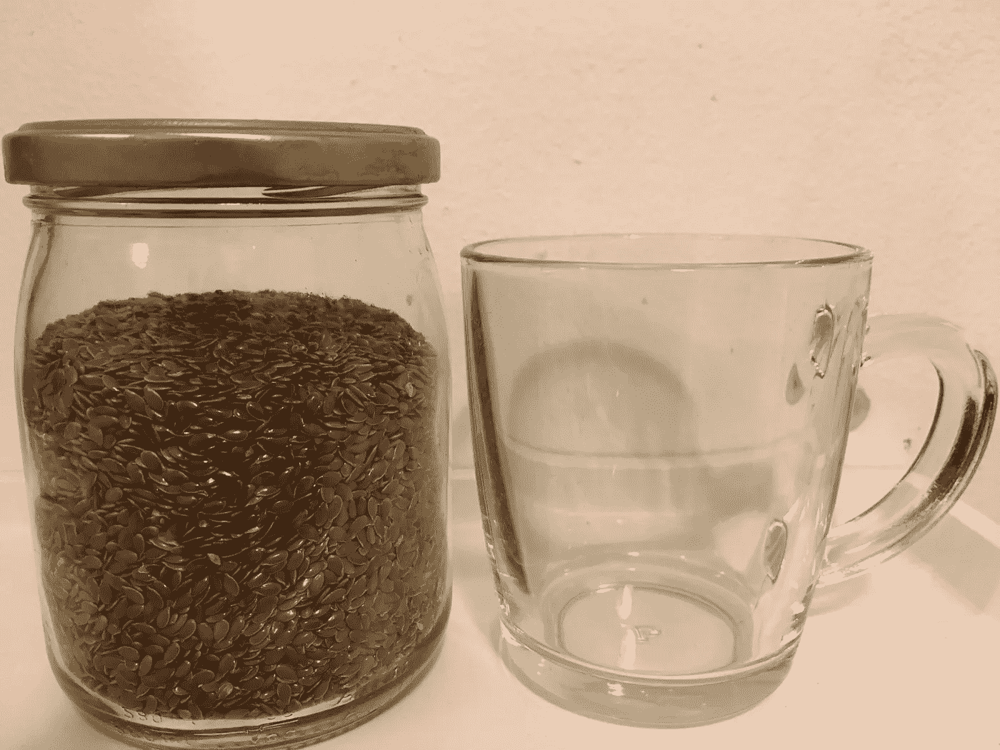

# 群体智慧挑战

> 原文：<https://medium.com/hackernoon/the-crowd-wisdom-challenge-e6afacbdd73e>

Flax seed jar

1906 年，一位名叫弗朗西斯·高尔顿的英国科学家去了一个乡村集市，在那里他看到了一场为一头大公牛进行的体重评判比赛。参与者付钱下注，试试运气，猜猜公牛的体重。共有 800 人参加了比赛。当然，他们谁也没有猜到这头牛的准确重量。他们中的一些人低估或高估了牛的体重，但弗朗西斯的发现是惊人的。他发现答案的中位数是 1207 磅，与真实体重 1198 磅的误差在 1%以内。我最近读到了 Francis 的发现，发现它相当令人印象深刻，所以我决定自己做一个小的[实验](https://hackernoon.com/tagged/experiment)…让我们看看[的群体智慧](https://hackernoon.com/tagged/crowd-wisdom)是否在猜测罐子里的亚麻籽数量上起作用。上面是我的亚麻子罐的照片。我把它放在一个玻璃杯旁边，这样你就能掌握它的大小。我还创建了一个非常简单的表单，您可以在其中添加您的猜测。请不要把你的猜测写在评论里。

【https://goo.gl/forms/SfYJbEtTmbIBiMgM2 

我会在几天后公布答案，一旦有足够多的人会猜测。这里的关键是群体，所以如果你像我一样好奇，想知道群体智慧是否真的有用，请在你的朋友中分享这篇文章:)

2017 年 3 月 18 日更新

点击阅读所有关于实验结果的[。](/@ofirdagan/the-crowd-wisdom-challenge-results-9369db1dab82#.rtqfr8qm4)

> [黑客中午](http://bit.ly/Hackernoon)是黑客如何开始他们的下午。我们是 [@AMI](http://bit.ly/atAMIatAMI) 家庭的一员。我们现在[接受投稿](http://bit.ly/hackernoonsubmission)并乐意[讨论广告&赞助](mailto:partners@amipublications.com)机会。
> 
> 如果你喜欢这个故事，我们推荐你阅读我们的[最新科技故事](http://bit.ly/hackernoonlatestt)和[趋势科技故事](https://hackernoon.com/trending)。直到下一次，不要把世界的现实想当然！

