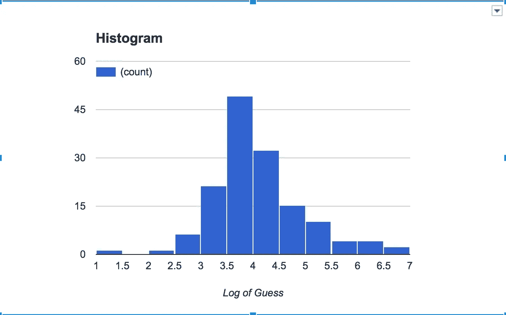

# 众智挑战[结果]

> 原文：<https://medium.com/hackernoon/the-crowd-wisdom-challenge-results-9369db1dab82>

这是我在 3 月 7 日发布的[群体智慧挑战帖子](https://hackernoon.com/the-crowd-wisdom-challenge-e6afacbdd73e#.fvi3rgy3j)的后续帖子。

真正的结果刚刚出来..在过去 7 天内猜对的 145 人中。利纳斯·梅迪纳斯和一个叫伊卡贾瓦的人最接近正确答案，那就是…..鼓…35905 颗种子！他们的猜测是 35，000。

虽然[实验](https://hackernoon.com/tagged/experiment)没有我希望的那么顺利；).猜测的中位数是 8500，平均数是 158319。中位数的误差幅度为 76.3%。有趣的笔记。如果我去掉 5.5%的高低猜测值，我将得到 37，513 的平均值，也就是 4.5%的误差幅度。如果我只去掉高的 5.5%，我将得到 35，375 的平均值，即 1.47%的误差幅度..还不错。

那么，[群体智慧](https://hackernoon.com/tagged/crowd-wisdom)真的存在吗？取决于你如何消化你的数字😉。

在下面的直方图中，你可以看到猜测的分布。正如中位数所预期的那样，大多数猜测都在 8500 或对数(3.93)附近。我根据猜测的对数做了 X 轴，这样高和低的猜测都会出现在图中。Y 轴表示在这个范围内已经猜到的人数。

## 我是怎么数出这么多种子的？

事实是我没有。).我数了两大群。1060 种子之一，1430 种子之一。我称了第一组的重量，得到 8.0 克。然后我称了第二组的重量，得到 10.8 克。因此，如果我想知道第二组有多少人，我会用 10.8 乘以 1060，然后除以 8.0，得到 1431，而不是真正的 1430。我认为这已经足够接近了，然后继续称重其余的种子。

> [黑客中午](http://bit.ly/Hackernoon)是黑客如何开始他们的下午。我们是 [@AMI](http://bit.ly/atAMIatAMI) 家庭的一员。我们现在[接受投稿](http://bit.ly/hackernoonsubmission)并乐意[讨论广告&赞助](mailto:partners@amipublications.com)机会。
> 
> 如果你喜欢这个故事，我们推荐你阅读我们的[最新科技故事](http://bit.ly/hackernoonlatestt)和[趋势科技故事](https://hackernoon.com/trending)。直到下一次，不要把世界的现实想当然！

