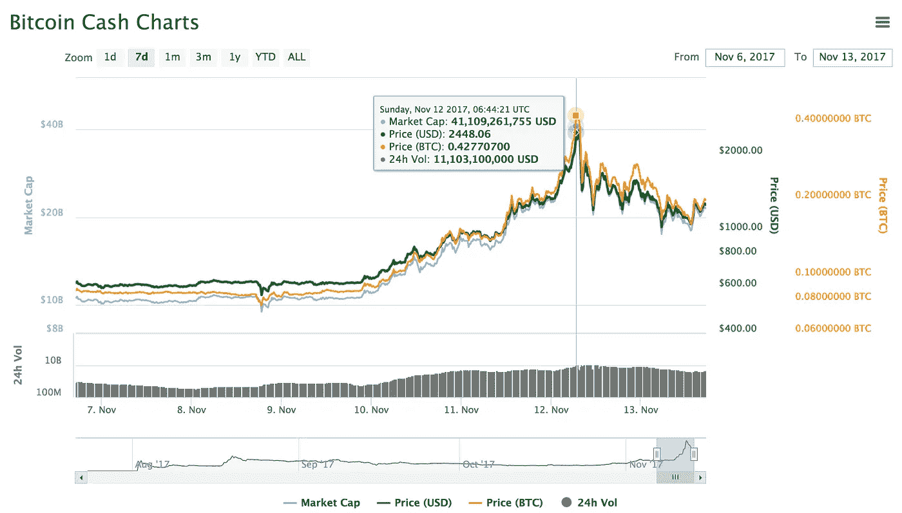
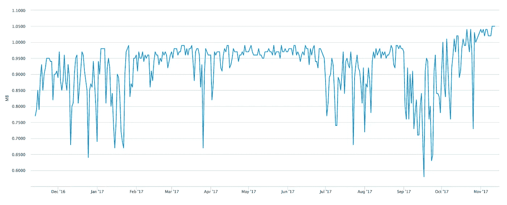
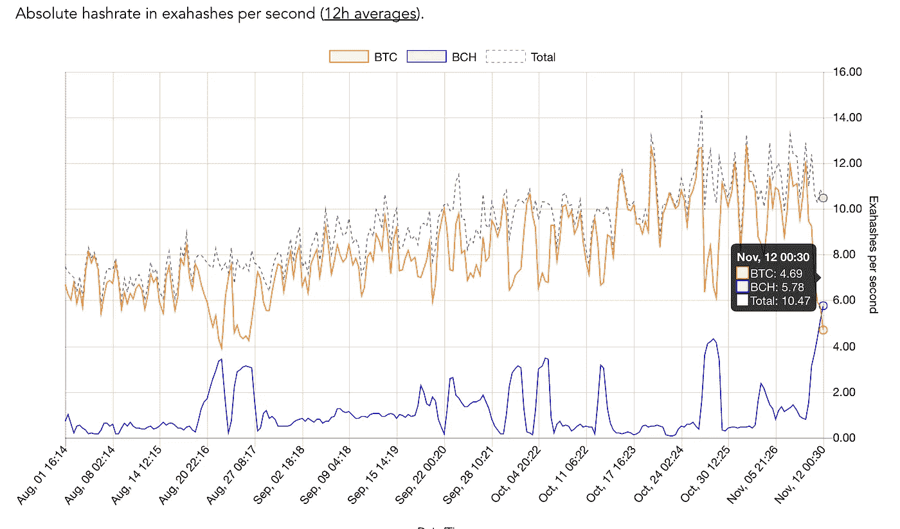

# 秘密的内战

> 原文：<https://medium.com/hackernoon/the-crypto-civil-war-40ee1ee9314f>

如果你还没听说，一种名为[比特币现金](https://www.bitcoincash.org/) (BCH)的加密货币已经疯涨。它的价值在周末几乎翻了两番，大约 24 小时前达到了 2400 美元的峰值。目前稳定在 1200 美元关口附近。如果你还没听说过这个，那是你仔细听的时候了。

Source: coinmarketcap.com

**那么什么是比特币现金呢？**

这是一种衍生的加密货币，于 8 月 1 日从我们都知道的比特币(BTC)中分裂出来，由于利益相关者的一些意识形态差异。这是通过一个叫做“[硬叉](https://www.investopedia.com/terms/h/hard-fork.asp)”的术语完成的。直到现在，比特币现金一直徘徊在 300 至 500 美元左右，被认为是小鱼，因为大多数人认为比特币(BTC)是真正的比特币。

然而，在过去的几天里，比特币社区出现了一些非常有趣的发展，在比特币(BTC)和比特币现金(BCH)市场引起了一些严重的轰动。

为了描述刚刚发生的事情以及为什么会发生，我必须稍微了解一下比特币的政治历史，甚至稍微涉及一些技术方面。

**比特币生态系统中的主要玩家是谁？**

比特币社区主要有 4 个利益相关者:维护比特币核心代码的核心开发者、保护交易安全的矿工、风险投资支持的初创企业和用户。每个利益相关者都有自己的议程。

现在，比特币原本是由化名的创始人和天才中本聪设计的点对点支付系统。

比特币核心开发团队相信，他会继续保持和扩展分散支付系统的愿景。

矿商(例如:Antpool、ViaBTC、BTC.com 等矿商)的主要目标是获取尽可能多的利润。他们因保护和验证系统中的交易而得到协议的奖励。他们也通过交易费赚钱。因此，更多的交易，意味着他们赚更多的钱(记住这一点！).

风险投资支持的创业公司(例如:比特币基地、Xapo、Shapeshift)的主要目标是通过他们的业务赚钱。交易多了他们也赚钱。不是通过交易费，而是通过其他收入模式。但是交易越多，他们赚的钱就越多(记住这一点！).

请注意，扩大交易数量对矿工和初创企业都有好处。

用户，就是像你我一样使用这个系统进行支付和存储比特币的人。

现在，你可能会看到主要的利益相关者是比特币核心开发团队、矿工和初创企业。用户没有太多发言权。

你问的政治在哪里？

中本聪在设计系统时，将比特币区块链中每个区块的区块大小定为 1MB。他这样做有一个非常技术性的原因(我不会深入细节，但这是为了在高层次上保持对系统的分散控制)。

问题是，每块交易 1MB 的门槛已经达到，比特币系统无法跟上被推送到网络中的交易数量。

Bitcoin Block Size Graph. Source: blockchain.info

为什么这样不好？以目前购买和交易比特币的人数，系统无法应对交易数量，出现了巨大的积压。一个块只能容纳这么多事务。还记得我在这里提到[的](/@rajathalex/satoshi-the-worlds-first-trillionaire-6f3b0d1b2132)比特币每 10 分钟才创建一次区块吗？这导致你的交易在很长一段时间内处于悬而未决的状态，除非你支付巨额交易费，让你的交易更早地得到矿工的验证，并将其放入区块。因此，街区空间正在成为主要的不动产。

比特币系统中任何交易的平均交易费已经达到 4 美元左右。这接近贝宝国际支付的 3.9%的费用。如果你的交易额低于 100 美元，使用贝宝可能会更便宜。因此，由于这个价格点，所设想的微交易不再可能。

此外，矿商们将会展开一场竞购战，让你的交易进入最早的区块。您支付的金额越高，您的交易就越早得到验证。

因此，您可以清楚地看到系统中的块大小和事务数量存在问题。比特币社区中产生的政治分歧是由于每个利益相关者提出了不同的解决问题的方法。

我不打算讨论技术细节，但是解决扩展事务的三个建议解决方案是:

1) [闪电网](https://www.investopedia.com/news/bitcoin-lightning-network/)(离线交易)

2) [隔离见证](https://www.investopedia.com/terms/s/segwit-segregated-witness.asp)

3)增加的块大小

[闪电网](https://www.investopedia.com/news/bitcoin-lightning-network/)(链外交易)还在研发中。

[隔离见证](https://www.investopedia.com/terms/s/segwit-segregated-witness.asp)已于 8 月通过一种名为“[软叉](https://www.investopedia.com/terms/s/soft-fork.asp)的东西在比特币(BTC)中实施，但未在比特币现金(BCH)中实施。

在这三个方案中，社区中最对立的方案是第三个，即增加街区规模。

问题是，如果增加块的大小，就会发生所谓的权力集中。比特币核心开发团队认为，这违背了中本聪建立的去中心化系统的最初愿景。然而，矿工和创业企业希望增加区块大小，以扩大交易数量，这样他们就可以赚更多的钱。他们还声称，这样做将使比特币成为真正的支付系统，与其他法定货币、VISA 和 PayPal 竞争。

因此，你可以看到战斗是在核心开发团队与主要的矿工和创业公司之间进行的。这场斗争自 2015 年以来一直在进行，当时提出了增加块大小的建议。

厌倦了永无止境的争论，2017 年 8 月，几大矿商硬分叉比特币区块链，创造了 8MB 区块的[比特币现金](https://www.bitcoincash.org/) (BCH)。这允许在系统中处理更多的交易。

然而，许多人仍然相信比特币(BTC)是真正的原创，并相信它最终会在未来得到改善。因此，比特币现金(BCH)在最初几天并没有获得太大的吸引力。

现在根据[纽约协议](/@DCGco/bitcoin-scaling-agreement-at-consensus-2017-133521fe9a77)，比特币本该在 2017 年 11 月 15 日实现一个叫做“ [SegWit2x](https://www.coindesk.com/explainer-what-is-segwit2x-and-what-does-it-mean-for-bitcoin/) 的东西。作为利益相关者之间的妥协，它应该具有 2MB 的块大小。这是社区经过两年的斗争和讨论后做出的决定。然而，他们上周取消了这一计划，因为他们担心利益相关者之间没有达成足够的共识，社区会分裂并产生另一个“硬分叉”，这可能会严重影响比特币及其生态系统。

现在，许多矿工坚持使用最初的比特币，认为 SegWit2x 将会实现。这一取消改进的举动激怒了一些主要的矿工。

**这一切意味着什么？**

现在这是事情在周末开始变得真正有趣的地方。

作为回报，并坚持他们的愿景，主要矿商如 Antpool、ViaBTC 等。将他们所有的采矿硬件和资源从比特币(BTC)转移到比特币现金(BCH)，因为这是他们的愿景的下一个最接近的替代方案。他们的目的是做空比特币(BTC)。

这一举动产生了一些疯狂的后果。突然的支持导致比特币现金(BCH)在周末飙升。现在，由于比特币现金(BCH)的价值比以前更高，在比特币现金(BCH)上采矿变得更加有利可图。因此，甚至许多较小的矿商开始将他们的资源从比特币(BTC)转移到比特币现金(BCH)来赚钱。这导致比特币现金(BCH)在周末的某个时间点拥有比比特币(BTC)更多的[哈希值](http://www.newsbtc.com/2017/11/11/bitcoin-cash-surpasses-bitcoins-absolute-hashpower-past-hours/)。他们将继续赚钱，直到比特币现金协议重置其[难度](https://en.bitcoin.it/wiki/Difficulty)来弥补这一点。

这在短期内对比特币(BTC)不利，因为挖掘的[难度](https://en.bitcoin.it/wiki/Difficulty)仍然很高，并且挖掘的很大一部分[权力](http://www.newsbtc.com/2017/11/11/bitcoin-cash-surpasses-bitcoins-absolute-hashpower-past-hours/)被转移出系统。

这是什么意思？比特币(BTC)交易在短期内得到验证需要更长的时间，交易将会大量积压。这种情况会持续下去，直到难度重新设定，最终重新校准。这也是导致比特币价格突然暴跌的原因。

Flipping of Hashpower between BTC and BCH. Source: coindesk.com

所有这一切的结果是，在两个系统之间的采矿力量转移中将有一个有趣的动态，导致加密市场在未来几周内被搅动。比特币现金(BCH)开始看起来像比特币的大卫(BTC)歌利亚，并被视为一个相当大的挑战者，它正在获得新的支持。见鬼。甚至以太坊的维塔利克·布特林也向他们表示祝贺。

祝大家有美好的一天，并小心崛起的巨人！