# 加密货币交易圣经

> 原文：<https://medium.com/hackernoon/the-cryptocurrency-trading-bible-43d0c57e3fe6>

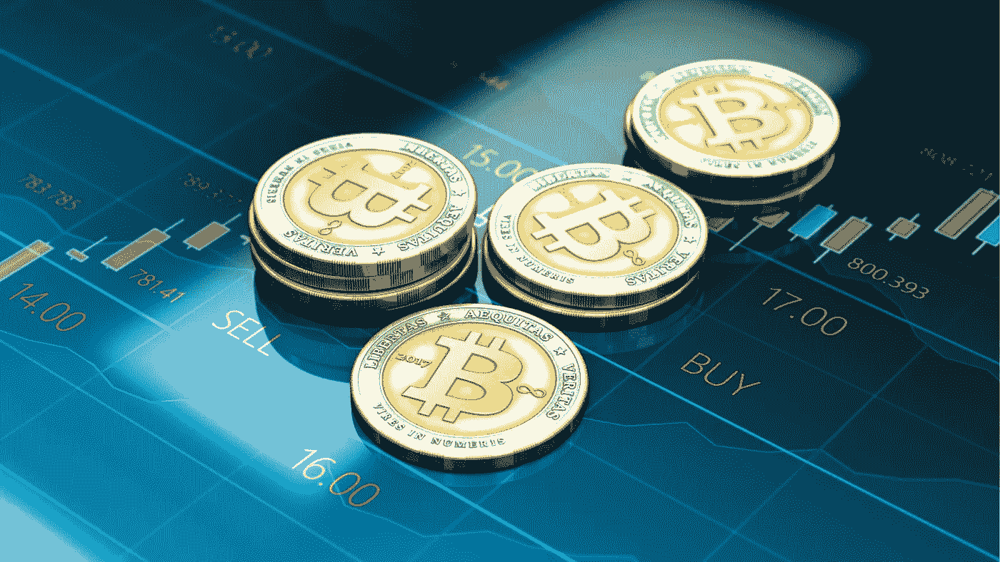

所以你想交易加密货币？

你已经看到了那些令人瞠目的 3000%的回报，你想进来。

你不会希望在普通的老股票市场投资一年后获得微不足道的 10%的投资回报率。那是给爷爷和老人的。你想用中指辞职，去你的钱！我说的对还是不对？

也许你梦想成为 [**乔丹·贝尔福特，华尔街之狼**](https://www.youtube.com/watch?v=wM6exo00T5I) ，或者 [**戈登“贪婪是好的”壁虎**？](https://www.youtube.com/watch?v=VVxYOQS6ggk)

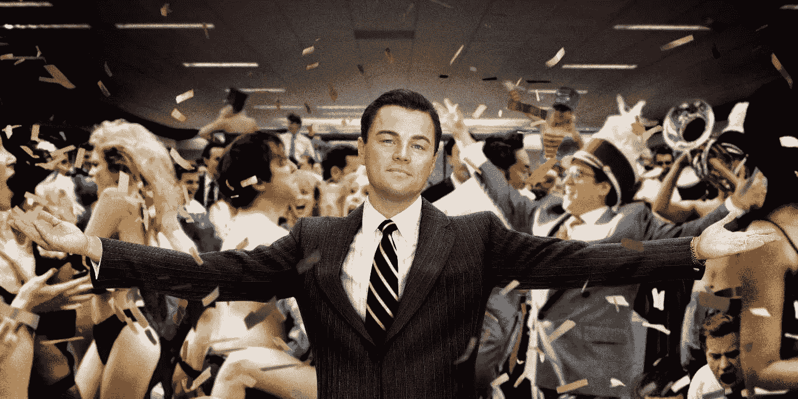

或者你想成为一个球员，一个杀手？你想要一栋镀金的房子，一艘游艇，说唱视频超级模特穿着比基尼在你的六个无限泳池中摇摆。

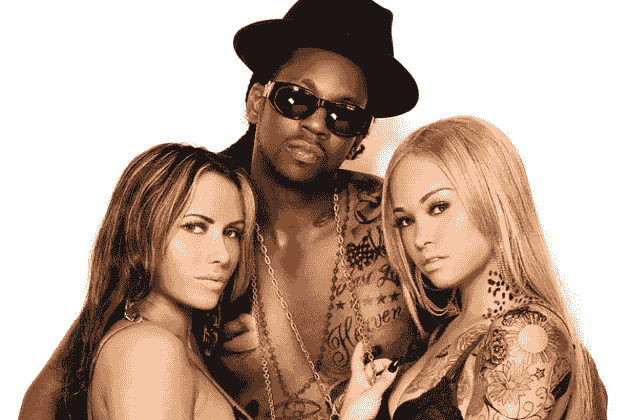

[2 Chainz Luvs Dem Strippers!](https://www.vevo.com/watch/2-chainz/i-luv-dem-strippers-(explicit)/USUV71201275)

我们没有恐惧，因为华尔街的**佛**在这里帮助你实现你的秘密荣耀梦想！这是我的故事:我住在一个单间公寓里，睡在我的浴缸里，现在我开着我的直升机去工作，只是因为我讨厌交通。

所有这些，甚至更多，都可以是你的！

靠近一点，我会告诉你闪电般快速加密财富的终极超级秘密成分！

你准备好了吗？

秘方是… **什么都没有**。

等等，什么？

没错。

致富没有秘密的成分。任何告诉你不同的人都是在卖东西。

哦，是的，我还没有真正的直升机…还没有。

当然，[加密货币确实有一些历史上最好的投资回报率](https://nextshark.com/ben-yu-cryptocurrency-101/)。你确实有机会赚大钱。**那么让我们来谈谈投资密码的正确方法*。***

*我不隐瞒我是 cryptos 长期多头的事实。我相信这是一项改变游戏规则的技术，将波及整个世界，重塑社会的方方面面。和我的朋友克里斯·迪克森一样，我相信有一天 [**比特币很可能会价值 10 万美元一枚**](http://www.coindesk.com/venture-capitalist-chris-dixon-bitcoin-will-hit-100000/) ，尽管我不太同意常年模仿[丹尼斯·霍珀](https://youtu.be/h5JXrP8yv8o) [**约翰·迈克菲对比特币将达到 50 万美元一枚**](http://www.zerohedge.com/news/2017-07-17/massive-spike-bitcoins-causes-john-mcafee-make-outrageous-prediction-promises-eat-hi) 的预测，至少在未来三年内不会。可能要多花一点时间。我已经在我的文章 [**中谈到了为什么每个人都错过了最近 500 年来最重要的发明**](https://hackernoon.com/why-everyone-missed-the-most-important-invention-in-the-last-500-years-c90b0151c169) 和 [**关于有史以来写得最好的区块链推文的思考**](https://hackernoon.com/reflections-on-the-best-blockchain-tweets-ever-written-d488af960d4f) 所以我不会再重复那些原因。*

*各位，我们要谈谈现金。不像这个领域的很多人，交易不是我的主要兴趣，但是像其他人一样，我也喜欢赚钱。*

*加密货币怎么赚钱？*

*小心点。*

# ***提问，提问***

*你需要问自己的第一个问题是，你有足够的额外资金进行投资吗？*

*额外的钱是什么意思？*

*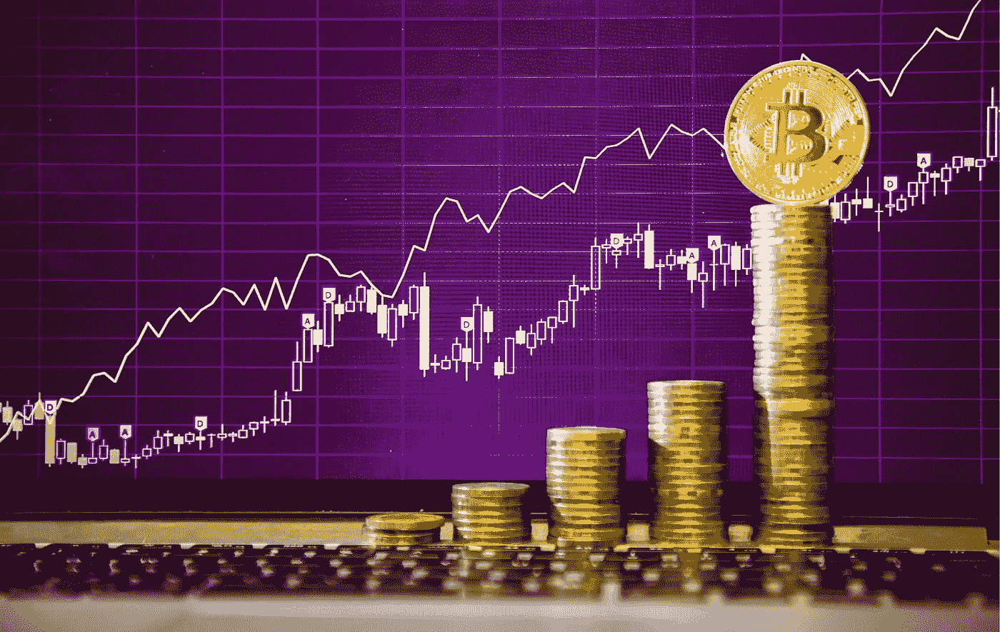*

*令人惊讶的是，美国证券交易委员会在这方面有一些很好的指导。尽管他们让伯尼·麦道夫带着一个大规模的金字塔计划逍遥法外长达十年，尽管每年都有人告诉他们这件事，但他们偶尔也会做点好事！虽然，我不是保姆式国家 [**证券交易委员会**](https://en.wikipedia.org/wiki/Accredited_investor) 认可的投资者规则的忠实粉丝，也不是“ [**模式日内交易者**](https://www.sec.gov/fast-answers/answerspatterndaytraderhtm.html) ”规则的忠实粉丝，该规则要求你至少有 25，000 美元才能在传统市场进行日内交易(*，顺便说一下，该规则不适用于秘密市场……然而*)，该规则还是有一些优点的。这些数字是武断的胡说八道，但我确实同意导致这些法律产生的观点。*

*他们试图保护人们免受他们不必要的损失。*

*既然保姆式国家不能在加密市场保护你，你就必须勇往直前，承担个人责任，保护自己。*

*虽然像 [**我把我所有的零花钱都投资到以太坊(我所有的朋友都是这样做的)**](https://motherboard.vice.com/en_us/article/ev48we/college-kids-are-investing-all-their-money-in-ethereum)**】**这样的故事在某种程度上很有趣(大学生可以承担一些风险，因为如果他们失去了一切，他们还有很多时间可以挽回)但在另一个层面上，它们也非常可怕。如果那个女孩失去了她一年所有的食物钱怎么办？不给力。*

*我现在找不到这条推文了，但就在几天前，我看到一个人发帖讲述他如何抵押了他的汽车，在交易密码时失去了一切，他的妻子把他赶了出来。他希望进入一个“狗屎硬币泵”，也就是交易者聚在一起疯狂购买，在把它扔给白痴之前，抽取相当于月亮的一分钱股票。不太好。不要做那样的人。*

*只投资你能承受损失的东西。*

*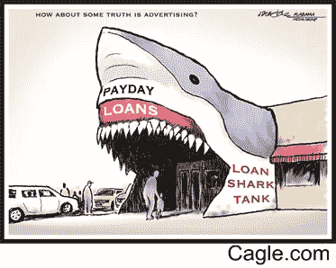*

*Copyright © [Cagle.com](http://www.cagle.com/).*

*如果你没有很多钱，*从小做起*。不要刷爆你的信用卡，也不要从那个坐在 156 街和百老汇街拐角处的家伙那里“贷款”。你只会被烧伤。*

*你要问自己的第二个问题是:*

*你是**买入并持有**还是**交易者**？*

*这是两码事。*

*对大多数人来说，正确的策略是买入并持有 。找一些众所周知的加密货币，如比特币、以太币、Dash 或莱特币，把它们冷藏起来，放在袜子抽屉里，然后忘掉它们。不要看新闻。不要担心剧烈的波动或大众媒体的悲观预测。就买，持有，忘记。一两年后，把它们挖出来，卖掉一部分，用收益再买一点。洗，冲洗，重复，直到退休。*

*然而，如果你想交易，那就完全是另一回事了。这意味着你在寻找进出市场的机会。游戏规则很简单:*

*低买高卖。*

*你会说。*

*尽管说起来容易做起来难。*

*这个游戏有两个部分:*

*   *赚钱*
*   *留着它*

*大多数人在第二部分崩溃了。每个人都在牛市中赚了钱，然后大多数人会马上把钱还回去。*

*那是不是意味着你不应该交易？不会吧。我爱交易！*

*在你获胜的日子里， ***这是终极冲刺*** 。你是一个维京掠夺者，突袭毫无防备的村民，兴高采烈地把他们砍倒。*

*但在糟糕的日子里，这是残酷的。你会失去睡眠、头发、朋友和金钱。你会沮丧，愤怒，头脑混乱。*

*那为什么还要玩呢？*

***因为交易是终极游戏。***

*你是在一个闭塞的战场上，和信息不完整的其他人竞争，也是在和疯狂的、虐待狂的市场“头脑”竞争，也是在和你自己竞争。你的精神力量、情绪和信仰系统都在与你作对。商学院教给你的关于理性行为者在市场上利用完美分布的信息做出理性决策的废话，完全是胡说八道。*

*任何花五分钟交易的人都知道这是废话。*

*市场并不理性。人也不是。我们是基于恐惧的情感动物。*

*只有象牙塔里的学院派经济学家才会想到如此荒谬的事情。*

*首先，信息甚至没有接近均匀分布。我们都在玩弄片面的信息和战争的迷雾。更糟糕的是，我们都有不同程度的处理信息的能力。意思是我们都有点傻。如果你没有那么聪明，不管你有多少信息，你都不能用它做任何事情。直接转到[邓宁-克鲁格](https://en.wikipedia.org/wiki/Dunning%E2%80%93Kruger_effect)，不要跳过 Go。*

*我们大多数人都没那么聪明。*

*我们所有人都有愚蠢的、 [**不可思议的信仰体系**](https://www.psychologytoday.com/articles/200803/magical-thinking) 和 [**破碎的精神试探法**](http://mentalfloss.com/article/68705/20-cognitive-biases-affect-your-decisions) ，它们在我们生命的每一秒都在与我们作对。*

*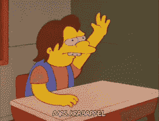*

*如果你问一群人，他们中有多少人是“高于平均水平”的司机，几乎所有人都会举手。这是不可能的。我们不可能都高于平均水平，但我们都相信自己是。*

*即使你是一个优秀的交易者，你也不能对这种精神错乱免疫。如果你认为你是，那是另一种神奇的信仰。当我写这篇文章的时候，我做了不是一个*而是两个*愚蠢的 BTC 交易，试图赶上今天疯狂的 600 美元一枚硬币的反弹。*

*我知道这是个糟糕的主意。*

*我还是做了。*

*我正在写这篇文章(不专注)*和*我参加聚会迟到了，真是愚蠢的双重打击。规则一:如果你错过了一个交易，远离市场。下次抓住他们。*

*但是我听了吗？没有。因为我和其他人一样，是一个情绪恐惧的生物。FOMO(害怕错过)抓住了我。FOMO 的原力很强大，你或任何人都不能幸免。无论你做得多好，你都会不断地搬起石头砸自己的脚。*

*当我在常规市场交易时，我不能告诉你有多少次[我看到优秀的专业交易者](http://slopeofhope.com/page/community/comments.html)(我正看着你**希望的斜率**)说“这没有意义，市场是错的。”*

*不，市场永远是正确的。*

*你错了。*

*你要么顺应潮流赚钱，要么赔钱并抱怨市场应该更加理性。*

*问题是，我们大多数人都在脑海中看到一部关于生活的电影，而不是实际上就在我们眼前的东西。如果现实和我们想去想的不匹配，我们就去想我们想去想的。对大多数人来说，放弃他们的信仰体系和死亡是一回事。他们宁愿死，也不愿改变主意。*

*这对市场不起作用。市场是谦逊的一课。你将学会看到事物真实的一面，而不是你想象中的一面，否则你将被带到柴房里，用橡胶软管抽打。换句话说，你会失去你所有的钱，就像那个白痴卖掉他的车去玩市场一样。市场是经济达尔文主义，它们毫无怜悯之心。*

*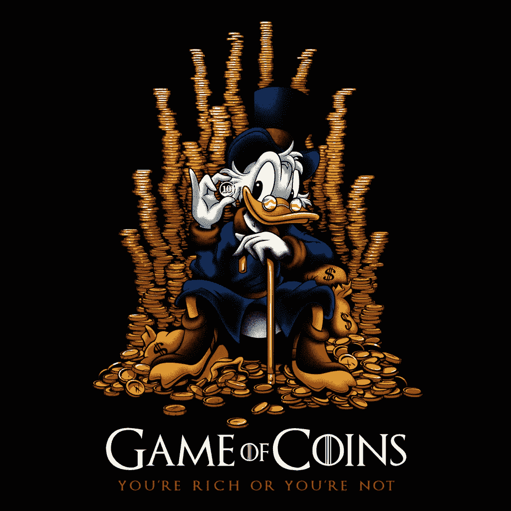*

*让我给你举一个例子，说明你的信仰体系如何在硬币游戏中对你不利。*

*我密切关注的交易者之一是波洛涅克斯 的 [**狼。在充分披露，我是*不是*的成员，他的“狼群”目前，这是他的付费私人交易信号组。我只是关注他在 Twitter 上发布的重大市场动向。那是因为，总的来说，我更喜欢自己做研究，相信自己的眼睛，听从自己的召唤，不管是对是错。**](https://twitter.com/WolfOfPoloniex)*

*狼是一个快速、积极的交易者，这很符合我的个人风格。他的电话经常让我赚很多钱。你必须问所有交易者的一个问题是“他们是对的吗？”没有人总是对的。事实上，即使是最好中的最好*也是错的多于对的*。最伟大的交易者在 20%的交易中赚钱。我们其余的交易只赚不赔。*

*那么我们如何才能客观地知道一个人是对是错呢？*

*简单。*

*我的银行账户要么上升，要么下降。*

*就是这样。*

*这是一个完美的系统。二进制。你赢或输。没有中间地带。*

*如果我的银行账户在上涨，我密切关注他的电话，那么他是对的。如果我一直在他的电话上赔钱，那他就错了。*

*但大多数人不这么看。很多人认为这家伙的电话绝对是狗屎。这是为什么呢？*

*因为狼有一种在你面前的角色，让许多人不愉快。他喜欢指责那些说他错了的人。每当他发布一个电话，人们很快就会扑向他，称他为白痴、混球和骗子。他们希望他失败。*

*原因是他们无法把他的电话和他的角色分开。他们把两件不相关的事情混为一谈。他是否讨人喜欢完全无关紧要。就我个人而言，我喜欢这家伙，但这也无关紧要。只不过人们不能也不会这么看。*

*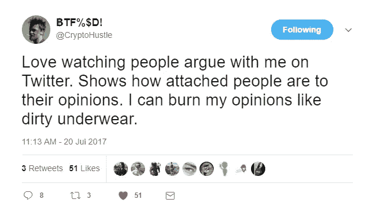*

*人们对自己的观点非常执着。烧掉你的观点！你的意见对市场毫无意义。*

*如果你认为牛市开始了，而它变成了熊市，那么你的观点是错误的。句号。算了吧！继续前进。但是人们喜欢他们的观点。他们拼命地抓着它们。*

*我们只是天生如此。*

*我们的大脑充满了精神陷阱。*

*当你错了的时候保持“正确”是赔钱的好方法。*

*你知道吗，多达 38%的人不知道美国哪个政党更保守。38%!事实上，大多数人根本不会根据实际政治来投票。他们[挑选他们最喜欢的人](http://abcnews.go.com/Technology/story?id=119958&page=1)，然后*将他们的观点投射到那个人*身上，即使那个人*的想法与他们自己的*截然相反。*

*多他妈的愚蠢啊？*

*欢迎来到人类世界。*

*我们容易产生各种疯狂的精神错乱。*

*有了这种破碎的灰质，我们怎么能指望擅长交易呢？*

*还有希望吗？*

*是的。*

# *变得擅长交易*

*首先，你最好开始阅读。*

*我们都有很多东西要学，越早开始学，我们会学得越好。你的目标是在接下来的日子里每天都学点东西。*

*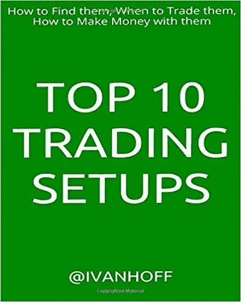*

*我目前最喜欢的关于交易的书是超级简单的 [**十大交易设置:如何找到它们，何时交易，如何用它们赚钱**](http://amzn.to/2ughxup) 。像所有交易书籍一样，我更喜欢纸质版，而不是 Kindle 版，因为图表更容易看到。*

*这本书简明扼要。没有作者的交易荣耀的故事，也没有你只需多花 1000 美元就能拥有的他的特殊的、超级秘密的系统的链接。它专注于为多重市场趋势提供简单、实用的建议。当价格上涨时，每个人都赚钱，但你如何处理横盘或下跌的交易？它在里面。*

*虽然这本书关注的是传统市场，但他提出的大多数规则都可以很容易地应用于加密市场。他在第一页解释了为什么新交易者会亏损的原因，这个原因值整本书的价格。*

*新交易者亏损是因为他们:*

> **交易量太大*
> 
> **无优势交易，或者换句话说，赌博*
> 
> **过度贸易*
> 
> **交易低价垃圾股*
> 
> **使用过度杠杆。*

*在密码系统中用杠杆交易就像耍弄眼镜蛇一样。如果你不是专业交易者，就别他妈这么做。加密市场发展太快，你很容易失去别人的钱，你不必偿还。不太好。*

*这给我们带来了常规市场和加密市场之间的一个主要区别。*

***密码市场以视频游戏的速度发展。***

*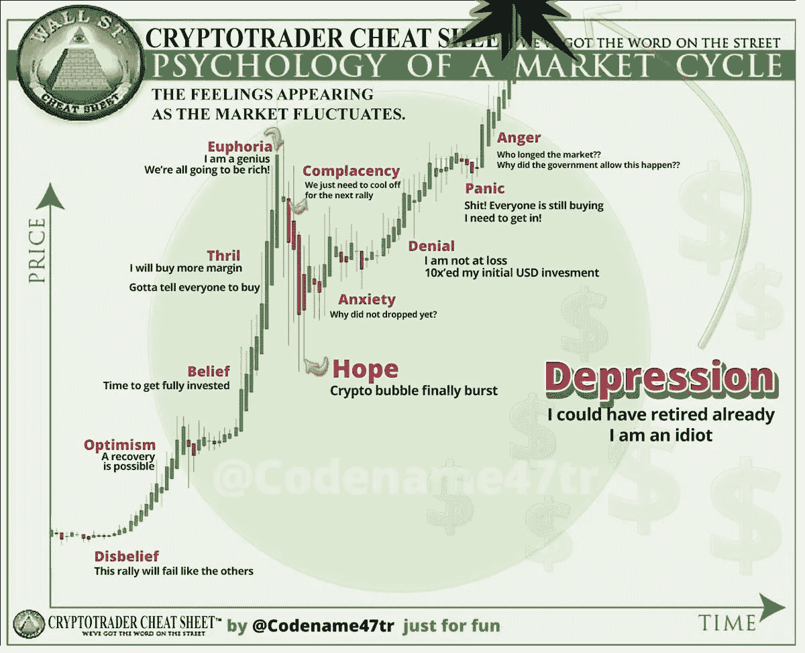*

*当他谈到一个市场可能需要几周或几个月才能结束时，在加密交易的平行宇宙中，这可能会在几天内结束。我们实际上刚刚看到市场暴跌 40%,全面下跌，然后在两天内恢复到新的高度。这就是它移动的速度。*

*这也是大众媒体不理解 cryptos 的原因之一。他们定期报告称，比特币已经彻底终结了。太搞笑了。[查看这篇来自 99 个比特币的文章。每天都有人写比特币的讣告](https://99bitcoins.com/bitcoinobituaries/)。*

*问题是大众媒体习惯于以较慢的速度玩游戏。这就好像他们在大学里是优秀的足球运动员，但是到了职业赛场上，却被其他人超过了。完全是另外一个层次。这就是电竞宇宙。*

***Cryptos 是电脑一代的股票市场。***

*它是由没有过没有互联网的生活的孩子们经营的。对他们来说，它就像一棵树，一直在那里。纽约证券交易所起源于油墨和木浆时代。当福布斯、CNN 或福克斯报道传统股市的熊市时，他们通常在一段合理的时间内是正确的。那个市场将会冷淡几个月。在 crypto 中，它明天可能会成为新星。*

*这是曲速。*

*保持你的优势。这就引出了第二本书:*

*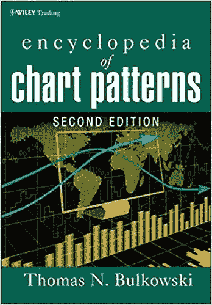*

*[**百科图表模式**](http://amzn.to/2tLuMQ2) 。*

*这本书是一个怪物。它又重又密，充满了信息。读完之后，你可能会发现模式无处不在，即使它们并不存在。别担心。无论如何都要研究它们。你会经常在 Twitter 上看到人们在图表上随意画线，并称之为“技术分析”，但这本书更加严谨和严肃。*

*技术分析在加密交易中非常有效。我的直觉告诉我，这是因为大多数交易密码的人都是极客，我们倾向于喜欢 TA，因为它对工程师的大脑有意义。这使得它们成为自我实现的预言。这也是因为有很多机器交易在进行。你将在交易所定期与机器人交易，它们别无选择，只能根据均线、回调、突破和 TA 爱好者喜欢的所有其他东西做出决定。*

*另一个有用的原因是因为 TA 都是心理学。人们希望获利并减少损失。在一定程度的上涨之后，它将会下跌。这很自然。*

*市场实际上只不过是我们集体无意识的共同幻觉，是我们希望、梦想和恐惧的投射。*

*请记住，TA 不是一个神奇的八号球。*

*它并不总是有效。往往只是垃圾巫毒。很难做对，容易做错，容易产生各种错误信号。尽管如此，它仍然是一个有用的工具。它救了我很多次，帮我避免了大事故。*

*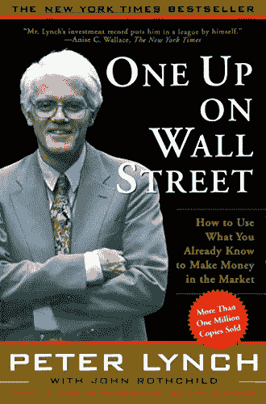*

*我单子上的最后一本书是我一直很喜欢的一本书: [**《华尔街之上》**](http://amzn.to/2ufAewy) ，作者是传奇投资人彼得·林奇。是啊，林奇，他的名字在字幕上。15 年来，他战胜了市场。统计数据显示，大多数交易者在十年后退出。书中的许多建议都已经过时了，比如在投资股票之前确保你买了房子。对今天的年轻人来说，房子通常是一个巨大的债务坑。但他的投资建议是永恒的，适用于任何市场。*

*他是怎么做他的穆拉的？像沃伦·巴菲特一样，他专注于“价值投资”。你问的是什么？问得好，年轻的学徒。*

*他投资于他所知道和理解的*。当他的妻子或孩子带着一个新商店的购物袋回家时，他会研究这家公司并购买它。他认为如果人们从它那里购买，那它就是一家好公司。**

*投资于你所知道的是一个伟大的精神启发。沃伦·巴菲特经常拒绝投资各种公司，比如人人都爱的科技明星，因为他不懂科技。因为他不明白，所以他不能提前打好电话，所以他呆在外面。如果你不明白一枚硬币的用途，那就置身事外。不要买它，因为它要去月球了，一些傻瓜在一个无聊的论坛上告诉你它是杀手。*

*在密码学中，价值投资意味着不买一堆狗屎硬币。ico 无时无刻不在发生，新的硬币涌入市场，承诺巨大的回报。他们中的一些人有一天会出生。但是在接下来的几年里，这些硬币中的大部分都将化为乌有。*

*就我个人而言，我倾向于投资“基础设施”硬币或有机会成为多面性和多用途的硬币。我有构建系统的背景，因为我做了十多年的系统管理员。我在寻找建造未来铁路的人们。*

*以太坊、比特币、QTUM、Tezos 有多种用途。[壶币](http://www.potcoin.com/)没有。*

*多年来，像所有优秀的交易者一样，彼得·林奇在 20%的“本垒打”交易中赚了所有的钱，在 80%的交易中亏损或略有收益。*

*80/20 是公式。*

*你永远不会做得比这更好，即使你管理了几年。最终你会[回到均值](http://www.investopedia.com/terms/m/meanreversion.asp)。这是统计学宝贝。数学是上帝。它控制着这里和其他地方的一切。*

*当然，即使你读完了所有这些书，也要努力记住:*

*没有什么秘密成分。*

*其实是有的。*

*秘密成分就是你。*

*这很俗气，但却是真的。*

*变好的方法是 ***进入游戏*** 。*个人经历*无可替代。古代围棋里有句老话。*

*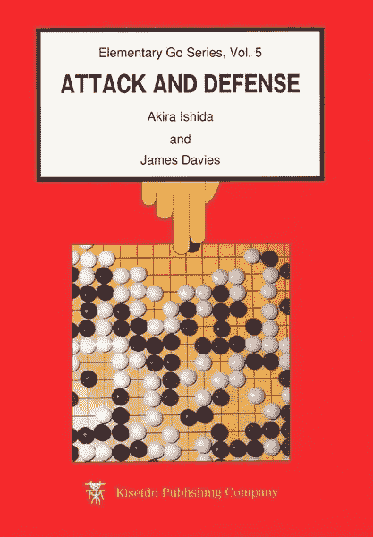*

*[**Attack and Defense**](http://amzn.to/2ufZ2Vf)*

***“学围棋，先快输 100 局。”***

*生活中的一切都是如此。*

*你必须进入竞技场。你必须玩这个游戏。在游戏中没有皮肤，你什么也学不到。*

*在书上读到一些东西是一回事，去做完全是另一回事。*

*当压力来了，你的情绪对你不利，你看着几千美元在几分钟内蒸发，你和你的另一半吵架，荒谬地指责她带你去吃饭，并“导致”你赔钱(神奇的信仰)，因为你没有像鹰一样看着交易屏幕，然后你就会明白。*

*这不是开玩笑。*

*这不是假设。上周*发生在我身上*。*

*但是我每天都在学习。*

*哦，我确实赚了钱。我只是生气我没有做更多。那时我知道我需要休息一天，什么也不做。我起晚了，散了散步，吃了一顿丰盛的早餐，并为对我美丽的女士的无礼道歉。*

*你必须充电。你不需要赶上每一次该死的跑步。出去。看树，听鸟叫，和你的孩子和宠物玩耍。简而言之，做生活中重要的事情。当你回来时，市场会等着你。*

*事情是这样的:你会犯错误。你会学到的。这是唯一的办法。*

*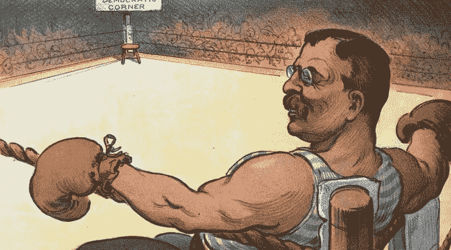*

*TR got in the arena and you should too.*

*但是，如果你让伟大的泰迪·罗斯福的这句惊人而传奇的话成为你交易和生活的指南，如果你幸运的话，你可能会在这个世界上做得很好:*

*“重要的不是批评家；不是指出强者如何跌倒，或者实干家在哪里可以做得更好的人。荣誉属于真正站在竞技场上的人，他的脸上沾满了灰尘、汗水和鲜血；勇敢奋斗的人；谁犯错，谁一次次功亏一篑，因为没有不犯错误和缺点的努力；但是谁真正努力去做这些事情呢？谁知道伟大的热情，伟大的奉献；他把自己奉献给一个有价值的事业；谁最好知道最终高成就的胜利，谁在最坏的情况下，如果他失败了，至少失败了，而大胆，所以他的位置永远不会与那些冷漠和胆小的灵魂不知道胜利和失败。”*

*############################################*

***我喜欢的红利交易书:***

*   *[**烛台如数家珍地解释了**](http://amzn.to/2eGcCNX)*
*   *[**烛台如数家珍练习册**](http://amzn.to/2vzxP00) (适合测试你的技能)*
*   *理解交易原则和用系统代替你疯狂的直觉的终极书籍是《海龟之路[**。**](http://amzn.to/2tn6Lj6)*

*############################################*

## *如果你喜欢我的作品，请[访问我的 Patreon 页面](https://www.patreon.com/danjeffries)，因为那是我与所有粉丝分享特别见解的地方。顶级赞助人可以独家访问传奇的硬币表 Discord，在这里您可以找到:*

*   ***市场来电**来自我和其他专业技术分析大师。*
*   *进入**投币人**专用**私聊**。*
*   ***幕后**看看我和其他专业人士是如何解读市场的。*
*   ***你还可以独家参加每月一次的虚拟聚会**，在那里我会分享我正在做的一切，让你看看我的幕后工作过程。*
*   *我会在每一次谈话后都有一个问答环节。问我任何问题，我都会回答。*

*############################################*

## *如果你和我一样热爱加密空间，那就来吧，加入 [DecStack，这是一个虚拟的加密货币和分散应用项目的合作场所](http://decstack.com/)，在这里你可以接触到多个项目。永远完全免费。只是进来和社交，一起工作，分享代码和想法。通过反馈让你的想法更好。寻找新朋友。见见你的新家人。*

*############################################*

*免责声明:做一个大男孩或大女孩，自己决定把辛苦赚来的钱放在哪里。我不是财务顾问，这也不是财务建议，如果我真的需要告诉你这些，那么无论如何最好把你的钱放在口袋里。*

*############################################*

## *这是我在推特上关注的交易者名单。这是一个小名单。你的列表也应该很小，否则你会得到很多相互矛盾的信号。*

*###########################################*

**

*[Photo credit](https://extranewsfeed.com/the-winds-of-world-war-iii-8bc369584f67)*

*简单介绍一下我:我是一名作家、工程师和连续创业者。在过去的二十年中，我涉及了从 Linux 到虚拟化和容器的广泛技术。*

**你可以看看我的最新小说，* [***一部史诗般的中国科幻内战传奇***](http://amzn.to/2gAg249) *在这部小说中，中国挣脱了共产主义的枷锁，成为世界上第一个直接民主国家，运行着一个高度先进、人工智能的去中心化 app 平台，没有领导人。**

## *加入我的读者群，你可以免费得到一本我的第一部小说《蝎子游戏》。读者称之为“神经癌的第一次严重竞争”和“黑色侦探会见约翰尼记忆术。”*

## *你也可以根据书中的想法查看[蝉开源项目](http://iamcicada.com/)，该项目概述了如何立即将该技术变为现实，你也可以参与其中。*

## *最后，你可以[加入我的私人脸书小组，Nanopunk Posthuman 刺客](https://www.facebook.com/groups/1736763229929363/)，在这里我们讨论所有的科技、科幻、幻想等等。*