# 加密货币交易圣经之二:技术分析的七宗罪

> 原文：<https://medium.com/hackernoon/the-cryptocurrency-trading-bible-two-the-seven-deadly-sins-of-technical-analysis-cacd04f916b3>

所以你读了原版的 [***加密货币交易圣经***](https://hackernoon.com/the-cryptocurrency-trading-bible-43d0c57e3fe6) 然后你一头扎进了这个伟大的游戏？

你过得怎么样？

要诚实。

你是在赚钱还是在赔钱？

交易只有一个标准。你不是赢就是输。很简单。有对有错，不像现实生活那样模糊不清。

**权利就是赚钱。错了就是赔钱。**

如果你亏损了，但你仍然告诉自己你擅长交易，那你就是在欺骗自己。

你涨了 100%，但四周后就全退了？那你失败了。就这么简单。

但是不用担心。我去过那里。每个人都有。没有人可以幸免。

这些都是很难的教训，但只有一个方法来学习它们:

通过自己犯错误。

没人能跳过步骤。错误是学习的一部分。你可以阅读每本交易书，在 Excel 电子表格中仔细记录一年的交易，当你面临风险时，你仍然可以用真钱来支撑它。除非你投入游戏，拿自己的钱去冒险，否则什么都不重要。当你看着钱在可怕的交易中蒸发时，直到你的血液在跳动，你的心脏在跳动，恐惧的浪潮席卷你，你才会学到该死的东西。

只有通过这样做，我们才能学到生活中的任何东西。

看关于交易的书，去参加研讨会，和朋友聊天，想着交易不是交易。交易就是交易。你得拿自己辛苦赚来的钱去冒险才能明白。

那是因为交易和生活是自我发现的旅程。

它需要剥去所有虚假和伪造的东西。当你赔钱时，需要痛苦的自我分析来找出你错在哪里。

*   你在 [**FOMO**](http://www.urbandictionary.com/define.php?term=fomo) 被扫地出门了吗？
*   你是不是 [**HODL**](http://www.urbandictionary.com/define.php?term=hodl) 太久了？
*   你试过用 [**接住落下的刀**](https://www.thebalance.com/what-does-catching-a-falling-knife-mean-1344945) 吗？
*   你买了小费而不是蘸酱吗？
*   你的止损太紧了吗？

欺骗自己是交易者的第一大敌人。社会奖励自欺欺人的人。它回报给他们的是社区、工作、友谊和一张他们并不真正了解的圣诞贺卡。但是交易惩罚被欺骗的人，以最快的速度把他们的钱拿走。

每个人都有不同的缺点。你得自己找出自己的弱点。没有人能替你做这件事。

我必须吸取的一个教训是，直到最近，我还不太擅长技术分析。

人们认为我很棒。我可以把它们中最好的放在一起做成一张漂亮的图表，并在上面画一些好看的线条。但在我内心深处，我知道我没那么好。更糟糕的是，一些和我交谈过的交易者认为我在这方面非常棒，这加剧了我对自己撒的谎。这使得它更难被发现。喜欢你的人的多巴胺会以各种可怕的方式扭曲你的思维。

这是发现谎言最困难的事情之一。人们会喜欢你的谎言。他们可能完全看不到你缺乏技能，因为他们自己也看不到。

It’s right over here!

然后有一天你醒来，意识到你是盲人领着盲人。

你突然发现你周围都是你糟糕的迹象。他们藏在显眼的地方。也许你进入交易太早了，而不是等待突破确认，或者你的头脑正在填充一些不存在的模式，或者你真的不知道这些模式是什么意思，或者你每次都不能退出交易而不归还 75%?赔钱的可能性是无穷无尽的。这就是为什么这个游戏既精彩又疯狂。

作为一个交易者，你必须很快看到你的错误，否则你会给自己挖一个越来越深的洞。

最好也是唯一的办法就是赔钱。

等等，什么？

是啊。进去赔钱。

中国古代围棋中有句老话:

**[**要得到擅长围棋的人，先输百场快**](http://agfgo.org/pages/learn2.php) **。”****

**你必须感受到失去的痛苦，才能明白你再也不想有那种感觉，而停止痛苦的唯一方法就是改善。失败是你的老师。**

**托马斯·爱迪生失败了成千上万次，才找到了制造电灯的最佳材料。一天，他恼怒的助手喊道:“为什么我们还在做这个？你为什么要浪费时间和金钱？我们经历了一次又一次的失败。不可能的。”**

**爱迪生告诉他:“我们没有失败过一千次。我们刚刚发现了一千种制造电灯的方法。**

****

**这就是这篇文章的全部内容:如何搞砸。希望这能帮助你避免我的一些愚蠢的举动。**

**你自己仍然会犯很多同样的错误，但是也许，仅仅是也许，你会在花了几千美元(或者更糟)后回过头来看这篇文章，突然想起你在这里听到的一些东西，这将增加你纠正并最终正确的机会。**

**所以，让我们深入研究一下交易的基本原罪，把重点放在技术分析上。**

# **搞砸一个:觉得 TA 很神奇**

**你会发现很多文章告诉你技术分析是一夜暴富的途径，或者是一派胡言的 T2。非此即彼。**

**这就是二元思维。二元思维是字面上的疯狂。这是愚蠢的标志。作家称之为[黑白错乱](http://tvtropes.org/pmwiki/pmwiki.php/Main/BlackAndWhiteInsanity)。在交易中没有宗教热情的空间。没有一个系统是完美的，但每个系统都有值得你学习的地方。一个系统的好坏取决于它提供的实际结果。人们对它的看法毫无意义。从每个系统中吸取有用的东西，把其余的留下，但不要把婴儿和洗澡水一起倒掉。**

**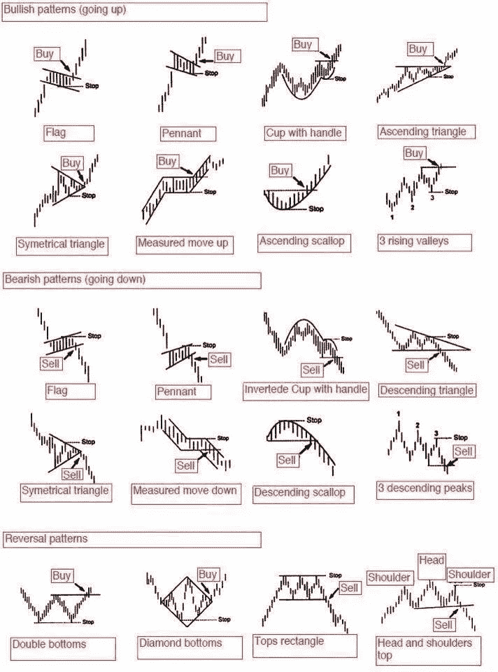**

**Some basic patterns from [Steven Burns](https://twitter.com/SJosephBurns/status/588536643092516864). Even so, stop trying to memorize all these names and stop trying to find these patterns in everything you see because eventually you will just project them onto the chart whether they’re there or not. Learn to see what is actually in front of you.**

**技术分析只是另一种工具。**

**这不是一条通往无限荣耀的道路，也不是完全的废话。它介于两者之间。它是帮助你赚钱的一个指南。**

**当谈到加密货币时，技术分析更有分量，因为它由许多技术人员主导，这使它成为一个自我实现的预言。TA 对技术人员有意义。在其他市场，您的里程可能会有所不同。**

**当你过于依赖 TA，以至于逃避常识时，问题就出现了。**

**我在自己的交易中发现的一个问题是否认基本的直觉和逻辑。我一直在寻找一个神奇的指标，每次都能显示出完美的逆转。**

**那个指标不存在。**

**我发现自己在看了五六天的连续上涨后盯着图表，心想:“我必须出场了。涨了六七成。它必须落回地球。”但是指标似乎与此不符，所以我继续交易，损失了很多钱。**

**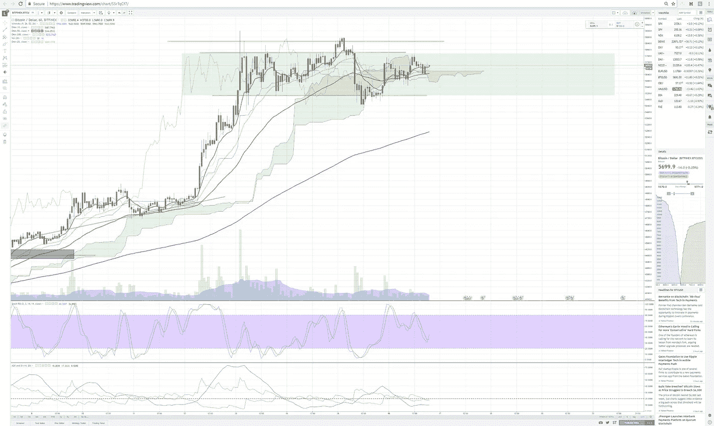**

**Chart 1: Bull flag showing with a small failed break out above. But BTC is at an all time high, so any buys here are Russian Roulette. If you bought a lot lower, feel confident and stay in but if you’re just getting in now, think twice.**

**也许这只股票正处于历史高点，并且仍然显示出**牛市标志**(见图表 1)？**

**那又怎样？必须结合其他因素来看待一个模式。**

**比特币已经涨了 1000 美元，你仍然认为它第二天还会涨 1000 美元吗？这根本说不通。世事有起终有落。**

**交易一段时间后，你会对市场有更好的感觉。这在很大程度上是常识。三四天的火箭速度增长可能意味着逆转。**

**这不是魔法。这是基本的人类心理。**

**错误在于试图完美地计时。你不能也永远不会。别提了。**

**如果你做得很好，你只需要走出去，把利润从桌上拿走。如果你输了，减少你的损失。听起来很简单。不是的。**

**是的，你会错过一些好的方面。谁在乎呢。没有人确切地知道顶部和底部。**

**你吃了鱼身，但留下鱼尾和鱼头。**

**如果你从不把你的利润存入银行，你就没有任何利润。**

# ****搞砸两件事:让一切变得过于复杂****

**有很多书籍和[网站可以学习图表模式](http://www.investopedia.com/university/technical/techanalysis8.asp)。**

**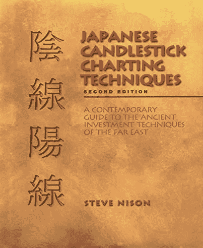**

**想发现[的秘密、古老的奥秘**日本蜡烛棒如数家珍**](http://amzn.to/2zakFaG) ？**

**用 [**自定进度的在线培训系统**](https://www.babypips.com/learn/forex) 让自己成为一名交易者怎么样？**

**也许你想知道 [**曾经发现的每一种模式**](http://amzn.to/2yq6JM0) ？**

**别说了。**

**问题是，很快你就会看到飘过的云层中的图案，并寻找阵风的逆转。模式，到处都是模式。**

**大多数模式都是毫无意义的。抛硬币的成功率大约是 5%。这不太好。**

**你最好保持简单。学习基本模式，学好。**

**查看 [**本课程的初级模式和指标**](https://www.babypips.com/learn/forex/elementary) 。**

**事实上，暂时忘记课程的其余部分。学那些基础就行了。练习它们。弄清楚如何有效地部署它们。**

**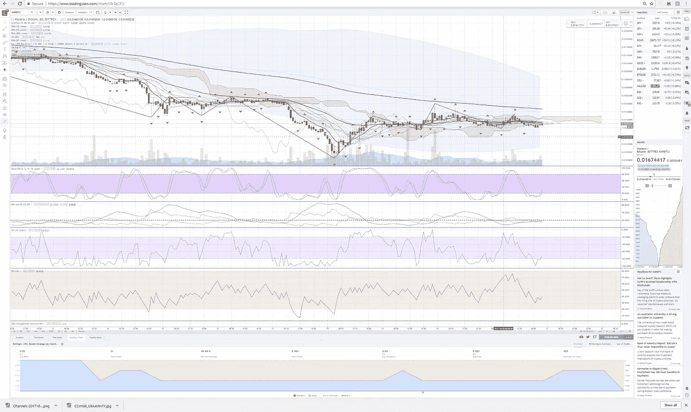**

**Chart 1a: This is not helpful. This is an unreadable mess. You can’t make a decision from this insanity.**

**如果你上了一个像 [Tradingview](https://www.tradingview.com/) 这样的网站，会有成千上万的指标。很快你就会把它们都堆在一张图表上。忘了它吧。只会把你搞糊涂。**

****弄清楚均线，随机 RSI，趋势线和蜡烛线的基础，向上和向下通道，牛市标志，突破和楔形。****

**暂时忘掉其他一切。算了吧。大部分都没用或者太稀有或者太难读。**

**保持简单。**

# **搞砸三:看到想象的模式**

**我在新交易者身上经常看到的一个错误是，倾向于记住一百种模式，从牛头旗到头肩顶，然后从头肩顶倒过来，却发现到处都是。**

**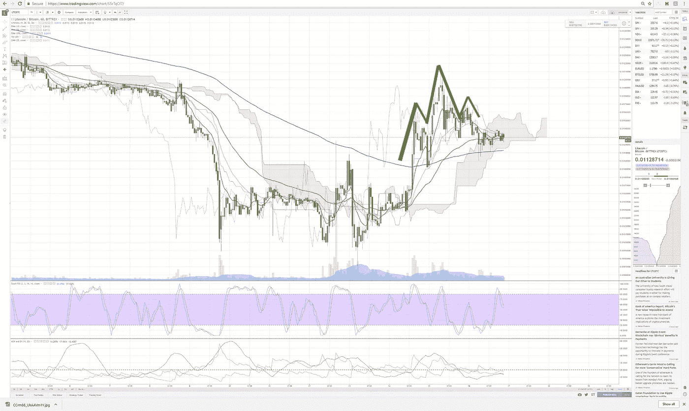**

**Chart 2: Imaginary Head and Shoulders. It kind of, sort of looks like a head and shoulders, but in the context of the overall pattern (a three week long downtrend) this is nothing but a few little bounces after climbing back up over the 200 bar moving average, which you see in the blue line. This is a fake pattern!**

**当他们在一小时图中看不到它们时，他们放大到五秒图，在那里找到一个模式(图 2)。如果图案不太合适，他们就把它塞进去，把一个方形的钉子砸进一个圆孔里。**

**另一种方式是当还没有一个清晰的模式，但你还是找到了一个。**

**模式需要时间来发展。**

**有些日子根本没有交易可做。你必须置身事外，或者等待格局明朗。**

**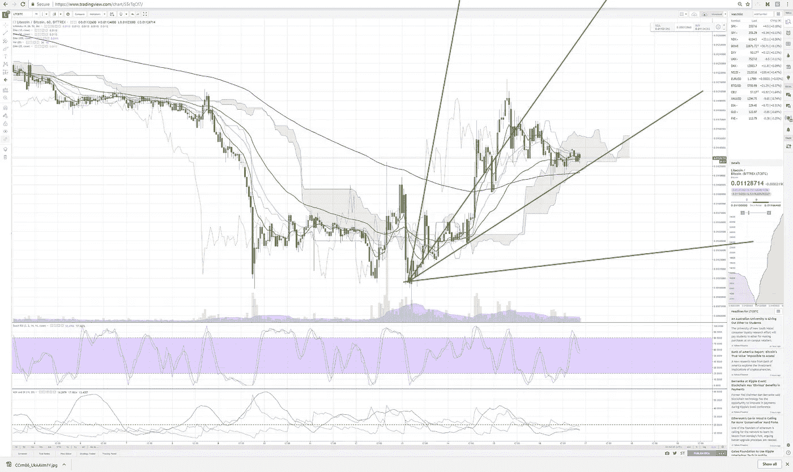**

**Chart 3: WTF? I see crazy stuff like this all the time on Twitter, usually with a LOT more green fan lines. What does this actually tell you? Nothing. It tells you the coin can go in just about any direction. You goal is to correctly predict the next direction not state the obvious that it could go in any direction. This is less than worthless.**

**第二种方式是交易者在图表上堆积各种各样的线来代替真实的趋势。**

**问题是这对你做决定有什么帮助？如果你概述了一枚硬币向北的五种方式和向南的五种方式，那有什么好处呢？**

**你的目标是正确预测下一个价格趋势，而不是表明它会向任何方向发展。**

**如果你不能预测任何事情或者从你的图表中做出一个好的决定，你就是在浪费时间。**

# **错误四:偏好短期模式而非长期模式**

**长期模式比短期模式更容易交易。短期模式很容易成为海市蜃楼。但是一个持续几周或一个月的长期模式很重要。**

**你应该看看一枚硬币在一周、几周、一个月、三个月、一年内的表现。你越往后拉，一些模式就变得越明显。**

**我发现最重要的是，图表顶部和底部的一些基本趋势线是我所需要的。**

**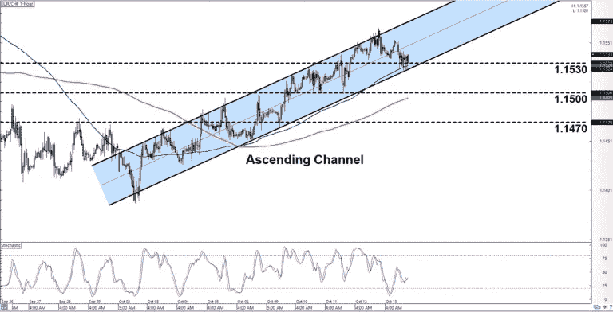**

**Chart 4: Baby Pips channel illustration from their excellent basic patterns course. [Check out the free course here.](https://www.babypips.com/trading/bp-forex-intraday-charts-20171013) Once you know channels you can start making good decisions.**

**[**频道是你最好的朋友在如数家珍**](http://www.investopedia.com/articles/trading/05/020905.asp) **。学习渠道。说真的。它实际上可能是你在 TA 中唯一需要知道的事情(图表 4)。****

**越靠近看，几乎所有东西都是一个频道。头肩？渠道。杯柄？弯曲通道。上升的楔子？渠道。**

**如果你在一枚典型的硬币上回顾一个月，你会看到一个非常清晰的上升或下降通道。看起来疯狂和不稳定的模式将融入更大的模式，这就是你想要的。**

**你想忽略离群值，看到硬币的一般运动。不要担心频道线外的一些光点。没有什么是完美的。尝试连接三个或更多点。两个连接点不是趋势，是猜测。**

**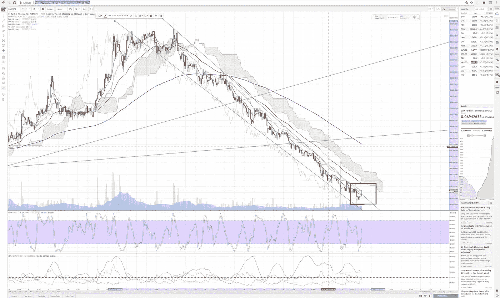**

**Chart 5: A long downward channel slide for Dash. This happened over a month or so. There is NO TRADE except a short in this channel. Any long trade will lose you money here until it stops that ski slope decline. Note I have highlighted a small chance at a breakout in red. This is the first break of the pattern. Still, be careful. Wait for confirmation for a day or two. This turned out to be a false breakout and the coin went right back into its long, slow slide.**

**只有三种主要的通道:上升通道、下降通道和横向通道。似乎显而易见，但经常被忽视，因为它看起来很简单，但在交易时，越简单越好。**

****简单是可操作的。****

****复杂不可诉。****

**如果一枚硬币在通道中下跌了一个月，突然打破了这个模式，要密切注意。耐心等待它确认一个变化。不要试图抓住第一次突破，因为它可能会回落到整体向下的斜坡(图 5)。**

**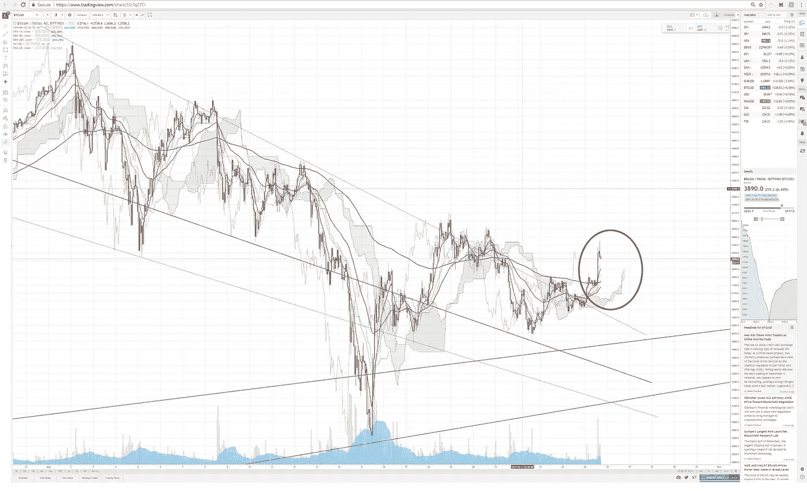**

**Chart 6: BTC tried to break out of its slump several times, popping above the top of the downward channel but each time it fell back into the channel. When it finally broke free it showed a dynamic push skyward, which is circled in red. You are looking for a real change in direction, not a guess. Don’t try to catch every dollar, just the sure things.**

**上升通道也是如此。当你开始看到一只股票在强劲而稳定的上涨后开始减速，没有到达通道的顶部或底部时，是时候出场了。**

**下跌的反转发生得更快，而上涨趋势在像火箭一样起飞前往往移动得更慢。不要陷入下跌趋势。当一枚硬币在上升通道中开始减速时，赶快离开。**

**横向通道是最具挑战性的。他们让日内交易者试图抓住通道内的小波动来获得小收益，但是他们更危险。**

**我总是在寻找一枚硬币掉出来或者跳过一条横向通道。如果硬币随后回落到通道的顶部，而天花板变成了地板，那么你可能会有所收获。**

**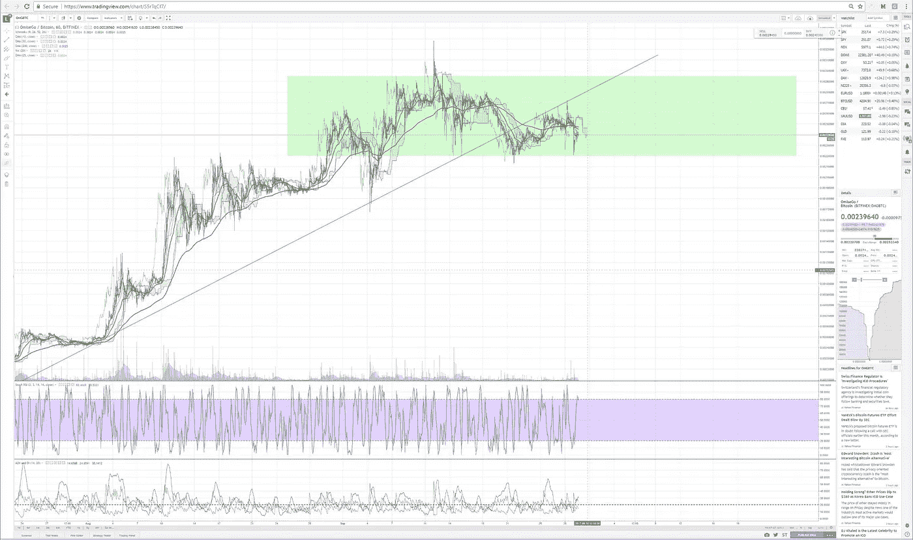**

**Chart 7: OMG was going up along the green trend line for a month. It suddenly broke it and went sideways. Other traders I knew were still calling bullish. When a coin does this get out. It is now about to start a new pattern and you can’t tell which until it has more time to develop. After such a long rise the trend is likely down, which is exactly what happened over the next few days. But even if it goes up, get out until that up trend confirms for a few days and then get in again.**

**最重要的一点是:**

****当一枚硬币在一个通道中交易了很长一段时间，突然向上、向下或横向突破该通道时，要密切注意。****

**游戏刚刚改变了。准备好你的菲亚特或者暂时退出游戏。**

# **失败五:过度交易**

**这张是经典之作。每个人都会犯这个错误。我不是例外，你也不会例外。保证。**

****

**This is going to last forever I’m HODLing!!!!!!!**

**听着，赚钱很刺激。一旦你获得了 40%的收益，你大脑中的快乐化学物质就会在你的大脑中爆炸，让你兴奋。你想要更多，所以你冲进去。**

**赔钱也是很恐怖的。当市场对你不利时，恐惧挤压你的喉咙，你在流汗，你的血液在血管里拼命流动。在你失去更多之前，你赶紧扔掉。**

**在你意识到之前，你已经在一天或几天内进出了五笔交易，在经纪费上花了一大笔钱，却一无所获。**

**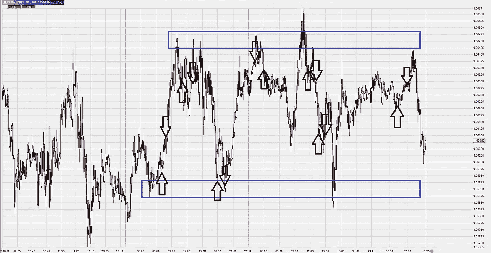**

**Chart 8: I’m Mr. Meeseeks. Look at me! I made way to many entries and exits in what is basically just a sideways channel. I racked up brokerage fees, made almost no money and made myself sick with worry doing it. Awful. Do not do this ever.**

**这是一个巨大的错误。这可能是早期交易者犯的最大的一个错误，我当然一次又一次地为此感到内疚。**

**傻瓜听了一百万次真理，却永远不明白。聪明人只需要听十万遍就明白了。这意味着即使是傻瓜和国王也不得不经常犯同样的错误。这是无法逃避的。区别在于你是否有一天醒来，意识到你在做这件事，或者只是继续快乐地把钱扔进马桶。**

**在交易中，情绪会把你搞得一团糟。它们让你产生错觉。你需要忽略这些错觉，专注于。**

**停止寻找微小的短期模式，尤其是如果你刚刚开始。**

**希望每隔几周或每个月进出一次。**

**那些长期的变化更容易看到，对你来说也更健康。你不必整天盯着该死的图表，用根本不存在的幻觉把自己逼疯。当你不用每天花八个小时盯着屏幕的时候，事情就简单多了。**

# **搞砸六:没有误差范围**

**这个是最糟糕的。太微妙了。当你赚了一大笔钱后，它会悄悄靠近你，直刺你的喉咙。**

**在《T4》90 年代早期的经典交易文本之一《安全边际》中，塞思·卡拉曼为顶尖交易者列出了终极指导方针:**

****给自己一个误差范围。一个大的。****

**这本书已经绝版，售价数百或数千美元，但你没必要花那么多钱买一本告诉你一切的书。把钱投入市场。**

**以下是关于这本书你需要知道的一切:**

**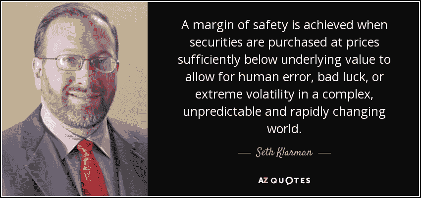**

**把那句话铭记在你的脑海里。**

**让它烙进你的眼球。**

****一旦你理解了那个图形，你就理解了买卖密码或其他任何东西的基本教训。****

**这不是唯一有效的策略，但对你的钱包和血压来说是最好的策略之一。**

**在交易中要寻找的最基本的模式是，当市场崩溃，人们陷入恐慌，一枚硬币下跌了一个月或更长时间，或者快速下跌，损失了大量的价值。这是你想买的时候，几乎没有其他时间了。当街上血流成河时，你应该高兴地购买。**

**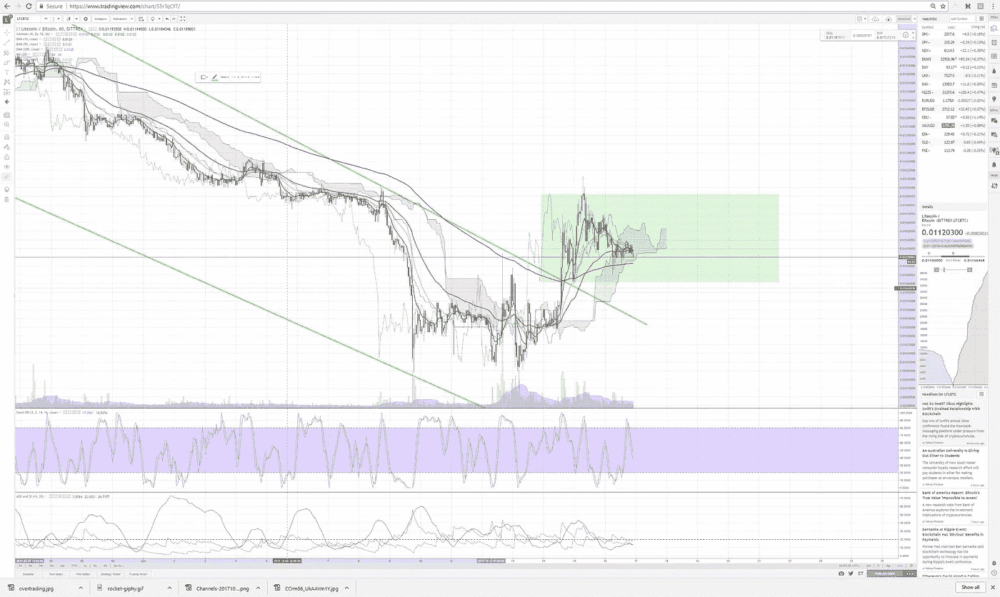**

**Chart 9: A long downward slide in a channel suddenly breaks out and starts a new sideways trend.**

**血战之后的买入信号通常是你能想到的最基本的信号。**下降通道突然转向侧面。这表明市场已经经历了足够多的屠杀。如果它横盘了几天，其他交易者就开始怀疑这是不是真的，是时候进场了。最终会是这样的，那时你会再次跳进去。****

**另一个要寻找的模式是，当一枚硬币长时间稳定攀升，然后突然直线上升。那根巨大的绿色蜡烛几乎总是牛市的终点。当比特币或另类硬币像火箭一样直线上升时，骑一天左右，然后离开。**

**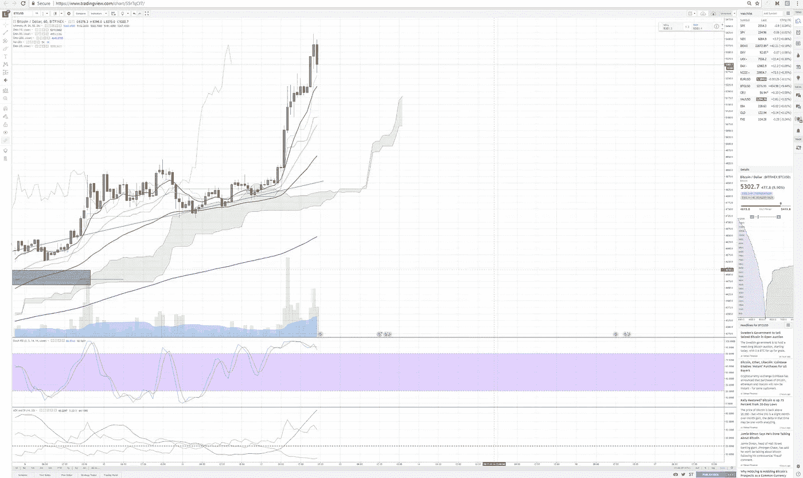**

**Chart 10: BTC breaks straight up after weeks of a steady upwards climb with a few minor pullbacks. Time to sell. It won’t last.**

**不要担心试图赶上全程。毫无意义。出去吧。它会再次崩溃。**

**你想这么做的原因是，没有人能真正完美地预测市场。当你必须在 50 美元或 100 美元范围内正确使用比特币时，这是一笔糟糕的交易。比特币可以在一周或几天内移动 500 美元或 1000 美元！如果你和上一个历史高点之间有 1500 美元或更多的差额，这就是下金蛋的鹅。它给了你很多犯错的空间。**

**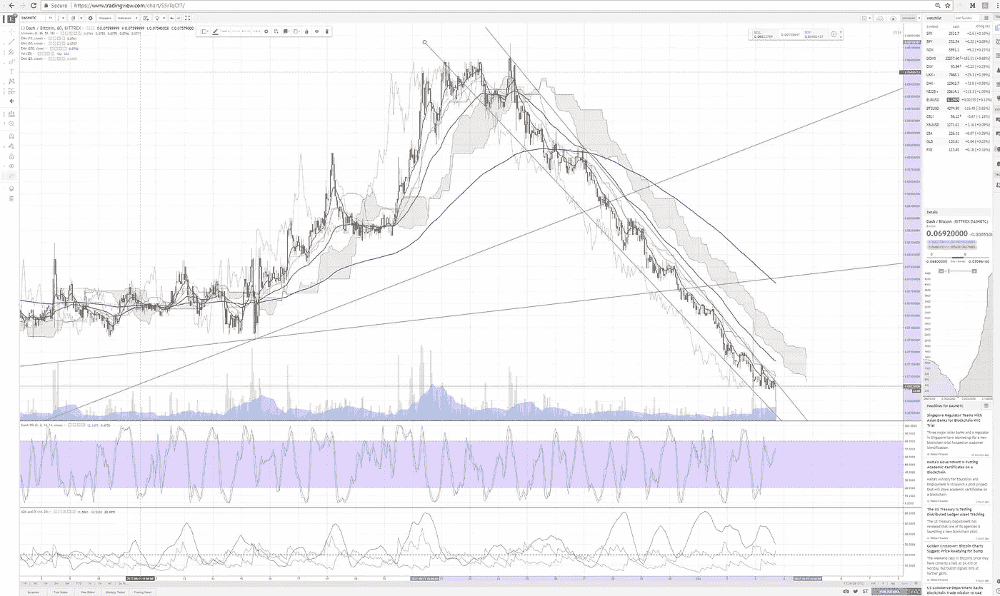**

**Chart 11: Dash broke two upwards trends (the green lines it slashed through) on its way down. At this point you are looking to buy when it changes direction because it has significant room to run to get back to its high, aka margin of error.**

**500 美元的误差幅度也相当惊人。当它开始攀升至 500 美元并暴跌时，你不必担心止损，因为它几乎不会跌到比你买入时更低的位置。一旦它攀升到 1000 美元，即使是 700 美元的回调也吓不倒你。你不会害怕来自中国或杰米·戴蒙口中的坏消息。你会坚持，知道你有很多空间去搞砸。**

**给自己和这个世界一个疯狂的机会。你不知道它什么时候或为什么会发疯，但它总是以某种方式发疯，不管是坏消息还是恐慌，还是因为太阳黑子而无缘无故地突然逆转。**

**误差幅度的反义词是在火箭上涨后试图抓住交易。比特币可能会在这轮上涨的顶部徘徊数天，但崩盘只是时间问题。不要试图猜测它是否会再次突破 200 美元。那是俄罗斯轮盘赌。不这样做，你会发现你开始赚钱了。**

# **搞砸七:全押**

**交易不是扑克。现在把它从你的脑海中抹去。**

**如果你开始一次又一次地把你所有的钱都变成几个硬币，那你就是在玩火。**

**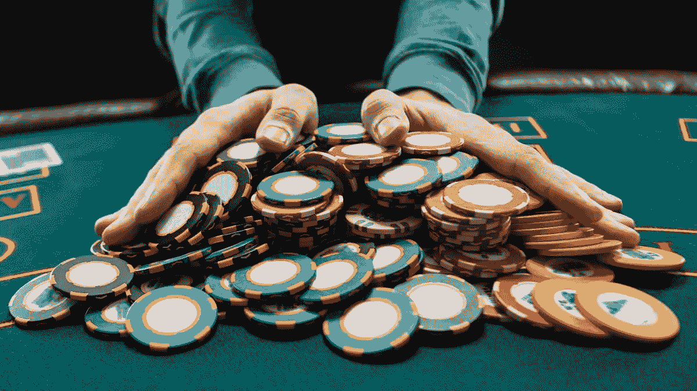**

**Do not do this in trading.**

**我不能告诉你我这样做了多少次，因为这是一个很容易犯的错误。事情是这样的:**

**你发现了你的第一次自下而上的反转。一枚硬币在过去的一个月里损失了 50%的价值，现在看起来它终于摆脱了下滑的趋势，开始转向侧面，甚至可能会爆炸。所以你听大师的话，把少量的钱放在硬币上，大约 5%或 10%。然后硬币开始运转，你再往里多放一点。到目前为止一切顺利。但是过不了多久，你就会想“我应该从一开始就全押，那样我现在就会有更多的钱了。”**

**这正是你下次要做的。你带着 100%的现金进去。**

**也许有一两次有用。**

**但是突然就没有了。**

**你没有发现底部，或者一些坏消息破坏了一个好的上升趋势的开始。它开始进一步下滑，突然你失去了一大笔钱。**

**以较小的收获为乐。不要孤注一掷，你不会一下子失去一切。**

**从小处着手，逐步扩大。**

# **稳扎稳打赢得比赛**

**海龟交易者长期赚钱。兔子赔钱。**

**当你听说某个男人或女人在两个月内涨了 1000%，你可以放心，他们下个月会跌 1500%。大风险和最终的大损失相伴而生。**

****但如果你坚持更保守的策略，保持简单，不要疯狂追逐你能找到的每一个花哨的指标，在市场血淋淋的时候买入，你就能在交易中赚钱。这不容易，但可以做到。****

**如果你坚持足够长的时间，你甚至可以以此谋生。**

**当你把图表做对了，你就知道了。你会做出预测，看到市场完全像你想象的那样发展。**你只需要预测大方向，而不是试图完美地计算出所有的起伏，这是完全不可能的。****

**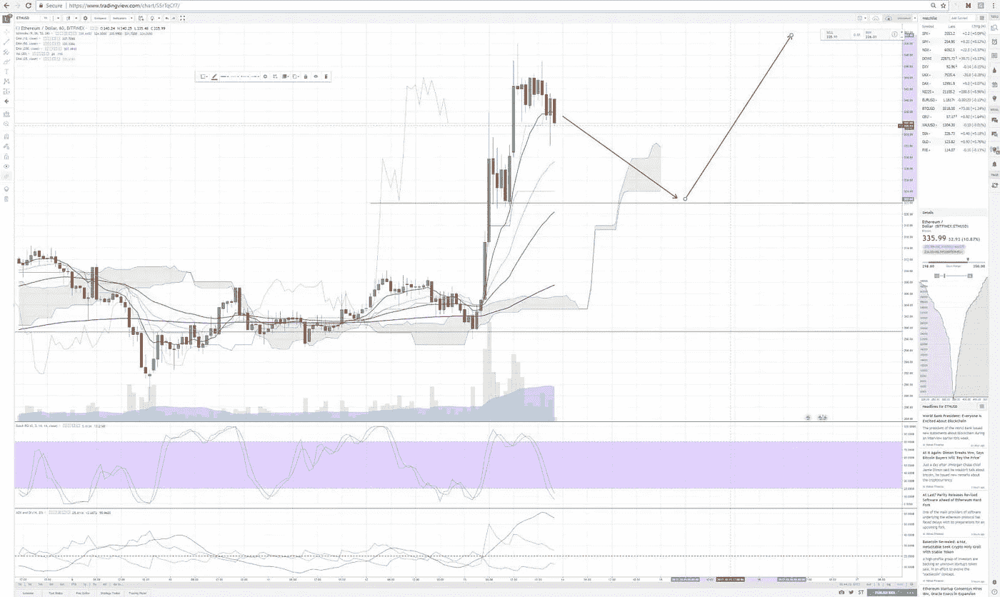**

**Chart 12: My prediction of a 50% retracement after a bullish jump straight up.**

**看看这张以太坊图表，我预测了下跌和反弹(图 12)。请注意几天后，它是如何下降到我预测的位置，正负几个点，然后在向上攀升时抱住了线(图 13)。**

**那是一种奇妙的感觉。**

**当你开始相信自己，并真正开始买进这些股票并赚了大钱时，那就更好了。**

**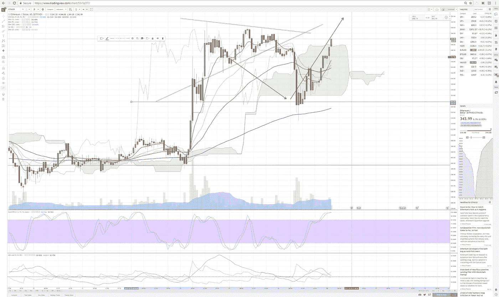**

**Chart 13: Nailed it!**

**交易是谦逊的一课。这是一次自我之旅。你需要找出你所有的优势和劣势。没有欺骗自己的余地。它需要狂热地坚持真理。它需要不断的重新评估。**

**了解自己没有最终的目的地。在生活和交易的旅途中，从来没有人到达过。**

**总是有更多的东西要学。**

**生活是一条河。不要推河。骑马过河。现在就去学习它教给你的一切，不要担心过去或未来。**

**成为一个永远的学生，谦虚地学习，无情地改正自己的错误，当这一切都结束时，你可能会得到一大笔钱。**

**祝你好运。愉快的交易。**

**############################################**

**免责声明:做一个大男孩或大女孩，自己决定把辛苦赚来的钱放在哪里。我不是财务顾问，这不是财务建议，如果我真的需要告诉你这些，那么无论如何最好把你的钱放在口袋里，因为当你失去它时，你会因为你的错误责怪别人，而不是你自己。**

**############################################**

## **如果你喜欢我的作品，请[访问我的个人主页](https://www.patreon.com/danjeffries),因为那是我与所有粉丝分享特别见解的地方。顶级赞助人可以独家访问传奇的硬币表 Discord，在这里您可以找到:**

*   ****来自我和其他专业技术分析大师的市场呼声**。**
*   **进入**币**只能**私聊**。**
*   ****幕后**看看我和其他专业人士是如何解读市场的。**
*   ****你还可以独家参加每月一次的虚拟聚会**，在那里我会分享我正在做的一切，让你看看我的幕后工作过程。**
*   **我会在每次谈话后都有一个问答环节。问我任何问题，我都会回答。**

**############################################**

## **如果你和我一样热爱加密空间，那就来吧，加入 [DecStack，这是一个虚拟的加密货币和分散应用项目的合作场所](http://decstack.com/)，在这里你可以接触到多个项目。永远完全免费。只是进来和社交，一起工作，分享代码和想法。通过反馈让你的想法更好。寻找新朋友。见见你的新家人。**

**############################################**

## **这是我在 Twitter 上关注的交易者列表。这是一个小名单。你的列表也应该很小，否则你会得到很多相互矛盾的信号。**

**############################################**

****

**关于我:我是一名作家、工程师和连续创业者。在过去的二十年中，我涉及了从 Linux 到虚拟化和容器的广泛技术。**

## **读者们称我的突破性纳米块小说[、蝎子游戏](http://amzn.to/2gNn04x)、“神经漫游者的第一次严肃竞争”和“黑色侦探遇上约翰尼助记术”**

## **你也可以根据书中的想法查看[蝉开源项目](http://iamcicada.com/)，该项目概述了如何立即将该技术变为现实，你也可以参与其中。**

## **最后，你可以[加入我的私人脸书小组，Nanopunk Posthuman 刺客](https://www.facebook.com/groups/1736763229929363/)，在这里我们讨论所有的科技、科幻、幻想等等。**