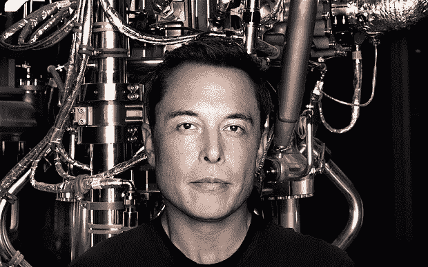
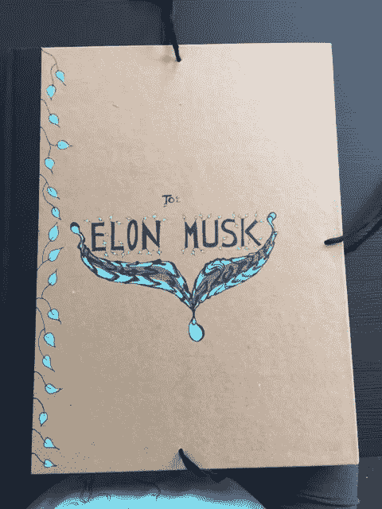

# 个人崇拜和你是如何受到伤害的

> 原文：<https://medium.com/hackernoon/the-cult-of-personality-and-how-you-are-harmed-50bf3939f723>

Musk On The Cover Of Ashlee Vance’s Biography

## 个人崇拜正在你的头脑中进行一场战争，但你可能甚至没有意识到它的存在。

个人崇拜旨在阻碍你的成长，我将向你展示如何阻碍你的成长。埃隆·马斯克是个人崇拜的最佳化身。我从未想过我会写这种文章，因为我可能是埃隆·马斯克的最大粉丝之一。事实上，三年前，当我偶然发现他的一个视频时，就像被闪电击中一样。我的脑子着火了。去年，我甚至给马斯克发送了一份定制设计的投资组合，其中包含一份让优步车手与特斯拉配对的提议。

我有一个悠久的传统，给我非常钦佩和尊重的人送东西。我从小就一直这样做，但我从未完全改掉这个习惯。我经常被强烈的感激之情所征服，就埃隆而言，我对他所做的工作感到无比感激。

在发现埃隆·马斯克作品的两年前，我一直在研究目前发生在陆地、海洋和天空中的环境破坏。我狼吞虎咽地获取信息，了解微塑料、过度捕捞、破坏性能源公司、孟山都公司，不胜枚举。那两年我消耗了太多信息，差点生病。多年来，我试图理解我能做些什么来帮助地球。我了解了有机农业运动和许多试图拯救地球的团体。我甚至写了一本儿童书，书名是 *Solargirl Stella* ，这是我在一个幻象中看到的(这是另一个故事)。我被像[深绿抵抗组织](http://deepgreenresistance.org/en/)这样的激进组织和致力于[重建我们星球的人们所吸引。](https://en.wikipedia.org/wiki/Rewilding_(conservation_biology))

但是我从来不能深入到这些团体中去，因为我觉得这些地下运动违背了我的本性:我不喜欢被逮捕的前景。我也开始意识到这些团体中包含的许多缺陷。我总觉得它们缺乏一种智能的、包罗万象的设计。就在这个时候，我看到了埃隆·马斯克的视频。

从我看到那段视频的那一刻起，我就开始尽可能多地了解马斯克:PayPal、特斯拉汽车公司(Tesla Motors)以及 SpaceX 和 SolarCity。在我的一生中，我不记得有哪一次接触过我认为真正聪明的 CEO。在了解马斯克之前，我对 CEO 的定义有着非常刻板和先入为主的观念。我以为他们都是贪财、贪婪、没骨气的神经病，他们活着只有一个目的:赚越来越多的钱。我当然不尊重这种低下的野兽。

我心目中的英雄往往是艺术家、作家、梦想家、科学家、发明家，是敢于挑战分类、有远见卓识、改变历史进程、一路粉碎过时思想的开拓者。圣女贞德、尼古拉·特斯拉、蒂奥·扬森和弗里达·卡罗都在我的名单上。阿瑟·兰波是另一个例子。十年过去了，我仍在试图解读兰波的一句名言的全部含义，

> “我研究了没有人能逃脱的幸福的神奇形状。”

那不是他妈的一句绝妙的句子吗？这是什么意思？

马斯克先生粉碎了我对“首席执行官”的先入为主的观念，我喜欢它消亡的每一秒钟。在对马斯克的正式研究减弱后，我发现自己想要了解这个好奇的人更多。我倾向于研究我感兴趣的话题，直到没有更多信息了。后来，我通过埃隆前妻[贾丝汀·马斯克](http://justinemusk.com/)和阿什莉·万斯的书 [*埃隆·马斯克:特斯拉、SpaceX 和对梦幻未来的追求*](https://en.wikipedia.org/wiki/Elon_Musk:_Tesla,_SpaceX,_and_the_Quest_for_a_Fantastic_Future) 发现了他不那么光彩的一面。发生在埃隆私人助理玛丽·贝丝·布朗身上的故事是残酷的，说明了他对那些对他表现出荒谬忠诚的人是多么残忍。来自 Quora 的贾丝汀·马斯克写道:

> “12 或 13 年前，我们搬到洛杉矶后不久，玛丽·贝思·布朗就开始为埃隆工作(那时我和埃隆还没有离婚)。MB 是埃隆手下一名出色而忠诚的员工，在个人层面上也很好相处。她把生命都献给了工作——和我们的家庭——她离开的消息令我震惊。显然(我相信，根据写了一本关于埃隆的书的阿什莉·万斯所说)，MB 要求加薪。e 告诉她，如果她真的对 SpaceX 至关重要，它就不应该在她不在的时候运作(或者类似的事情)。他建议用三周的实验来检验这个假设/她的价值。这让我想起了很多年前，我和家人在加拿大度过一周的假期后，他曾对我说过的类似的话——我不在的时候，他的生活过得很顺利。他让我知道我是一个不称职的管家。”

当然，我个人并不知道细节，但我读过阿什莉·万斯的书，这就是个人崇拜发挥作用的地方。当我们了解到埃隆·马斯克的性格缺陷，以及他倾向于可怕地对待某些人的事实时，我们往往会看向另一边。我们往往会对自己说，“嗯，他经营着两家(或三家)公司，正在改变历史的进程。”但是让我指出另一个有趣的天才，尼古拉·特斯拉，他也改变了历史的进程。我刚刚读完他的自传，据我所知，他并没有表现出对其他人如此残忍的对待。埃隆·马斯克(Elon Musk)拥有非凡的工程智慧、商业敏锐度、改变技术和太空历史进程的动力和热情。他还特别善于利用机会。但他是凡人，有瑕疵。他拥有一些不值得效仿的品质。最后两句话总是被媒体忽略，因为个人崇拜想让你相信你永远无法达到埃隆·马斯克的水平。

诚然，你可能不具备打造另一个埃隆·马斯克所需的完美平衡的特质、才能和技能。但事实是，你有能力做伟大的事情，比你最疯狂的梦想还要伟大。让我意识到这些想法的文章是由安德烈·德拉甘内斯库(Andrei Draganescu)写的，他可能你从未听说过。以下是他对个人崇拜的令人震惊的解释:

> “你并不特别。埃隆·马斯克是。这个系统赞美那些以某种方式打破漏斗的人。然后这些流氓给我们的环境带来了大量的变化。为了控制这种情况，我们设计了一个赋予人类特殊能力的系统。我们当然没有，只有他们有。
> 
> 个人崇拜模式是英雄文化的基础。从古代的半神半人到现代的流行明星和名人充斥着首席执行官。这是关于他们如何简单地比其他人更好。
> 
> 没有人比其他人更好。我们有时会汗流浃背，浑身发臭，有时又卑鄙愚蠢。我们中的一些人利用机会，就是这样。机遇是环境在变革的漏斗壁上产生的裂缝。"

说到卑鄙和愚蠢……你读过贾丝汀·马斯克的生活吗？我的天啊！她和他的生活听起来糟透了！更像是一场噩梦。埃隆的心理学似乎充满了讽刺。

埃隆在一篇文章中承认，他对和孩子在一起的时间的定义有时相当于在和他们在一起时同时处理多项任务，发电子邮件。嗯……这让我想起了一些值得思考的事情:为了实现梦想，你愿意放弃什么？

我开始明白，为了让你对未来的憧憬变成现实，而让这个世界弯曲起来，其真正的代价是什么。但等一下。或许，只是或许，我也在遭受一种令人眩目的个人崇拜？你看，个人崇拜是如此根深蒂固，如此多的一部分结构，我们的思想，我们甚至不能察觉它的存在。

我们并不认为埃隆·马斯克是一个真实的人，只是一个存在于我们想象中的偶像。**他代表的是一个我们懒得去变成**的人。他是我们在童年时代抛弃的疯狂理想的化身。他象征着一万亿成年人的集体潜能。出于某种原因，这些成年人放弃了成为超级英雄的梦想，转而住进了一些平庸、泛着荧光的小隔间里，那里的墙壁乏善可陈。

## 了解埃隆·马斯克会让人彻底沮丧。

当《福布斯》杂志再次刊登他的故事时，我们感到既软弱又羞愧。福布斯知道这一点。《福布斯》杂志知道，如果把自己的照片放在马斯克的旁边，就会觉得自己是个十足的失败者。

媒体利用个人崇拜让你感到自卑、自卑、自卑和脆弱。媒体不是用来支撑你，给你提供信息，丰富你的生活，让你爬出自己设计的牢笼的。不，媒体机器的目的是攻击你最脆弱的个性特征，让你上瘾，就像毒贩子想让你上瘾海洛因一样。

## 让我提出另一个历史人物，他极大地改变了我们人类的进程:尼古拉·特斯拉。

尼古拉·特斯拉选择不结婚，因为在他看来，卷入一段关系会减少他为自己的发明投入的时间。他选择了发明而不是关系。他也倾向于独立工作，不负责管理公司。他有许多朋友，像马克·吐温，但似乎他的日常生活并不围绕着人。个人崇拜也笼罩着尼古拉·特斯拉。但比起马斯克，特斯拉更像是一个好奇的怪人，因为特斯拉完全抛弃了女人。马斯克似乎对她们很不好，而特斯拉却一点也不关心女性。

这和我有什么关系？

很简单。我想发挥我的潜力。我想消除误解，帮助破坏现状。我想让同样躺在阴影里的聪明人曝光。我希望人类进步。我厌倦了隐藏自己的聪明才智。我想改变很多事情。

看来，我的整个人生都是在阴暗处度过的……