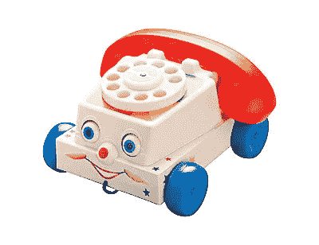

# 手机文化

> 原文：<https://medium.com/hackernoon/the-culture-of-a-phone-9fafc4a3bfc>

今年，我们实施了一条“开会时不准打电话”的规定，我不得不说，我喜欢这条规定！

当我还是个孩子的时候，我喜欢电话，那种白色的塑料轮子，当你拉它的时候，它会发出很响的声音。我想我们家[的电话](https://hackernoon.com/tagged/phone)大约一个月响一次(如果是这样的话)，我们过去常常跑去接电话(我很少第一个到达)。当然，我自己接到一个真正的电话就更少了，这在某种程度上是由我的年龄决定的，但在我的童年时代，打电话是很昂贵的——你只有在绝对必要的时候才会打电话给别人。我很惊讶，当我的儿子更小的时候(甚至现在仍然如此)，他也喜欢玩具手机，就像他所有的朋友一样，甚至是那些带轮子的白色塑料手机。直到现在，我还没有真正考虑过为什么这款手机有这么大的吸引力，但这些年来，这已经增加了十倍，因为它们现在很“智能”。这种手机成瘾也已经成为成年人生活的一部分。我的意思是，就我个人而言，没有[谷歌](https://hackernoon.com/tagged/google)地图，我哪里都找不到路，我甚至没有尝试过。需要一个事实——我的手机，一张照片——我的手机，购物——我的手机；而且还在继续。事实上，当我有了儿子，我的手机就是我的生命线。没有什么比一个新生婴儿在深夜哭泣，不吃东西，不睡觉，只有你更让人受不了了，但是通过我的手机，我可以上妈妈网，看到我并不孤单，我可以得到建议，我可以看到我的其他朋友也在同一条船上，这种联系的感觉是无价的(显然我知道在手机出现之前，人们确实有孩子并生存了下来！！).所以不要误解我，我喜欢手机和它能带来的东西。

但是后来我看了西蒙·西内克([https://www.youtube.com/watch?v=HK97VG-m3W0](https://www.youtube.com/watch?v=HK97VG-m3W0))的这个片段，它唤起了我的一种负罪感。我喜欢使用和依赖的手机在很多情况下变得咄咄逼人，阻止我做我真正重视的事情&享受更多。他观察到你不与同事闲聊，因为你直到最后一刻才打电话回家。我远程工作，所以当我去办公室时，我经常只是在开会(这是我想改变的另一件事)，所以每一分钟的空闲时间我都在处理电子邮件、Slack、Skype 和其他形式的沟通，除了最好的一种——面对面地与人交谈。互动并了解他们，他们的生活和他们认为重要的事情。他提出的观点是，如果你在开会，那就应该是重要的，重要到足以让你全神贯注的会议，手机的哔哔声、嗡嗡声、闪烁声不仅会分散你的注意力，还会分散所有人的注意力，不管是不是故意的，其他人同样会分心，主持会议的人很可能会觉得你没有给予他们全部的注意力。你需要这些信息吗？大多数情况下不会，但是只要它在那里，你仍然可以造成伤害。我发现自己在年初与一位同事交谈，他告诉我他们没有足够的时间做非客户工作。我给他们的建议是，总会有为客户做的事情，如果你什么都不等，你很可能会等很长时间(除非你的业务陷入困境，那是另一个问题)，但实际上，这是关于优先级的问题。有些事情(大多数事情)真的可以等，如果你不在接下来的两个小时内做，世界会崩溃吗，客户会抛弃你吗？不，只是确保你已经设定了期望。那时，我看到我自己的建议被应用到我非常喜欢的讨厌的手机上，实际上，如果我几个小时没有看到所有这些通知、电子邮件和 WhatsApp 消息，会发生什么——哦，看，没有太糟糕的事情，事实上还有很多好处。

发生了什么事？办公室里有人买了一些看起来像口袋的东西，现在挂在我们的主会议室里，大多数人在会议开始时或进入房间时都会把手机放在那里。笔记本电脑也被禁止使用，除非你正在投影或做笔记。我喜欢它。我相信你已经猜到，世界并没有崩溃，但会议不再被电话打断，人们不再使用笔记本电脑，而是在倾听，这种感觉很好。现在，我们在会议开始的时候会聊得更多，这都不是工作，但这是很好的、健康的面对面互动，可以了解人们。对我来说，这只是你如何 ***建立一种文化*** 的一小部分，我想成为这种文化的一部分， ***确保人们在任何时候都感到他们是重要的，他们说的和做的都是重要的*** 。如果我的同事认为我的参与很重要，希望占用我的时间，我应该尊重他们的要求，全力以赴，或者礼貌地拒绝，但不要半途而废。每个人都喜欢这个新规则吗——我想不会，打破习惯很难，也不是所有人都喜欢改变，但我相信它带来的好处会把他们争取过来。

我非常喜欢的白色塑料手机呢？我想他们仍然在生产这种手机，孩子们也仍然喜欢它。也许我们小时候喜欢它们，因为它们都是关于交流的(&噪音)。毕竟，你花了几年的时间学习如何沟通。我们学习如何读懂人们，如何根据他们的反应理解他们的情绪——你需要看到人们这样做，你需要观察，倾听，学习和反应，躲在手机后面会削弱你花了多年时间学习的这些技能，事实上可能会阻碍你继续学习它们，因为它永远都不应该停止。当然，手机在这个世界上有一席之地，但是没有什么能比适当的互动更好，我认为它永远不会。我会和一个朋友交换手机吗？那个朋友在半夜三更和我在一起，还带着婴儿的哭声，当然会。我想了解我周围的人，不仅仅是他们在社交媒体或即时通讯上有多好，这包括我的同事。

> [黑客中午](http://bit.ly/Hackernoon)是黑客如何开始他们的下午。我们是阿妹家庭的一员。我们现在[接受投稿](http://bit.ly/hackernoonsubmission)并乐意[讨论广告&赞助](mailto:partners@amipublications.com)的机会。
> 
> 如果你喜欢这个故事，我们推荐你阅读我们的[最新科技故事](http://bit.ly/hackernoonlatestt)和[趋势科技故事](https://hackernoon.com/trending)。直到下一次，不要把世界的现实想当然！

