# 不确定时期的治疗方法:建立一个坏蛋臭虫袋

> 原文：<https://medium.com/hackernoon/the-cure-for-uncertain-times-build-a-badass-bug-out-bag-a47617aa5b3b>

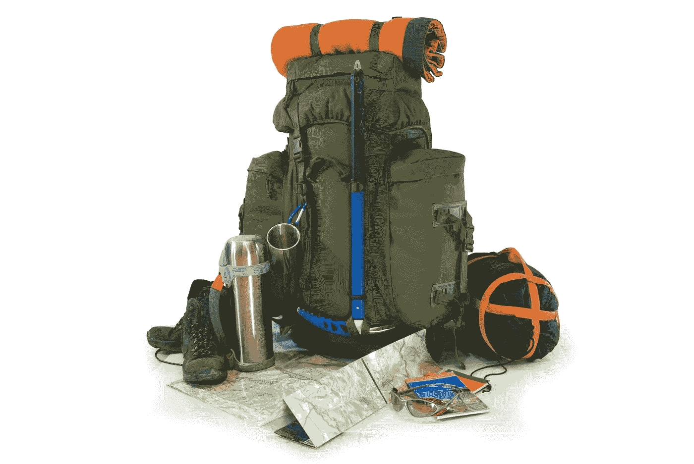

# 中国人有句咒语:“愿你生活在有趣的时代。”

欢迎来到有趣的时代！

无论是[川普滥发行政命令](https://www.washingtonpost.com/news/monkey-cage/wp/2017/01/30/most-of-trumps-executive-orders-arent-actually-executive-orders-heres-why-that-matters/)并造成机场混乱，[委内瑞拉经济从南美第一走向彻底崩溃](http://www.economist.com/news/leaders/21715658-economy-collapsing-nation-war-government-blame-venezuelas-leaders?zid=305&ah=417bd5664dc76da5d98af4f7a640fd8a)还是[俄罗斯投票将殴打妻子 380–3](http://www.usatoday.com/story/news/2017/01/27/russian-parliament-decrimiinalizes-domestic-violence/97129912/)(严肃地说)[现实现在正威胁要让洋葱出局](https://www.reddit.com/r/Showerthoughts/comments/5r2iwi/the_onion_might_go_bankrupt_because_they_cant/)。

2016 年媒体上最受欢迎的文章是[历史告诉我们川普和英国退出欧盟之后会发生什么](/@theonlytoby/history-tells-us-what-will-happen-next-with-brexit-trump-a3fefd154714#.ga7t4kqwo)。TL；博士？我们即将经历一个“人类定期强加给自己的愚蠢季节”，也就是大规模混乱和毁灭。

那么，一个仅有一点可支配收入的美国人应该做些什么呢？

# **当然是打造一个 badass bug out 包啦！**

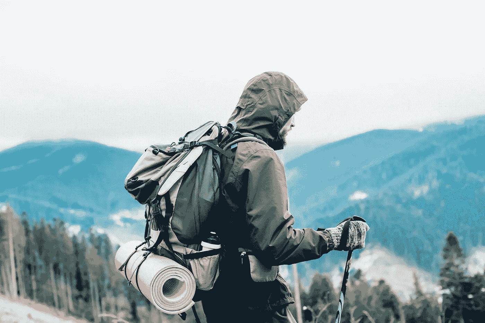

你问什么是臭虫袋？这是一个装满应急物资的背包。有人称之为 go bag。你把所有必需品都放在里面，比如食物、水、医疗用品、工具和任何你在危机中可能需要的东西。

**如果发生火灾、暴乱、** [**【政变(审判或其他)**](/@yonatanzunger/trial-balloon-for-a-coup-e024990891d5#.pp5ilghuy) **你需要逃离的，这是除了宠物、亲人之外，你第一个、有时也是唯一可以抓住的东西。**

或许，你已经不再关注脸书的所有人，开始了每日冥想练习，并清除了 Google Now 中的政治内容，但你别无选择了？你需要别的东西来应对恐惧、不确定性和怀疑的激增。我想不出比花时间做一个可怕的虫子袋更好的补品了。

幸运的是，几年前我染上了包热，我将与你，我忠实的读者们分享我来之不易的智慧。

现在，我不得不说实话。当我在 2013 年制作我的包时，甚至我都很难证明它除了有点古怪之外还有什么。

“你永远不会用这个，”我一直在想。

另一方面，今天看起来就像我在跳蚤市场以 1 美元一根的价格买了黄金。

需要澄清的是，我对为世界末日做准备不感兴趣。坦白地说，如果这个世界在核战中毁灭，我不想活下来。玩得开心 [**余波 4**](http://amzn.to/2k6WNzW) **为真。不是我。宇宙可以愉快地回收我的 DNA，在不太有趣的时候把我带回来。**

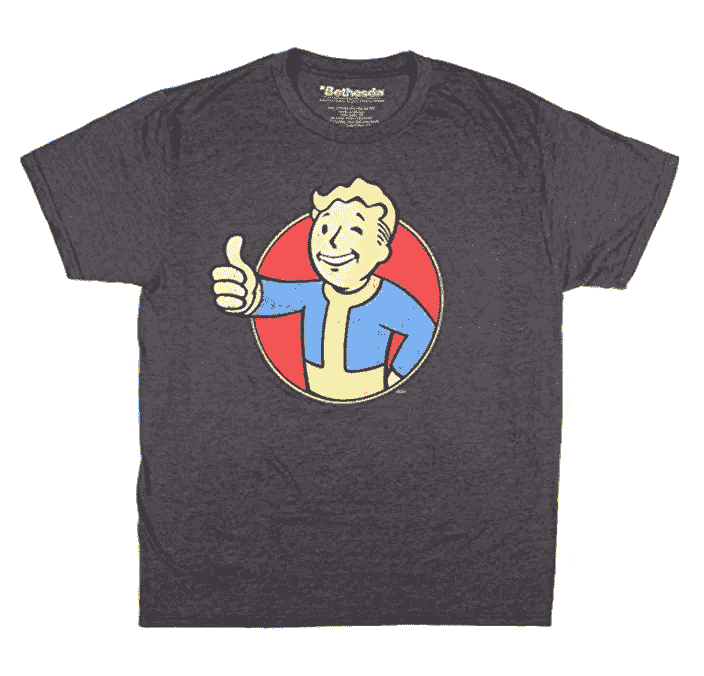

Fallout 4 available now. Just look outside your window!

但是基本的准备工作还是有很多可以说的。一个好的应急包确实可以帮助应对日常灾难，如火灾、地震或演变成骚乱的抗议活动。多想想童子军的座右铭“时刻准备着”与世界末日预报员储备六年的物资。我曾经看过《末日准备者》的一集，其中一对夫妇学习了标记日志，这样他们可以更好地协调对抗入侵者。如果你想和菲律宾人聊天，我鼓励你学习这种美丽的语言，但我只是在想“我如何才能逃离一场暴乱，比如说，伯克利的暴乱？”

所以让我们开始吧！

# **Bug 出包蓝图**

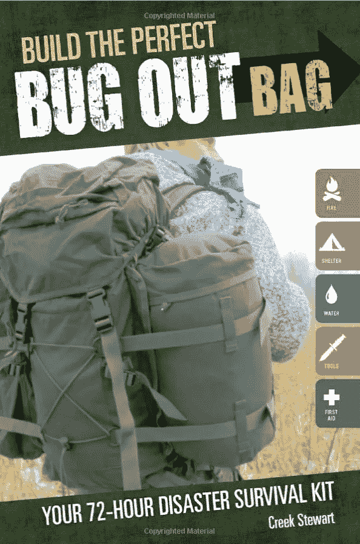

首先，你需要一本操作指南。我买了几个，不过我会给你省些麻烦:

[**打造完美的 Bug Out 包**](http://amzn.to/2kayGyK) **就是你需要的全部。**

这是书中的关键建议:不要买现成的工具包！他们很烂。它们可能更便宜，但它们充满了无用的废话，在真正的危机中不会帮助你。买你买得起的最好的。如果你真的需要这个东西，你最不需要的就是它变成一堆垃圾。仔细挑选每一件物品。

第二点建议是保持更新。每半年左右检查一次，更换过期的食品和药品。如果食物变质了，那就不好了。所以照顾好你的包，它会照顾好你的。

# **首先要做的事**

让我们从大件物品开始，比如背包、食物、药物和工具。我也会加入一些有趣的片段，因为，嗯，它们很有趣！

我要给你看我为工具箱买的所有东西。如果你买不起清单上的所有东西，你可以花更少的钱找到同等的东西。做好每一部分的功课。

不要以为你必须花很多钱才能得到最好的东西。但是有几件东西是你不想便宜买的。

## **背包**

不去预算特别计划的第一件事？你猜对了:包。如果你的包不好，你会很受伤。它需要耐用，能装很多东西，还能平衡你的体重。

**我最后得到了** [**格里高利山的巴尔托罗 65**](http://amzn.to/2l2icI3) **背包**。这东西是头野兽。大量的口袋，重量分配带，防风雨的——你能想到的。太棒了。

无论你选择哪个包，都要做好调查！你需要花多少时间就花多少时间，因为这是其他一切的基础。

如果你被难住了，你可以看看[这本 2017 年露营和徒步旅行最杀手背包指南](https://www.theadventurejunkies.com/best-backpacks-for-hiking/)。

## **砍刀**

好吧，我承认，这个不应该是名单上的第二名，但是我喜欢这个东西！

Destroy all Zombies!

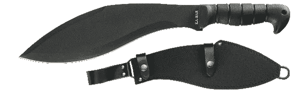

每当妻子需要我砍一些房子边上的常春藤或砍一些树篱时，我随时准备着我可信赖的 Ka-Bar 。用电锯修剪树篱是给吸盘用的。像一个古老的环游世界的冒险家那样去做吧！

当轮到你带领一群乌合之众的幸存者穿越末日荒原时，你的弯刀技能将会派上用场。

用你的缟玛瑙黑色迷你剑劈穿僵尸！

做的时候看起来很酷。

如果这对丹尼·特雷霍来说足够好，那对你来说也足够好。

## **猎刀**

你包里最重要的工具是一把刀。而且不是一般的刀:一把完整的唐刃。这意味着整个手柄都是一大块金属。不管你怎么惩罚它，它都不会碎。

Draw First Blood (R)!

**[**安大略黑鸟 K-5**](http://amzn.to/2kxXRh2) **听起来像是一个视频游戏兵工厂的最终升级，这太棒了**。拔出来的时候感觉像兰博。你甚至可以得到一把官方的兰博鲍伊刀！**

**我还保留了一把可以夹在口袋或腰带上的折叠小刀。我一直在用它。我非常喜欢它，以至于有一次我误把它带到机场时，我选择把它邮寄给自己，而不是把它扔掉！**

**如果你决定做这件事的话，这有助于打开你将从亚马逊收到的所有奇怪的包裹。**

## ****医药箱****

**你需要一个[医药箱](http://amzn.to/2kO4lFs)，里面有抗生素、绷带、烧伤膏等。放些个人药物，止痛药什么的。**

**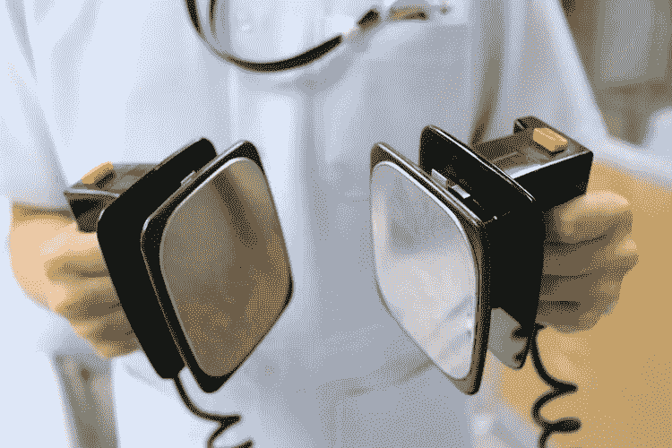**

**也不要忘了任何宠物药！**

**如果你真的打算在核浩劫中幸存下来，你还可以得到碘化钾片。一点阿司匹林也能持续很长时间。**

**当然，永远记住杆菌肽。没有医务人员在路上，一个小伤口可能是一场噩梦。**

## ****胶带****

**你读过或者看过 [*火星人*](http://amzn.to/2kn12Wt) 对吗？如果管道胶带对被困在火星上的科学家来说足够好，那么对你来说也足够好。**

**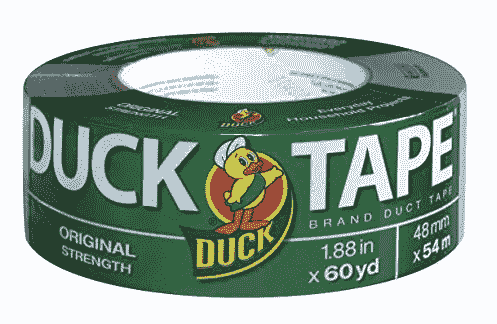**

**Approved by Matt Damon**

**管道胶带可以修复任何东西，从撕破的衣服、损坏的天线到裂开的伤口。你可以用它做一个吊带，甚至在紧要关头做一双鞋。**

**在过去的 100 年里，没有人发明更好的东西。**

## ****氢瓶和纯净、干净的水用 Berkey****

**听着，即使你从来不做一个逃生袋，也要弄一个这样的水瓶。它们是绝缘的，可以全天保持液体的低温或高温。你可以在早上把它装满冷水，在盛夏的时候把它放在你的热车里，当你打开它的时候，你仍然可以喝到清凉的、赋予生命的水。无论我去哪里，我都带着这个小版本。**

**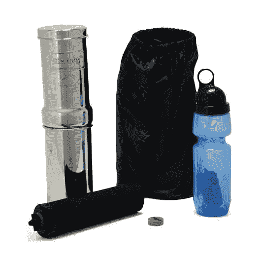**

**Seriously just get the Berkey because it rocks!**

**你也会想要一些净化水的东西，比如这些药片。不过，平板纯净水的味道相当糟糕。有一个更好的选择。**

****市面上绝对最好的净水器是** [**旅行伯克希尔**](http://amzn.to/2kOhr5x) **。这是一种重力过滤器，可以清除从重金属到病毒的一切物质。什么都逃不过它。**我们家里有** [**大 Berkey，天天用**](http://amzn.to/2joSocZ) **。它扼杀了竞争。大部分净化器(像大家大学都有的 B 开头的那种)过滤不多。他们甚至增强了一些重金属！拿着这个，尝尝在我们污染地球上每一条河流之前，水应该是什么味道。******

## ****水****

**说到水:你需要水来保持水分。水很重，所以要确保你带了足够的水。最好携带一个旅行背包和一个热水瓶。**

## ****紧急口粮****

**这些 3600 卡路里的巧克力棒在一个紧凑的空间里储存了大量的能量。我不得不承认:它们吃起来并不好玩。事实上，它们尝起来有点像肉桂味的纸板。但在紧要关头，你需要大量的食物，但不能太重。**

**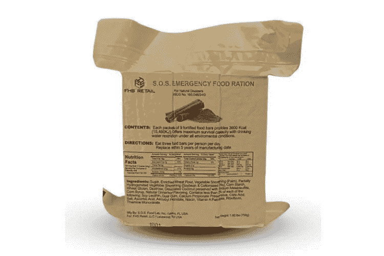**

**Food?**

**还有很多其他更小的食物，味道更好，所以做你的研究。但是一定要搞定这些高热量的怪物。**

## ****火****

**火在荒野中至关重要。如果你不能生火，你就不能给任何人发信号，烧灼伤口，烹饪食物或保暖。得到各种生火的方法。**

**[防风暴、随处可打的火柴](http://amzn.to/2kOsk7u)应该是你的首选。瑞典火钢可以点燃 3000 堆火，而且它有内置的哨子！**

****

**It’s Swedish so it has to be good!**

**给自己找些火绒[就像你在玩 D & D 一样，用瑞典之火点燃它！以防下雨，也准备一些在下雨时有用的](http://amzn.to/2jPumUI)[打火物](http://amzn.to/2jp4B1d)。**

**你也可以拿一个[小放大镜](http://amzn.to/2kOil23)，像小时候烧军人(或者蚂蚁)一样使用。**

**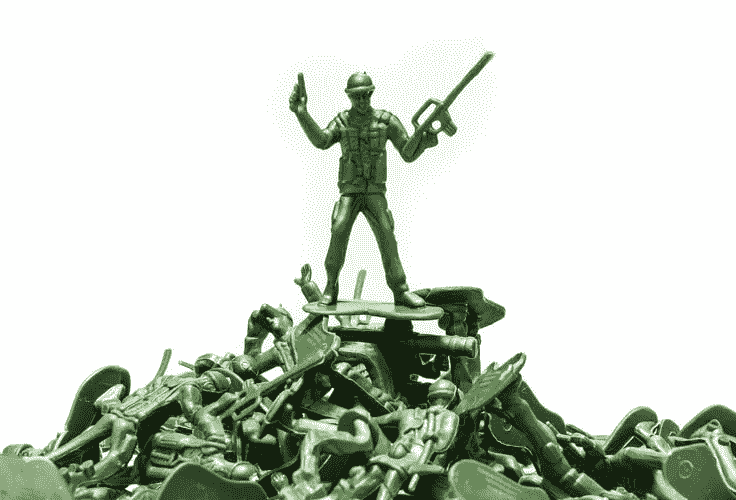**

**Army men vs magnifying glass**

## ****知道你要去哪里****

**在紧急情况下，你不会有谷歌地图带你去你需要去的地方，所以给自己找一张好地图。**

**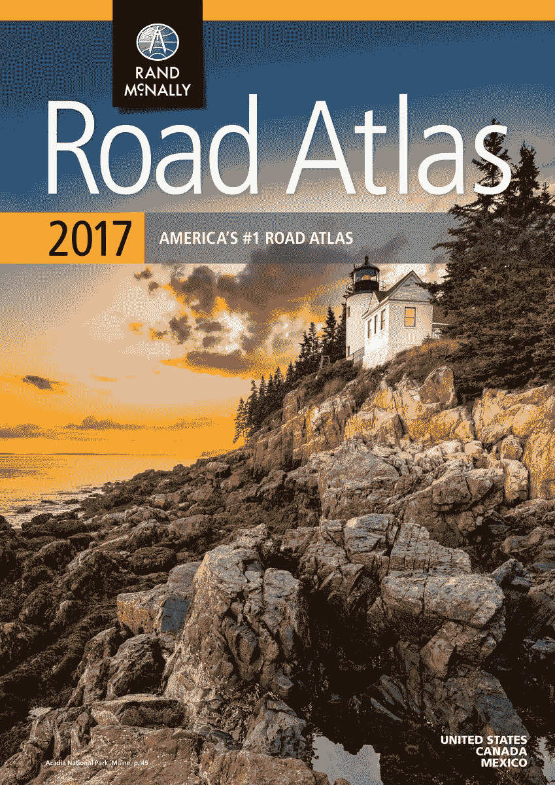**

**如果你不得不在一个摇摇欲坠的美国的荒原上杀出一条血路，Rand McNally 是你新的最好的朋友，帮助你远离主干道，避开武装民兵。**

**指南针将帮助你逃离成群的游荡掠夺者和亡灵。买一个好的，像[这个蛤壳式的已经在军队服役几十年了](http://amzn.to/2kJdYG9)。**

## ****迷路时发出信号****

**如果你迷路了，用这面镜子告诉人们你还活着，需要帮助。荧光棒也有助于照亮道路，它们看起来很适合燃烧人类。**

## ****黑暗中的一道光****

**说到电力，你会想要一个头灯。他们在各种项目中表现出色。我经常在使用电脑或做 DIY 项目时使用我的电脑。对于夜间徒步旅行也很有用。**

**你还可以得到一个好的[老式灯笼](http://amzn.to/2kOeCRQ)和一些[长效蜡烛](http://amzn.to/2klNKeZ)。**

## ****擦屁股****

**别忘了三通尿，否则你会被树叶擦屁股。不好玩。显然，澳大利亚有人用错误的叶子擦了他的屁股。疼得他自杀了。别做那种人！**

**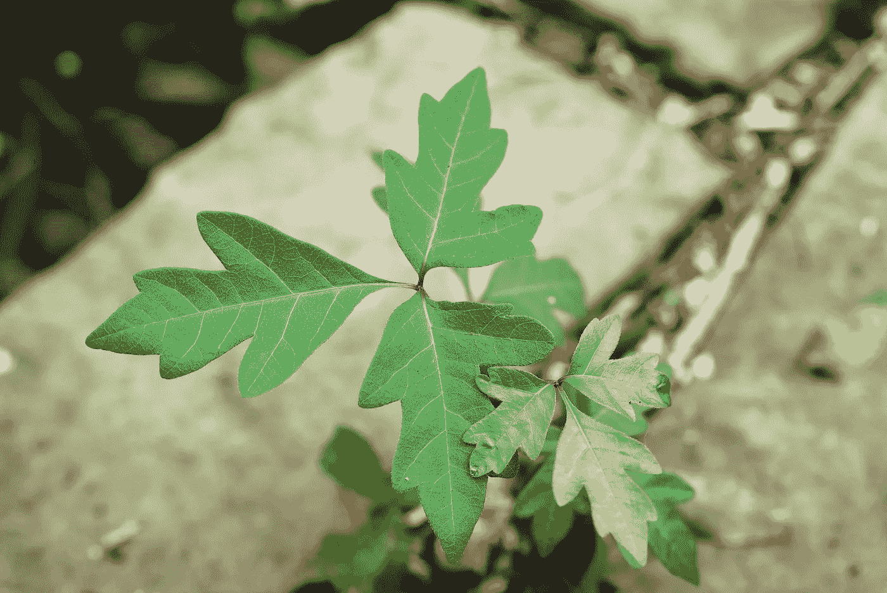**

**Poison Ivy ( Do Not Wipe Ass with This )**

**说到植物，也许你会想拿起这本[食用植物野外指南](http://amzn.to/2l2k1oJ)，这样你就不会选错了，最后变成一个统计数据。**

## ****书籍****

**这让我们想到了书。你应该已经有了你的朋友兰德·麦克纳利和食用植物野外指南。你也会想要这本野外医学指南。**

**还有请不要买 Kindle 版本。如果你在奔跑中耗尽了能量，那你就不走运了。买一本好的老式平装本。它永远不会耗尽电池，而且亮度设置完美。**

## ****防水文件袋****

**你会想把地图、护照、出生证明和其他重要文件放进这个方便的防水小袋子里。不要丢失无法替换的文档。提前考虑。**

## ****布妮帽子****

****

**NOT a Boonie hat**

**我的妻子讨厌我的[布妮帽](http://amzn.to/2kleuN2)，但是我喜欢它。这让我觉得自己像是《T4》中的临时演员。我到哪里都穿着它，尤其是在热天走路的时候。它能很好地保护我们免受日晒雨淋。**

## ****手摇收音机****

**只要你能转动曲柄，这台收音机即使没有电池也能继续工作。如果有紧急情况，你可能无法谷歌，但你需要收听任何紧急广播或新闻。它还有一个内置的 LED 灯。**

## ****一个衬垫****

**永远不要低估写下一些东西的需要。找一两个好本子，一些钢笔和铅笔。没有可用的电话，给某人留个条可能会救你一命。**

## ****睡袋****

**我给妻子买了[凯尔蒂宇宙 20 度睡袋](http://amzn.to/2kJ1TAQ)给自己买了[凯尔蒂二元论木乃伊包](http://amzn.to/2kOeYIk)。**

****

**Mummy bag. Great for camping and eating.**

**你可以用[加热板](http://amzn.to/2klrOkN)来增加这些，帮助在严寒中保持热量。[几个枕头](http://amzn.to/2klJCvo)也不会疼。**

## ****帐篷****

**帐篷种类繁多。我只需要一个给我和我妻子还有我的猫。如果你有孩子，就买个大一点的。这个 [Luxe Tempo 双人帐篷](http://amzn.to/2jPP9HR)做到了。易于安装，坚固且保暖。**

## ****宠物运送器****

**说到你的小伙伴，别忘了一个宠物提篮和一个便携式食物和水工具包。食物和水的装备包折叠起来，[这艘来自奥克福德的运输船也是如此](http://amzn.to/2jPT72X)。它在飞机上也能工作，所以你可以带着它旅行。用卡车把它们运到兽医那里也很时髦。**

**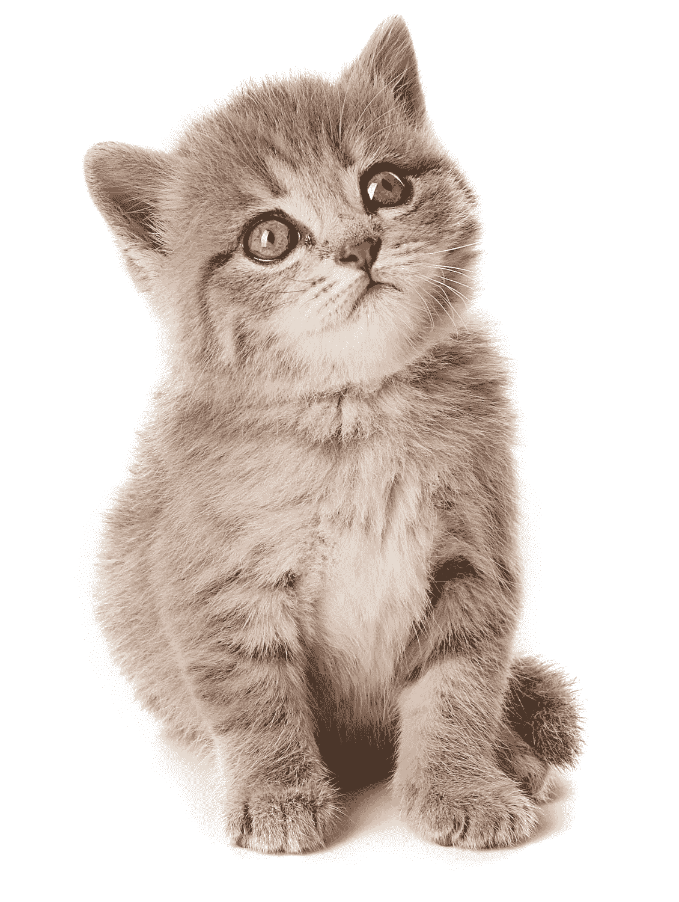**

**Don’t forget me!**

## ****烹饪****

**如果你想做饭，你需要一些用品。有的[锅碗瓢盆](http://amzn.to/2kb4nrA)，[一个杯子](http://amzn.to/2kJ9MpG)，有的 [sporks](http://amzn.to/2klvx1D) (谁不爱说那个词？！？！)，一个炉子，[炉子的燃料](http://amzn.to/2kJulCr)，还有[支撑那些罐子的东西](http://amzn.to/2kOeYIe)。**

## ****煤气罐和水罐****

**你需要一个地方来储存煤气和水。这是一个显而易见的事情，不需要大量的研究。只需挑选[一些装气体的塑料罐](http://amzn.to/2kOmdjf)和[一个装水的塑料罐](http://amzn.to/2klhCIR)。**

## ****服装****

**有一条不会湿透的好裤子会有所帮助。在紧急情况下，棉花是一个杀手，因为它会吸水，所以穿上有很多口袋的防水衣服来装东西。预科生称之为吸汗面料。**

**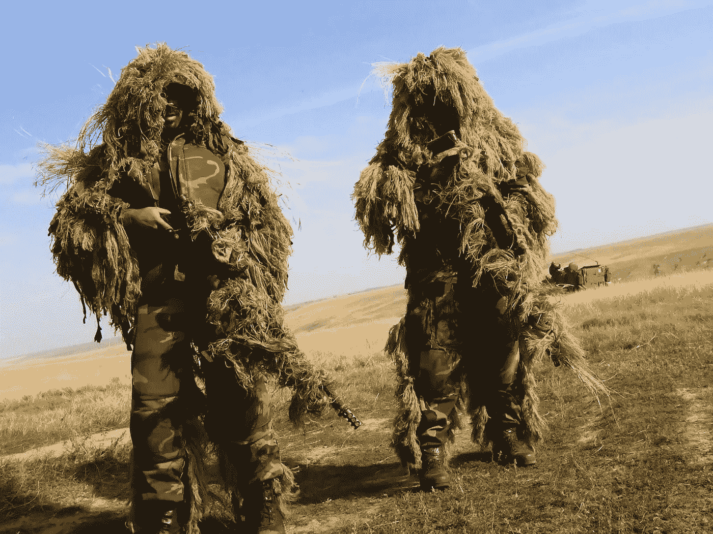**

**Call of Duty flashbacks!**

**当你用弯刀砍僵尸时(或者为妻子砍树篱时)，一些工作手套会防止你的手被举起来。一些雨布会让你保持干爽。**

**最后，正如上尉·丹在《阿甘正传》中提醒我们的，你需要好的支撑袜和登山鞋。哦，多带点内衣，伙计。**

## ****发电机****

**这个放不进你的包里，但可以放进你的汽车或卡车里。无论你走到哪里，都有一点电力是件好事，而燃气发电机就是答案。这个小宝贝甚至有一个“反极性”指示器，所以如果你需要修理曲速驱动器，你可以反极性！**

## ****太阳能发电****

**在紧急情况下，太阳能是关键。这项技术在过去几年里发展迅速，所以你也要做研究。我挑选了两种不同的太阳能充电器:Instapark Mercury 27 和 Solar Joos 35。**

**无可否认，它们并不完美。你不用给笔记本电脑供电，这样你就可以完成你的[辐射 4 荒地工作室](http://amzn.to/2kyunzB)的工作。你也不会在五分钟内给手机快速充电，但一个好的便携式太阳能电池板可能意味着是否有足够的电量拨打 911。**

**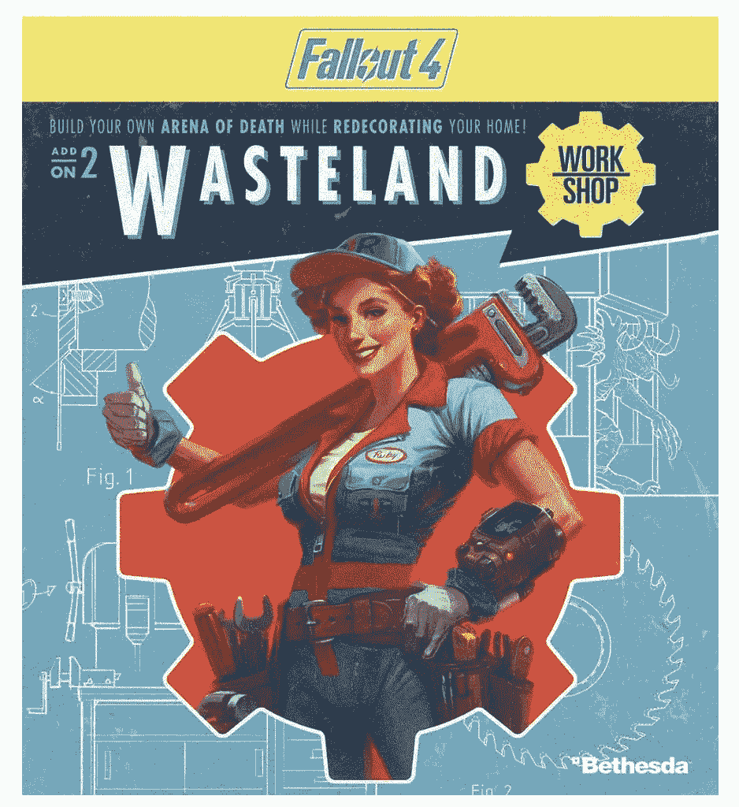**

## ****枪****

**这个有争议。只有在你觉得舒服的情况下才这样做。除了弯刀，我不会把它和任何武器联系起来。网络上不乏武器网站，所以四处看看吧。不是每个人都有枪，但我相信《T4》中的真实爱情故事“最好有枪但不需要它，而不是需要枪但没有它”。9 毫米，点 45，左轮手枪都是不错的选择。**

**然而，如果你想去认真科幻比你需要[一个可靠的锯短猎枪](https://www.youtube.com/watch?v=BQ9hlrTfja8)。把它绑在你的胳膊上，这样你就可以把它甩出去了。查看原始终止符中的链接剪辑以获取提示。**

****

**Do not mess with Granny. She got a scope on that rifle!**

## ****杂项****

**你可能想拿一些[肥皂水](http://amzn.to/2klsUwR)来清洗自己，还有一些[迷你毛巾](http://amzn.to/2kJdgZp)。获取各种[电池](http://amzn.to/2jPxyjg)。虫子咬人，所以弄[点虫子喷雾](https://www.amazon.com/gp/product/B000LGN3Z2/ref=oh_aui_detailpage_o02_s04?ie=UTF8&psc=1)。**

**一个 [N95 医院口罩](http://amzn.to/2klvHWj)可以防止家人传播病菌。当我在中国研究我的史诗科幻内战传奇 [**【茉莉之战】**](http://amzn.to/2l2kAi4) 时，我每天都戴着它，在疯狂的北京赛博朋克污染中努力咳嗽。**

**就是这样。我知道，有很多东西。即使你一次买不起，当你有一些可支配收入的时候，投资几个关键的部分，逐步建立起来。**

## ****首先要拿到的关键棋子是:****

*   ****袋子****
*   ****食物****
*   ****水****
*   ****医疗箱****
*   ****刀****
*   ****砍刀(开玩笑的。算是吧。)****

**如果你能一下子得到，那就去做吧。当时我很幸运，因为我有一笔不错的奖金来支付这笔费用，所以这并不太困难，但在我的生活中，这并不总是对的。**

**不管你做什么，只要开心就好。享受研究一切的过程。得到好东西，好好照顾它。如果你照顾它，它也会照顾你。**

**希望你不需要它。**

**但也许，只是也许…有一天会救你家人的命。**

**############################################**

**如果你喜欢这个教程，我希望你能打小心脏推荐给其他人。之后，请随时将文章通过电子邮件发送给朋友！非常感谢。**

**###########################################**

****

***简单介绍一下我:我是一名作家、工程师和连续创业者。在过去的二十年中，我涉及了从 Linux 到虚拟化和容器的广泛技术。***

***你可以看看我的最新小说，* [***一部史诗般的中国科幻内战传奇***](http://amzn.to/2gAg249) *在这部小说中，中国摆脱了共产主义的枷锁，成为世界上第一个直接民主国家，运行着一个高度先进的、人工智能的去中心化应用平台，没有领导人。***

## **[***加入我的读者群，你可以免费获得我的第一部小说《蝎子游戏》、***](http://meuploads.com/join-my-readers-group/) ***。*** *读者们纷纷称之为* ***【第一次神经癌的严重竞争】*******黑色侦探遇上约翰尼助记。******

## ****最后，你可以 [**加入我的私人脸书小组，纳米机器人后人类刺客**](https://www.facebook.com/groups/1736763229929363/) **，在这里我们讨论所有的科技、科幻、幻想等等。******

****############################################****

****我偶尔会从我文章中的链接赚钱，但我只推荐我拥有、使用和喜欢的东西。在这里查看我的[完整保单](http://meuploads.com/disclosure/)。****

****############################################****

****感谢阅读！****

************************

> ****[黑客中午](http://bit.ly/Hackernoon)是黑客如何开始他们的下午。我们是 [@AMI](http://bit.ly/atAMIatAMI) 家庭的一员。我们现在[接受投稿](http://bit.ly/hackernoonsubmission)并乐意[讨论广告&赞助](mailto:partners@amipublications.com)机会。****
> 
> ****如果你喜欢这个故事，我们推荐你阅读我们的[最新科技故事](http://bit.ly/hackernoonlatestt)和[趋势科技故事](https://hackernoon.com/trending)。直到下一次，不要把世界的现实想当然！****

********