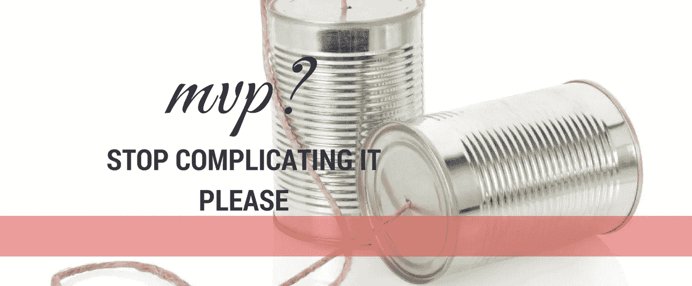

# MVP 的奇特案例——为什么和如何

> 原文：<https://medium.com/hackernoon/the-curious-case-of-mvp-the-why-and-how-e7fa16ad6ae3>

## 在打造 MVP 的时候，我们都有点忘乎所以。月复一月的开发。但是真的需要吗？还是可以绕开？

> **最小可行产品** ( **MVP** )是一个功能刚刚够满足早期客户，并为未来开发提供反馈的产品。

虽然这个词已经有 20 年的历史了，但它的流行要归功于两个人:

*   [所有双关语都是有意的。

    很有趣，不是吗？你周围所有的食品科技创业公司都试图把餐馆带回家。然而，没有人真的想给你带来值得为之杀戮的食物。

    

    如果你就是这么做的呢？

    一个简单的解决方案——做一件事。告诉你在任何特定的地方，任何餐馆的菜单上最令人惊奇的菜是什么。

    非常简单的概念。让我们认为这是一个应用程序。以下是步骤:

    1.  用户启动应用程序
    2.  应用程序检测用户的位置
    3.  显示该地区的餐馆。甚至可能给出某种指示，说明哪些是受欢迎的，哪些不是
    4.  询问用户的偏好——纯素食、无麸质等等
    5.  建议用户可能喜欢的确切菜肴—餐馆+菜肴
    6.  该地区最受欢迎的 10 道菜——来自不同的餐馆

    用户现在可以做出明智的选择。我想吃北京烤鸭，酷——我知道去哪里。

    ## 所以。MVP 会是什么样子？

    嗯，这将是一个应用程序，将…..

    呃。

    

    你真的需要一个 MVP 的应用吗？让我们这样来看。我们的主要假设是这个系统对外面的美食家有用。让我们做一个快速和肮脏的测试。

    以任何地方为例——我选择了印度新德里的康诺特广场。

    我打印了一个小册子，比如一个 3 页的折叠本。它有一个餐馆列表，以及每个餐馆的受欢迎的菜肴——就来自那个地方。在一个页面上，它有不同类别的十大最受欢迎的菜肴。可能只是两类，一类是素食者，一类是那些靠吃肉为生的人。接下来，我在宣传册的正面印上 5 家餐馆。小册子是密封的。当然，人们可以免费看前面。如果他们喜欢这个产品，他们可以花 30 美分购买。

    *   在这个阶段，价格并不重要。愿意掏钱是。
    *   我会看转化率。我采访的 100 个人中，有多少人甚至想看头版。在那些付钱的人中，有多少人愿意付我 30 美分。
    *   什么样的人对漏斗中的这两个桶最感兴趣。他们是大学生、夫妇、职业人士还是游客？

    我可以列出一些更有趣的数据点，你可以在这里积累，但你得到的想法。更重要的是，你没有写一行代码就成功地做了一个完整的试验。你用一个和你的实际产品看起来相差甚远的 MVP 做到了这一点。

    > 当然，你也应该有一个网站。在宣传册的设计和内容方面，我们还可以谈一些其他的事情。你如何利用通过这个实验产生的销售线索，但让我们暂时把这些都放在一边。](https://medium.com/u/16b8f3e95f9b# food fort thought—<em class=) 

[Ola*通过在一个中心号码上接受出租车预订开始了他们的业务。你知道吗？他们开始逐步淘汰这一过程，最终完全抛弃了它。他们这样做不是因为它不起作用，而是因为他们知道它无法扩大规模。但是，即使是中央 1800 号码*也达到了它的目的，是一个前进的好方法。](https://medium.com/u/16b8f3e95f9b# food fort thought—<em class=)

[这才是 MVP 的真正本质。拥有一个能验证你的假设并给你可操作的市场情报的产品。MVP 是否接近你真正的产品并不重要。](https://medium.com/u/16b8f3e95f9b# food fort thought—<em class=)

> [*Ola 是优步的竞争对手，在印度开展业务](https://medium.com/u/16b8f3e95f9b# food fort thought—<em class=)
> 
> [*我们只是用通用名称 1800-number 来称呼它，它实际上不是 1800-number。](https://medium.com/u/16b8f3e95f9b# food fort thought—<em class=)

> [.](https://medium.com/u/16b8f3e95f9b# food fort thought—<em class=)
> 
> [**在这里阅读这个故事的后续**:](https://medium.com/u/16b8f3e95f9b# food fort thought—<em class=)[……【续】MVP 传奇](https://hackernoon.com/cont-the-mvp-saga-1ec318e97f07)
> 
> .

联系很容易。我可以在 [Twitter](http://twitter.com/@abyshake) 、[、](http://facebook.com/abyshake)、 [Quora、](http://bit.ly/abyshake)、 [LinkedIn](http://in.linkedin.com/in/abyshake) 上找到我。我写在媒体上，但我猜你已经知道了。我也有一个[邮件](mailto:mail@abyshake.com)账号。:-)

玩得开心！我们聊聊吧。人类、机器人——对我来说真的没什么区别。

> [黑客中午](http://bit.ly/Hackernoon)是黑客如何开始他们的下午。我们是阿妹家庭的一员。我们现在[接受投稿](http://bit.ly/hackernoonsubmission)并乐意[讨论广告&赞助](mailto:partners@amipublications.com)机会。
> 
> 如果你喜欢这个故事，我们推荐你阅读我们的[最新科技故事](http://bit.ly/hackernoonlatestt)和[趋势科技故事](https://hackernoon.com/trending)。直到下一次，不要把世界的现实想当然！

