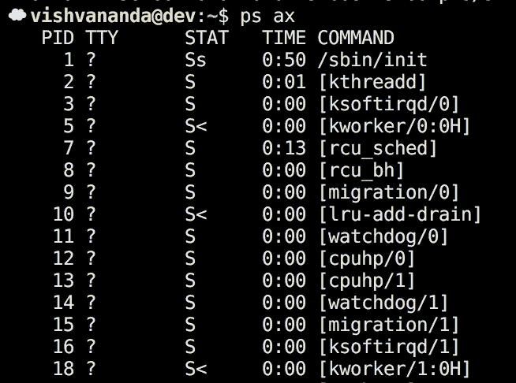

# Pid 名称空间的奇怪情况

> 原文：<https://medium.com/hackernoon/the-curious-case-of-pid-namespaces-1ce86b6bc900>

## 以及容器如何共享它们

名称空间是 linux 容器的主要组件之一。名称空间提供了共享资源的隔离:它们为每个应用程序提供了自己独特的系统视图。由于名称空间，每个 docker 容器似乎都有自己的文件系统和网络。Linux 在许多版本中逐渐增加了名称空间支持。由于这种逐渐的变化，每种类型的名称空间都有其独特的挑战。Pid 名称空间特别需要特殊处理，尤其是当涉及多个进程时。

## Linux 中的 PID

linux 中的进程存在于一个树状结构中。内核中的每个进程都有一个唯一的进程标识符，简称为“pid”。中每个进程的记录跟踪其直接父进程的 pid。当通过 [fork](http://man7.org/linux/man-pages/man2/fork.2.html) syscall 创建进程时，pid 也被传递给父进程。内核为子进程生成一个新的 pid，并将标识符返回给调用进程，但是由父进程手动跟踪这个 pid。

内核启动的第一个进程的 pid 为 1。这个过程被称为初始化过程，或简称为“初始化”。init 的父 pid 是 pid 0，表示它的父是内核。Pid 1 是用户空间进程树的根:通过递归地跟随每个进程的父进程，可以从任何进程到达 linux 系统上的 pid 1。如果 pid 1 死了，内核就会死机，你必须重启机器。

## 名称空间的快速概述

[Linux 名称空间](https://lwn.net/Articles/531114/)是使用 [unshare](http://man7.org/linux/man-pages/man2/unshare.2.html) syscall 创建的，传递一组表示要创建哪些名称空间的标志。在大多数情况下，unshare 会让您直接进入新的名称空间。例如，当一个进程创建一个网络名称空间时，它会立即看到一个没有设备的空网络视图。

pid 名称空间[有点不同](https://lwn.net/Articles/531419/):当您取消共享 pid 名称空间时，进程不会立即进入新的名称空间。而是要求分叉。子进程进入 pid 名称空间，成为 pid 1。这赋予了它特殊的属性。

同样重要的是要注意，pid 名称空间创建了流程层次结构的单独视图。换句话说，分叉的进程实际上有两个 pid:它在名称空间内有 pid 1，在名称空间外有不同的 pid。

## 命名空间中的 Pid 1

在名称空间中，与其他进程相比，init (pid 1)有三个独特的特性:

1)它不会自动获得默认的信号处理程序，因此发送给它的信号会被忽略，除非它为该信号注册了信号处理程序。(这就是为什么许多 docker 化的进程无法响应 ctrl-c，而您被迫用类似‘docker kill’的东西杀死它们)。

2)如果命名空间中的另一个进程在其子进程之前终止，则它的子进程将被重定为 pid 1。这允许 init 从进程中收集退出状态，以便内核可以将其从进程表中删除。

3)如果它死亡，pid 名称空间中的每一个其他进程将被强制终止，并且该名称空间将被清理。

很明显，init 进程与容器的生命周期紧密相关。

## 码头工人的“错误”

Docker(和 runc)运行指定为容器入口点(或 cmd)的进程，作为新 pid 名称空间中的 pid 1。这可能会导致应用程序进程出现一些意外行为，因为它通常不是作为 pid 1 运行的。如果它不建立自己的信号处理程序，发信号的进程就不会工作。如果它派生出一个在任何孙进程退出之前死亡的子进程，僵尸进程会在容器中累积，可能会填满进程表。

Docker 对这件事一直不闻不问。可以在你的容器中运行一个特殊的 init 进程，并把它 fork-exec 到应用程序进程中，许多容器这样做是为了避免这些问题。这个决定的一个不幸的副作用是容器变得更加复杂。一旦容器有了真正的 init 系统，人们倾向于嵌入多个进程，这牺牲了依赖隔离的一些好处。Docker 缺乏对 pods 的本地支持只会加剧这个问题。

## Rkt“解决方案”

Rkt 对这个问题采取了一种更理智的方法。它假设您正在启动的进程不是一个 init 进程，所以它为您创建一个 init 进程(systemd ),然后让 systemd 为容器进程创建一个文件系统名称空间并启动它。Systemd 成为名称空间中的 pid 1，容器进程作为 pid 2 运行。这意味着如果容器提供了一个 init 进程，它将作为 pid 2 运行，但是这在实践中很少引起问题。

## 更简单的选择

对于单个进程，像 systemd 这样的高级 init 系统是多余的，但是期望容器构建者理解 pid 名称空间和 init 进程的细微差别是错误的。有一个更简单的解决方案，但是它要求容器的生成者代表用户充当 init。

在分叉到 pid 名称空间之后，spawner 可以再次分叉，而不是立即执行容器进程。第二个分支允许容器生成者成为 pid 1。它可以设置信号处理程序将所有信号传递给孩子。然后，它可以收获僵尸，直到其子进程死亡，此时，它可以收集容器进程的退出状态，并将其传递给容器化系统。这意味着信号按预期工作(我可以再次 ctrl-c 我的进程！)和丧尸妥妥的收割。

请注意，从 docker 1.13 开始，类似的替代方案已经可用。启动容器时可以传递`--init`标志，这将导致 docker 为您启动一个简单的 init 进程。然而，这个选项似乎没有被广泛使用，而且在我的实验中，它似乎有一些缺陷。我发现了这样的场景，当我按 ctrl-c 键控制进程时，init 进程不会停止，直到被手动终止。

## 一个容器中有多个容器

多个相关的进程一起运行通常是有益的，但是最好将这些进程分别捆绑起来，这样就可以隔离它们的依赖关系。为了实现这一点，rkt 和 kubernetes 引入了豆荚的概念。pod 是一组共享一些名称空间的相关容器。在 rkt 实现中，除了文件系统名称空间之外，每个名称空间都是共享的。

因为 kubernetes 也支持 pods，所以它使用 docker 说明了一种类似的方法。由于 pid 名称空间的上述问题，kubernetes 还没有在同一个 pod 中的容器之间共享 pid 名称空间。这是不幸的，因为这意味着同一个 pod 中的进程不能相互发送信号。此外，pod 中的每个容器都有前面提到的 init 问题:每个容器进程都将作为 pid 1 运行。

rkt 方法优于 pod。您不需要在容器中运行 init 进程，但是创建多个可以相互通信甚至相互发送信号的进程是很容易的。不幸的是，当我们开始讨论向现有的 pod 添加容器时，情况就不那么简单了。

## 向 Pod 添加容器

通过[容器运行时接口](http://blog.kubernetes.io/2016/12/container-runtime-interface-cri-in-kubernetes.html)，kubernetes 引入了 pod 沙箱的概念。这允许容器运行时在启动容器之前分配资源。虽然对联网特别有用，但该概念还允许向现有的 pod 添加容器。如果您首先创建 pod 沙箱，然后一个接一个地启动容器，为什么不允许稍后添加一个额外的容器呢？这对于数据库备份或日志收集等周期性任务尤其有用。

Rkt 引入了对这一特性的实验支持，允许创建独立于任何容器的 pod。容器(或者 rkt 术语中的“应用程序”)可以在以后从 pod 中添加或删除。Rkt 通过在没有运行单元的情况下启动 systemd 来实现这一点。然后，它与 pod 的 systemd 通信，按需启动新的应用程序。这个解决方案非常优雅，尽管在这个模型中，init 进程有额外的特权，并引入了新的攻击媒介。rkts 沙盒模型中的 systemd 进程:

*   有权访问主机的文件系统名称空间，因此它可以为它启动的容器创建文件系统名称空间。
*   必须维护全部特权，因为它不知道每个新应用程序将需要的特权集。
*   对容器中运行的所有其他进程都是可见的。

在非沙盒模型中，init 进程可以启动子进程，然后放弃这些特权以最小化危害的影响。

## 沙箱和 Pid 命名空间

有几种不同的方法来处理 init、沙箱和 pid 名称空间。每种方法都有一些缺点。以下是可用的选项:

1.  Pid 名称空间不是与沙箱一起创建的。相反，每个容器都有自己的 pid 名称空间。这符合 kubernetes 目前的工作方式，并且可以受益于上面提到的处理单个进程的更简单的 init 策略。这种方法的主要缺点是 pod 中的进程不能相互发送信号。
2.  Pid 名称空间不是与沙箱一起创建的。相反，pid 名称空间是在沙箱中启动第一个容器时创建的。在这种模式下，进程可以相互发送信号。缺点是启动的第一个进程成为 pod 的“主进程”。如果它死了，所有其他容器进程都将被内核终止。主流程必须存在于 pod 的整个生命周期中。
3.  Pid 名称空间是与沙箱一起创建的。沙箱包括一个智能初始化进程，可用于启动其他进程。这就是 rkt 应用程序沙盒的工作方式。如上所述，缺点是 init 进程特权过多，引入了新的安全攻击媒介。
4.  Pid 名称空间是与沙箱一起创建的。沙箱包括一个简单的 init 进程，该进程只处理信号和收割僵尸。其他每个进程都进入 pid 名称空间，但是在名称空间之外仍然有一个活动的父进程。因为 init 进程没有启动新的容器，所以它不需要维护特权或访问主机文件系统。这种方法的缺点是，在名称空间中，每个进程似乎都有一个 pid 为 0 的父进程，因此进程树的正常树状结构被破坏了。
5.  pid 名称空间和 init 与选项四完全相同。其他每个进程都进入 pid 名称空间并守护(父进程退出)。内核将[将进程重新初始化为 init](https://lwn.net/Articles/532748/) ，这将修复选项四的损坏的进程树。这种情况下的缺点是在后台化变得困难之后从外部监控新流程。集装箱化系统被迫通过 pid 跟踪过程，而不是简单地等待过程。

那么这些选项中哪一个是最好的呢？这两种情况都有道理，但我更倾向于选择 4 和 5。事实上，人们可以根据流程的预期生命周期在它们之间进行选择。第五个选项非常适合长时间运行的流程，尤其是对于 docker，无论如何，流程生成者最终都会使流程变得混乱。如果流程是一个较短的任务，使用选项四并将流程与 pid 流程树分开会使事情变得非常简单。

看起来 kubernetes 正在做一些工作来创建一个可以充当 init 的[暂停容器](https://github.com/kubernetes/kubernetes/commit/81d27aa23969b77f5e7e565b0b69234537b0503e)。一旦 kubernetes 支持共享 pid 名称空间，option 5 很快就会跟上。

## 结论

pid 名称空间中隐藏着相当多的复杂性。今天集装箱化系统所做的选择有明显的缺点，可以通过采用替代方法来避免。虽然 docker 中单个容器的缺点已经被很好地理解了，并且有一个合理的解决方法，但是允许容器生成者充当 init 将会简化容器构建者的工作。

当涉及到容器组时，独立 init 的 rkt 方法优于 docker 方法。它允许进程通过信号进行通信，这在当前使用 kubernetes pod 模型是不可能的。然而，一旦包含了延迟启动容器，即使 rkt 的方法也开始显示出一些缺点。

对于延迟启动容器，最引人注目的方法是启动一个简单的 init 进程和 pid 名称空间，但是通过容器生成器生成新的容器进程。这允许 init 进程放弃特权，关闭攻击媒介。spawner 可以选择对新流程进行 daemonize，保持流程树的一致性，或者它可以作为新流程的父流程，从而简化流程管理。

> [黑客中午](http://bit.ly/Hackernoon)是黑客如何开始他们的下午。我们是 [@AMI](http://bit.ly/atAMIatAMI) 家庭的一员。我们现在[接受投稿](http://bit.ly/hackernoonsubmission)，并乐意[讨论广告&赞助](mailto:partners@amipublications.com)机会。
> 
> 如果你喜欢这个故事，我们推荐你阅读我们的[最新科技故事](http://bit.ly/hackernoonlatestt)和[趋势科技故事](https://hackernoon.com/trending)。直到下一次，不要把世界的现实想当然！

