# 奇特的系绳故事

> 原文：<https://medium.com/hackernoon/the-curious-tale-of-tethers-6b0031eead87>

在我的上一篇[帖子](/@bitfinexed/meet-spoofy-how-a-single-entity-dominates-the-price-of-bitcoin-39c711d28eb4)中，我讨论了系绳以及它们是如何工作的。在这篇文章中，你将确切地了解到系绳是多么的不稳定。

从 [CoinMarketCap](https://coinmarketcap.com/assets/tether/) 的历史上可以看出，2017 年初，流通中的系绳数量约为 1000 万美元。

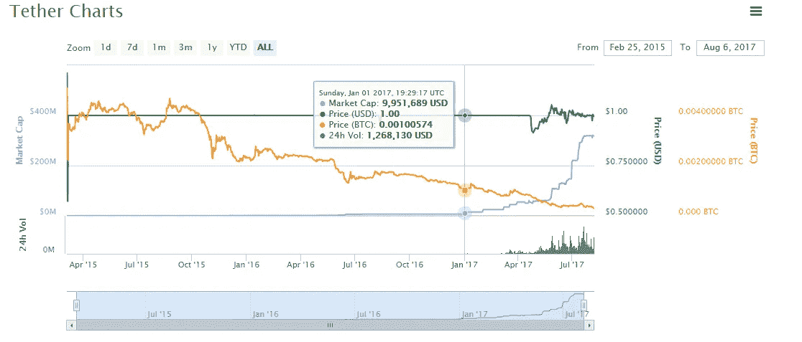

你会注意到，在 2016 年的大部分时间里，流通中的系绳在总体情况下基本持平，只是随着比特币的价格开始大幅上涨。

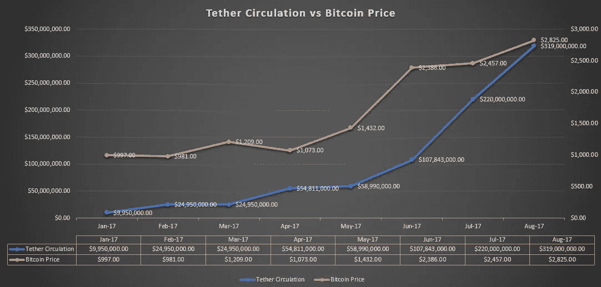

2017 年 3 月，Bitfinex 从传统银行系统中被切断后，Tether 真正开始腾飞，作为 Bitfinex 的姐妹公司，Tether 也在同一时间被切断银行业务，这引发了 Tether 和 Bitfinex 对富国银行的诉讼。

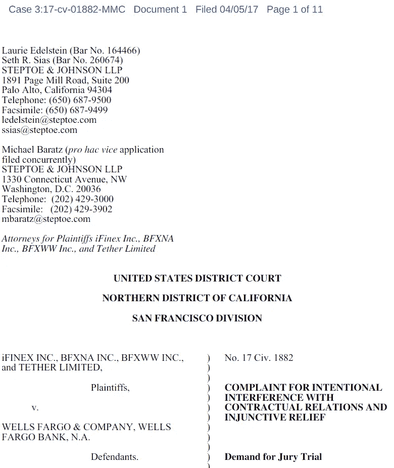

[Source](https://www.scribd.com/document/344831470/1-main)

仅仅六天后就撤回了…

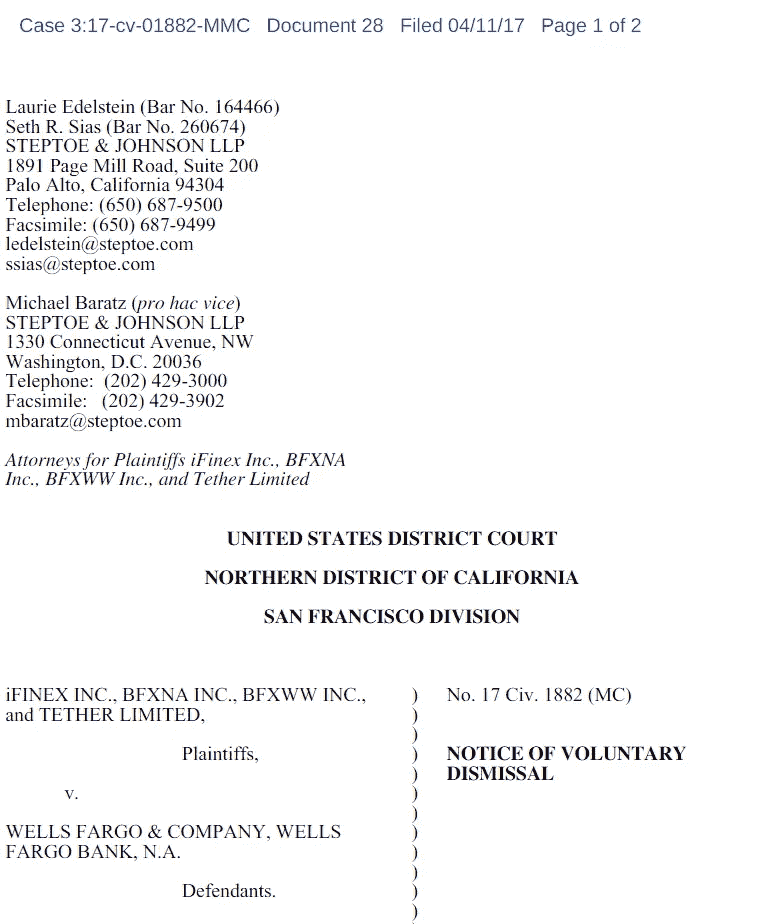

[Source](https://www.scribd.com/document/344993295/Notice-of-Voluntary-Dismissal#from_embed)

一周后，泰瑟终于就这一情况发表了声明。

> 自 2017 年 4 月 18 日起，所有进入 Tether 的国际电汇都被我们的台湾银行封锁和拒绝。因此，在这些限制解除之前，我们预计绳索的供应量不会大幅增加。

[来源](https://tether.to/announcement/)
[存档](http://archive.is/6DDZS)

在这篇文章发表的时候，Tether 还没有正式宣布他们银行问题的解决方案(和 Bitfinex 一样)。

据推测，如果 Tether 事实上有一个可行的解决方案来解决他们的银行问题，他们当然会自豪地在他们的网站上宣布，告诉每个人这个好消息。将近四个月了，我们在这个问题上一直保持沉默。

人们很快对此不屑一顾，认为这“不是什么大问题”或“比特币找到了出路”，但这不是 Bitfinex 和 Tether 在对富国银行的诉讼中所说的话…

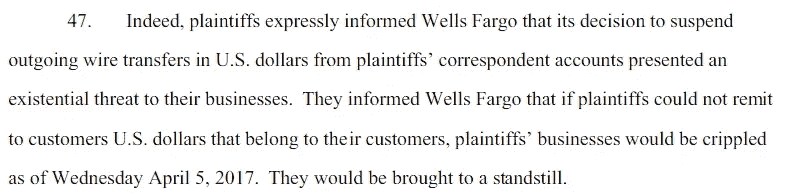

[Source](https://www.scribd.com/document/344831470/1-main)

# Tether 和 Bitfinex 如何“解决”他们的银行问题。

Tether 声称，在他们的银行问题得到解决之前，tether 的供应不会增加，但自从这一声明以来，tether 的供应实际上增加了 482%。

从 2017 年 7 月到 2017 年 8 月，绳索的供应量增加了超过**100，000，000 美元。**

也没有传统的银行业务……那么，网络份额是如何大幅增长的呢？谁在给系绳公司送钱来创造这些系绳？

哪个头脑正常的人会同意购买价值数亿美元的绳索？

> 我们不是罪犯，但现在我们必须学着像罪犯一样存钱。Bitfinex 首席财务官兼 Tether 股东 Giancarlo Devasini 在一次关于 Tether 的口头谈话中。

Information from Bitfinex

Bitfinex 和 Tether 试图通过创建看似不相关的空壳公司并在这些公司下开设银行账户来解决他们的银行问题。首席战略官菲尔·波特(Phil Potter)承认对 Bitfinex 使用了这种策略，并不难推断这种策略也用于 Tether。

> *“我们过去也遇到过银行业务的小问题，我们总是能够绕过它或处理它，开设新账户，或者……转移到一个新的公司实体，许多猫捉老鼠的把戏。”
> ——菲尔·波特，Bitfinex 首席战略官(* [*来源*](https://www.youtube.com/watch?v=62cvxPIDBGY) *)*

这种策略不会持续很久，随着最近对 BTC-E 的打击，监管者开始调查 BTC-E 资金的去向只是时间问题。

BTC-E 的收益很可能与系绳混在一起。

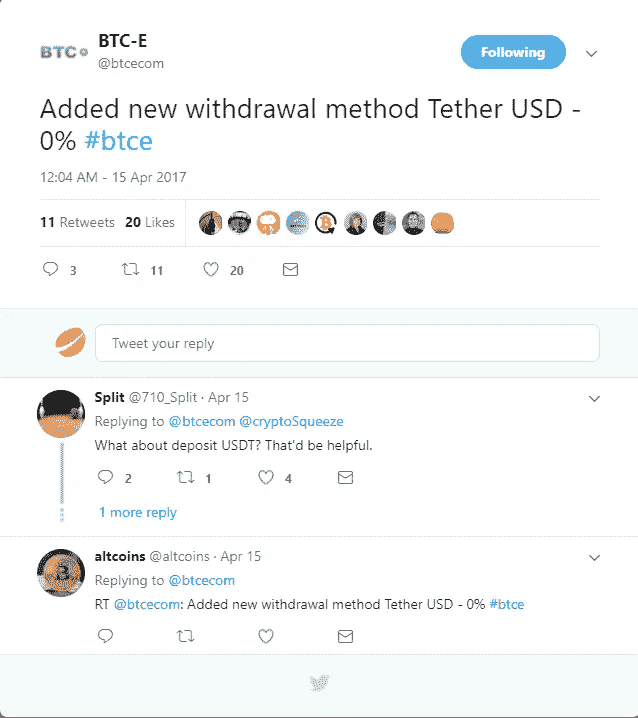

BTC-E Announcement 3 days before Tether announcement about no withdrawals/deposits. [Source](https://twitter.com/btcecom/status/853142083527245824) ([Archive](http://archive.is/qRJTe))

为了将 Tether 添加到您运营的交易所，您必须与 Tether Limited 签订合同，以获得正确的账户类型。你不能在没有与 Tether 合作的情况下就把 Tether 加入你的交易所，而且这两家公司在银行问题出现后的几天内就开始合作，这可能根本不是巧合。

BTC-E 非常擅长保持银行业务的开放，尽管在比特币社区因不透明和犯罪分子将加密货币兑换成法定货币而臭名昭著。

Bitfinex 和 Tether 的银行业务可能采用了 BTC-E 战略。

# Tether 声称进行了“专业”审计，但没有提供任何关于审计或审计人员的证据。

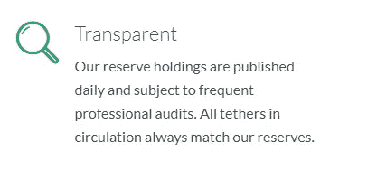

‘Transparency’ You keep using that word. I do not think it means what you think it means. [Source](https://tether.to/) ([Archive](http://archive.is/uLzlT))

几个月来，我一直要求提供审计证明，或者仅仅是他们的专业审计师的公司名称，但一直没有回音。现在有超过 3 亿美元在这些绳上，似乎没有人问问题。

# Tether 没有真正的流动性。只有一个合法的美元/USDT 货币对，在北海巨妖。

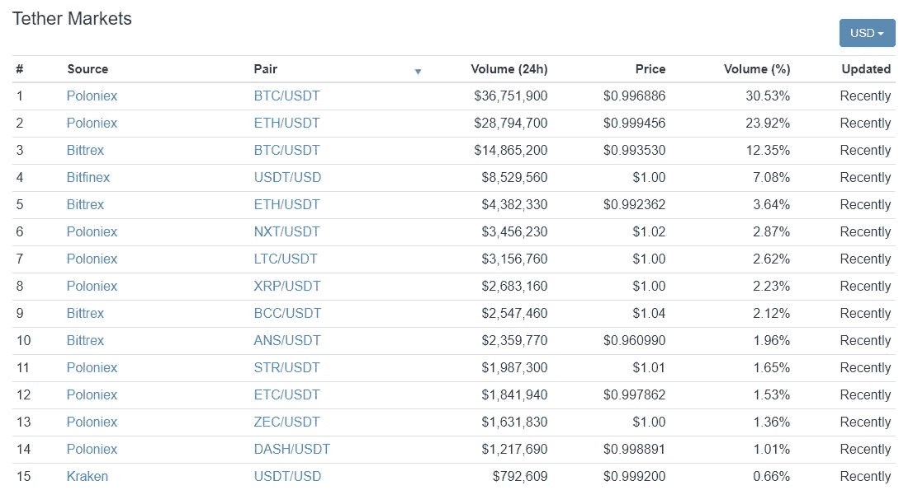

If you want real USD for your USD Tethers, you must use Kraken. [Source](https://coinmarketcap.com/assets/tether/#markets)

与市场其余部分的规模相比，美元/USDT 的交易量可以忽略不计。唯一的另一个美元/USDT 对是在 Bitfinex 上，反正和 Tether 的位置是一样的。

Bitfinex 上的系绳不浮动。Bitfinex 将始终将 1 特瑟鲁德视为 1 美元。

# Bitfinex 平台上的所有美元，与 Tether USD 处于相同的位置。

2017 年 5 月 12 日，Bitfinex 宣布他们将大部分资金转移出台湾，这表明他们的台湾银行业务可能非常有限。

> 然而，我们已经**将大部分资金转移出台湾**，之前公告中讨论的“一次性”提款解决方案即将上线。不幸的是，由于结算程序的繁琐性质，我们在学习如何更有效地处理这一过程时，将按大小降序处理这些请求。
> [来源](https://www.bitfinex.com/posts/203) ( [存档](http://archive.is/tyE8i))

# **这都是 FUD！你只是被伤害了你卖了你的比特币！**

嗯，我说的不是比特币。这篇文章是关于系绳的。但是为了好玩，让我们继续假装我说的关于系绳的一切都是假的…

我们就访问[系绳网站](http://tether.to/legal) ( [存档](http://archive.is/TRGkq))。

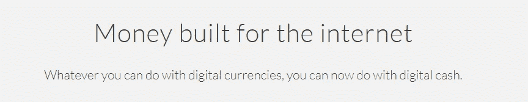

Money built for the internet, that is not money.

> 然而，系绳不是货币，也不是货币工具。
> -系绳网站

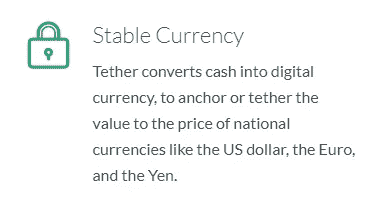

**Converts cash to ‘digital currency’, that is not stored value or currency.**

> 它们也不是储值或货币。
> -系绳网站

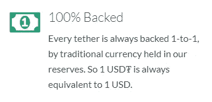

**100% backed by no contractual right or legal claim.**

> 我们没有合同权利或其他权利或法律权利来赎回或交换您的绳索。
> -系绳网站

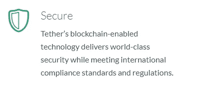

Your money is securely in **our possession.**

> 我们不保证任何赎回权或交换我们的系绳的钱。
> -系绳网站

我不确定，但我不认为[tether.to/legal](http://tether.to/legal)和[系绳](http://tether.to)在不同的网站上。如果我说错了，请随时纠正我，tether.to/legal 的是 FUD**的某种阴谋网站。**

# 可以发行的系绳数量没有限制。

没有可靠的第三方审计，USD Tether Limited 实际控制的金额是完全未知的。

1.  这很可能是在法律上与 Tether Limited 无关的银行账户中(**记住**:他们不能在 Tether Limited 下正常进行银行业务)，这就提出了一个问题，即你如何能指望他们兑现 Tether redemption，即使他们想这么做。
2.  他们自己的“专业审计”统计数据通常显示为负资产，这表明他们可能在“印刷”无担保的股票。

March 20th, 2017, 3 days before the first known suspended withdrawal. [Source](http://archive.is/QQnT0)

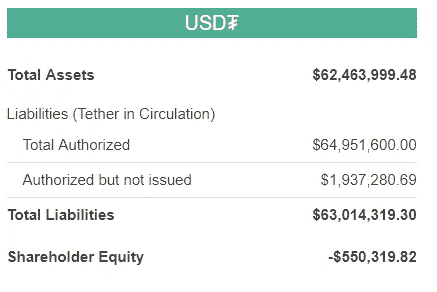

April 30th, 2017 [Source](http://archive.is/yaolX)

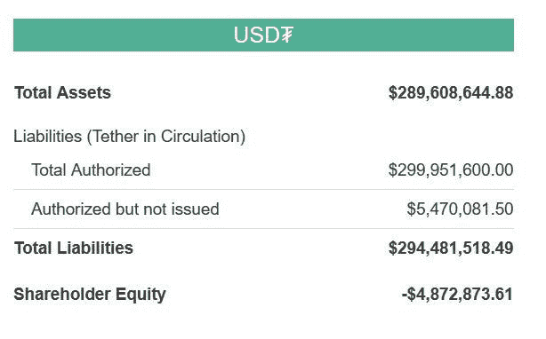

July 15th [Source](https://twitter.com/ButtCoin/status/886378980714045440) ([Archive](http://archive.is/dq7kL))

# 目前还没有大规模赎回真实美元的交易。

流通中的绳索还没有被大量兑换成真钱。较小的玩家可以通过北海巨妖获得美元。当太多的系绳持有者试图集体赎回几百万或几千万美元时，问题就出现了。

理论上，在他们的透明网站上，当这种情况发生时，流通中的份额应该下降，但实际上从未下降过。

从现有的数据来看，他们从未赎回过大的系绳持有人账户。

他们可能永远也不会。

> 可能还有其他人，**所以我们需要保留不赎回**的权利。
> - [斯图亚特·霍格纳](http://www.gamingcounsel.co/about/) ( [存档](http://archive.is/5SXVR))，系绳首席法律顾问。

其他原因是什么？他们不肯说。

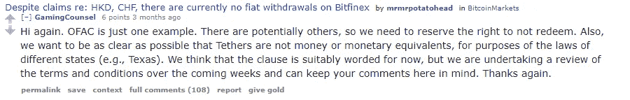

Even the Tether lawyer spreads FUD about Tether! What does he know? [Source](https://www.reddit.com/r/BitcoinMarkets/comments/66fiif/despite_claims_re_hkd_chf_there_are_currently_no/dgj38pu/) ([Archive](http://archive.is/TA7Ou))

所以，总结这篇文章。我会给你绝对最好的情况，告诉你绳索对持有它们的人来说到底是什么。

最坏的情况是什么？数以亿计的“1 美元”区块链代币四处流动并继续交易，实际上根本没有美元支持它们。

当音乐停止播放银行骗局时，这些代币仍然作为会计分录，仍然可以交易。

人们可以预期一些相当愚蠢的价格。如果你持有 50，000 枚实际价值为 0 美元的 USDT 代币，那么以 1 BTC 兑换 50，000 USDT 的价格购买比特币是很划算的，市场上的其他人最初会如何解读这一点？

别忘了，不可避免的是，有些人会比其他人更早知道音乐停止了。人们在市场其他人之前和诉讼之前就知道银行的问题，并根据这些信息进行交易。

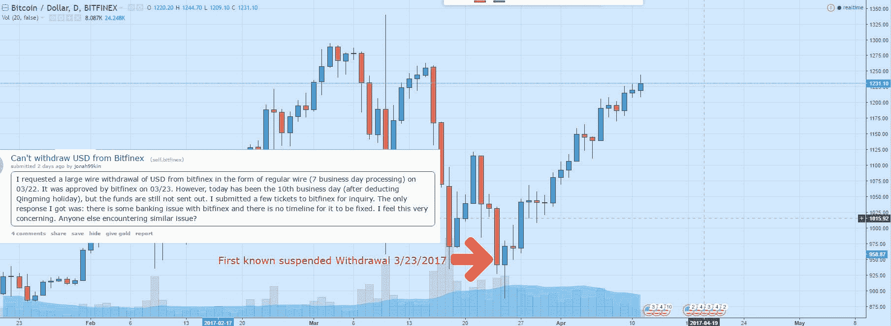

谨慎交易。

-bitfineexed