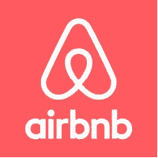

# 数据共享经济🌑

> 原文：<https://medium.com/hackernoon/the-data-sharing-economy-ec142e80a6fd>

在过去的几年里，我们的经济已经大大转向共享经济。现在共用公寓、汽车或自行车已经很普遍了。

这些公司拿走了一个*然后*未使用的资源，一个额外的空间，并把它变成了创收资产。然而，他们不仅利用了我们的物理资源，还利用了与产品相关的信息，否则这些信息将继续被**谷歌**和**脸书**收集，从而增加他们永久的垄断地位。

位置、收视率、品牌数据都开始流入 [dogvacay](https://dogvacay.com/) 、 [Airbnb](https://www.airbnb.com/) 、 [getaround](https://www.getaround.com/) 等。这对健康的经济来说是非常重要的。

## 但是我们能把这样一个成功的模型应用到业务数据中吗？🤔

## 是啊！🎉

通过实现 B2B 数据共享和一般意义上的数据共享经济，我们可以创建一个系统，使公司能够与合作伙伴、制造商、供应商和其他第三方共享数据。

想象一个环境，数据流经公司卖给你一个三明治。

> *采购➡️包装➡️发货➡️消费。*

通过这种公开的交流，我们可以改进每一个步骤，因为向您销售三明治的所有相关方都可以了解全局。

我们可以改善几乎每个领域，航空、医疗保健、自动驾驶汽车。

未来的目标是服务能够通信。来自埃隆·马斯克的火箭🚀到您的晚餐预定在 8 点，改善客户体验，在这些方之间平稳地转换数据。

然而，在努力实现数据共享经济的同时，我们也面临着一些问题。

尽管在过去几年中，围绕大数据、厚数据、机器学习等有很多*噪音*。人们仍然不知道他们的数据可以如何使用，因此，他们不明白他们的价值。在这种情况下，一个人的垃圾是另一个人的财富。

企业不愿意出售他们的数据。特别是在德国，数据被囤积、存储，很少被使用，这就是为什么“数据驱动的方法”最近受到了大肆宣传。
提出的一个要点是，竞争对手可能会获得他们的数据，或者销售价格没有足够的竞争力，当然，提供这些数据的成本太高，因为没有一个平台支持无缝的数据交换。

但是，我们能做些什么来推动经济增长呢？

*   首先，我们需要教育人们。
*   帮助他们了解其数据的贸易价值。
*   然后，我们需要为他们提供一个平台，让他们能够探索和实现他们的数据交换愿望。
*   最后，我们需要减少交换的麻烦。在没有标准的情况下，通过不同的协议移动文件会增加工作量，从而吓跑用户。

## 这就是我们引入⭐数据圈的原因

DataCircle 是一个一站式数据交换网络，致力于让用户摆脱所有数据交换的痛苦。

数据保留在你的前提下。
你决定你的购买价格。
我们关注可见性/可发现性。
对数据的任何操纵都可能发生在这个平台上。

> *上传，分享，完成。*

请继续关注对所有这些如何工作的更深入的描述。

如果你在柏林，欢迎在 11 月 30 日参加我们由 Penta 主办的[聚会。](https://www.meetup.com/PentaMeetups/events/245207896/)

