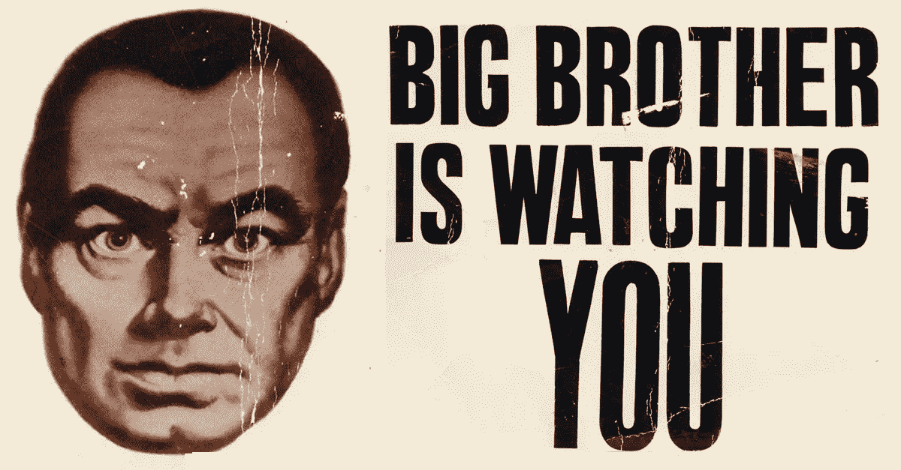
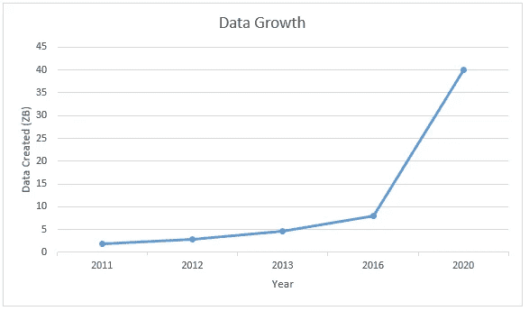
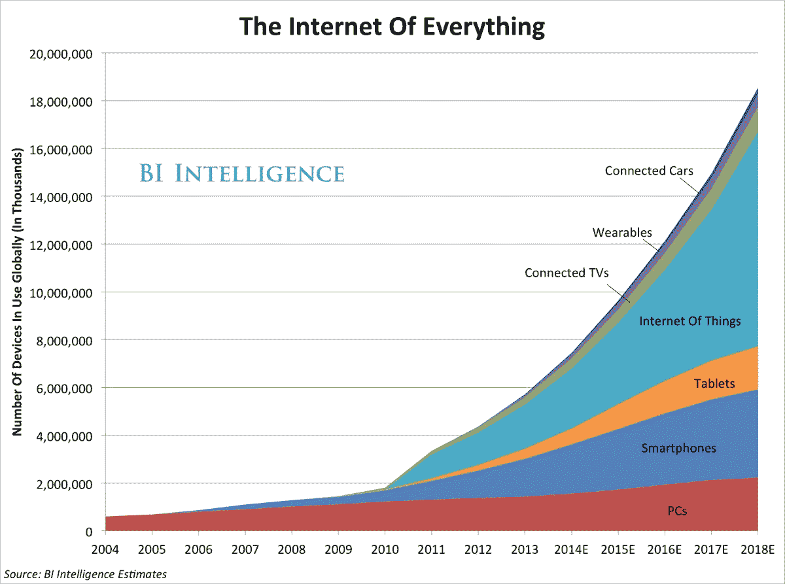

# 数据战争

> 原文：<https://medium.com/hackernoon/the-data-wars-15d595d31c8c>

欢迎来到数据战争。控制数据的终极战斗将发生在你的口袋里、你的客厅、你的卧室、你的办公室甚至你的浴室。我们的每一个动作，每一步都会产生数据输出。我们每天什么时候走出家门？我们什么时候买食品杂货？还有更多。亚马逊、[、脸书、](https://hackernoon.com/tagged/facebook)、[、谷歌、](https://hackernoon.com/tagged/google)、优步和其他主要的科技公司都渴望控制和使用你的数据输出。想象一下，当您的客户有需求时，能够立即满足他们的需求？这是营销人员的天堂。

让我们从头开始。

## 预测经济

可预测性是现代资本主义的一个基本要素。企业预测用户口味、行为和购买模式的能力使得规模经济能够发挥作用。品牌无法以不可预测的方式改变产品的配方和细节。使基础设施和供应链适应不断变化的消费者需求的成本将会非常高。因此，现代资本主义环境中的企业需要消费者拥有稳定可靠的消费模式，这是确保制造业或基础设施领域的大量投资财务稳健的条件。

品牌和营销是创造用户行为的有效工具，可以强化你的商业地位和消费模式。然而，随着数字技术的出现，可预测性的核心变成了数据。由于我们是容易受骗的用户，智能手机技术允许企业获取 10 倍的数据。我们不眨眼地下载和安装应用程序，因此为企业家捕捉数据和利用数据创造了途径。除了我们手机携带的其他功能之外，GPS 技术允许应用程序实时跟踪我们的行动、购买、习惯等等。**事实上，脸书比一些地方政府更了解非洲人民的生活。**

我们开发的人工智能和虚拟现实系统越多，我们就越能进入预测经济。以无缝的方式将技术嵌入人们的生活，允许对数据进行前所未有的访问。多亏了资本主义技术，社会主义公共计划的梦想得以实现。举个例子:亚马逊 Dash。如果你知道用户何时需要洗碗皂，你可以提前储备，进一步提高系统效率。

随着时间的推移，业务运营者可以分析消费模式，并生成物流、库存和运营优化。当用户实际创建订单时，零售商已经知道订单即将到来。因此，我们的习惯和态度变得货币化，数据交易公司蓬勃发展。这可以被定义为预测性电子商务:**预测性电子商务应用人工智能技术来处理用户数据并预测客户的需求。你也知道谁是电子商务世界的王者……亚马逊。**

## 亚马逊的妙招

亚马逊发布了一个名为 Alexa 的杰作。Alexa 是一个人工智能助手，可以为你执行多项任务。根据最新数据，它已经学习了超过 10，000 个任务。从订餐、安排会议或订购优步之旅。亚马逊采取了一个看似无害的举措，取代了传统的基于文本的搜索，推出了一个更先进、更强大的搜索引擎:超级智能的快速学习语音控制虚拟助手。突然间，亚马逊在授权用户克服文本和硬件障碍的同时，解锁了数据的圣杯。不再有台式机，不再有手机，不再有 tipying。

潜在的玩法是数据战争。用户的注意力和用户的数据输出的最终拥有者是谁？脸书及其获得的赞誉 Instagram 和 Whatsapp 一直在有效地利用注意力套利。亚马逊被甩在了后面，因为总的来说，它仍然是一个电子商务平台。除了 Kindle，亚马逊的硬件产品都没有取得多大成功，直到最近的亚马逊 Echo。以 Alexa 为软件的亚马逊 Echo 通过允许亚马逊进入注意力套利游戏扭转了局面。现在它可以在用户自己的客厅和卧室里接收用户的注意力。它捕捉最相关和最少的数据:你吃什么？你听什么？你什么时候吃饭，睡觉，听音乐，醒来…？你的时间表是什么样的？你和优步一起去哪里？还有更多。

## 谷歌是新的微软

谁可能是谷歌的终极杀手？亚马逊。谷歌试图通过发布 Google Home 来反击亚马逊。一个有能力的基于人工智能的硬件，直接与亚马逊 Echo 竞争。尽管尽了最大努力，谷歌会成为我们这个时代的微软吗？Android 似乎是曾经不可一世的微软 Windows 的开源版本。搜索引擎的发展在过去的几年里停滞不前。

Waynmo 对优步的诉讼和人才外流让你怀疑谷歌是否能够在传统领域之外创造新的核心业务。Alphabet 尚未从其非谷歌业务部门产生有意义的收入，而亚马逊已成功拓展到云业务等领域。亚马逊网络服务对杰夫·贝索斯来说是如此有利可图，以至于他可以在不影响股价的情况下，继续推动专注于增长的亚马逊巨头。

脸书通过发布像最近发布的“工作标签”这样的功能来主导社会发现。它允许人类发现和找到彼此，同时允许品牌直接销售给脸书不断增长的客户群。它正在成为一个踩着 LinkedIn、谷歌和亚马逊的鞋子的虚拟集会场所。谷歌曾经主导内容发现和产品发现。现在，脸书和亚马逊正在创造强大的工具来增强产品、内容和社会发现。

谷歌一直未能成功涉足社交领域。Google+很失败。看起来谷歌无法偏离其核心业务:搜索引擎和伴随而来的谷歌 Adwords。 Adwords 仍然是一个基于文本的广告引擎，而在脸书、Snapchat 或 Instagram 上做广告可以给人们带来更有意义的视听体验，从而提高点击率。据说优步正在考虑在他们的产品中引入广告。这将创造一个比 Adwords 更有效的解决方案:在正确的时间、正确的地点做广告。

## 技术是你一生的伙伴

硅谷技术人员是你新的终身伙伴。无论你在欧洲、非洲、印度还是美国。在非洲，数据战争正在催生一些可疑的提议，比如 Internet.org，这是脸书控制用户数据和互联网访问的有效工具，为什么它被踢出了印度。技术也可以成为社会发展的工具，中国电子商务的魔力就是一个例子。

数百万中国人利用阿里巴巴和微信的平台建立了中小企业。与此同时，中国共产党正在推动[建立一个在线数据处理系统，可以根据每个公民的在线足迹给公民打分。这个分数将用于管理旅行许可或贷款的发放。这是完美的控制。](https://www.scientificamerican.com/article/will-democracy-survive-big-data-and-artificial-intelligence/)

Twitter 正在成为新的 MySpace。谷歌可能会成为新的微软。在某个时候，脸书也可能变得商品化。新技术、新工具将会兴起，旧工具将会消亡。这就是它的美妙之处。这就是为什么很难选出数据战争的最终赢家。也许是政府？目前，亚马逊和脸书似乎在这场战斗中处于领先地位。

随着我们在生活中嵌入新技术，我们对微观管理生活的需求消失了。数据战争可能会给我们的生活带来更少的隐私和更多的侵入性技术。然而，我们大多数人似乎对这种交换感到满意。我们不必像过去那样考虑交通、住宿或购物。应用程序和科技企业让我们能够更有效地利用时间，这就是为什么隐私倡导者可能会输掉这场战斗。时间是所有应用程序和科技产品的宝贵诀窍。时间是生命的货币，因此任何能让我们少浪费时间的事情，都是在把生命还给我们。我希望技术能帮我们做到这一点。

> 我们应该培养思考我们正在做的事情的习惯，这是一个极其错误的真理，所有的教科书和杰出人士在演讲时都在重复这个真理。情况恰恰相反。**文明的进步在于增加了我们无需思考就能完成的重要操作的数量。思想的运作就像一场战斗中的骑兵冲锋——它们在数量上有严格的限制，需要新鲜的马匹，并且只能在决定性的时刻进行。[T5【阿尔弗雷德·诺斯·怀特海】T6](https://en.wikipedia.org/wiki/Alfred_North_Whitehead)**

> [黑客中午](http://bit.ly/Hackernoon)是黑客如何开始他们的下午。我们是 [@AMI](http://bit.ly/atAMIatAMI) 家庭的一员。我们现在[接受投稿](http://bit.ly/hackernoonsubmission)并乐意[讨论广告&赞助](mailto:partners@amipublications.com)机会。
> 
> 如果你喜欢这个故事，我们推荐你阅读我们的[最新科技故事](http://bit.ly/hackernoonlatestt)和[趋势科技故事](https://hackernoon.com/trending)。直到下一次，不要把世界的现实想当然！

