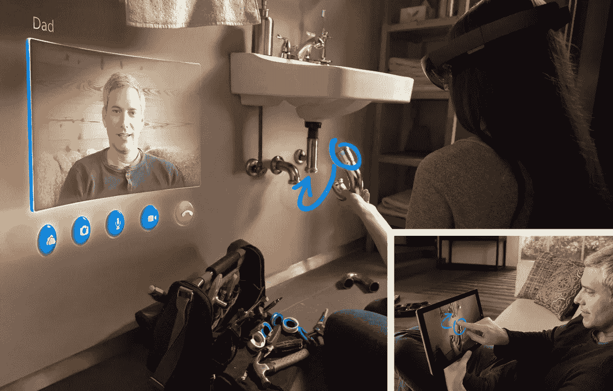
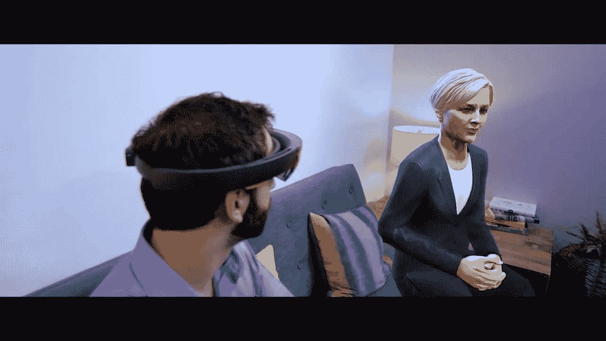

# 混合现实的黎明(HoloLens 应用)

> 原文：<https://medium.com/hackernoon/the-dawn-of-mixed-reality-hololens-apps-9070a9800c26>

Microsoft — “Fragments” for HoloLens

自从微软宣布 HoloLens 以来，我们就想知道可能的应用是什么。

随着 Lumia 智能手机的失败，雷德蒙德公司已经经历了一件重要的事情。事实上，微软明白，如果你不提供引人注目的应用程序，即使硬件是高质量的，操作系统是高效的，系统也会失败。

因此，让我们来看看这个新平台的第一个提案是什么。

目前，HoloLens 的应用涵盖了各个领域。这些领域是视频游戏、教学、通信、设计、娱乐和视频。

这些应用能让你一跃成功吗？

让我们通过分析商店上的一些来看看它。

# 沟通

Skype:你可以与你的朋友、家人和同事联系，他们可以看到你所看到的，并与你的全息图互动。使用 Skype 在您周围的空间中绘制和嵌入图像，与他人协作并更有效地做出决策。在不分散您注意力的情况下获取说明。在朋友或同事的帮助下，让您的手空出来从事现实世界的项目。

我不认为普通的 Skype 用户能从 HoloLens 中获益。我也不认为在墙上看到对话者的形象是有用的。当你不得不发出远程指令时，我看到了更多的优势。在这种情况下，对话者可以绘制线、箭头和各种指示的全息图，以提供他的远程帮助。

Microsoft — Skype for HoloLens

有趣的是这项技术仍在研究中。这使得用户可以看到远在千里之外的人，并在家中以 3D 形式再现。这些在我们面前说话和移动。还有记录对话的能力，然后以我们想要的大小的全息图的形式重访。

# 旅行

HoloTour:这个应用程序可以让你在私人导游的陪同下无限制地旅行。例如，你可以发现自己在罗马，沉浸在纳沃纳广场，仿佛你就在那里。你可以参观今天的竞技场，也可以回到过去观看角斗士比赛。该应用程序为游客提供了游客在现实世界中无法看到的视图和动画。这几乎是纯虚拟现实的应用，因为它能够使体验非常身临其境。目前，你只能参观罗马和马丘比丘(这可不是一件小事！)但是未来潜力巨大。这是考古学的未来，因为它提供了否则不可能的体验。

# 教育

恐龙王国:侏罗纪公园的终结！我们家有恐龙。你可以面对恐龙。虚拟现实带来的教育体验。图形和动画也不例外。声音很棒。星系探索者目标:研究太阳系。你可以放大行星、太阳或者看到整个星系。恒星和行星爱好者可以在 3D 中看到附近的行星并收集信息。目前来看，似乎有点局限。微软已经向任何想要研究或扩展源代码的人开放了源代码！

全息解剖学:通过分析不同层面的全息图来研究人体的学科。从表皮到内脏都能看出来。没有互动，但只是在教育层面上。对人体研究的一项重大应用。

# 比赛

片段:亲身生活的调查游戏。你是侦探，你的家是犯罪现场。你的角色是帮助一个团队解决案件。

Microsoft — “Fragments” for HoloLens

这个游戏很有创意，是电影风格游戏的第一个例子。你可以以主角的身份活出这部电影。就像你的侦探同事坐在你的客厅里一样令人印象深刻。令人印象深刻的是犯罪现场是如何在你家里重现的。

年轻的骗子:一个平台游戏，将真实的房间家具，地板和墙壁转换成冒险的场景。融入周围环境的好看的游戏，保证一定的多样性。同样的发挥水平，在不同的房间变得不一样。即使你改变了家具的布局，游戏也会改变。

机器人突袭:外星人进入你的房间，在墙上制造出逼真的洞。一些敌人逃跑了，另一些走在墙上。你必须瞄准并射击它们。如果你没打中，它会损坏你家的墙。幸运的是，当你离开游戏时，一切都恢复如初。这是最成功的游戏之一。它融合了混合现实和战斗中快速行动的关键点。

# 录像

动作片:允许新形式的叙述。您可以在家中移动、调整大小、旋转和录制动画全息图。您还可以创建视频(带全息图)，与朋友分享。这是一个为创造性留有余地的应用程序。用户通过在现实世界中放置全息图来拍摄原本不可能的场景，从而成为创作者和视频导演。视频可以在线分享。有许多全息图可供选择(如魔兽角色)和其他进来。每一个都可以以各种方式使用，有很多动画和音频效果。为了体验 Actiongram 的功能，微软委托 A.Todd's Bellpond Films 制作视频:

# 娱乐

全息图:我们可以在房间的不同固定点放置可用的全息图。我们还可以根据需要调整它们的大小和旋转它们。无论是墙壁、天花板还是地板，一切都固定在我们选择的位置。在很短的时间内，我们可以让我们的房间充满动物，体操运动员，宇宙飞船，等等。我认为这可能是一个可爱的游戏，但它的寿命很短。

全息水族馆:我们把房间改造成一个水族馆，里面有大小合适的鱼和植物。我们可以旋转新的水下世界，旋转并从内部看到它。热爱水族馆的人都知道，这是他们梦想能够进入的理想世界。HoloLens 让这一切成为可能，甚至不用淋湿。我认为这个应用程序也不会长久。

Arails:创造了火车和过山车的轨道，能够包括不明飞行物(？).对于那些对火车有热情的人来说很可爱，但对我来说它似乎不是一个必须的应用程序。

# 工具

HoloStudio:提供一套工具来创建你自己的全息图。你可以和你的朋友分享全息图。一个套件，提供了一个全息工具箱来构建带有手势的对象。这些全息仪器就像真实世界的仪器。您可以创建全息图，并通过 3D 打印将其转换为实物。如何用这种方法建立复杂的三维模型有待验证。我怀疑“旧”个人电脑对专业人士来说仍然更有用。

全息照相:力学应用。提供汽车模型的技术信息。在诊断和维修过程中很有用(了解电缆路径、螺栓尺寸等。).我很难想到一个使用 HoloLens 对汽车进行维护的机械师。然而，随着现代汽车的尖端技术，一个帮助可能是有益的。

总之，Hololens 的应用供应仍然不成熟。这是可以理解的，因为这是一项新兴技术。有些应用程序很有趣，有些则远不如“扫雷”成功。我们不要忘记这项技术需要使用眼镜。历史上，眼镜从未受到公众的青睐。考虑到 HoloLens 在使用 30-40 分钟后开始有重量感。希望可用的应用越来越有说服力。只有这样，用户才能克服眼镜带来的不适感。

让我们看看会发生什么…

***弗朗西斯科·帕洛塔*** *是软件设计和开发方面的资深软件工程师专家。他在太空和国防领域工作，研究虚拟现实和增强现实的应用开发技术。*

你想了解更多关于虚拟现实、增强现实和混合现实的知识吗？**在[媒体](/@pallotta.francesco)和[推特](https://twitter.com/FranPallotta)上关注我**。

你喜欢这篇文章吗？**推荐**，点击心形♡图标。