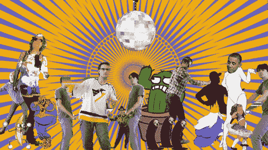
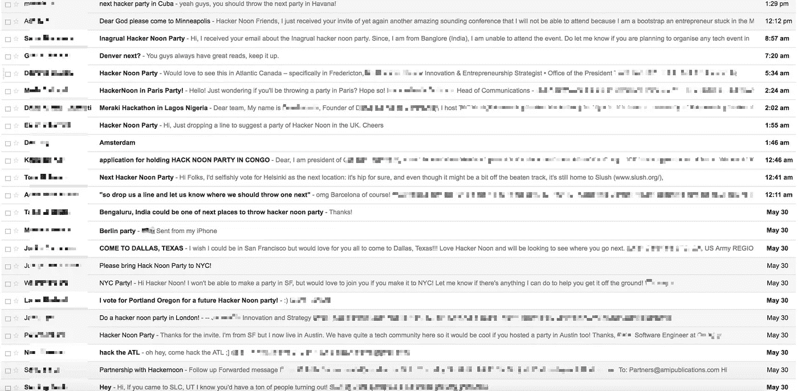
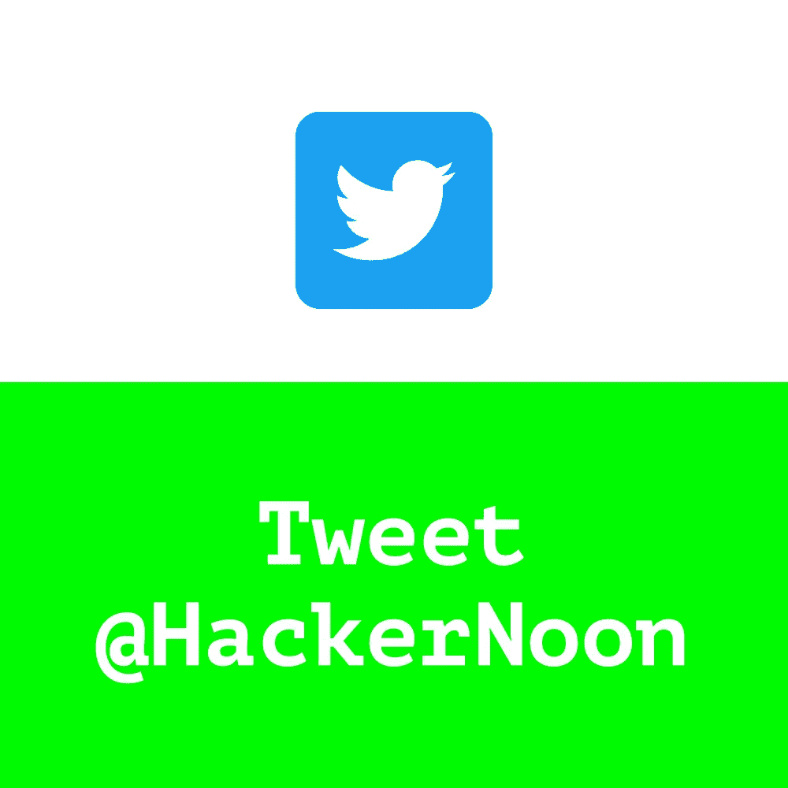

# 我们说要开派对的第二天

> 原文：<https://medium.com/hackernoon/the-day-after-we-said-we-were-having-a-party-64cc416007d1>

我们昨天给一群人发了电子邮件，我们的第一批 100 多张票被 T2 黑客正午社区认领了。一些人也表示对 facebook 事件感兴趣[。我们的门票即将售罄，但我仍会送出更多的门票:](https://www.facebook.com/events/1863147424011018/)

> [折扣代码= @ami for Hacker Noon Party](https://www.eventbrite.com/e/inaugural-hacker-noon-party-tickets-34596684615?discount=@ami) (价值 20 美元)

昨天最酷的事情之一来自于电子邮件邀请[中的一行大约 800 字，“我们应该在世界其他地方举办更多这样的活动，所以](https://hackernoon.com/youre-invited-to-our-inaugural-hacker-noon-party-d570743e844)[给我们写封短信，让我们知道接下来应该在哪里举办。](mailto:partners@amipublications.com)

智力——和读者——分布不均。私营部门、政府部门、学术界——都对未来的活动感兴趣。**纽约、亚特兰大、阿姆斯特丹、伦敦、拉各斯、盐湖城、班加罗尔、柏林、弗雷德里克顿、达拉斯、波特兰、刚果、古巴、奥斯汀、巴塞罗那、丹佛、赫尔辛基** —接下来我们该去哪里？我以前从没去过这些地方的一半。有很多要考虑的……我肯定是偏于请求的"**亲爱的上帝，请到明尼阿波利斯来吧。**

不管怎样，我喜欢它。这个社区的成长将来自于社区本身。如果你想谈谈如何共同成长，请回复这个帖子或在 Partners@AMIpublications.com 给我们发电子邮件。

> [*黑客中午*](http://bit.ly/Hackernoon) *是黑客们下午的开始。我们是* [*@AMI*](http://bit.ly/atAMIatAMI) *大家庭的一员。我们现在* [*接受投稿*](http://bit.ly/hackernoonsubmission) *并乐意* [*讨论广告&赞助*](mailto:partners@amipublications.com) *机会。*
> 
> 如果你喜欢这个故事，我们推荐你阅读我们的 [*最新科技故事*](http://bit.ly/hackernoonlatestt) *和* [*趋势科技故事*](http://bit.ly/hackernoonlatestt) *。*
> 
> *直到下一次，不要把这个世界的现实想当然！*

> [黑客中午](http://bit.ly/Hackernoon)是黑客如何开始他们的下午。我们是 [@AMI](http://bit.ly/atAMIatAMI) 家庭的一员。我们现在[接受投稿](http://bit.ly/hackernoonsubmission)并乐意[讨论广告&赞助](mailto:partners@amipublications.com)机会。
> 
> 如果你喜欢这个故事，我们推荐你阅读我们的[最新科技故事](http://bit.ly/hackernoonlatestt)和[趋势科技故事](https://hackernoon.com/trending)。直到下一次，不要把世界的现实想当然！

