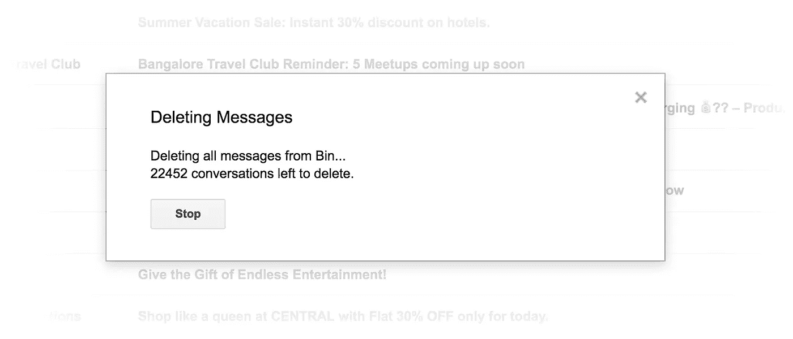

# 那天我终于整理好了我的邮件

> 原文：<https://medium.com/hackernoon/the-day-i-finally-got-my-email-sorted-fd7bf26cf4d>

## 以及它如何让我快乐

Photo Credit: [Luca Bravo](https://unsplash.com/@lucabravo)

几周前，我在读一本名为****的好书，书中建议了一些简单的方法来处理那些不会给我们的生活增加任何价值，反而会让生活变得一团糟的东西。****

****我一直想拥有一个整洁有序的收件箱。虽然这只是一个梦。直到那一刻。我需要一些动力。这让我实际上花了几个小时来清理我六年来积累的数字垃圾。在一个晴朗的周日下午阅读这本书，传递了这一点。****

# ****弄脏我的手****

****尽管有各种阻力，我还是拿着笔记本电脑坐下来，打开 Gmail，回到了过去。****

****当我开始的时候，我的收件箱里有大约 5000 封电子邮件。尽管都读过。对我来说，开始清理最老的电子邮件是有意义的，因为我不必过多考虑它们。他们中的大多数在这个时候是不相关的。此外，由于我最近养成了删除普通垃圾邮件的习惯，我最近的邮件列表比几年前清晰多了。****

****由于 Gmail 每页最多显示 100 封邮件，我不得不处理大约 50 页的垃圾邮件，并从中过滤出钻石和红宝石。我按照这个*简单流程*，****

*   ****选择特定页面中的所有电子邮件****
*   ****取消那些看起来值得保留的****
*   ****删除所有选中的****
*   ****将页面中剩余的电子邮件存档****
*   ****此外，在存档之前，打开它们，看看它们是否有趣或让我想起了什么****

****对于**社交**和**促销**标签，花费的精力要少得多。我只是选择了所有的邮件并删除了它们。它们是普通的社交媒体更新或某种广告。没有情绪或犹豫。批量删除即可。****

****尽管这似乎是一项无聊的任务，但我喜欢做。不是因为我没有别的事可做，也不是因为我喜欢点击按钮，而是因为我在清理垃圾的时候释放了很多记忆。我将在下一节讲述所有这些记忆。在此之前，我想引用一句话来结束这一节，以激励你去弄脏自己的手。****

> ****你可以从一无所有开始，但仍然会成功。然而，如果你不开始，你将永远不会成功。”——***奥斯卡·宾朋*******

# ****回忆之旅****

****像这样的清理工作对任何人来说显然都是一项非常平凡的任务，至少对我来说是这样。让我感到愉快的是所有的旧邮件，我不得不重读它们，它们让我想起了什么。****

****当我开始我的清洁工作时，我偶然发现了我和高中朋友们交换的电子邮件。我们考试前交换的所有学习笔记。然后是大学作业。有趣的笔记。我们分享的疯狂的事情。所有这些都让我想起了我们曾经的快乐和我那时的生活。****

****再往上，我看到了我第一次向一个非常受欢迎的在线博客[Hongkiat.com](http://www.hongkiat.com/blog/author/rahulchowdhury/)投稿的电子邮件。哦，第一张 PayPal 发票让我兴奋不已。我第一笔可观的网络收入。我用这些收入买了我的第一部安卓手机。我当时很开心，这是一个伟大的成就。这可能看起来很小，但正是这些小事给了你生活中真正的快乐。****

> *****“小事情看起来没什么，但它们能带来和平，就像那些草地上的花，单独看起来没有气味，但放在一起会让空气变得芬芳。”——*****

*****接着，我收到了一些电子邮件，内容是关于我和一个儿时伙伴建立的博客。我们写的所有帖子。我们认可的所有意见。我们所做的评论。我们在博客上做的赠品。我们为我们的小博客付出的所有努力。好满足。那么多*回忆重温*。*****

*****再次看到我的第一封工作邀请信真是太棒了。虽然我很早就离开了那份工作，但它仍将是一次特殊的经历，那段记忆将永远让我微笑。此后不久，我看到了我的第二封聘书，是关于我写这篇文章时正在做的那份工作的。当我离开我的第一份工作时，手里还没有拿到另一份工作机会，收到这封信是多么令人欣慰的一刻。*****

*****还有更多。我会说，这是一个重温记忆而不是做垃圾清理工作的美好时光。我喜欢它。最重要的是，我得到了奖励，这使我进入了下一部分。*****

> *****有些记忆是真实的，比任何可能再次发生在一个人身上的事情都要好——***威拉·凯瑟********

# *****我的劳动成果*****

*****从这个小练习中，我可以说我得到了两个重要的回报，*****

*   *****一个更干净的收件箱和一个快乐满意的大脑*****
*   *****一个重温我最美好的珍贵回忆的机会*****

*****然而，第三个奖励的到来完全出乎意料。随着时间的推移，由于我积累的所有电子邮件，我的谷歌提供的 **15GB** 存储空间接近耗尽。事实上，几天后当我的存储空间完全耗尽时，我实际上在考虑购买升级到 **100GB** 的存储空间。*****

*****令人惊讶的是，由于我删除了所有的垃圾邮件，总共有 22452 封**邮件**，Gmail 花了大约 2-3 分钟删除，我节省了 2GB 的空间。*****

**********

*****我从来没有意识到所有这些垃圾邮件占用了我的云存储空间这么多。在我真正需要购买更多存储之前，这给了我几个月的时间。我用准备用来升级云存储的钱吃了一顿丰盛的晚餐。我不再需要升级了，很长一段时间都不需要。*****

*****那天下午我很开心，也有一种成就感。我感到*有动力*。我会再花一些时间，坐下来，通过我的档案来澄清这一点。*****

> *****出色完成工作的回报是做更多工作的机会— ***乔纳斯·索尔克********

*****我想通过这篇文章说的是，我们周围积累了很多我们不需要的东西。摆脱它们，清理我们的工作场所或家庭，甚至像电子邮件收件箱这样的数字化的东西，可以让你的生活变得更有条理，让你的思维变得更轻松。*****

*****从繁忙的日程中抽出一些时间，清理你周围的空间，无论是物理上还是数字上。请相信这次经历将是有益的，并且*完全值得。******

> *****下次你需要重要的东西时，你会很容易找到它，因为不会有 100 英尺的垃圾来掩盖它。*****