# 互联网停滞的那一天

> 原文：<https://medium.com/hackernoon/the-day-the-internet-stood-still-98a6f5aa4a2a>

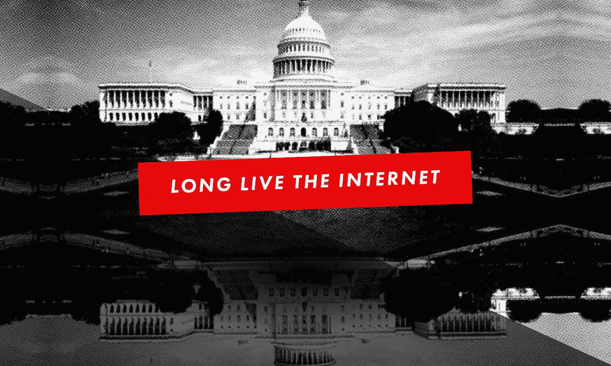

互联网是一幅没有尽头的风景。它巨大的信息、思想、声音和图像只有不断的增长和不断的变化才能与之匹敌。

但是有一天，互联网静止了。

2012 年 1 月 18 日星期三，互联网上的所有网站都以统一的信息覆盖了它们的主页。媒体和商业巨头 Reddit、维基百科、谷歌、亚马逊、Craigslist 加入了 50，000 多个网站前所未有的停电。这是一个如此强大和鼓舞人心的抗议行动，它做了一件没有人认为可能的事:它感动了国会。

美国参众两院曾希望悄悄地通过两项严格限制的网络审查法案，不要在媒体上大肆宣扬，也不要引起公众的注意。这些法案得到了娱乐业的支持，它们将从根本上改变我们所知的互联网。

> “政府并没有去找人们，要求他们删除特定的非法材料。它关闭了整个网站。从本质上说，它阻止了美国人与某些其他群体的完全沟通。”—SOPA 的艾伦·施瓦茨/琵琶

互联网变暗的那一天是这场运动的最后一站，这场运动迫使国会重新思考其秘密和愤世嫉俗地破坏网络自由和开放的企图。受到选民大量电子邮件和电话的冲击，国会放弃了《制止在线盗版法案》(SOPA)和《保护知识产权法案》(PIPA)。

# 是什么让这场斗争如此强大

未来五年回顾，SOPA/PIPA 被一个不太可能的联盟击败，这个联盟由互联网活动家、网络社区和巨大的商业利益组成，这更加令人惊讶。行动号召并没有遵循党派路线。它聚集了自由主义者、进步主义者、保守主义者和茶党积极分子。不管你是大公司还是普通公民。有一天，界限被划定，为自由互联网而战改变了一切。

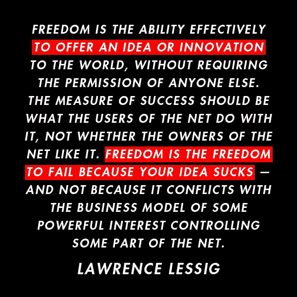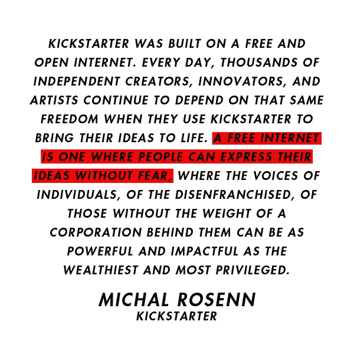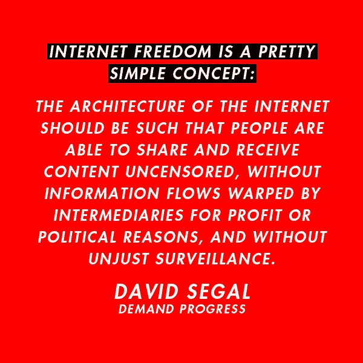

# 新的威胁，脆弱的胜利

但是没有太多的时间来庆祝 PIPA 琵琶的失败。

2012 年晚些时候，国会推出了《网络情报共享和保护法案》( CISPA ),不仅引发了关于隐私的辩论，还再次引发了关于旨在允许政府前所未有的过度干预的法律的辩论。

第二年，SOPA/PIPA 胜利的主要领导人艾伦·施瓦茨因涉嫌从网上数据库下载过多文章而面临数十年监禁，并结束了自己的生命。这是一场悲剧，迫使人们认真审视用来起诉亚伦的法律，即《计算机欺诈和滥用法案》。

然后在 2014 年，一个新的威胁出现了。威瑞森提起的诉讼推翻了联邦通信委员会关于网络中立的规定，给了电信公司一个推动新限制的窗口。在一波大规模的基层支持之后，包括一次令人想起针对 SOPA/PIPA 的封锁的在线行动，FCC 最终提出了加强互联网开放性和我们访问互联网权利的规则。

在过去的五年里，互联网自由已经不仅仅意味着反对审查制度。

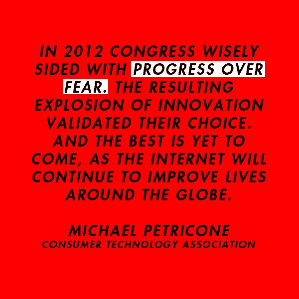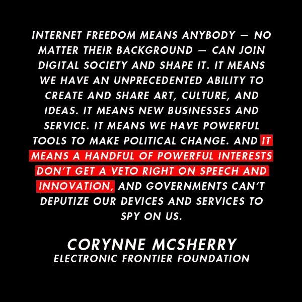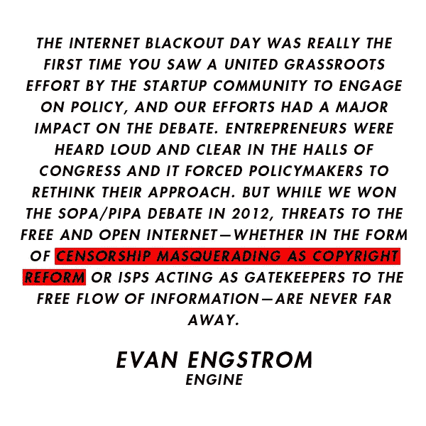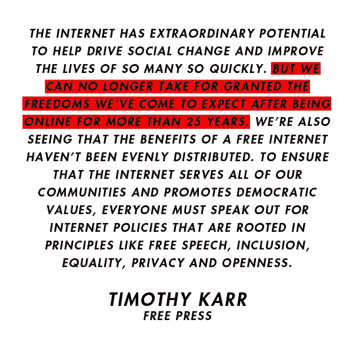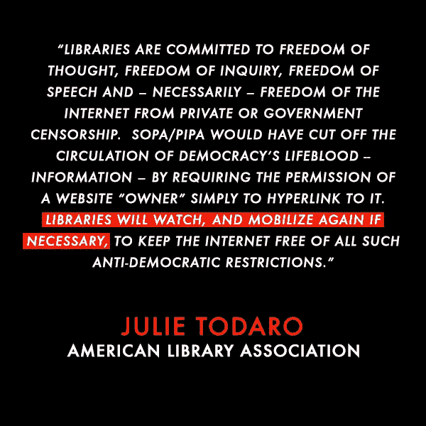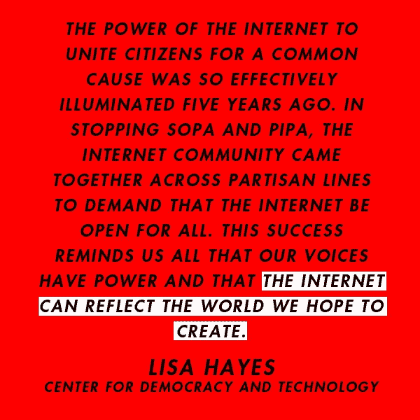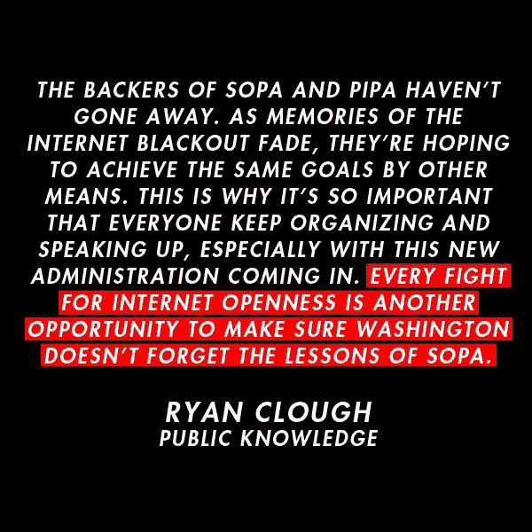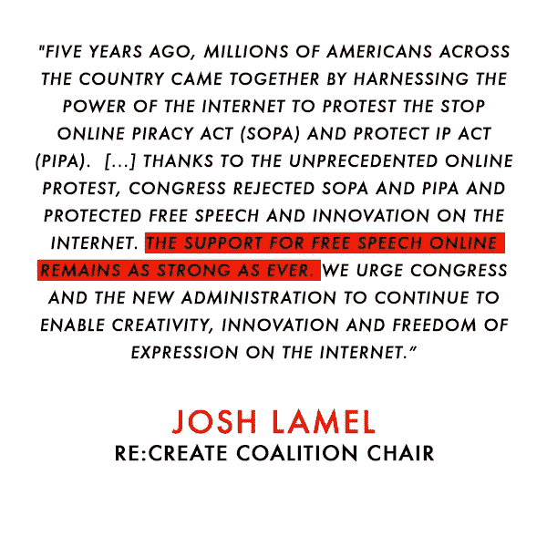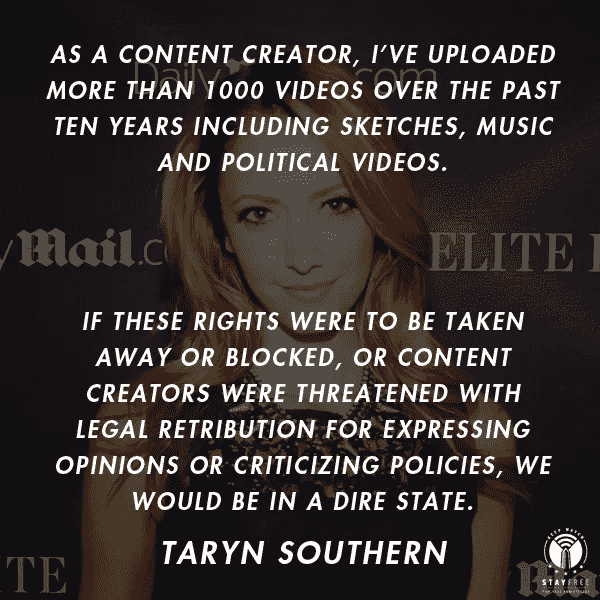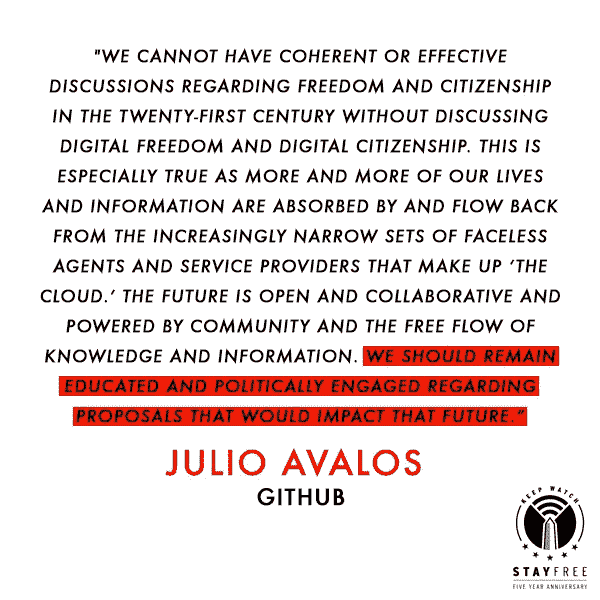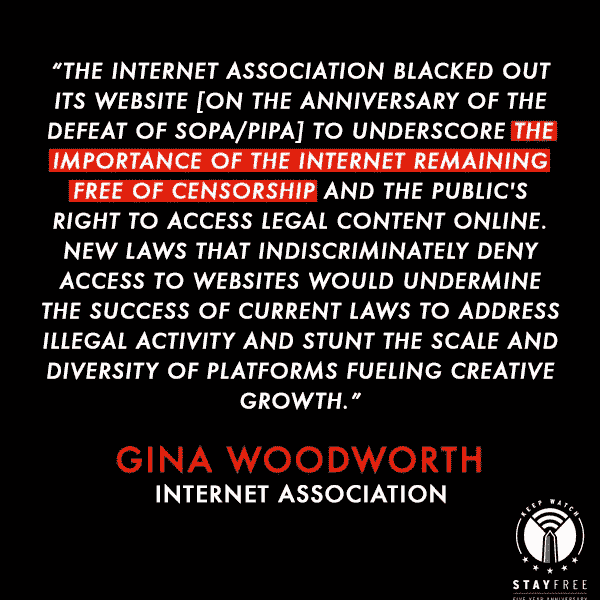

# 展望未来

随着本月华盛顿的权力易手，关于互联网作为创新、创造和表达空间的未来，许多问题仍未得到解答。唐纳德·特朗普(Donald Trump)政府包括两名新任命的联邦通信委员会成员，他们此前曾公开反对网络中立，并可能试图最早在今年撤销现有的联邦通信委员会规则。这就是为什么在过去五年中反对 SOPA/PIPA 并保持警惕的活动分子没有等待国会提出新的法案来鼓励公众激活。他们敦促现在就采取行动，而约会的发生预示着未来的战斗。

如果说 2012 年对 SOPA/PIPA 的胜利教会了我们什么的话，那就是互联网是否仍将是一个每个人都可以可靠且负担得起地分享、连接和自由创作的地方取决于我们。

# 我们能做什么

如果 SOPA 去世了，这篇文章可能就不存在了。事实上，如果一家公司发现一篇文章有问题，所有的媒体都会被搞垮。如果在引入 SOPA 的时候，没有几个人发出警报，那么许多像这样的网站就会发生同样的事情。

因此，在华盛顿领导新时代到来之际，我们能做些什么来继续战斗呢？

加入我们，重新致力于保护这个我们称之为互联网的美丽而狂野的创造。保持警惕。保持自由。

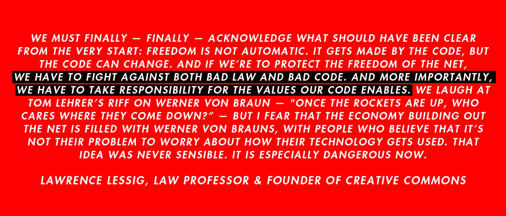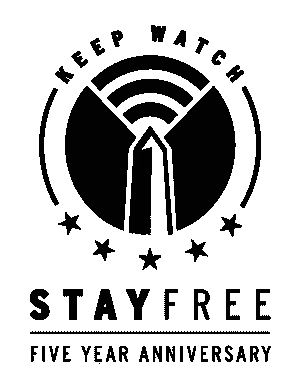

***本作已合作专题内容来自*** [*访问现在*](https://www.accessnow.org/)*[*民主与科技中心*](https://cdt.org/)*[*消费者技术协会*](https://www.cta.tech/)*[*需求进展*](http://demandprogress.org)*[*电子前沿基金会*](https://www.eff.org/) **[*Kickstarter*](https://www.kickstarter.com/)*[*劳伦斯·莱斯格*](/@lessig)*[*公共知识*](https://www.publicknowledge.org/)*[*塔瑞安·扫森*](https://www.youtube.com/user/TarynSouthern)*********

**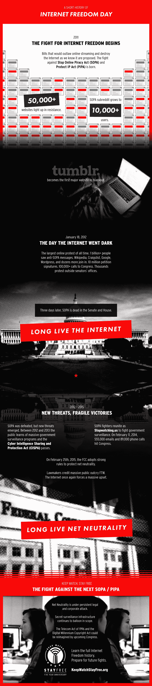**************

> **[黑客中午](http://bit.ly/Hackernoon)是黑客如何开始他们的下午。我们是这个家庭的一员。我们现在[接受投稿](http://bit.ly/hackernoonsubmission)并乐意[讨论广告&赞助](mailto:partners@amipublications.com)机会。**
> 
> **如果你喜欢这个故事，我们推荐你阅读我们的[最新科技故事](http://bit.ly/hackernoonlatestt)和[趋势科技故事](https://hackernoon.com/trending)。直到下一次，不要把世界的现实想当然！**

****