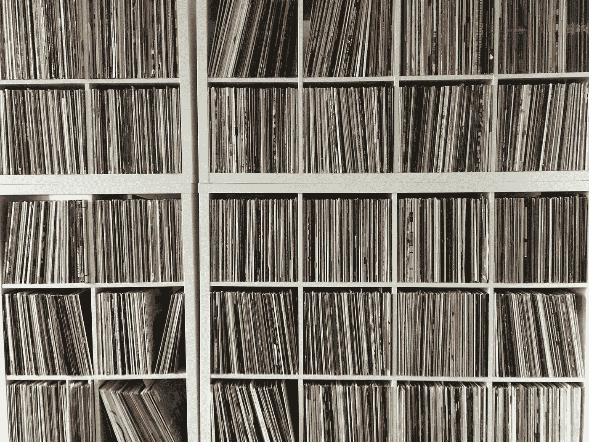
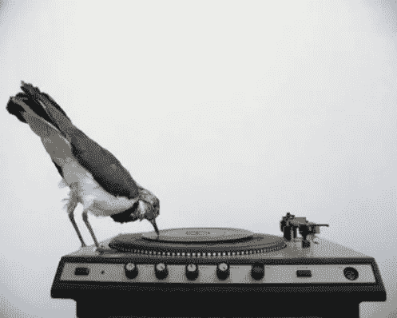
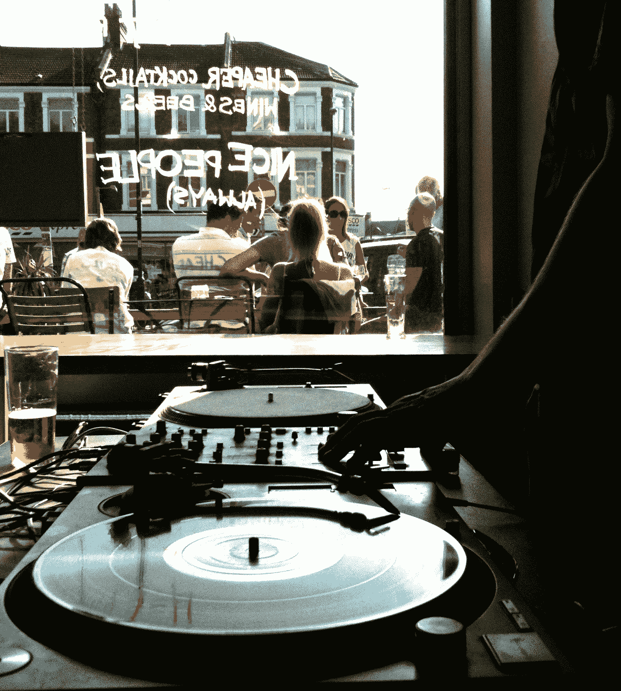
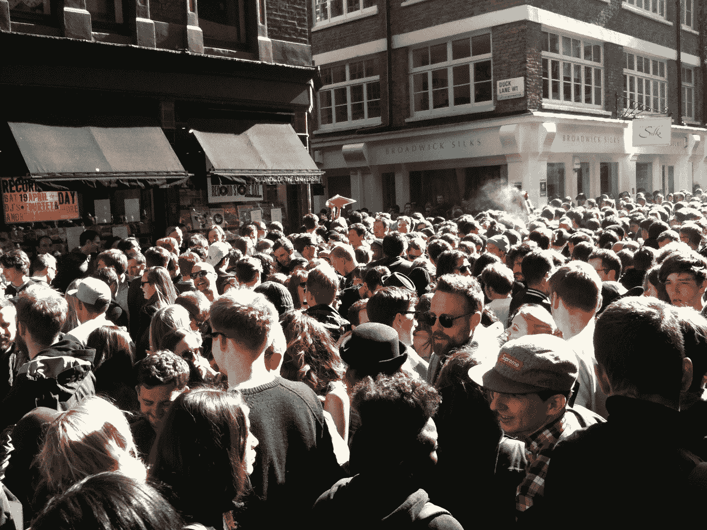

# 音乐消亡的那一天

> 原文：<https://medium.com/hackernoon/the-day-the-music-died-ed137d509b31>

## 我们如何聆听和热爱我们的音乐

> 我记得走进唱片店。它位于一个奇怪的地方，奥兰治县的一个购物中心(好像那里还有别的什么？).但是对南加州来说，家庭音乐的选择更好。他们甚至有一个小小的英国车库区，让我感到恐怖的是，我会花 17.99 美元为一个我隐约认识的艺术家买一张 EP，而且格式[很快就要死了](https://www.inc.com/magazine/20000501/18689_pagen_3.html)。

德国数学家 Karlheinz Branenburg 和他的科学家朋友在 1993 年向公众发布了 MP3。新格式中的[创新](https://www.inc.com/erik-sherman/silicon-valleys-problem-and-why-music-startups-have-to-die.html)，意味着不可思议地将音乐文件缩减了 90%以上。三年后，一个网名为 NetFraCk 的家伙组建了世界上第一个 MP3 盗版团队。被称为压缩音频，他们翻录的第一首歌曲是[金属乐队的](https://www.inc.com/jeff-haden/does-your-business-need-to-create-raving-fans-metallica-provides-the-perfect-blu.html)“直到它沉睡”。它标志着末日的开始。

随着 1999 年 Napster 的出现，文件共享真正到来了。音乐产业进入了一个螺旋式下降的过程——没有人做好准备。我当时在一家独立的唱片公司工作，这家公司销售 t 恤的收入很快就会超过它十年前所依赖的唱片。与此同时，在接下来的 10 年(1999-2009)里，由于盗版的灾难性影响，音乐产业的销售额将会减半。但是付费或盗版的点播音乐不仅仅是为我们省了几毛钱。它彻底改变了我们发现、分享和享受音乐的方式。

# 发现

我经常缠着唱片店的店员问他们在放什么。他们热情地给我拿来唱片封套。“在这里。如果你喜欢这个，你一定会喜欢这个，”我经常听到他们递给我更多的曲子。这不是促销——这是让人们喜欢上好音乐的一种真诚的爱。我很快发现自己接近了咖啡馆、餐馆、甚至是古怪的瑜伽班的工作人员，去发现什么样的音乐快乐在保佑着我的耳朵。

但是后来沙札姆来了。还有 YouTube。还有 Spotify。这些游戏规则改变者不仅意味着我的好奇行为成为了过去——它还标志着算法驱动的发现时代的开始。我承认，让一台电脑知道你自己都不知道自己喜欢什么有很多好处，但我猜想它已经让我们大多数人成为被动和懒惰的音乐消费者。

想想你最后一次购买甚至从头到尾听一张专辑是什么时候。透过屏幕我能看到你困惑的表情。重点是，虽然我们可以通过今天的流媒体服务获得一个吃到饱的音乐自助餐，但更多并不一定更好。

# 共享

“哦，我把那首歌放在我的 Spotify 跑步播放列表上了，”我们现在告诉我们宇宙中的每个人。但是，我可能不在乎——甚至不认识你。分享音乐意味着知道一个朋友会喜欢一首特定的曲子。这是一种窄播方式，而不是广播方式。一首歌(不管是新的还是旧的)通过一个特定的人进入你的生活，这是很奇妙的。它可能是你无尽的夏天的配乐，或者更多的时候，就像某种香水——将某个时刻变成记忆。

然而，这并不完全是悲观的。一个朋友告诉我一个在线电台 Rinse.FM。有一天在听了一个 DJ 混音后，另一个自动由 [Yasmin](https://soundcloud.com/rinsefm/yasmin290817) 播放。除了迈克尔·杰克逊，我想不起还有哪位艺术家对我产生过如此深远的影响。我很快就把另一个朋友介绍给了 Yasmin，几个月后在一次公路旅行中，他向我坦白，“Yasmin 改变了我的生活。”事实证明，算法和在线音乐的普及*可以*是一件美好的事情。

# 享受

Dre 耳机无法在 Beats 上复制共享的音乐体验(无声的迪斯科可能是唯一的例外)。一起看演唱会的集体体验有一些特别的、原始的东西。除了声音非常大之外，现场音乐还能产生一种纯粹的联系——一种共同的感觉。这正是为什么现在的音乐会比以往任何时候都更赚钱。新一代人重视体验，并意识到网上收听无法复制真实的东西。

当然，所有的东西在重生之前都必须死亡——因此乙烯基正在复活。我知道我计划保留我的收藏直到我入土为安。今天，我所拥有的简单知识*给我带来了安慰。凭借其温暖的特质，黑胶唱片就是人们所期待的声音。无论是独自一人，与朋友一起，还是与一群陌生人一起摇摆——音乐总是让我们感觉如何。*

*加入千人并获得我的数字善月报——只需点击**[***这里***](https://www.jonasaltman.com/newsletter)*