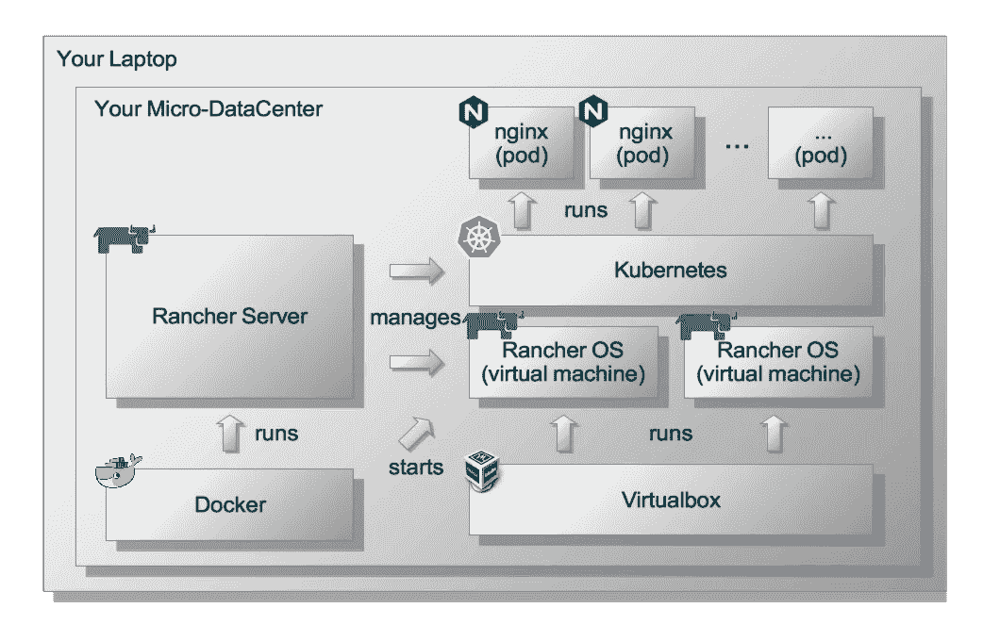
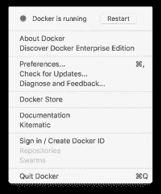
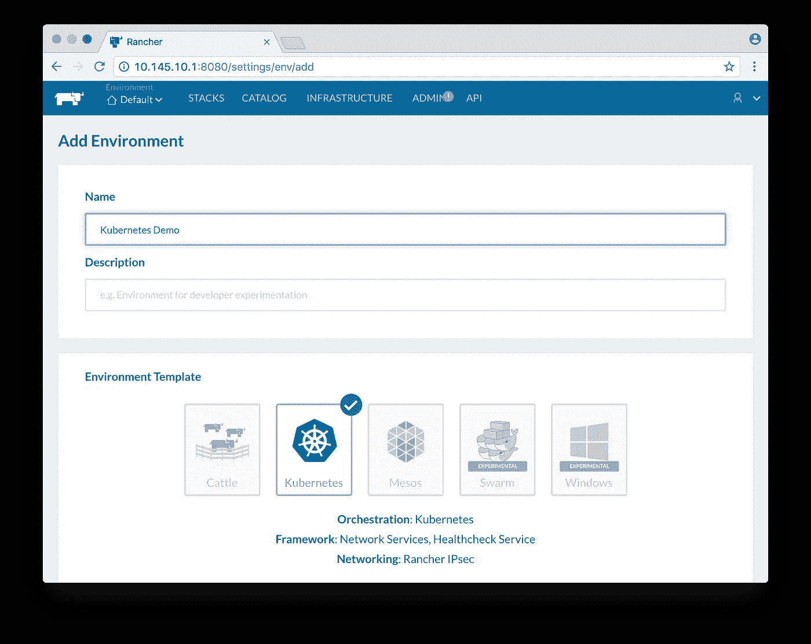
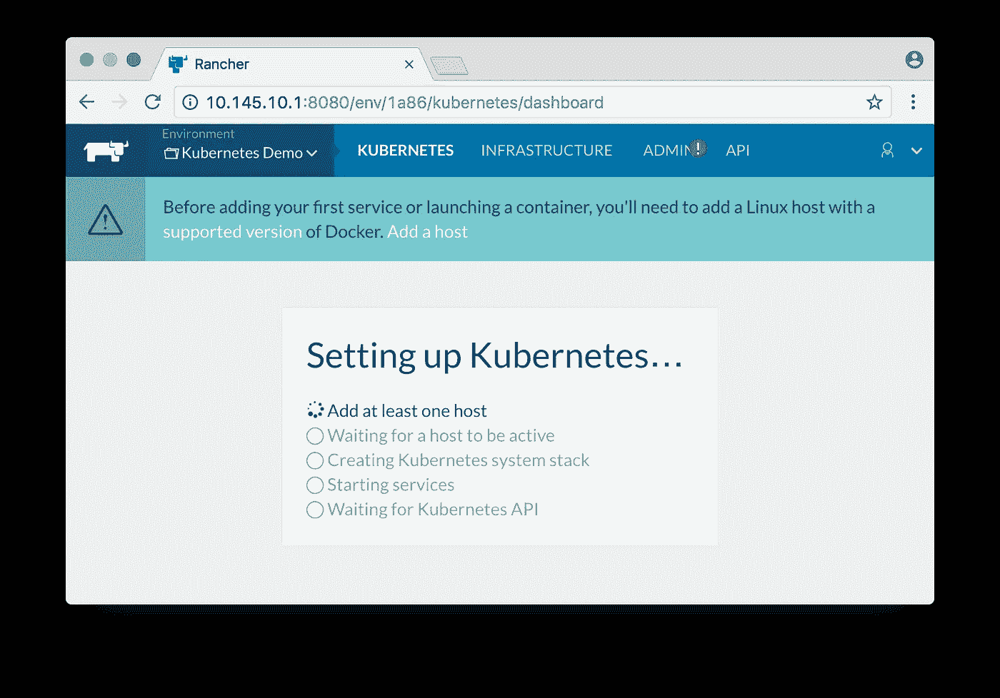
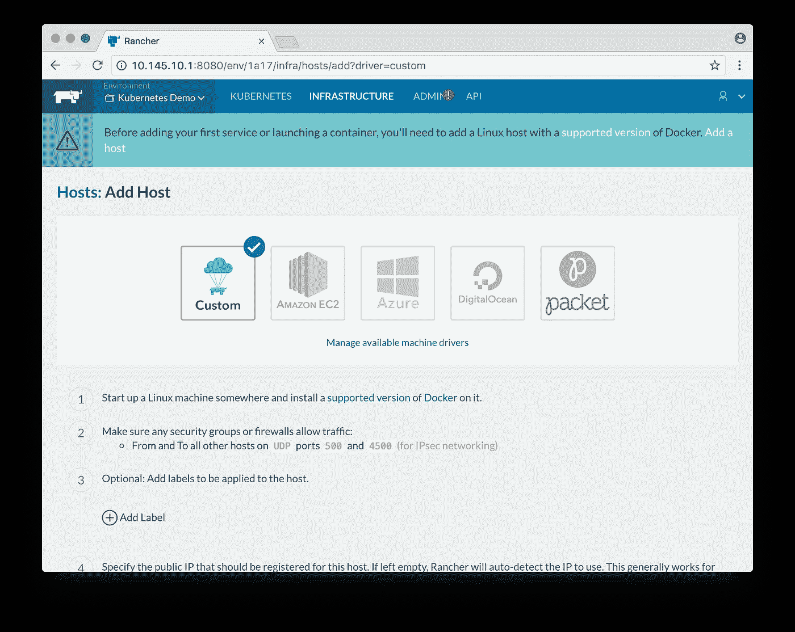
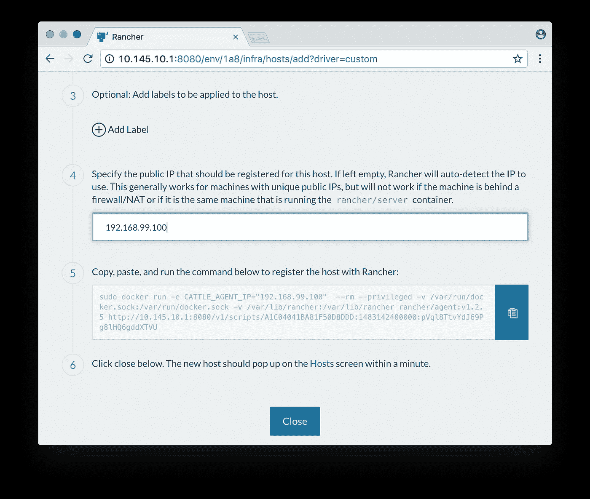
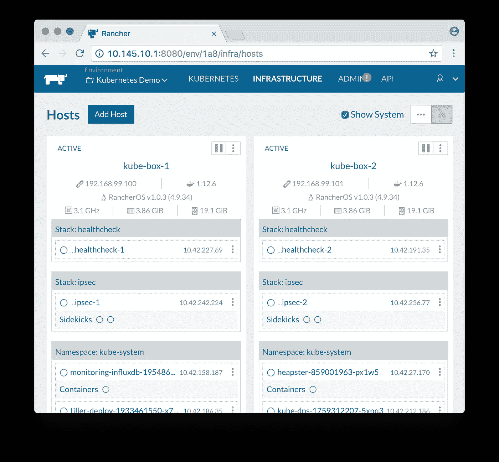
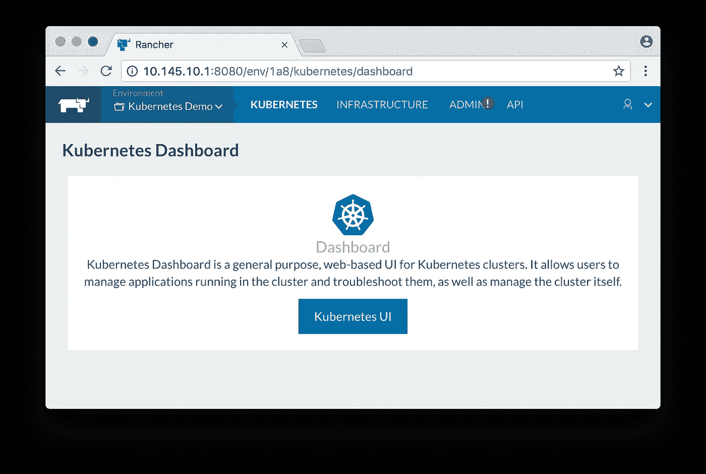
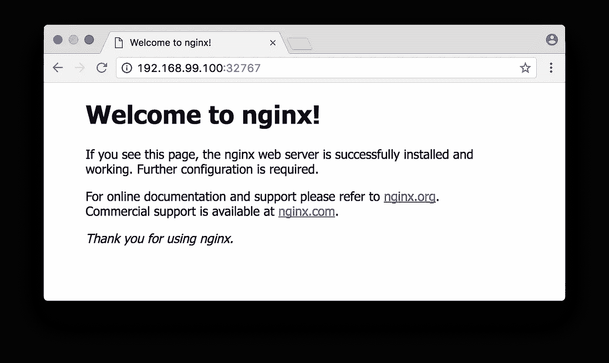

# 你的笔记本电脑成为微型数据中心的那天

> 原文：<https://medium.com/hackernoon/the-day-your-laptop-became-a-micro-datacenter-97ba62c9e862>

您知道吗，您可以在 15 分钟内将笔记本电脑从一台普通电脑推到一个支持 [Kubernetes](https://kubernetes.io/) 集群的微型数据中心，然后再推回到一台普通电脑。

是的，你没看错。

只需 15 分钟，您就可以在笔记本电脑上安装并运行自己的 Kubernetes 集群。

## [**微服务**](https://martinfowler.com/articles/microservices.html)**[**Kubernetes**](https://kubernetes.io/)**都是炒作。****

**但是，如何开始[学习更多关于这两个令人兴奋的话题的知识呢？](https://hackernoon.com/tagged/learning)**

**我将向您展示这一过程的每一步，并让您快速了解笔记本电脑上的学习环境。在这篇文章的最后，你将可以在你的笔记本电脑上实验和探索 Kubernetes。**

**下图概述了我们完成设置后，您的微数据中心将会是什么样子。**

****

**我们将利用运行在您笔记本电脑硬件上的虚拟化层(由容器和虚拟机组成)。**

**在这个虚拟化层上，我们将运行 [Rancher](http://rancher.com/) ，它将帮助我们设置和管理我们的微数据中心以及 Kubernetes 集群。**

## **以下是构建微型数据中心的 5 个简短步骤**

1.  **安装依赖项([Docker](https://www.docker.com/)&[Virtualbox](https://www.virtualbox.org/))**
2.  **安装[牧场主服务器](http://rancher.com/rancher/)**
3.  **在 Rancher 创造一个 Kubernetes 的环境**
4.  **向 Kubernetes 集群添加两个节点(虚拟机)**
5.  **在 Kubernetes 上运行一个“Hello World”服务**

**重要的事情先来。**

## ****1。安装依赖项****

**只有两个依赖关系可以让我们继续前进:**

1.  **我们需要在您的笔记本电脑上安装 Docker([单击此处](https://docs.docker.com/engine/installation/)并按照说明安装 Docker)**
2.  **我们需要在您的笔记本电脑上安装 Virtualbox([单击此处](https://www.virtualbox.org/wiki/Downloads)并按照说明安装 Virtualbox)**

**如果您还没有安装它们，请花一分钟时间安装它们。**

**当你完成安装后，继续启动 Docker。**

****

**Docker is running**

**这篇文章中的屏幕截图和终端命令都来自 Mac。然而，除了极少数例外(我将会指出这一点)，您应该可以很好地理解 Linux 或 Windows。**

**让我们开始吧(看看你的手表:)**

## **2.安装牧场主服务器**

**[Rancher Server](http://rancher.com/rancher/) 将管理我们的微型数据中心和 Kubernetes 集群。让我们在码头集装箱里点燃牧场主。**

**在笔记本电脑上打开一个终端，复制粘贴以下命令(一行):**

```
> docker run -d --restart=unless-stopped -p 8080:8080 rancher/server:stable ### The Rancher Server will take some time to get up and running.
### You can tail the logs to check Rancher's progress
> docker ps
CONTAINER ID        IMAGE
**4a3dcbaaa4ba**        rancher/server:stable> docker logs -f **4a3dcbaaa4ba**
```

**一旦 Rancher 启动并运行，你可以将浏览器指向[本地主机端口 8080](http://localhost:8080/) 并访问 Rancher 服务器的 web 界面。**

**稍后，我们希望我们的两个 Kubernetes 节点(虚拟机)连接到 Rancher 服务器。这两个节点将无法使用本地主机地址进行连接。因此，我们需要在笔记本电脑上的 localhost 接口中添加一个别名。让我们分配一个[私有 IP 地址](http://whatismyipaddress.com/private-ip)作为别名。**

**我选择了 **10.145.10.1** 作为一个随机的私有 IP 地址。请注意，选择什么专用 IP 地址并不重要。你会没事的，只要你远离更常见的(如 192.168…或者 10.0…).远离这些私有 IP 范围将有助于避免网络冲突。**

***Windows 用户注意:在 Windows 上分配别名可能会有所不同。请小心阅读操作系统的详细信息。对于 Linux 用户来说，下面的命令看起来应该非常相似。***

```
### Add the alias> sudo ifconfig lo0 alias **10.145.10.1**/24### Check with **ifconfig** to see whether the alias has been added> ifconfig
*lo0: flags=8049<UP,LOOPBACK,RUNNING,MULTICAST> mtu 16384
 options=1203<RXCSUM,TXCSUM,TXSTATUS,SW_TIMESTAMP>
 inet 127.0.0.1 netmask 0xff000000 
 inet6 ::1 prefixlen 128 
 inet6 fe80::1%lo0 prefixlen 64 scopeid 0x1* ***inet 10.145.10.1 netmask 0xffffff00* ***
 nd6 options=201<PERFORMNUD,DAD>*
```

**通过将浏览器指向 [10.145.10.1 端口 8080](http://10.145.10.1:8080/) 上的别名，验证您可以到达 Rancher 服务器 web 界面**

## **3.在 Rancher 创建 Kubernetes 环境**

**在牧场主网络界面的左上角点击*环境* 然后选择*管理环境>添加环境***

**给新环境命名(即“Kubernetes Demo”)。选择 *Kubernetes* 环境模板，然后向下滚动并点击“创建”。**

****

**Create a Kubernetes Environment**

**你现在会在左上角的*环境*下拉菜单中看到新的*‘Kubernetes Demo’*环境。点击它。**

**在这个阶段，Rancher 正在等待我们向新创建的 Kubernetes 环境添加基础设施节点。**

****

**Rancher waits for infrastructure nodes to be added**

## **4.向 Kubernetes 集群添加两个节点(虚拟机)**

**我们使用 docker 中的 *docker-machine* 命令创建了两个虚拟机(注意，您可以添加硬件支持的任意数量的节点，但是对于演示来说，两个就足够了)。**

**对于我们的两个 Kubernetes 节点，我们可以使用安装了 Docker 的任何 Linux 发行版机器映像。然而，Rancher 发布了一个名为 [Rancher OS](http://rancher.com/docs/os/running-rancheros/workstation/docker-machine/) 的微型容器优化图像。我们将使用 Rancher OS。它非常适合我们的用例。**

**回到您的终端，从下面的框中复制粘贴命令(一行)。**

**注意:**用 **kube-box-1** 运行命令两次**，然后用 **kube-box-2** 创建我们的两个节点。**

```
### Create a Rancher OS virtual machine with 3G of RAM (one line)> docker-machine create -d virtualbox --virtualbox-memory "3072" --virtualbox-boot2docker-url [https://releases.rancher.com/os/latest/rancheros.iso](https://releases.rancher.com/os/latest/rancheros.iso) **kube-box-1** ### Run the command again now for the second node> docker-machine create -d virtualbox --virtualbox-memory "3072" --virtualbox-boot2docker-url [https://releases.rancher.com/os/latest/rancheros.iso](https://releases.rancher.com/os/latest/rancheros.iso) **kube-box-2**
```

**Rancher OS 预装 Docker。不幸的是，Docker 的默认版本比 Kubernetes 喜欢的 Docker 版本要新。**

**我们必须[将两个节点](http://rancher.com/docs/os/configuration/switching-docker-versions/)上的 Docker 切换到合适的版本(1.13.1)。**

**登录到两个节点中的每一个，并更改 Docker 版本。**

```
### ssh to **kube-box-1**> docker-machine ssh **kube-box-1**### and switch the Docker version to 1.13.1 then logout[docker@**kube-box-1** ~]$ sudo ros engine switch docker-1.13.1
[docker@**kube-box-1** ~]$ exit### then **do the same** for the second node> docker-machine ssh **kube-box-2**[docker@**kube-box-2** ~]$ sudo ros engine switch docker-1.13.1
[docker@**kube-box-2** ~]$ exit
```

**太棒了。我们的两个节点现在已经准备好加入 Kubernetes 集群。**

**下一步，我们将在这两个节点上运行一个小脚本，将它们注册到 Rancher 并加入 Kubernetes 环境。**

**对于注册脚本，我们需要节点的 IP 地址(注意，您的节点的 IP 地址可能不同)。**

```
### Retrieve the IP address for **kube-box-1**> docker-machine ip **kube-box-1
192.168.99.100**### and the IP address for **kube-box-2**> docker-machine ip **kube-box-2**
**192.168.99.101**
```

**我们已经得到了我们需要的所有信息。是时候回到 Rancher web 界面并点击**“添加主机”****

****

**Add a host**

**为新节点保留默认的'*自定义*'设置。**

**然后向下滚动到步骤 4。指定上面检索到的 **kube-box-1** 的 IP 地址( **192.168.99.100** 或 *docker-machine* 在您的情况下分配的任何值)。**

**Rancher 需要 IP 地址来与其基础设施节点通信。**

****

**Enter the node’s IP address and copy the registration script**

**复制步骤 5 中的命令。这是在 **kube-box-1** 上运行 Rancher 代理的注册脚本。**

**回到笔记本电脑上的终端，使用我们在上面已经使用过的 *docker-machine ssh* 命令登录到 **kube-box-1** 。**

```
### ssh to **kube-box-1**> docker-machine ssh **kube-box-1** ### on **kube-box-1** run the script from the Rancher web interface[docker@**kube-box-1** ~]$ sudo docker run -e CATTLE_AGENT_IP="**192.168.99.100**”  -d --privileged -v /var/run/docker.sock:/var/run/docker.sock -v /var/lib/rancher:/var/lib/rancher rancher/agent:v1.2.1 [http://10.145.10.1:8080/v1/scripts/F6FC06D291DDADE7F0B7:1483142400000:8dr5IQ1NsrNG2pEX2hLh7XPppI](http://10.145.10.1:8080/v1/scripts/F6FC06D291DDADE7F0B7:1483142400000:8dr5IQ1NsrNG2pEX2hLh7XPppI) ### wait for the command to complete then logout[docker@**kube-box-1** ~]$ exit
```

**再次执行上述所有操作(从“添加主机”开始)，以注册 **kube-box-2。****

**重要！记得在步骤 5 中复制粘贴 **kube-box-2** (即 **192.168.99.101** )的 IP 地址。如果你用 kube-box-1 的 IP 地址注册 kube-box-2，就会发生不好的事情。**

**Rancher 现在正忙于为这两个节点提供 Kubernetes 服务。**

**切换到*基础设施>主机*来观察 Kubernetes 服务在两个节点上的运行。**

****

**Rancher provisions Kubernetes services on the two nodes**

**Rancher 需要花一些时间在两个节点上下载和安装 Kubernetes 服务的映像。**

**耐心点。根据您的互联网连接，这可能需要相当长的时间。有几种方法可以判断您的 Kubernetes 集群何时配置好并开始运行。**

**一种方式是 Rancher 何时开始提供打开 Kubernetes 仪表板的链接( *Kubernetes >仪表板*)。**

**你有一些时间，而牧场主正在努力工作，纺出你的库伯内特斯集群。玩一玩 Rancher 的 web 界面，看看它还提供了什么我们还没有讨论的东西。**

****

**Kubernetes is ready. You might want to checkout the Kubernetes dashboard.**

## **5.在 Kubernetes 运行“Hello World”nginx 服务**

**现在，到了退场的部分！我们的微型数据中心运行着 Kubernetes。**

**按照传统，让我们运行微服务的“Hello World ”:一个简单的 [nginx](https://nginx.org) web 服务器(提供默认网页)。**

**Kubernetes 提供了 *kubectl* 命令行工具来配置它的资源。**

**有了 Rancher 服务器，我们可以选择**

*   **从 web 界面中的控制台运行 *kubectl* ,或者**
*   **如果您的笔记本电脑上安装了 *kubectl* ，那么 Rancher 会将 *kubectl* 配置文件交给我们，让我们复制到笔记本电脑上。**

**这两个选项都可以从 Rancher web 界面的 *Kubernetes > CLI* 菜单中获得。**

**为了简单起见，我们将使用 Rancher 的 web 控制台来运行 *kubectl。***

**当然，你可以自由地在你的笔记本电脑上安装 kubectl 并用 Rancher 提供的配置对其进行配置(点击*‘生成配置’*按钮，如下图所示)。当你以后开始用你的 Kubernetes 集群做更多有趣的事情时，在你的笔记本电脑上安装 kubectl 将会派上用场。**

****

**kubectl shell in the Rancher web interface (or check out the config file if you run kubectl on your laptop)**

**为了方便起见，我用 Kubernets 配置文件( **)创建了一个 [github repo](https://github.com/danaschwanden/micro-datacenter) 。yaml* )来运行 nginx 的“Hello World”示例。**

**运行 nginx 示例(Kubernetes 部署和 Kubernetes 服务)所需要的只是在 Rancher 的 web 控制台中执行两个' *kubectl create -f …'* 命令。**

**如果您打算从您的笔记本电脑上运行 *kubectl* 或者想要研究两个 *yaml* 文件的内容，请克隆 [github repo](https://github.com/danaschwanden/micro-datacenter) 。**

```
### Copy-paste the commands and enter them on Rancher's web console### Create a deployment (spinning up two nginx pods)> **kubectl create -f** [**https://raw.githubusercontent.com/danaschwanden/micro-datacenter/master/HelloWorld/nginx-deployment.yaml**](https://raw.githubusercontent.com/danaschwanden/micro-datacenter/master/HelloWorld/nginx-deployment.yaml)*deployment “dep-nginx” created* ### Check to see the deployment we just created> **kubectl get deployments***NAME      DESIRED CURRENT UP-TO-DATE AVAILABLE AGE
dep-nginx 2  *     2       2          2         6s### Check to see the two pods the deployment created> **kubectl get pods***NAME                       READY STATUS  RESTARTS AGE
dep-nginx-3655994670–2gks0 1/1   Running 0        10s
dep-nginx-3655994670–53dfd 1/1   Running 0        10s*### Create a service to expose the nginx services on the two nodes> **kubectl create -f** [**https://raw.githubusercontent.com/danaschwanden/micro-datacenter/master/HelloWorld/nginx-service.yaml**](https://raw.githubusercontent.com/danaschwanden/micro-datacenter/master/HelloWorld/nginx-service.yaml)*service “svc-nginx” created* ### The service is configured to use “NodePort”
### Kubernetes master will allocate a random port from a
### flag-configured range (default: 30000–32767)
### Let's check on what port the service exposes nginx> **kubectl get services***NAME      CLUSTER-IP    EXTERNAL-IP PORT(S)        AGE
svc-nginx 10.43.164.192* ***<nodes>*** *8080:****32767****/TCP 12s*
```

**注意上面的*‘ku bectl get services’*命令的输出。它告诉我们两件事:**

*   **nginx 服务( *svc-nginx* )暴露在外部 IP ***<节点>*** 上**
*   **在端口 ***32767*** (可能与您的情况不同)。**

**这意味着 nginx 现在在端口 ***32767*** 上的两个 ***节点*** 上都可用。**

**让我们通过将浏览器指向 Kubernetes 服务分配的端口上的任何一个节点的 IP 地址来验证我们可以到达 nginx。**

**例如**http://192 . 168 . 99 . 100:32767**通过 **kube-box-1** 访问 nginx。请注意，您的 IP 地址和端口可能不同。相应地更改它们。**

****

**Et voila**

****恭喜**。你的笔记本电脑运行着一个微型数据中心，Kubernetes 和 nginx 作为一个简单的展示案例服务。**

**现在轮到你随心所欲地玩这个设置了。我们几乎没有触及能做些什么的表面。狂野一点。**

**我希望你会喜欢你新的数据中心能力。**

**完成后，您可能想要清理并释放资源。清理就像设置环境一样简单。只需遵循以下 5 个步骤。**

## **清理**

**正如我们承诺的，我们想让你的笔记本电脑保持原样，就像我们在这篇文章开始时发现的那样。**

**让我们把扫帚拿出来。**

**a)停止 Kubernetes 服务和部署。**

```
### In the Rancher web interface console run> kubectl delete service **svc-nginx**
*service “svc-nginx” deleted*> kubectl delete deployment **dep-nginx**
*deployment “dep-nginx” deleted*
```

**b)停止两个节点并将其移除**

```
### In the terminal on your laptop run> docker-machine stop **kube-box-1**> docker-machine stop **kube-box-2**> docker-machine rm **kube-box-1**> docker-machine rm **kube-box-2**
```

**c)删除笔记本电脑本地主机界面上的别名。如果您使用的是 Windows 或 Linux，这一步可能会略有不同。请谨慎使用，并为您的操作系统仔细阅读。**

```
### In the terminal on your laptop run> sudo ifconfig lo0 **-alias** 10.145.10.1
```

**d)停止 Rancher 服务器容器并将其删除**

```
### In the terminal on your laptop run> docker ps
CONTAINER ID IMAGE 
**4a3dcbaaa4ba** rancher/server:v1.6.3> docker stop **4a3dcbaaa4ba** > docker rm **4a3dcbaaa4ba**> docker images
REPOSITORY         TAG             IMAGE ID            rancher/server     v1.6.3          **b4c15b304585**> docker rmi **b4c15b304585**
```

**完成了。我希望你旅途愉快(你看时间了吗？)**

**PS:一如既往: ***“此处陈述的观点为本人观点，非本公司观点”*** 。**

## **有用的链接**

*   **启发了这个故事的牧场主帖子**
*   **[牧场主文档](http://rancher.com/docs/rancher)**
*   **[牧场主操作系统文档](http://rancher.com/docs/os/)**
*   **[Kubernetes 文档](https://kubernetes.io/docs/home/)**
*   **[nginx 文档](https://nginx.org/en/docs/)**