# 深度链接是不够的

> 原文：<https://medium.com/hackernoon/the-death-of-deep-linking-6cc65eb33e28>

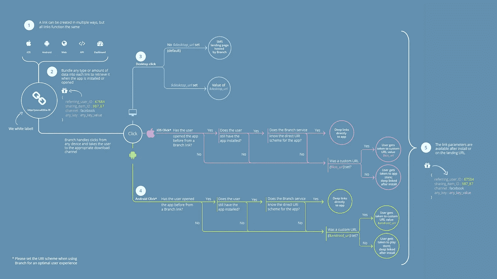

A link behavior flow diagram from the early days of [Branch](https://branch.io).

> **更新:**我们在 2019 年 4 月发布了这个故事的第二部，[*App 归属*](https://hackernoon.com/the-death-of-app-attribution-abb6f370d0c7) 之死。它讨论了跨平台测量和 UX 的未来。

*这是* [*分支*](https://branch.io) *的故事。不是年代的历史，而是我们存在背后的原因。如果你想知道“* [*深沈*](https://hackernoon.com/tagged/deep-linking) *”是如何同时成为一个流行语* ***和*** *一个行业脏字的，这里有答案。这也是对即将到来的互联网内容发现危机的解决方案。*

L 墨水牛逼。正如我们所知，它们是网络的基础，因为现在是 21 世纪，我们大部分时间都被链接所包围。几乎每个人都直观地了解如何使用第一个链接，但是你有没有停下来思考一下第二个链接实际上是如何工作的？大概不会，因为这个概念非常简单:当你点击一个链接，你就会被带到你想去的地方。

有了这样一个显而易见的过程，你忽略了这个系统到底有多脆弱是情有可原的。

# 网络链接与手机链接

> 与 web 体验相比，本机代码有许多优势，但内容可访问性和可发现性肯定不在其中。

看，在网络的早期，当每个浏览器实现的东西都不一样，大多数人体验到的“互联网”是“AOL 之外的地方”，链接可能最终不“正常工作”，这是一个真正的风险。正是开放标准的广泛采用给了我们今天所知的网络，并使像谷歌这样的搜索引擎(本质上只是数万亿链接的大规模排序数据库)成为可能。然而，即使这样也不是没有争议。

我们现在理所当然地认为谷歌搜索结果由直接指向内容的链接组成，但许多早期的网站管理员对用户被“深度链接”到他们网站中间的想法并不兴奋。提议的替代方案是让每个网站成为一个有围墙的花园，只能通过自己的主页访问，任何其他方式都无法访问内部内容。幸运的是，这个未来从未实现。网络一直是开放的，深度链接(无论是通过搜索引擎还是其他方式)是我们现在每天都在使用的东西。

但是这种早期网络的替代版本听起来是不是有些熟悉？这是应该的，因为[这是当前移动应用的现实](https://www.wired.com/2010/08/ff_webrip/)。与 web 体验相比，本机代码有许多优势，但内容可访问性和可发现性肯定不在其中。所以，现在我们回到了网络的早期，除了这一次围墙花园是一个非常真实的技术限制，而不仅仅是一个理论上的可能性。

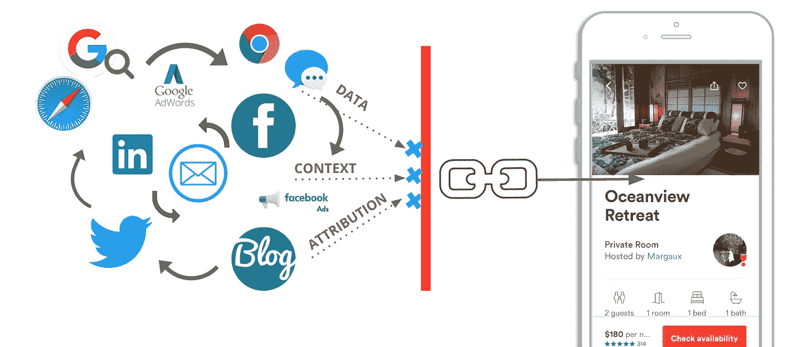

# 反思链接解决手机上的围墙花园问题

无论平台或设备类型如何，内容都可以被访问和发现吗？网络及其定义明确的链接标准不会很快消失，但 iOS 和 Android 应用程序的等效机制仍然非常不成熟，尽管苹果和谷歌可能会声称相反。目前，一个链接的行为通常会有所不同，这取决于一些无关紧要的事情，如点击前查看该链接的应用程序版本。

更糟糕的是，数字世界现在变化如此之快，以至于假设某个特定用户将如何联系到你不再安全——昨天是你的桌面网站，今天是你的移动网站，明天可能是你的原生应用程序，但下周可能是一个甚至尚未发明的全新渠道。

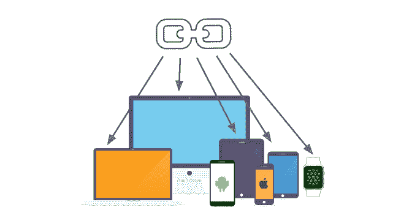

最近多平台链接的趋势(包括 iOS 通用链接、Android 应用链接和脸书应用链接)已经扭曲了网页链接，使*也*容纳应用。使用这种方法，一个常规的 web 链接同时指向多个目的地，本地客户端负责决定加载哪个目的地。它从根本上说是混乱的，是对现有系统的攻击，一旦内容出现在一个平台上而不是另一个平台上，它就会崩溃。不管我们喜不喜欢，[原生应用是未来的一部分](https://www.emarketer.com/Article/Smartphone-Apps-Crushing-Mobile-Web-Time/1014498)，未来的链接不能继续受到这些变通办法的限制。这还不够好。

相反，我们需要重新审视我们如何处理互联网上的链接。需要一种连接基础设施的新方法，采用过去行之有效的最佳方法，但从一开始就设计为适应网站和移动应用程序，并足够灵活，以适应未来技术的出现。“深度链接”将是其中的一部分，但我们现在需要的远不止于此。

# 对新链接基础设施的要求

> 链路路由变得过于复杂，无法在用户设备上进行本地处理。我们需要更强大的东西。

以下是该系统必须满足的八个关键方面:

1.  每个链接都有一个向后兼容的地址(URL ),在任何可以使用链接的地方都有效。
2.  将用户传送到所请求的目的地(“链接”的基本定义)。
3.  能够处理应该可被发现的公共目的地和需要身份验证或授权的私有目的地。
4.  能够检测用户的设备和环境详细信息，并智能地路由到最佳可用体验(桌面 web、移动 web、本机应用)。这应该是可能的，即使首选是本机应用程序，它需要首先安装。
5.  技术细节的集中实现(例如，处理故障边缘情况)，保持单个链接的创建和使用的简易性。
6.  可动态更新(包括对现有链路的追溯),以纳入新兴技术和新发现的边缘故障。
7.  整个流量管道的分析报告(如 HTTP referer 标头和 UTM 参数)。
8.  能够接受额外的上下文链接数据(通常作为 URL 查询参数在 web 上实现)。

换句话说，远程链接服务。用于链路路由的 API。云中的专用链接重定向服务器。托管深层链接。无论你喜欢什么名字，原因都是一样的:随着移动生态系统变得更加分散，链路路由变得过于复杂，无法在用户设备上本地处理。我们需要更强大的东西。

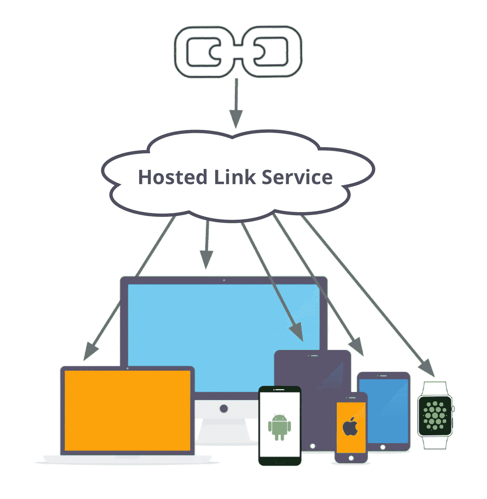

# 如何为每台设备打造链接解决方案

在过去的两年里，我们一直致力于[分支](https://branch.io)的工作，我们已经意识到，像这样的系统实际上不需要用*取代*现有的链路标准。相反，它可以将所有这些部件结合在一起，填充孔洞，并在部件之间添加胶水，以完成用户体验。要做到这一点，需要两个基本要素:

1.  **远程托管服务。**这决定了每位访客使用哪种体验。
2.  **本地，客户端模块**。这些允许每个应用或网站从远程服务接收关于显示什么内容的指令。

## 第 1 部分:远程服务

在网络上，我们从来不需要这样的东西。每个网络浏览器都可以仅基于链接 URL 中包含的数据来处理自己的路由，并且没有可能*无法*加载体验的风险。但是这种情况在手机上经常发生——例如，如果没有安装应用程序——结果经常是一条错误信息。不理想。这个远程服务的主要目的是获取我们所知道的关于即将到来的访问者的一切信息(设备类型、应用程序安装状态、来自打开的链接的数据等。)，以此来确定可能的最佳用户体验(网站、App/Play Store、直接到 App)，然后发送到那里。

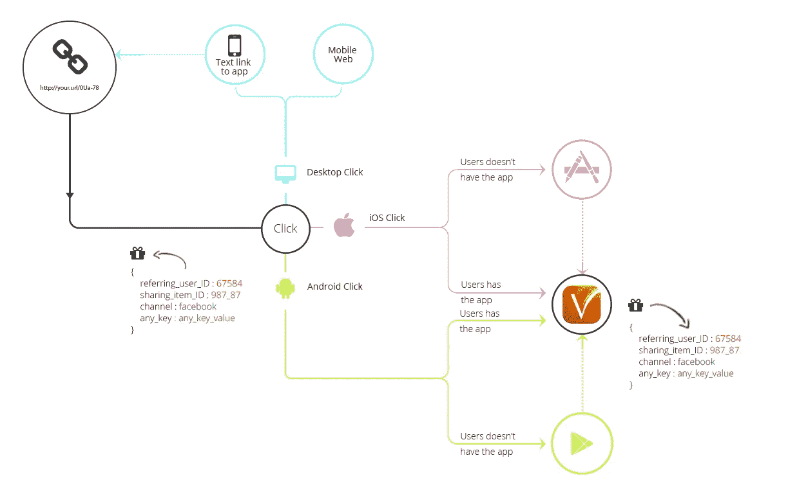

除了简化路由过程之外，远程实施路由逻辑(而不是在每台设备上实施)还有其他一些优势:

1.  可以在用户通常会从视野中消失的地方跟踪他们(例如，当通过应用程序或 Play 商店时)。最常见的例子是“延迟深度链接”，或者直接链接到尚未安装的本地应用程序中的一段内容的能力。
2.  链接可以更短，因为链接地址是存储在远程服务上的一组数据参数的唯一键。换句话说，你不再需要把所有的链接数据和行为控制信息*塞进链接本身。*这使得“上下文深度链接”变得非常简单，或者说，这种跟踪功能可以跟踪链接被点击的位置、最初共享链接的人，以及除链接目的地之外几乎无限量的其他自定义数据和跟踪参数。

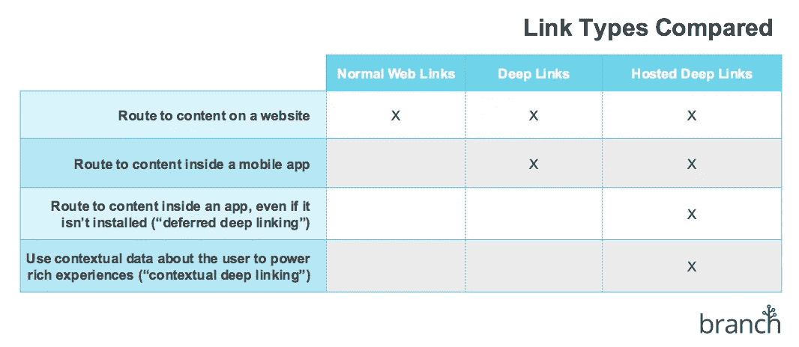

远程服务还负责创建链接。这包括接受一组数据键——每个平台上的内容位置、行为控制参数、跟踪和显示配置，以及其他自定义数据——并返回引用它们的链接地址。然后，该链接在任何地方都有效，如果您为每项内容传递一个系统范围内的唯一 id，当多个链接都指向同一内容时，甚至可以进行重复数据消除以确保数据完整性。

## 第 2 部分:本地客户端模块

一旦远程服务确定了哪种体验对访问者来说是最好的，我们需要沟通接下来应该发生什么。应用程序或网站需要链接数据来了解访问者请求的内容，并且有跟踪和分析内务任务要做。所有这些都由本地模块处理，这些模块被打包成特定于平台的 SDK。

每个 SDK 都经过优化，最适合其编程语言和环境，并广泛负责以下任务:

1.  每次加载/打开应用程序或网站时，找出是否涉及远程路由服务(检查是否点击了链接)。
2.  从该链接中检索数据，并将其传递给应用程序或网站以供使用。
3.  跟踪所有这些发生的情况，并向远程服务报告，以便进行分析。

网络上的链接已经让我们习惯于期待即时响应，所以我们的新链接也应该一样:所有这些都必须立即发生，这听起来很容易，但有时可能需要仔细的编排，以便对用户保持不可见。当然，SDK 还通过在对远程服务的调用周围包装方便的编程接口来简化链接的创建。

# 系统的快照

这是我们 2014 年在[分公司](https://branch.io)开始搭建的平台。结果如何，到目前为止我们学到了什么？

**我们现在已经远远超越了“深度链接”。这是更大的事情。**

用于应用链接的 SDK 非常有意义。从来没有一个被广泛接受的、通用的方法来实现应用程序深度链接，所以这是一个全新的领域，[分公司现在有一个适用于每个主要平台的 SDK 和开发工具包](https://developer.branch.io)。另一方面，web 链接已经“工作正常”，所以虽然 Branch web SDK 在技术上*可以*用作路由到网站的独立方法，但使用混合方法和标准重定向规则几乎总是更好。从远程链接服务返回的任何数据然后被用于增值而不是主要导航。

至于远程链接服务，Branch 确实使用了远程后端来完成大部分繁重的工作，但是在实践中，我们经常不得不依靠本地 web 浏览器来实现“最后一英里”功能。即使对远程服务的支持最终被直接内置到设备操作系统中，通过 web 浏览器进行路由对于完全向后兼容来说仍然是必要的。

最终结果是一个链接基础设施，它确实满足了上述所有八个要求，并且在几乎所有情况下都比其他任何可用的东西都更好。Branch 平台现已被超过 11，000 个活跃应用广泛采用，包括[业内大多数顶级应用](https://branch.io/partners/)。

但是我们学到的最令人惊讶的事情是事情会有多少种出错的方式。苹果和谷歌都试图假装移动深度链接是一件简单的事情。这是一个复选框，“很好拥有”的特性，可以通过遵循每个平台的开发人员文档中的一些指南来实现。不幸的是，这与事实相去甚远，更重要的是，它忽略了问题的真正规模:如果链接要在任何地方使用，它们就需要在任何地方工作。只有通过大量痛苦的实验，这一目标实现的真正复杂性才会变得清晰。

首先，有许多相互竞争的移动深度链接标准，它们都具有不同的功能和实施要求:

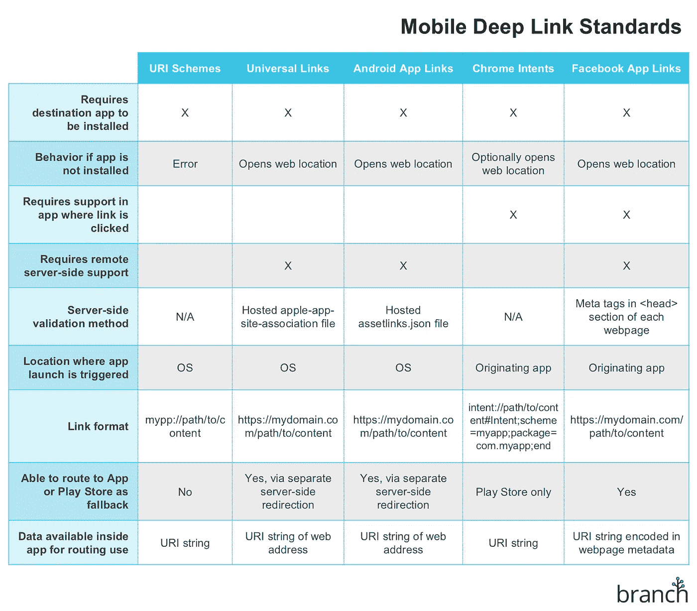

*注:iOS 和 Android 加在一起* [*控制了 99.3%的移动市场*](https://www.statista.com/statistics/266136/global-market-share-held-by-smartphone-operating-systems/) *。正因为如此，Branch 对其他平台的支持非常有限，为了简单起见，这里省略了它们。*

当然，这些标准中没有一个是每个平台或操作系统版本都支持的:

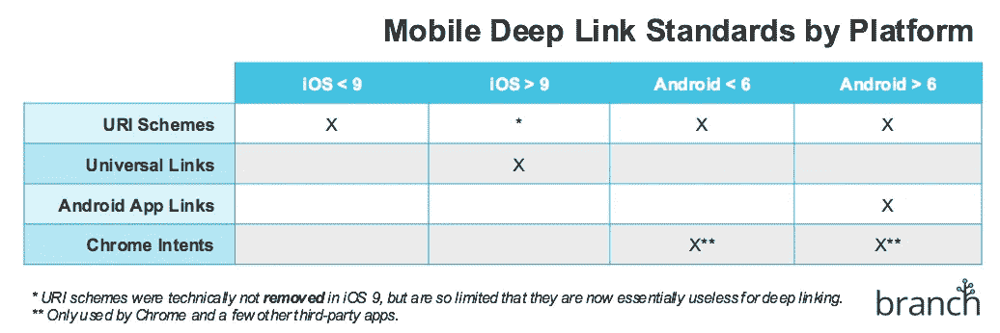

脸书发明了一个开源的深度链接标准，实际上显示了它的前景，然后又完全抛弃了它，这值得特别的表扬:

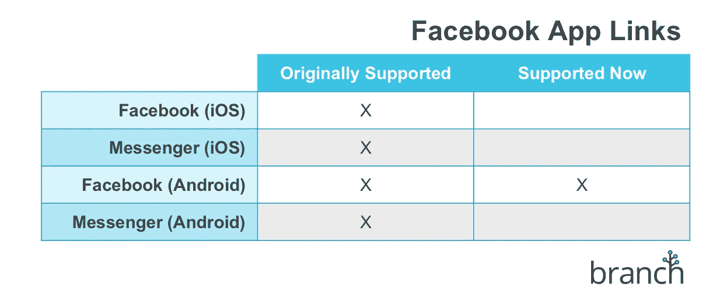

即使在每个平台中，每个网络浏览器做的事情也不同。这很重要，因为大多数链接点击仍然发生在浏览器中，并且每个链接路由系统至少在一些核心功能上依赖于浏览器:

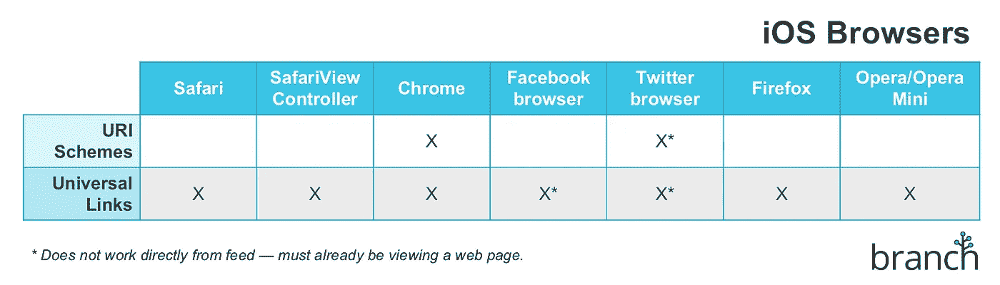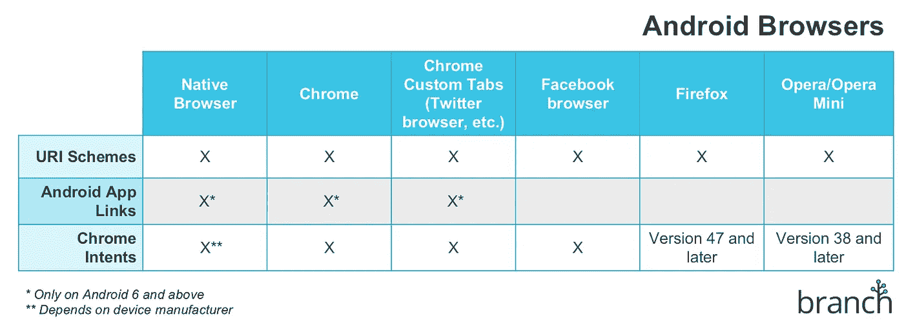

网络浏览器范畴之外的事情变得更加混乱。如此多的其他应用程序能够打开链接，试图生成一个完整的列表将是一项不可能的任务，但这里有几个值得注意的亮点:

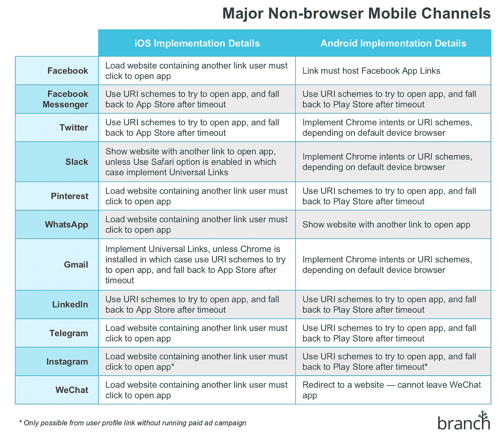

# 建立内部链接的困难

> 你会希望你的应用链接成为世界上最大的移动内容索引的一部分。

首先，构建一个能够适应所有这些边缘情况的链接系统是一项很大的工作。在 Branch，我们的团队花了所有醒着的时间专门研究这个，我们已经知道细节决定成败。

例如，如果你在所有电子邮件中添加了 app 深度链接，却发现你的退订链接需要转到每个平台的网页上，该怎么办？现在你的电子邮件比以前更糟糕了。即使基础设施建成了，生态系统的变化也是如此频繁，以至于没有任何东西可以在未来“正常工作”。跟上不断变化的标准是你不想要的全职工作，因为你已经有更令人兴奋的事情要做了。

但更重要的是，还有一个关键的最后一块我们还没讨论:[搜索](/swlh/the-war-for-mobile-search-a118f0e31c37#.wc9d5ivwp)。应用程序内容不会出现在网络搜索中，谷歌开发的最佳解决方案包括(再次)将应用程序和网站更紧密地捆绑在一起。随着应用生态系统的不断发展，这不可能是我们解决内容可发现性问题的最佳答案。就像我们大多数人不假思索地使用谷歌进行网络搜索一样(有多少其他搜索引擎已经成为自己的动词？)，你会希望你的应用链接成为世界上最大的移动内容索引的一部分。这个指数是分支的，每天都在增长。

不管是好是坏，[本地移动应用的时代已经到来](http://www.wsj.com/articles/the-web-is-dying-apps-are-killing-it-1416169934)。但是任何进步都是有代价的，向应用的转变意味着链接——互联网的核心概念——已经倒退了一大步。作为开发者，我们有责任找到一个解决方案来恢复网络的开放性，否则应用程序将注定永远生活在有围墙的花园里。

# 附录:什么会出错？

这是对我们在网络上处理链接的方式的一个非常基本的调整，所以当然有一些合理的反对意见需要解决。

## 如果服务中断了怎么办？我会不知道把我的用户送到哪里去！

这可能是使用集中式系统进行链路路由的最大风险。但在现实中，我们已经依赖远程服务，如 DNS 和 CDNs 的大部分现代互联网。这些系统的好处大于风险，链接成功率超过 99.9%(意味着每 1000 次尝试中不到一次失败)是完全可以实现的。

## 如何在没有活动网络连接的情况下生成链接？

当发生这种情况时，无论是由于网络拥塞还是仅仅因为不需要额外的网络调用，所有的链接数据都可以被编码成一个长格式的 URL，然后在第一次加载该链接时被传递给远程服务。结果是一个更长的链接地址，但行为相同。

## 缩短的链接网址更难阅读。

网络链接的一大优点是用户看到的地址通常遵循一个**路径/到/内容**结构。事实上，这是如此普遍，以至于[将其作为最佳实践](https://moz.com/blog/15-seo-best-practices-for-structuring-urls)。这种结构最初反映了网站托管服务器的底层文件系统，但随着 Bit.ly 和 Goo.gl 等 URL 缩写服务的兴起，这种结构已经开始瓦解。Branch platform(以及 Firebase Dynamic Links 等山寨尝试)已经使用了类似的短 URL 方法，因为无法保证移动应用程序内的内容将与相应网站的结构相同。这将链接从任何单一平台的技术实现中解放出来，但是没有什么可以阻止将结构构建到链接的地址中，并且如果需要，分支系统已经允许定制这些地址。

## 这与通用链接和应用程序链接有什么关系？

尽管苹果和谷歌打算让这些标准更紧密地联系应用和网站——这与注重灵活性的综合链接基础设施的目标相反——但很容易将它们纳入系统。出于我们的目的，它们作为预授权的快捷方式来加速用户体验。

> [黑客中午](http://bit.ly/Hackernoon)是黑客如何开始他们的下午。我们是 [@AMI](http://bit.ly/atAMIatAMI) 家庭的一员。我们现在[接受投稿](http://bit.ly/hackernoonsubmission)，并乐意[讨论广告&赞助](mailto:partners@amipublications.com)机会。
> 
> 如果你喜欢这个故事，我们推荐你阅读我们的[最新科技故事](http://bit.ly/hackernoonlatestt)和[趋势科技故事](https://hackernoon.com/trending)。直到下一次，不要把世界的现实想当然！

