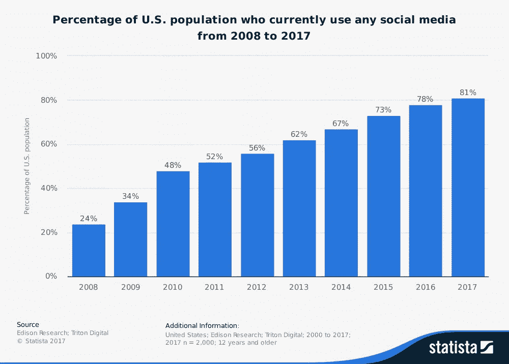
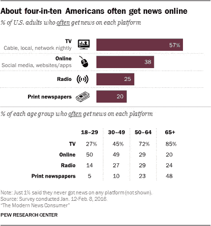
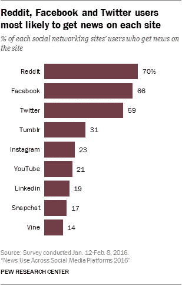

# 中立宣言——作为宪法权利的互联网自由

> 原文：<https://medium.com/hackernoon/the-declaration-of-neutrality-internet-freedom-as-a-constitutional-right-1788da8a7449>

## 我们的言论和新闻自由是如何建立在互联网中立的基础上的

[The Wired](https://www.wired.com/2017/05/congress-not-fcc-can-fix-net-neutrality/)

# 宣言

> 我们认为这些真理是不言而喻的，互联网生来平等，其创造者赋予它某些不可剥夺的权利，其中包括生命权、自由权和追求幸福的权利。

互联网是一个活的言论自由的生态系统，在这里所有的内容都可以被创造和分享。它是一种手段，通过它我们可以与我们所爱的人交流，分享想法，嘲笑猫 gif。我们可以创建、访问和共享应用程序和服务——接触到世界各地的受众。更重要的是，我们可以规划自己对幸福的追求。

我们可以去我们想去的地方，消费任何东西——我们有自由和个人自由来选择我们想看或不想看的东西。

> 从定义上来说，自由是不受控制、干涉、义务、限制和阻碍的自由。这是一种根据个人选择去做、思考、说话的权力或权利。

正是有了这种自由，我们才能作为一个国家进行创新，传播新技术，分享变革性的想法。

# 第一修正案

> 国会不得制定关于确立宗教或禁止自由信教的法律；**或剥夺言论自由，或新闻自由**；或者人民和平集会并向政府请愿以平反冤屈的权利。
> 
> ——美国宪法第一修正案

在这个互联网成为大多数美国人主要交流方式的时代，保持**中立变得更加重要。这种中立性确保了我们可以自由地获取我们想要的内容，并且新闻媒体在创作和传播自己的内容时不会受到限制。**

在一个非中立的世界里，你的互联网服务提供商(威瑞森和康卡斯特等互联网服务提供商)可以控制你访问哪些网站和应用程序。他们可以让你为使用谷歌搜索支付更多费用，但让雅虎免费(对不起，雅虎..).它们可以阻止你从你喜欢的新闻来源获取信息..他们可以阻止你阅读这篇文章。

> 如果没有一个中立的互联网，你的自由和解放将成为你愿意花多少钱来获取你想要的东西的函数。

三十年前，有人可能会说，限制互联网接入不会从实质上剥夺媒体或人民创造或获取信息的权利。在 20 世纪 80 年代，我们仍然依赖电视、印刷新闻、电话和直接的口头传播。2017 年，这种情况发生了巨大转变。互联网……世界各地的电线和电脑的连接已经成为交换和获取信息的主要工具。

当你限制了获取信息的自由，你就限制了我们的言论自由和新闻自由。

下面的数字显示了互联网作为一种演讲、交流和新闻的手段已经变得多么普及和重要:

## 81%的美国人使用社交媒体(2017 年)

## 40%的美国人从网上获取大部分新闻(2016 年)

## 70%的 Reddit 用户、66%的脸书用户和 59%的 Twitter 用户最有可能从每个网站获取新闻(2016 年)

# 互联网自由可能很快就会消失

这不是一个政治问题，而是一个基本的宪法问题。这是一个影响我们每个人的问题。

我们在网上做什么，我们给谁投票，我们访问什么网站…所有这些都不重要。我们都是互联网用户，我们都属于这个由人和物组成的互联网络。

而且，我们为连接付费。我们为与一切事物联系的自由付费。一旦这一点被剥夺，那么我们就在为能够看到别人想让我们看到的东西，或者我们能够负担得起的东西而付费。

我们认为这种自由是理所当然的..而 [2017 年可能是它最后一年](https://www.nytimes.com/2017/11/21/technology/fcc-net-neutrality.html)。

— —

**了解更多并采取行动**

*   纽约时报——联邦通信委员会计划废除网络中立
*   [网络中立之战](https://www.battleforthenet.com/)
*   商业内幕— [网络中立解释](http://www.businessinsider.com/net-neutralityfor-dummies-and-how-it-effects-you-2014-1)

— —

*Justin 每周出版设计、技术和生活方面的启发性内容。关注他上* [*中*](/@justindesign) *了解更多。*