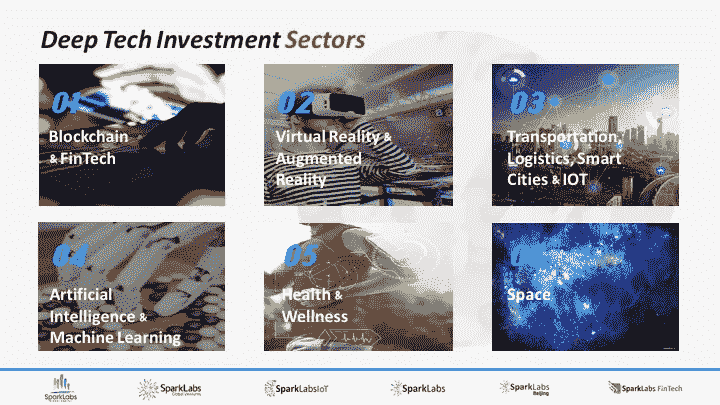
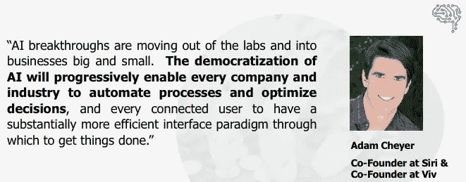
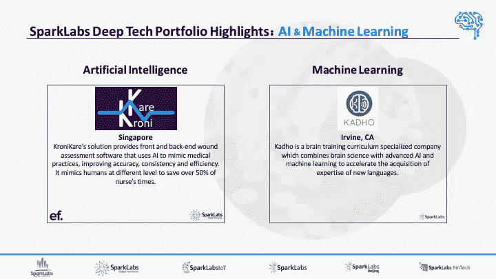
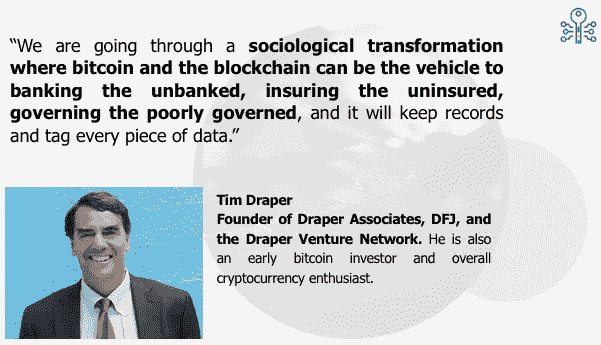
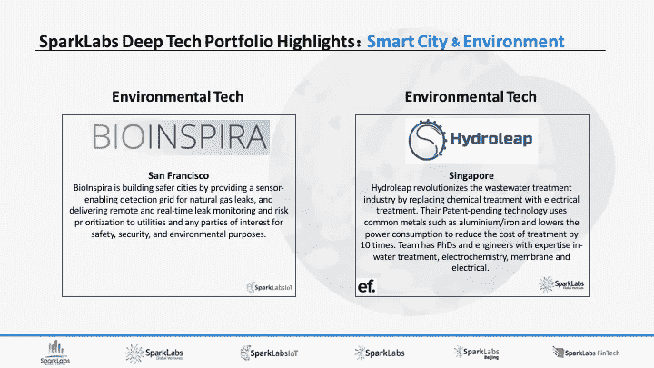
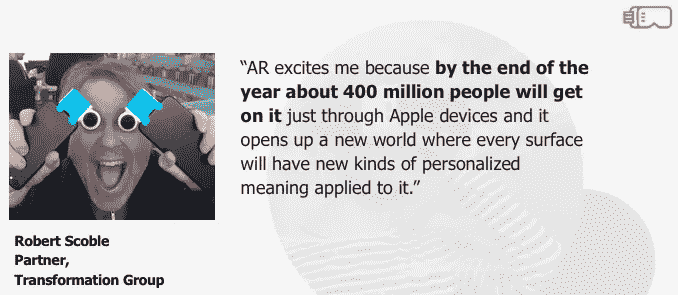

# 深刻的技术革命:快速变化即将来临

> 原文：<https://medium.com/hackernoon/the-deep-tech-revolution-rapid-changes-coming-to-a-future-near-you-2e41b37c532e>

由 [SparkLabs 集团](http://www.sparklabsgroup.com)的联合创始人[吉米·金](https://medium.com/u/e51309d3df24#face04)是 [N3N](http://www.n3n.io/) 的联合创始人和创始首席执行官，这是思科在全球范围内的第一笔工业物联网投资。

Read our research report [here on Slideshare](https://www.slideshare.net/bernardmoon/sparklabs-group-deep-tech-sector-overview)

凭借这些积累的知识，我们试图向你提供我们对人类灭亡的预测，这是由于人工智能的快速崛起，并伴随着一本方便的未来指南，以导航通过后启示录世界。想想[《逃离纽约》](http://www.imdb.com/title/tt0082340/)遇上[《银河系漫游指南》](https://www.amazon.com/Hitchhikers-Guide-Galaxy-Douglas-Adams/dp/0345391802)或者[《疯狂的麦克斯》](http://www.imdb.com/title/tt0079501/?ref_=nv_sr_3)遇上[《坎特伯雷故事集》](http://www.sparknotes.com/lit/canterbury/)但是我们的其他伙伴不想在我们世界的阴谋爱好团体的口袋里制造混乱。

相反，我们决定创建一个易于阅读的(*与我们最初的想法*相比，非常无聊)概述，让人们在这个涵盖许多快速变化的技术领域的广泛类别中加快速度。这是我们的完整报告，以下是我们目前了解到的一些要点。

## **人工智能&机器学习**

人工智能的影响将体现在许多领域。这项技术将直接和间接地影响我们业务和日常生活的许多方面。

We appreciate Adam Cheyer and others for providing their direct insights for our research report!

人工智能对工作场所的影响非常有趣，因为我们相信它将加速权力从西方向东方的转移。在亚洲，中国和新加坡认识到人工智能将带来的巨大影响，两国都在投入数十亿美元对劳动力进行再教育，培训数百万人学习人工智能和机器学习，为未来做准备。这将导致比西方更多有才华的人工智能研究人员和开发人员，为亚洲的人工智能开发和教育开辟更多的可能性。人工智能的下一个重大突破完全有可能来自硅谷以外，就像在伦敦建造的 DeepMind 一样，因为硅谷继续低估了人工智能研究在世界其他地区的快速发展。

KroniKare is from our partnership with EF Singapore as their exclusive co-investment fund. Kadho went through the 9th batch at SparkLabs Seoul.

## **区块链&加密货币**

三年前，我们一直是区块链的忠实信徒，但对加密货币犹豫不决，直到我们投资了斯德哥尔摩的加密货币交易所 Cryex 和韩国领先的比特币汇款公司 T2 Sentbe。我们相信区块链是革命性的，它将改变和颠覆许多行业，因为它比今天的现有系统更加安全、透明和高效。随着区块链的成熟，金融机构、能源、安全、政府、[医疗保健](https://github.com/WebOfTrustInfo/rebooting-the-web-of-trust-spring2017/blob/master/topics-and-advance-readings/Using-an-IP-blockchain-to-enhance-global-responsiveness-to-infectious-disease-outbreak.md)以及许多其他领域都将被打乱。

Read our research report [here on Slideshare](https://www.slideshare.net/bernardmoon/sparklabs-group-deep-tech-sector-overview)

今天，我们相信加密货币也将是革命性的，它们不是郁金香、豆豆娃或宠物石。沿着这些火箭船乘坐会有价格调整吗？是的，但是比特币、以太坊和其他加密货币已经存在并将改变社会。货币的定义、货币在全球的流动以及我们的信任(向更好的方向)都将因加密货币而改变。

## **工业物联网**

总的来说，我们认为物联网市场对创业者来说是一个巨大的机会。我们已经从全球种子基金 [SparkLabs Global](http://www.sparklabsglobal.com) 投资了 7 家物联网初创公司。这些都是面向消费者的硬件公司。虽然我们仍然对消费领域感到兴奋，但我们确实看到了工业物联网市场的更大潜力，反映这一趋势的是我们的第一批[物联网和智能城市加速器](http://www.sparklabsiot.com/en/)。16 家公司中有 13 家是工业物联网公司，其中许多是非硬件初创公司。

Read our research report [here on Slideshare](https://www.slideshare.net/bernardmoon/sparklabs-group-deep-tech-sector-overview)

有超过 130 亿台设备，其中大多数都连接到企业，我们认为创造真正的收入和价值只是时间问题。总体而言，工业物联网市场仍处于早期阶段，各公司仍在试图找出商业模式和稳定的收入来源。许多公司正在收集数十亿个数据点，但问题是这些是否是正确的数据点，公司应该如何处理这些信息，以及这些数据积累背后的商业模式是什么？

## **VR & AR**

当我们焦虑地等待苹果推出增强现实时，我们的团队一直是虚拟现实和增强现实的支持者，但视野更开阔。我们认为内容没有跟上技术的发展。

我们不认为这将是类似于视频点播(VOD)的漫长道路，但它将需要更多的几年时间。时代华纳于 1994 年推出了全业务网络实验，视频点播花了十多年时间才真正成为一种无处不在的服务，但视频点播面临的问题正好相反。他们拥有所有的内容，但这项技术太昂贵，无法大规模实施。当谷歌在 2006 年收购了 YouTube，网飞在 2007 年推出了视频点播服务时，视频点播真正进入了大众市场。

Thanks, Robert, for your insights for our report and continued evangelism of all things tech!

除了一些笨重的耳机之外，VR & AR 的技术几乎无处不在，但主要问题是有足够吸引人的内容。今年 6 月发布的苹果 ARKit 和即将发布的公告可能是 AR 超越口袋妖怪 go 时尚的转折点。

您可以在思考一些问题的同时，在这里查看我们的研究报告[中的其他部门。你在身边看到了哪些令人惊叹的技术和创新？您认为哪种技术将对我们的世界产生最大的影响？通过这些新技术，人们的生活将如何改善？请随时留下评论。谢谢你！](https://www.slideshare.net/secret/47Cg2TE83lQxXu)

*伯纳德·穆恩和弗兰克·米汉是 SparkLabs Group* *的联合创始人和合伙人。*