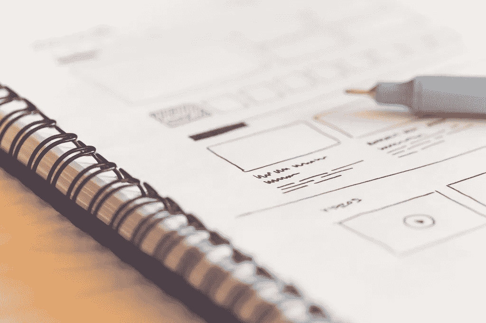
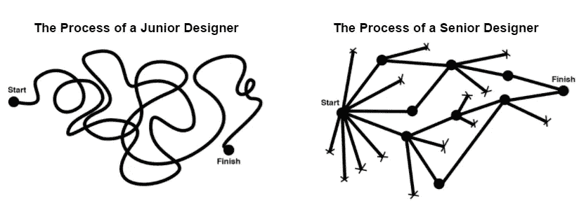

# 虚拟现实、增强现实和磁共振的设计过程

> 原文：<https://medium.com/hackernoon/the-design-process-in-vr-ar-and-mr-b34b2247520f>

*注意，我下面的想法不代表我公司的观点。*

Credit: [https://perzonseo.com](https://perzonseo.com)

最近，我一直在与众多的[设计](https://hackernoon.com/tagged/design)团队合作，探索虚拟现实(VR)、[增强现实](https://hackernoon.com/tagged/augmented-reality) (AR)和混合现实(MR)。不管设计经验如何，大多数团队都有一个有趣的故事:

他们会从之前的设计过程开始，无论是制作软件还是游戏；然而，在他们创建了设计文档，模拟了线框，并开始实施之后，**没有任何东西起作用**，因为 VR/AR/MR 对任何人来说都太新了，以至于无法理解什么样的设计可行或不可行。在这一点上，大多数团队得出结论，“**让我们尽快开始代码原型化，并从那里开始迭代**”

许多团队甚至会指出精益创业方法论*中的“ [**构建-测量-学习**](http://theleanstartup.com/principles) ”循环，试图证明为什么他们的设计过程变得越来越短是一件好事，然而他们实际创造一个引人注目的产品所花的时间却越来越长。*

在某些方面，团队没有抓住重点。由于“嗯，我们不知道它是否能工作，直到我们在硬件上测试它”的原因而跳过了早期的设计阶段，设计团队现在跳过了整个“**构建-测量-学习**”周期，这可能发生在**产品开发的纸上设计阶段**。

产品设计师朱莉·卓(Julie Zhuo)曾经画出这些图像来描述初级设计师和高级设计师之间的区别:

通过直接进入代码原型，团队的行为就像初级设计师一样，经常要求工程团队在线索出现时追踪线索，直到他们有希望找到解决方案。为了解决这个问题，我的设计团队一直在遵循一些简单的技巧，以确保我们总是在学习**如何**为 VR/AR/MR 设计，并且随着时间的推移，已经减少了创建一个引人注目的产品所需的迭代时间:

1.  **做预测。**当你第一次开始在 VR/AR/MR 中设计时，当你开始用代码实现它们时，你的设计很少会起作用。没关系。然而，鼓励你的设计团队仍然在纸上设计文档上创造和迭代，并且*做出预测*。写下**为什么**这个设计在 VR/AR/MR 中可能行得通**为什么**可能会失败？如果失败了，**我们可以尝试哪些替代设计？写下并创建这些假设是很重要的，这样当你在代码中用*做*原型时，你可以测试并与团队讨论结果。随着时间的推移，您的设计团队将学会如何做出更好的预测，并且纸上设计将变得越来越有价值，因为您将需要更少的代码迭代时间(这可以说总是比纸上设计迭代更昂贵！)**
2.  **学习新花样。**对于设计师来说，比以往任何时候都更加重要的是，要了解更多关于其他领域的知识，如[视觉注意力](https://en.wikipedia.org/wiki/Attention#Selective_and_visual)，社会心理学，甚至[舞台魔术](https://www.wired.com/2009/04/ff-neuroscienceofmagic/)，以了解为 VR/AR/MR 设计的细微差别。VR 最常见的挑战之一是设计师不再控制“相机”，用户可以随意查看。然而，通过学习**视觉注意力**和**舞台魔术**，你可以了解人类大脑是如何工作的，并加以利用。例如，周边视觉中的**运动开始**(移动的东西)将倾向于**吸引注意力**。你可以用这样的技巧将用户的注意力引导到你想要的地方。
3.  发展你的线框图。传统上，设计团队可能会在 2D 使用 Sketch 或 Axure 等应用程序制作线框；然而，这些工具是为基于*屏幕的*体验而设计的，通常是为网络或移动体验而优化的。对于一些团队来说，简单地用这些工具为 VR/AR/MR 创建线框限制了他们的设计思维，导致体验感觉非常类似于 web 或移动应用程序。通过*如何*创建他们的线框，推动你的设计团队更有创造力。例如，一个团队开始为体验中的所有东西制作纸板道具，他们的团队成员在互动中扮演角色。看着一个团队成员拿着一个纸板道具(比如说，一个 UI 菜单对象)，在另一个团队成员自己在房间里走动时，不得不在房间里走动，这是非常愚蠢的——但是，这重新创造了体验*在 VR 或 MR 中的真实感觉*,而不是 2D 线框。像 Sketch 和 Axure 这样的工具创建专门用于 VR/AR/MR 的线框的功能只是时间问题；但是，现在，推动您的团队尝试不同的解决方案，更好地模拟用户的实际体验。
4.  **少即是多**。许多设计团队对他们正在探索的新空间非常兴奋，以至于他们一直在想，“*如果..？*“每当他们想到一个新的新奇机制或功能时，他们都希望将其融入当前的产品设计中。在项目的每一点上，总是要再看一眼你的特性列表，并且思考，"*这对最终用户真正增加了多少价值？* " " *这是我们整个体验中只用一次的东西吗？*“在大多数情况下，你最好少用一些功能，只选择那些最大化用户价值的功能。

希望这些步骤能够让你的设计团队减少在 VR/AR/MR 中创造引人注目的产品所需的迭代时间。这是一个令设计师兴奋的时刻，每个人都在努力成为创造下一个*媒体*定义体验的团队；然而，仅仅因为它是未探索的空间并不意味着我们必须抛弃我们已经了解的关于 ***如何*** 我们做设计的一切。

# 关于作者:

**杰弗里·林博士**

Jeffrey Lin 目前是脸书领先设计团队 AR/VR 体验的设计总监，该团队正在为第一代虚拟和增强现实内容铺平道路。他之前是 Magic Leap 的设计总监，也是 Riot Games 的获奖电脑游戏《英雄联盟》的首席设计师，Riot Games 是《财富》杂志(Fortune)评选的最适合为 T3 工作的公司之一。他也是 Valve Software 的研究科学家，屡获殊荣的个人电脑游戏《T4》门户 2 的开发者，以及 Steam 平台的创造者。他在华盛顿大学获得了认知神经科学博士学位，并得到了霍华德·休斯医学研究所的资助。他的设计作品被刊登在 *Wired 杂志、麻省理工学院技术评论、The Verge、科学美国人*、*时代健康&科学、*和 *Re/code* 上。他的研究已经在许多同行评审期刊上发表，包括*自然*。