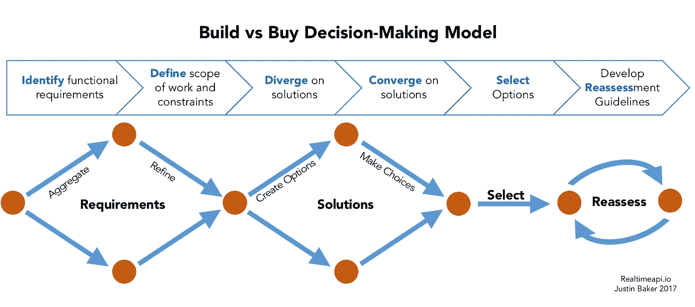

# 面向开发人员的 6 步构建与购买模式

> 原文：<https://medium.com/hackernoon/the-developers-guide-to-building-and-buying-services-6187e9fb3168>

## 定义客观选择自主开发或购买的解决方案的流程

对于几乎每个功能或架构应用程序组件，都有过多的“即服务”产品。我们将基础设施视为[服务](https://www.computenext.com/blog/when-to-use-saas-paas-and-iaas/) (IaaS)、后端即服务(BaaS)、SaaS、平台即服务..一个新的“aaS”似乎每天都在增加。

所有这些服务有什么共同点？嗯，他们雄心勃勃地承诺给你，工程师，(1)更多的自由，专注于你的核心产品，(2)更快的上市时间，以及(3)复杂和可重复的工程操作的生产就绪解决方案。

有时候就是这样。有时候不是。本指南的目的是提供一组合理的客观标准来评估您是否应该构建或购买特定的服务。

# 什么是构建？什么是购买？

构建并不一定意味着你正在从零开始。这意味着您正在结合定制代码、开源库和个人/社区的专业知识来构建您的用例的解决方案。这个解决方案是您将在内部设计、构建、运行、维护和扩展的东西。

另一方面，购买并不一定意味着您正在为您的用例购买端到端、开箱即用的解决方案。它更准确地代表了购买一个定义好的服务，这个服务为您的用例增加了近乎即时的价值。通常，服务本身的可行性将由卖方保证，您不需要设计和构建服务本身。但是，根据所购买的服务类型，您可以选择在内部运行和扩展。通常，您会将运行、维护和可伸缩性的工作交给销售人员。

# 开发者思维

在我们继续之前，让我们重新调整一下心态。

许多开发人员都有很强的自我意识，这通常是一种授权属性。强烈的自我给了开发者信心去克服复杂的障碍，一次专注几天甚至几周，并培养全新的产业。然而，合理的信心和不合理的信心之间是有细微差别的。

“我可以在 ____ 天内建造 ____ 个！”
“哈！我可以在一个周末建造一个更好的 ____”
“这个好贵。我只是要建造它。”

我们经常在开发论坛、聚合器如 Reddit 和 HackerNews 上，以及在我们的日常互动中看到和听到这些评论。如果我们不说，那么我们中的一些人可能会不时地想到它。嘿，有时我们可能是对的，但通常情况下，我们最初的自我驱动的反应使我们远离了应用于我们一般编程实践的客观标准。

在评估构建什么与购买什么，或者我们选择哪个比例时，我们必须重新调整心态，尽可能开放客观地对待我们的解决方案，这一点非常重要。除了纯粹主义者，没有人关心我们是否能够从零开始构建我们的产品，或者我们是否巧妙地将一系列购买的解决方案集成在一起。人们关心的是我们的产品是否有效，是否能给客户带来非凡的价值。

在构建与购买决策过程中，我们将回答这个问题:“我们如何快速、高效、谨慎地向客户交付卓越的价值？”

# 构建还是购买决策模型

# 第一步——确定并分类产品的功能范围

你的团队的任务是建立一个电子商务平台，允许用户对产品投赞成票和反对票。那么，你的产品的功能和架构特点是什么？

**功能性**

*   市场服务
*   投票服务
*   产品展示服务
*   库存管理服务
*   交易服务
*   买方、卖方和管理员帐户管理服务
*   搜索、过滤、提炼服务

**建筑和工艺**

*   数据库
*   服务器
*   负载平衡器
*   开发环境/版本控制
*   持续集成/交付渠道
*   REST /实时 API
*   前端框架
*   部署控制/ AB 测试

虽然这些不是全面的功能集，但重要的一点是，核心产品功能(市场、投票)和必要的系统和流程架构(服务器环境、CI/CD 管道)之间有明显的区别。有些特性是您的产品所独有的，有些架构特性几乎存在于每个现代应用系统中。

您的工作是识别这些特性中哪些是您的平台专有的，哪些是可复制的经验证的解决方案。为此，请询问以下问题:

*   使我的应用程序独一无二的专有核心特性是什么？
*   我的平台脚手架需要什么架构服务？
*   我的理想发展管道是什么样的？

请记住，我们还没有解决方案，也没有决定是构建还是购买。我们正在对产品的功能进行识别和分类。

# 步骤 2-定义工作范围，并根据约束条件进行协调

根据您在步骤 1 中的特性分类，是时候定义构建每个特性的工作范围了。

首先，逐项列出每个功能的详细功能并确定优先级:

*   特性可行的最小功能范围是什么？
*   该功能的理想功能范围是什么？
*   这是我现在需要的功能吗？还是可以等？

其次，对于每个功能，回答以下最小和理想功能范围的构建问题:

*   我有多少开发人员资源可以用来构建这个特性？保持此功能？
*   我可以利用任何领域专家来帮助设计这个特性吗？
*   我的团队中有人以前做过这个吗？
*   设计(A)，构建(B)，测试，部署(D)，维护(E)这个特性需要多少时间？
*   建造这个会从其他地方转移资源吗？
*   我需要雇用额外的资源吗？如果有，费用细目是什么？
*   在内部运行这个项目的基础设施成本是多少？

第三，对于每个核心功能，回答以下最低和理想功能范围的购买问题:

*   这项服务的月预算是多少？
*   我如何预测我的预算会随着时间的推移而变化？
*   我可以利用任何领域专家来帮助我评估最佳解决方案吗？
*   我有哪些开发人员资源可以用来集成和配置解决方案？
*   如果适用，我是否拥有自托管、运行、维护和扩展服务的资源？

# 第 3 步—解决方案分歧

现在我们可以吃到好东西了！在这一步中，我们不决定建造或购买什么；相反，我们正在汇总一份选择清单。

首先，搜索互联网，获得推荐，并评估解决方案生态系统。其他团队有没有成功建造过这个？他们买成功了吗？有哪些恐怖又成功的故事？

其次，创建一个构建与购买对比矩阵。请务必记下每月、基础设施和长期维护成本。注意每个构建或购买解决方案所需的总前期和持续时间(构建/购买混合也很好！).

# 第 4 步—解决方案融合

开始缩小你的选择范围。

请记住，购买并不意味着开箱即用的即时魔术。购买总会产生成本:

*   沙盒和初步技术审查
*   集成和设置
*   配置和微调
*   业务培训和工作人员入职

类似地，构建并不一定意味着一切都是从头开始，但它确实意味着您将承担持续维护、扩展和调试的成本。您还需要培训员工并开发新的操作流程。

# 第 5 步—建造或购买或两者皆有

为每个功能选择主要和次要解决方案选项。这样，如果主要解决方案不成功，您将有一个备用计划。让您的团队参与选择过程并使选择标准透明是绝对重要的。

# 第 6 步——制定重新评估指南

您为产品的第 1 天选择的解决方案可能不适合第 600 天的产品。这是可以的，但是我们必须能够预测和预防任何未来的扩展问题。为此，设置定量和定性基准，以触发构建与购买规模的重新评估。例如，我们相信我们当前的架构解决方案允许我们轻松处理多达 50 万个并发连接，但我们当前的增长模型预测 8 个月内会有 200 万个连接。当我们开始接近 300，000 大关时，这将触发另一个构建与购买评估，这样我们就可以先发制人地解决大规模问题。这种重新评估应包括:

*   在过去的 X 个月里，我们对产品的需求了解了什么？
*   什么比预期的更困难？什么更容易？
*   我们的资源和知识库发生了怎样的变化？
*   我们产品的核心竞争力转移了吗？
*   有什么新的更好的东西吗？

# 最后的想法——尝试你的方式

这看起来工作量很大。甚至可能需要一天或几天来评估一个特性。但实际上，当我们考虑到您产品的整个生命周期时，提前几天可以为您节省几个月的时间和大量的金钱。这几天也可能成就或毁掉你的产品。

定制您的构建与购买评估流程，以满足您组织的需求。尽管大型企业与初创企业有很大不同，但评估指标仍然非常相似。添加或删除指标，编纂一个更精细的流程，或者从头开始创建自己的流程。

无论哪种方式，重要的是要记住，建立一个成功的产品是非常困难的，所以不要给自己增加不必要的困难。让您的决策受到为您的产品选择正确解决方案的驱动，而不是为您选择正确的解决方案。

— —

*原文上*[*realtimeapi . io*](https://realtimeapi.io/the-developers-guide-to-building-vs-buying-services/)

*想保持联系？在* [*LinkedIn*](https://www.linkedin.com/in/justinabaker87/) 上加我