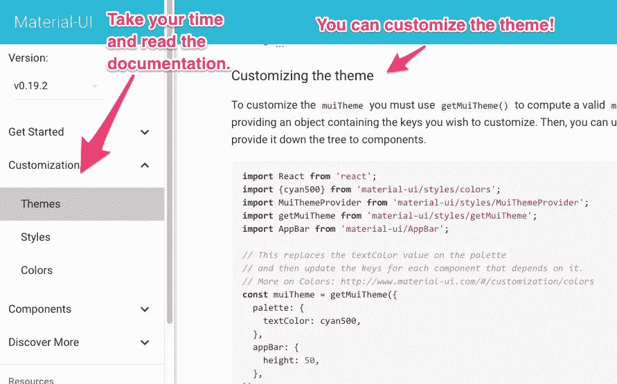

# 开发人员设计原则指南

> 原文：<https://medium.com/hackernoon/the-developers-guide-to-design-principles-1676e4aa9ea5>

在 [Radial Development Group](http://radialdevgroup.com) 我们相信代码是为人类编写的。其中很大一部分是应用程序的视觉[设计](https://hackernoon.com/tagged/design)，因为[设计](https://hackernoon.com/tagged/design)是用户体验的重要部分。

当客户有设计预算时，我们会与精心挑选的设计师团队密切合作，他们的作品是我们所喜爱的。结果棒极了。

How do you get good design when you don’t have a designer?

但是并不是所有的客户都优先考虑设计或者有预算。有些人时间紧迫，或者正在开发内部工具。在这种情况下，我们仍然希望构建专业的、用户友好的界面。那么解决办法是什么呢？

幸运的是，我们有一些实践和工具可以帮助我们确保所有的项目都符合基本的设计标准。

# 设计是关于决策的

正如 Radial 高级开发人员和联合创始人马歇尔·史密斯所说，“设计关乎决策。”决策应该是一致的。不同会让用户感到困惑。这会让他们迷路，甚至吓跑他们。但是，如何确保应用程序的一致性呢？

当我们和设计师一起工作时，我们经常会得到一份风格指南。这指定了从字体、颜色到应用程序的一般外观和感觉的元素。

如果没有设计师，我们可以使用一个 [UI](https://hackernoon.com/tagged/ui) 框架和一组选定的字体和调色板来实现一个类似的设计良好的结果，如果不是那么原创的话。

# 我们使用的 UI 框架

有几个现代的框架用于布局和用户界面。我们用过的有 Twitter 的 [Bootstrap](http://getbootstrap.com/) ，YooTheme 的 [UIKit](https://getuikit.com/) ，Google 的[Material Design](https://material.io/)via[Material UI](http://www.material-ui.com/#/)。

仅仅在项目中包含一个框架并不能立即保证好的设计。我们总是花时间去理解框架背后的设计哲学。这包括通读文档。我们花时间认真研究组件和示例。

Take the time to read through the documentation — you’ll learn a lot!

在可能的范围内，您希望使用框架提供的组件。很可能他们已经为你试图解决的问题提供了解决方案。因此，当框架已经为您解决了输入验证错误消息时，不要花费太多时间去试图弄清楚如何编写 CSS 和 Javascript 来显示这个问题。如果你发现自己试图做一些困难的事情，你可能错过了一个简单的方法，它已经在文档中。回去再看看！

当使用一个框架时，我们也建议花些时间去注意框架需要的结构。这是那些刚接触框架的人经常忽略的东西。例如，Bootstrap 需要容器元素来使用它们的默认网格系统。

# 制作您自己的主题或风格指南

之后，我们确保为颜色和字体建立一个基本的风格指南，并根据该指南设置 Sass 变量，以确保整个应用程序的一致性。许多框架还提供了提前定制主题的选项，因此即使不使用 Sass 也可以定制主题。

这些框架的优势在于它们提供的组件提供了可定制的视觉一致性——这在设计中非常重要。它们限制了开发人员必须做出的决策数量，同时还允许进行定制。最终结果？对客户或产品来说感觉独特的网站，遵循基本的设计标准，所以使用起来也很愉快。

本文由马歇尔·史密斯和斯蒂芬妮·奥格本共同撰写。

感谢您阅读[径向](http://radialdevgroup.com)博客，花点时间在这里和[推特](https://twitter.com/radialdevgroup?lang=en)上关注我们吧！