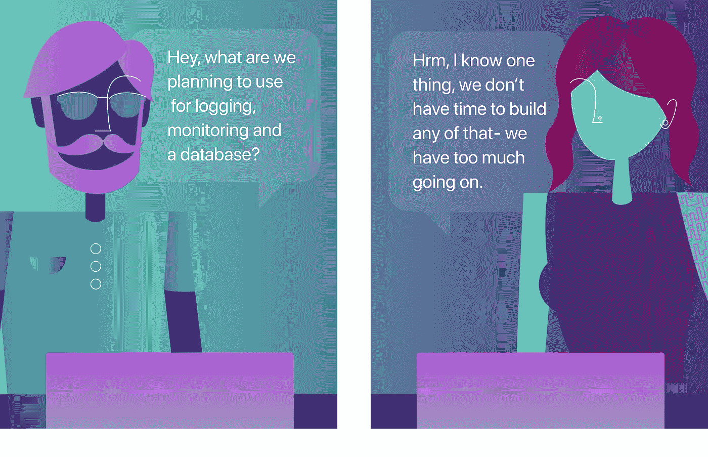
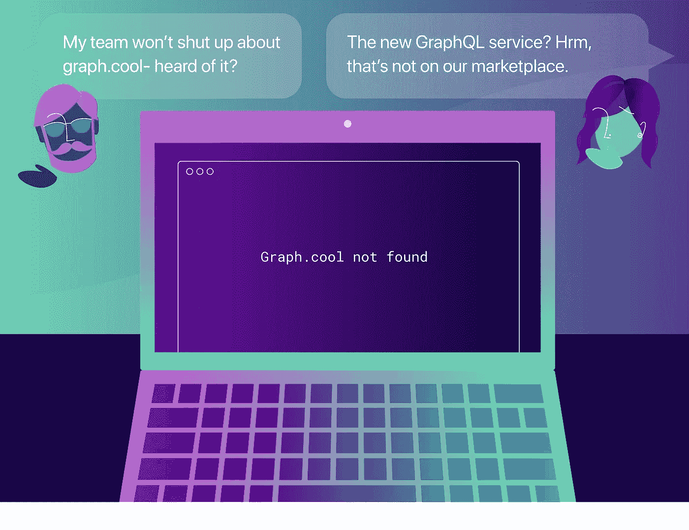
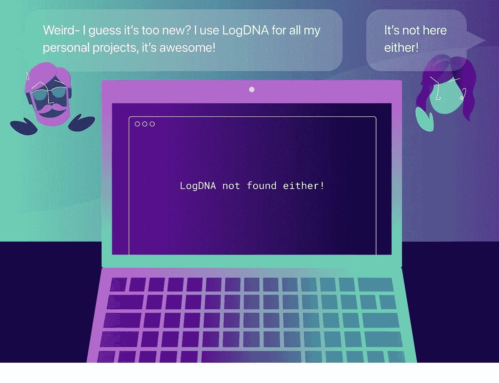
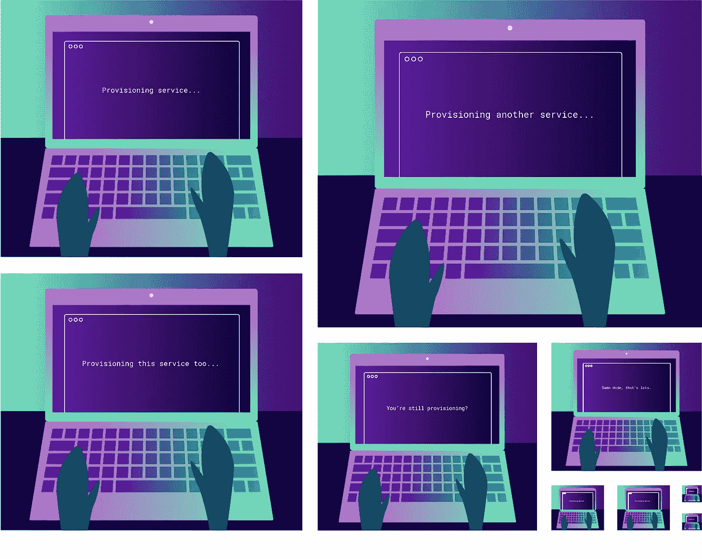
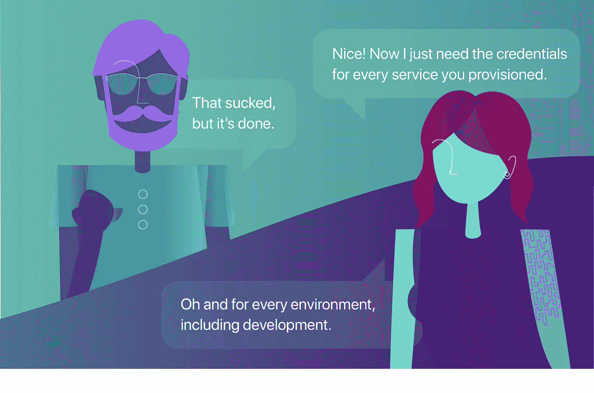
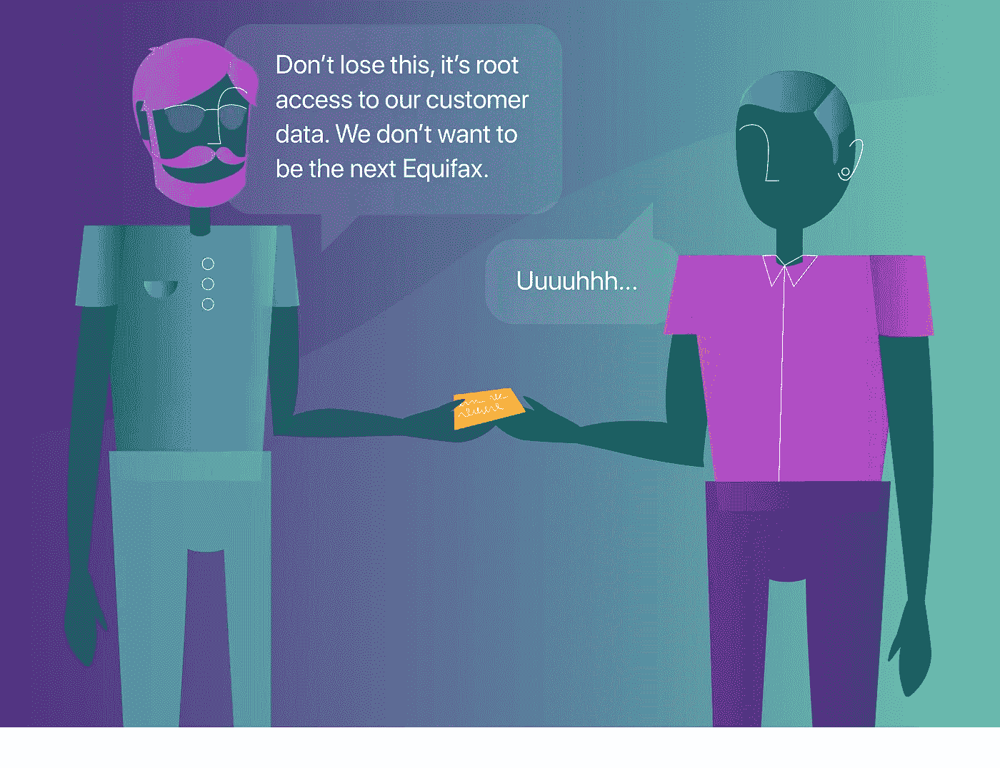

# 开发商的开放市场

> 原文：<https://medium.com/hackernoon/the-developers-open-marketplace-e11b96e27199>

很难做出令人惊叹的东西，尤其是没有合适的工具。

今天，我们使用可用的工具。如果我们在 AWS 上构建应用程序，我们选择 AWS marketplace 上可用的服务。为什么？这很简单——我们不必考虑设立新账户、与我们的团队共享服务或将服务添加到我们的应用程序中。

Manifold 让您可以自由选择*最佳* 服务、**最佳**服务，并为您提供在任何云上管理和使用这些服务所需的工具。

停止阅读漫画，去创造一些令人惊奇的东西，这将有所帮助:在我们身上使用最好的工具，应用代码 [HACKERNOON17](https://www.manifold.co/hackernoon?utm_campaign=hackernoon-q4&utm_source=hackernoon.com&utm_medium=referral&utm_content=blog-comic) 并在 [Manifold](https://www.manifold.co/hackernoon?utm_campaign=hackernoon-q4&utm_source=hackernoon.com&utm_medium=referral&utm_content=blog-comic) 上获得 25 美元的信用。

在[Manifold.co](https://www.manifold.co/hackernoon?utm_campaign=hackernoon-q4&utm_source=hackernoon.com&utm_medium=referral&utm_content=blog-comic)了解更多信息，或者在[推特](https://twitter.com/manifoldco)或[媒体](https://blog.manifold.co/?utm_campaign=hackernoon-q4&utm_source=hackernoon.com&utm_medium=referral&utm_content=blog-comic)上关注我们