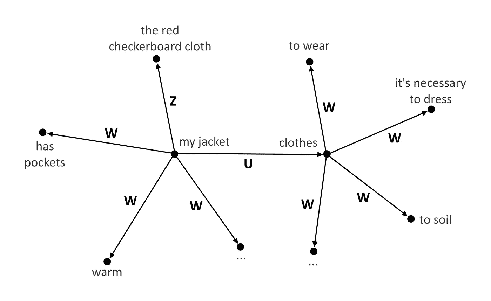

# 强人工智能的发展，通过复制人类精神的结构和过程。

> 原文：<https://medium.com/hackernoon/the-development-of-strong-ai-by-copying-the-structures-and-processes-of-the-human-psyche-3254c558ac05>

我想从 AI 那里得到什么？当然，蛋白质化合物的设计、基本反应和大气过程的计算都是非常有趣的任务。但它离我很远。我希望人工智能能够理解我，而不是简单地识别单词和执行语音命令。尽管我应该感谢后者。但我真正想要的是它能接受提示。我希望像《她》中那样被理解。

但是，我们怎么能让一台只运行“0”和“1”的机器有这样的行为呢？答案似乎相当简单——我们应该对人类的心理过程以及信息存储和处理的模式进行逆向工程。换句话说，我们应该开发一个完整的人类心理模型。

在我们已经开始开发强人工智能之后，我们找到了艾伦·图灵(1)、马文·明斯基(2)和雷·库兹韦尔(3)的一些作品。我们在那里发现的几个概念完全符合我们的想法。只有 AI 像我们一样，才会理解我们。

几句关于我们背景的话。我们是一个由心理学家、精神分析师和数学家组成的团队。自 2008 年以来，我们一直专注于人类心理过程的建模，并在具体解决方案方面取得了进展。此外，我们修改了所有的心理学理论。利用我们对互联网用户心理的观察，我们[开发了推荐新闻文章的解决方案](http://cybermind.technology/technological-cases),[考虑个人特质对搜索行为的影响](https://www.academia.edu/9464444/Personalized_Search_Human_Mental_Modelling_Approach)，并根据互联网活动锁定特定商品的消费者。这些案例比市场上的同类产品表现更好。

我们方法的一个主要特点是不断实现心智成熟及其认知过程。我们逐渐补充新的功能，皮亚杰的转化过程(4)，出现在每个发展阶段。我们用精神分析理论的一些要素丰富了皮亚杰的基本概念(5)。我们还应用了一些现象学方法来研究与年龄相关的心理结构和过程(6)。

由于资源有限，一开始我们不得不概述一些情况。在那个阶段，我们不涉及图形和执行机制。基于神经网络的解决方案在这两个过程中都表现出良好的性能。然而，我们对高级神经活动的关注允许整合这样的解决方案。

此外，我们与人类需求相关的方法也值得一提。我们假设把人类的所有需求都实现为 AI 的需求是不合适的。其中一些与传感器直接相关(如性需求)，一些与传感器间接相关(如安全需求)。这就是为什么我们的知识之一是人工智能的需求结构，这一结构一方面决定了正常的功能，另一方面以类似人类的方式发展了关于外部世界的知识。更进一步，我们将讨论 AI 结构中的需求。但这里要提到的是，它们是语义[网络](https://hackernoon.com/tagged/network)的一部分，某个特定的部分，它们决定了 AI 作为一个系统的功能(例如任务优先级)。

AI 结构本身。

所有信息都存储为语义网络。它的节点是人类思维能够确定的任何现象。通常，它们是物体、动作、特征、抽象概念。至于互连，到目前为止，有几种解决方案倾向于复制人类知识结构，并运行 5 到 30 种类型的互连。我们只应用那些实际发生在相应年龄的事件。结果表明，三岁儿童再造认知结构的语义网络包含四种类型的相互联系；七岁的孩子有 15 种类型。

*Z 型互连反映特定的标识符。当感知领域中出现“红色方格布”时，艾就断定这是“我的毛衣”。*

*W 型体现特色。它能够处理涉及特征的信息，并根据可用的信息对现象进行分类。*

*U 型将所有特征从上级节点转移到下级节点。“我的毛衣”接受了“衣服”的所有特征——“穿上”、“穿上”、“弄脏”等等。*

我想再次提到——我们重新创造了一些与年龄相关的心理。

在开发我们的语义网时，我们发现了几件有趣的事情:

1.语义网有一些焦点——决定互连分配差异的元素。许多涉及这些相互联系的链都是面向焦点的。这些焦点是需求。

2.转化过程触及知识结构。每个连续的发展阶段都需要改变互联结构。

3.在创建一个标准网络时，我们不断地跨越个人差异。大多数都很典型。换句话说，变体的数量是有限的；它受个人特质或环境的制约。这些都是心理类型。

我们的人工智能的另一部分包括将数据放入语义网或操作语义网数据的算法。我们依靠言语结构来实现理解。我们的算法检测先前由斯坦福自然语言分析器处理的陈述句的元素之间的连接；然后检查所有连接是否存在于语义网中，并添加新的连接。

操作语义网数据的算法依赖于特定的任务。它们考虑了节点的特征(例如，词性)和互连的特征。

目前，我们的系统可以理解和吸收通常介绍给 7 岁儿童的有限数量的主题领域中的信息，但在这些主题领域中没有任何限制。

与成熟相关的结构复杂性的几个概念？

我们面临的第一个问题是如何形成先验动词结构。精神分析提供了一个允许形成一些节点和连接的列表，但是这个列表还远远没有完成。因此，我们只形成了那些在晚年广泛使用的结构的节点。这是与“满意”、“自我”、“坏”等现象相关的节点。在那个阶段，我们还开发了补偿视觉、听觉和动觉传感器缺失的结构，但能够以相应的特征操作信息。换句话说，人工智能并不处理视频，而是引入了颜色、形状等。物体的一些特征。

语言阶段没有提供任何困难——我们只是开发了几种算法来实现对有限数量的连接类型(即三岁儿童——4 种类型)的检测。这样一个系统的演示([视频](https://youtu.be/lHovebnViTc))。从这个阶段开始，我们有一个很好的机会将我们的系统与一个标准——真实的孩子——进行大规模的比较。

最有趣的事情开始于 5 岁以上的阶段。

在这个阶段，我们提供了对几乎所有口语的理解。唯一的限制是多层次的复合句。

由于不可能自己形成抽象概念(这个转变过程发生在 8 岁到 14 岁)，儿童通常使用成人提供的概念。我们为我们的系统教授了相应主题领域的一些抽象概念，以便我们的语义网络能够正确地反映信息。例如，我们让人工智能学习“活着”、“捕食者”、“植物”等概念，这样它就可以像 7 岁的孩子一样理解关于动物的文本。这个过程以两种方式进行——要么由专家编写文本并将其引入系统，要么由专家自己在数据库中形成必要的节点和互连。这是一个让 AI 学习“鱼”这个概念的示例文本:

鱼是一种动物。鱼有细长的身体。鱼的身体扁平。鱼有头、颚、腮、尾、银鳞。鱼生活在水中。鱼会游泳，睡觉，吃饭，感觉疼痛，恐惧。鱼不会说话。如果鱼离开了水，它就会死去。鱼用鳃呼吸。鱼用鳍游泳。鲑鱼、鳟鱼、鲨鱼都是鱼。猫，熊，郊狼，鳄鱼，海豹，鹈鹕捕鱼。

为了实现问题回答，我们必须考虑所有可能的问题框架形式。在 7 岁之前，儿童以脚本的方式操作信息片段，尽管他们承认在措辞上有一些差异。后面的答案是由单独的元素组成的。

例如，如果你问一个学龄前儿童“大象和老虎哪个更大？”，他会很轻松地回答。但是如果你问“大象和长颈鹿哪个更大？”，他很可能会感到困惑。10 岁以后，他将毫无困难地回答能够操作与“更多”概念相关的不同特征(身高、体重等)。).

目前，语义网络包含 10，000 个节点和 40，000 个互连。我们的解决方案能够理解简单的文本。例如，许多来自[简单英语维基百科](https://simple.wikipedia.org/wiki/Main_Page)的文章都可以被系统理解。现在我们的进展缓慢，因为我们耗尽了资源。这导致我们的工作范围部分是用代码实现的。

在我们调整算法以适应 12 岁的人并学习必要的知识量后，我们计划通过图灵测试。我们的观点是，如此复杂的人工智能能够在聊天室中模拟成人交流。

下一阶段建议开发[自学习](https://hackernoon.com/tagged/self-learning)算法。在我们的情况下，自学习算法应该使人工智能能够为其语义网络形成新型的互连，改变现有的算法，并开发新的算法来解决不同的任务。我们几乎完成了与这一阶段相关的心理过程及其形式化的再现。弥补语义网和人类知识之间差异的问题需要一些突破。为了保持理解，人工智能有必要形成这种新型的连接，就像人类在类似情况下形成的那样。

我们现有的技术水平能够在其基础上开发先进的解决方案。这就是我们邀请其他团队合作的原因。我们为产品或平台提供技术基础。从合作伙伴的角度来看，我们希望专家对产品和资源进行评估，以便在程序代码中实现。此外，我们邀请热衷于上述想法的开发人员。

1.  计算机器和智能。艾伦·m·图灵，1950 年

2.心灵的社会。纽约:西蒙与舒斯特。马文·l·明斯基，1986。

3.人类思想的秘密被揭示。雷蒙德·库兹韦尔，2012。

4.孩子的语言和思想。让·皮亚杰，1926 年

5.儿童心理分析。梅兰妮·克莱茵

6.逻辑调查。埃德蒙德·胡塞尔，1900-1901 年

> [黑客中午](http://bit.ly/Hackernoon)是黑客如何开始他们的下午。我们是 [@AMI](http://bit.ly/atAMIatAMI) 家庭的一员。我们现在[接受投稿](http://bit.ly/hackernoonsubmission)，并乐意[讨论广告&赞助](mailto:partners@amipublications.com)机会。
> 
> 如果你喜欢这个故事，我们推荐你阅读我们的[最新科技故事](http://bit.ly/hackernoonlatestt)和[趋势科技故事](https://hackernoon.com/trending)。直到下一次，不要把世界的现实想当然！

