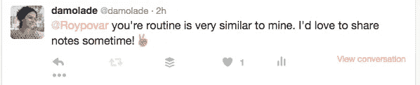
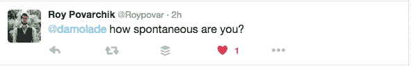
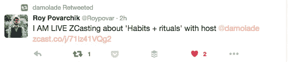

# 自由职业者和创始人的区别

> 原文：<https://medium.com/hackernoon/the-difference-between-a-freelancer-a-founder-d5aa9d25b0b>

今天早上，我在 Zcast 上与创始人 Roy Povarchik 进行了一次非常有趣、自发的对话，我想分享一下我个人从我们的对话中所学到的东西。希望他们能帮助有抱负的创始人/自由职业者。

今天早上我们讨论了受这篇博文启发的我们共有的仪式和习惯-

[http://growth hacks . ninja/2016/01/insights-from-content-marketing-and-growth-consultant-Roy-pova rcik/](http://growthhacks.ninja/2016/01/insights-from-content-marketing-and-growth-consultant-roy-povarchik/)

我觉得他的习惯和我的习惯最大的不同是，他每天都在创造自己的内容。

我觉得他和我志趣相投，我想和他联系，所以我发了微博给他-

对此我得到了惊人的回应-

他邀请我使用一个我从未听说过的应用程序，可能是因为这是一个大约一周前的应用程序？如果我在它的功能上犯了任何错误，请原谅，但我的理解是，它使你能够连接到 Twitter 并立即开始直播播客。

我们正是这么做的。

罗伊和我都在经营自己的生意的同时兼顾为人父母和配偶的责任。我们都喜欢以饮料开始我们的日常生活——他伸手去拿一杯水，而我，另一方面，喝下大约一加仑咖啡。我会让你们来判断谁的习惯更好。

我们发现我们都很欣赏[塔拉·布拉克](https://www.tarabrach.com/)的播客，并让她融入了我们的日常生活。

> “即便如此，当这种自动控制的习惯占据主导地位时，当我们的整个身份都处于控制者的角色中时，我们就变得远离了在场、新鲜和自发性的品质；我们失去了从更明智、更富有同情心的地方做出反应的能力。”—塔拉·布拉克

来自《放开控制》:https://youtu.be/8D8ugMRdrHU

罗伊听了她 25 分钟的冥想，并要求他的一些员工和他一起养成每天冥想的习惯，这对给他们的一天带来平静、清晰和专注感很有帮助。

我对日常冥想采取了一种有些不同的方法，我喜欢在晨跑时听佛法演讲，当我回家时，我试着挤出 25 分钟冥想。

塔拉在 Itunes 上免费提供她的播客。她将帮助你达到一个新的水平，特别是如果你已经使用 Headspace 应用程序尝试过了。正如 Roy 所说，有了 Headspace，你会觉得自己好像是坐着不动，在思考。有了度母，你会觉得有力量将你的冥想带到下一个层次。对我们来说都是游戏规则的改变者。

罗伊和我都从 2005 年左右开始从事增长型营销。在这个越来越年轻的行业里，我们感觉自己老了。虽然我们都认为我们的年轻同事在更快、更有天赋地学习和采用新技术的能力方面占据优势，但我们都认为我们的经验和对行业的深入了解是我们保持竞争力的关键。

罗伊和我为初创公司提供类似的服务——战略、内容营销、搜索引擎优化、分析。罗伊和我之间的主要区别是，他是一个创始人，而我仍然是一个自由职业者，因为他已经养成了每天创作内容的习惯。

我知道，在从自由职业者转变为创始人的过程中，写作和制作内容无论是图像、视频还是博客帖子，都是建立个人品牌和确立自身地位的最重要因素。

作为自由职业者，我们熟练地完成客户摆在我们面前的任务，为他人创造增长和收入。在我们内心深处，我们需要关注的是自己的成长。我们正在学习什么，以及如何与朋友、追随者和潜在客户分享这些知识。

作为自由职业者，我们从事的是没有福利和保障的“工作”、“项目”，所以我们必须把保障融入到我们的工作中。最有效的方法是创造内容。选择你的媒介，从今天开始。

正如罗伊提醒我的那样，**养成一个日常习惯**，即使一开始是一个小习惯。就像我们每天做的所有事情一样，它会变得更好，会成长。

我害怕自己写不出 4000 字，或者我不是一个足够好的作家，或者我没有时间。更糟糕的是，我甚至责怪我的家人。归根结底，我们想做的事情，我们会去做，如果我们不做，它们会一直困扰着我们，直到我们**腾出时间**去做它们。我读过一篇很棒的博文，这篇博文比我在这里看到的更好地将这个想法付诸实践:

【http://markmanson.net/question 

> “如果你发现自己月复一月、年复一年地想要某样东西，但什么都没有发生，你也从未接近过，那么也许你真正想要的是一个幻想、一个理想化的形象和一个虚假的承诺。也许你想要的并不是你想要的，你只是享受想要。可能你其实根本就不想要。”

为什么写作是自由职业者和创业者的区别？伟大的创始人为每个项目创造动力。他们建立了大量的工作和想法。他们创造遗产。他们分享这些事情，并帮助其他人学习如何为自己做到这一点。

如果自由职业者很快养成了创作内容的习惯，他们将会有一小部分工作和学习成果与他人分享。在你知道之前，这些工作会变得更好，更赚钱，会有人排队雇用你。为什么？因为你睡觉的时候你的内容在为你工作。假设你分享的每一条内容都是高质量的，它会自动填充你的漏斗，为你建立一个线索库，让你在最后一次演出结束后继续前进。

自由职业者必须意识到，演出只是演出。它们是项目，是别人雇你为他们做的实验。它们很可能在 6 个月到一年内结束。为了避免因不知道下一份薪水从何而来而产生的极度绝望，今天就开始创造和分享你的见解和学习，这样 6 个月后你就可以给你的等待名单发电子邮件，问… *谁是下一个？*

想了解更多关于自由职业的见解，请加入我即将到来的由[特别感谢](https://medium.com/u/d3e01079e886#peepchat

 [黑客中午](http://bit.ly/Hackernoon)是黑客如何开始他们的下午。我们是 AMI 家庭的一员。我们现在[接受投稿](http://bit.ly/hackernoonsubmission)并乐意[讨论广告&赞助](mailto:partners@amipublications.com)机会。
> 
> 如果你喜欢这个故事，我们推荐你阅读我们的[最新科技故事](http://bit.ly/hackernoonlatestt)和[趋势科技故事](https://hackernoon.com/trending)。直到下一次，不要把世界的现实想当然！

